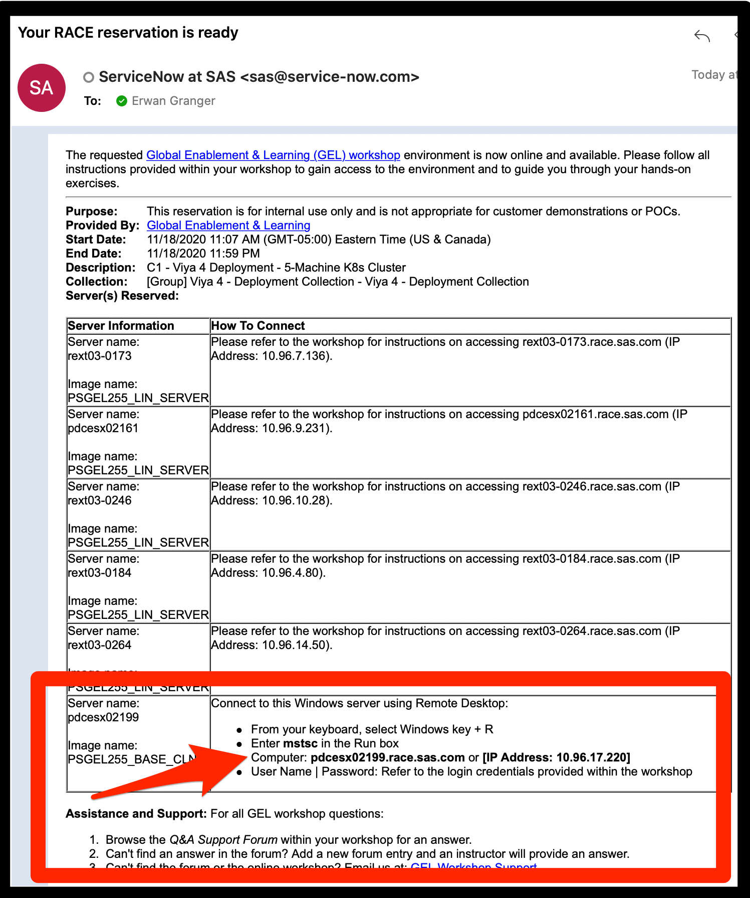

# Assess Readiness of Lab Environment

* [Getting connected](#getting-connected)
  * [Connect to the Windows JumpHost of your collection](#connect-to-the-windows-jumphost-of-your-collection)
  * [Connect to the first Linux machine from the Jump Host](#connect-to-the-first-linux-machine-from-the-jump-host)
* [Lab Environment Readiness](#lab-environment-readiness)
  * [Has the Collection finished bootstrapping?](#has-the-collection-finished-bootstrapping)
  * [Confirm Kubernetes is ready](#confirm-kubernetes-is-ready)
  * [If you are waiting for an environment to be up and running](#if-you-are-waiting-for-an-environment-to-be-up-and-running)
* [Navigation](#navigation)

## Getting connected

### Connect to the Windows JumpHost of your collection

* When you receive the e-mail confirmation that your RACE collection is ready, it will look like the following:

* The Fully Qualified Hostname of the Windows Jump Host is in the last line of the table
* Using a Remote Desktop Client, connect to this Windows machine as
  * User:  `.\student`
  * Password: `Metadata0`

### Connect to the first Linux machine from the Jump Host

* Once connected to the Windows Jump Host, open up MobaXterm (icon on the desktop)
* Once it's open, double-click on "sasnode01" to connect to it through SSH
* It is normal that only one out of the 5 machines is defined here: there is no need for you to directly access the other 4 machines.
* All hands-on should be done through the Windows Jump host and all Linux commands should be executed on `sasnode01`

## Lab Environment Readiness

### Has the Collection finished bootstrapping?

If you connect to the collection as soon as you receive the confirmation e-mail, the collection is probably still in the process of self-configuring.
You need to wait until that process is done. (between 10 and 20 minutes, usually).

In order to confirm that the bootstrapping is finished and successful, do the following:

1. Execute the following command on sasnode01:

    ```sh
    tail -f /opt/gellow_work/logs/gellow_summary.log
    ```

1. Wait for the last line to say:

    ```log
    PASS Final message: It seems everything deployed successfully!
    PASS Final message: You can start using this collection

    #####################################################################################
    ####### DONE WITH THE BOOTSTRAPPING OF THE MACHINE ##################################
    #####################################################################################
    ```

1. If you see this line, your Kubernetes Cluster should be ready for business! Do a `Ctrl-C` to cancel the `tail` and get started on the Hands-On!

1. If not, wait until you see it before moving on.

### Confirm Kubernetes is ready

1. Execute the following commands to see if Kubernetes is responding:

    ```sh
    kubectl cluster-info
    kubectl get nodes

    ```

1. You should see something similar to:

    ```log
    Kubernetes master is running at https://intnode03:6443
    CoreDNS is running at https://intnode03:6443/api/v1/namespaces/kube-system/services/kube-dns:dns/proxy

    To further debug and diagnose cluster problems, use 'kubectl cluster-info dump'.
    ```

    and

    ```log
    NAME        STATUS   ROLES                      AGE   VERSION
    intnode01   Ready    controlplane,etcd,worker   17m   v1.18.6
    intnode02   Ready    controlplane,etcd,worker   17m   v1.18.6
    intnode03   Ready    controlplane,etcd,worker   17m   v1.18.6
    intnode04   Ready    worker                     17m   v1.18.6
    intnode05   Ready    worker                     17m   v1.18.6
    ```

Make sure all 5 nodes are ready.

### If you are waiting for an environment to be up and running

If you chose one of the `_AUTODEPLOY_` RACE collections, it will take much longer (up to 45 minutes) for the collection to be ready.

If you want to see your environment booting up, you can run:

```sh
### Pick the namespace you are interested in checking
NS=gelenv
time gel_OKViya4 -n ${NS} --wait -ps
```

This will display the current status of your environment and will keep cycling until 80% of your endpoints are working.
This can take between 15 minutes and 40 minutes for a fresh deployment.

If it's still not "all clear" after 50-60 minutes, either cancel your collection and book a new one, or contact the GEL team via the VLE forums.

When the endpoints are working, execute the following to display the URLs you can use:

```sh
cat ~/urls.md
```

Do a Ctrl-Click to open up those URLs in your browser.

## Navigation

<!-- startnav -->
* [01 Introduction / 01 031 Booking a Lab Environment for the Workshop](/01_Introduction/01_031_Booking_a_Lab_Environment_for_the_Workshop.md)
* [01 Introduction / 01 032 Assess Readiness of Lab Environment](/01_Introduction/01_032_Assess_Readiness_of_Lab_Environment.md)**<-- you are here**
* [01 Introduction / 01 033 CheatCodes](/01_Introduction/01_033_CheatCodes.md)
* [02 Kubernetes and Containers Fundamentals / 02 131 Learning about Namespaces](/02_Kubernetes_and_Containers_Fundamentals/02_131_Learning_about_Namespaces.md)
* [03 Viya 4 Software Specifics / 03 011 Looking at a Viya 4 environment with Visual Tools DEMO](/03_Viya_4_Software_Specifics/03_011_Looking_at_a_Viya_4_environment_with_Visual_Tools_DEMO.md)
* [03 Viya 4 Software Specifics / 03 051 Create your own Viya order](/03_Viya_4_Software_Specifics/03_051_Create_your_own_Viya_order.md)
* [03 Viya 4 Software Specifics / 03 056 Getting the order with the CLI](/03_Viya_4_Software_Specifics/03_056_Getting_the_order_with_the_CLI.md)
* [04 Pre Requisites / 04 081 Pre Requisites automation with Viya4-ARK](/04_Pre-Requisites/04_081_Pre-Requisites_automation_with_Viya4-ARK.md)
* [05 Deployment tools / 05 121 Setup a Windows Client Machine](/05_Deployment_tools/05_121_Setup_a_Windows_Client_Machine.md)
* [06 Deployment Steps / 06 031 Deploying a simple environment](/06_Deployment_Steps/06_031_Deploying_a_simple_environment.md)
* [06 Deployment Steps / 06 051 Deploying Viya with Authentication](/06_Deployment_Steps/06_051_Deploying_Viya_with_Authentication.md)
* [06 Deployment Steps / 06 061 Deploying in a second namespace](/06_Deployment_Steps/06_061_Deploying_in_a_second_namespace.md)
* [06 Deployment Steps / 06 071 Removing Viya deployments](/06_Deployment_Steps/06_071_Removing_Viya_deployments.md)
* [06 Deployment Steps / 06 081 Deploying a programing only environment](/06_Deployment_Steps/06_081_Deploying_a_programing-only_environment.md)
* [06 Deployment Steps / 06 091 Deployment Operator setup](/06_Deployment_Steps/06_091_Deployment_Operator_setup.md)
* [06 Deployment Steps / 06 093 Using the DO with a Git Repository](/06_Deployment_Steps/06_093_Using_the_DO_with_a_Git_Repository.md)
* [06 Deployment Steps / 06 095 Using an inline configuration](/06_Deployment_Steps/06_095_Using_an_inline_configuration.md)
* [06 Deployment Steps / 06 097 Using the Orchestration Tool](/06_Deployment_Steps/06_097_Using_the_Orchestration_Tool.md)
* [06 Deployment Steps / 06 101 Create Viya Deployment Roles](/06_Deployment_Steps/06_101_Create_Viya_Deployment_Roles.md)
* [07 Deployment Customizations / 07 021 Configuring SASWORK](/07_Deployment_Customizations/07_021_Configuring_SASWORK.md)
* [07 Deployment Customizations / 07 051 Adding a local registry to k8s](/07_Deployment_Customizations/07_051_Adding_a_local_registry_to_k8s.md)
* [07 Deployment Customizations / 07 052 Using mirror manager to populate the local registry](/07_Deployment_Customizations/07_052_Using_mirror_manager_to_populate_the_local_registry.md)
* [07 Deployment Customizations / 07 053 Deploy from local registry](/07_Deployment_Customizations/07_053_Deploy_from_local_registry.md)
* [07 Deployment Customizations / 07 091 Configure SAS ACCESS Engine](/07_Deployment_Customizations/07_091_Configure_SAS_ACCESS_Engine.md)
* [07 Deployment Customizations / 07 101 Configure SAS ACCESS TO HADOOP](/07_Deployment_Customizations/07_101_Configure_SAS_ACCESS_TO_HADOOP.md)
* [07 Deployment Customizations / 07 102 Parallel loading with EP for Hadoop](/07_Deployment_Customizations/07_102_Parallel_loading_with_EP_for_Hadoop.md)
* [09 Validation / 09 011 Validate the Viya deployment](/09_Validation/09_011_Validate_the_Viya_deployment.md)
* [09 Validation / 09 021 SAS Viya deployment reports](/09_Validation/09_021_SAS_Viya_deployment_reports.md)
* [11 Azure AKS Deployment / 11 000 Navigating the AKS Hands on Deployment Options](/11_Azure_AKS_Deployment/11_000_Navigating_the_AKS_Hands-on_Deployment_Options.md)
* [11 Azure AKS Deployment / 11 999 Fast track with cheatcodes](/11_Azure_AKS_Deployment/11_999_Fast_track_with_cheatcodes.md)
* [11 Azure AKS Deployment/Fully Automated / 11 500 Full Automation of AKS Deployment](/11_Azure_AKS_Deployment/Fully_Automated/11_500_Full_Automation_of_AKS_Deployment.md)
* [11 Azure AKS Deployment/Fully Automated / 11 590 Cleanup](/11_Azure_AKS_Deployment/Fully_Automated/11_590_Cleanup.md)
* [11 Azure AKS Deployment/Standard / 11 100 Creating an AKS Cluster](/11_Azure_AKS_Deployment/Standard/11_100_Creating_an_AKS_Cluster.md)
* [11 Azure AKS Deployment/Standard / 11 110 Performing the prerequisites](/11_Azure_AKS_Deployment/Standard/11_110_Performing_the_prerequisites.md)
* [11 Azure AKS Deployment/Standard/Cleanup / 11 400 Cleanup](/11_Azure_AKS_Deployment/Standard/Cleanup/11_400_Cleanup.md)
* [11 Azure AKS Deployment/Standard/Manual / 11 200 Deploying Viya 4 on AKS](/11_Azure_AKS_Deployment/Standard/Manual/11_200_Deploying_Viya_4_on_AKS.md)
* [11 Azure AKS Deployment/Standard/Manual / 11 210 Deploy a second namespace in AKS](/11_Azure_AKS_Deployment/Standard/Manual/11_210_Deploy_a_second_namespace_in_AKS.md)
* [11 Azure AKS Deployment/Standard/Manual / 11 220 CAS Customizations](/11_Azure_AKS_Deployment/Standard/Manual/11_220_CAS_Customizations.md)
* [11 Azure AKS Deployment/Standard/Manual / 11 230 Install monitoring and logging](/11_Azure_AKS_Deployment/Standard/Manual/11_230_Install_monitoring_and_logging.md)
* [12 Amazon EKS Deployment / 12 010 Access Environments](/12_Amazon_EKS_Deployment/12_010_Access_Environments.md)
* [12 Amazon EKS Deployment / 12 020 Provision Resources](/12_Amazon_EKS_Deployment/12_020_Provision_Resources.md)
* [12 Amazon EKS Deployment / 12 030 Deploy SAS Viya](/12_Amazon_EKS_Deployment/12_030_Deploy_SAS_Viya.md)
* [13 Google GKE Deployment / 13 011 Creating a GKE Cluster](/13_Google_GKE_Deployment/13_011_Creating_a_GKE_Cluster.md)
* [13 Google GKE Deployment / 13 021 Performing Prereqs in GKE](/13_Google_GKE_Deployment/13_021_Performing_Prereqs_in_GKE.md)
* [13 Google GKE Deployment / 13 031 Deploying Viya 4 on GKE](/13_Google_GKE_Deployment/13_031_Deploying_Viya_4_on_GKE.md)
* [13 Google GKE Deployment / 13 041 Full Automation of GKE Deployment](/13_Google_GKE_Deployment/13_041_Full_Automation_of_GKE_Deployment.md)
* [13 Google GKE Deployment / 13 099 Fast track with cheatcodes](/13_Google_GKE_Deployment/13_099_Fast_track_with_cheatcodes.md)
<!-- endnav -->
