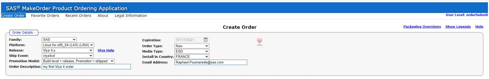
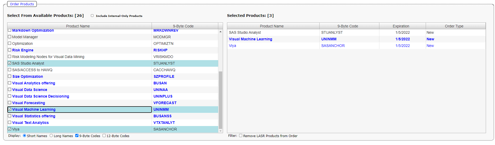
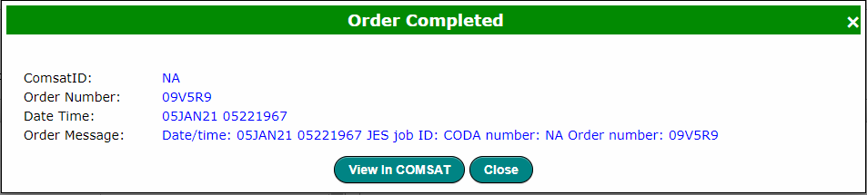
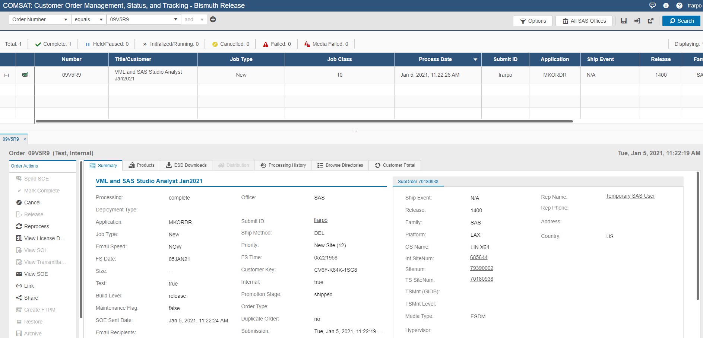
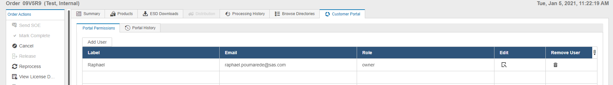
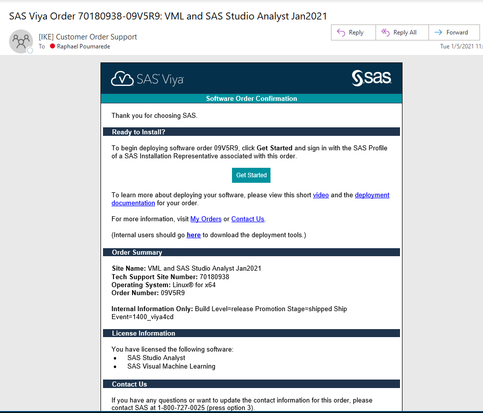
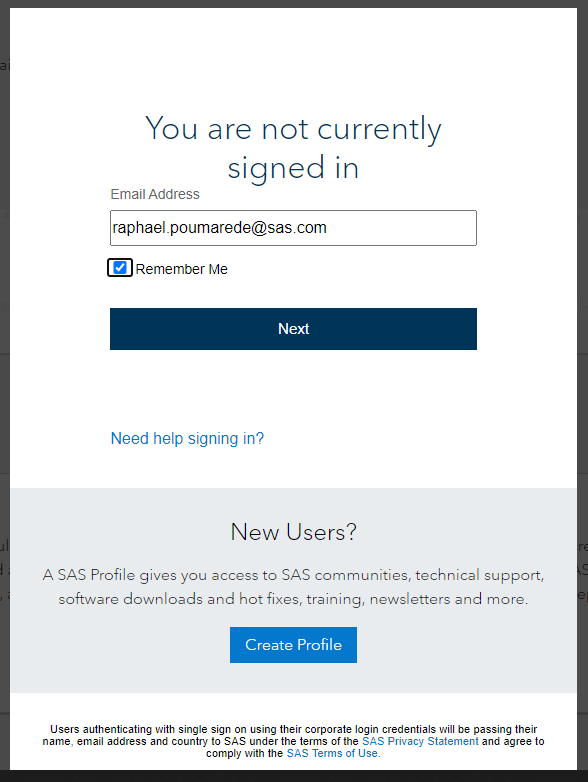
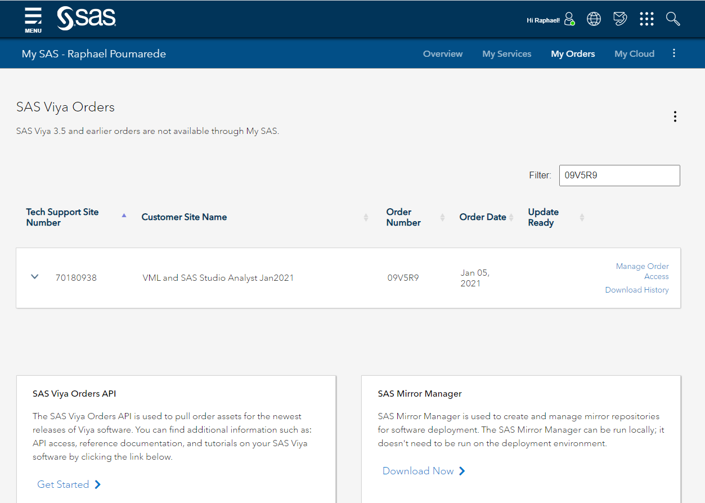
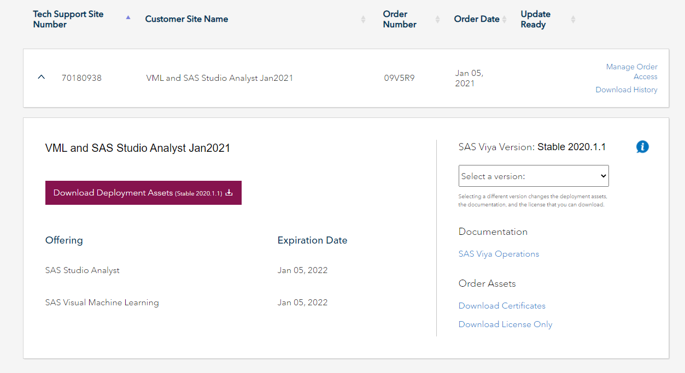

**_Note : In this hands-on we create our own Viya 4 order. We use the internal application "makeorder.sas.com". If you are following this VLE as a partner, you skip this section. It is not a pre-requisite for the following hands-on._**

# Create your own order

* [Use "Makeorder" and select your products](#use-makeorder-and-select-your-products)
* [Review the order in COMSAT](#review-the-order-in-comsat)
* [Download your Order's deployment assets](#download-your-orders-deployment-assets)
* [Conclusion](#conclusion)
* [Navigation](#navigation)

## Use "Makeorder" and select your products

* Open the [makeorder.sas.com](https://makeorder.sas.com/makeorder) internal web application.
* Fullfill the header : the platform must be "Linux for x86_64 (LAX) (LINA)" as today it is the only supported platform for Viya 4.

    

* Then you can select some products, for example SAS Studio Analyst and the "Visual Machine Learning" offering.

    

* You might have noticed that we don't see anymore the long list of SAS/ACCESS products in the Order products list. It is because they are now included in the offerings.
* Click on Submit and after a little while, you should see a dialog as below

    

    _Note : the orders starts with "09", it means it is an internal order that can be directly deployed ONLY inside of the SAS internal network_

* Click on the link to review the order in COMSAT (which is another SAS internal web application)

## Review the order in COMSAT

* The link will open the COMSAT application and show you your own order.

    

* From here you can check the products ordered by the customer, the number of downloads, the Processing history, etc...
* Click on the "Customer portal" tab (this tab is only available for Viya 4 orders)

    

    In this tab we can create another customer account to access the order in the portal. We can also view the access history.

    _Note: COMSAT allows you to see any type of SAS order (SAS 9, Viya 3.x, Viya 4, interal and external)_

## Download your Order's deployment assets

After creating your order, you will shortly receive an email similar to the one below.

If you click on the link "Get Started", it will open up the SAS Portal page.

You will have to sign-in with your sas.com account (or create it if you don't have one).

Once logged in, you should be able to see your order.

_IMPORTANT: If you don't see your order in the SAS Portal, try to do it from in "incognito" mode or retry after a clean up of your web browser history/cookies._

Click on the little icon and you will see the order details.

Now, you can pick a version and click on "Download Deployment Assets" to download an archive of the files that you will need for the Viya 4 Deployment.

## Conclusion

We will NOT perform the Viya deployment with the sample internal order that you might have created during this specific hands-on.
Because the remaining of the VLE Hands-on steps happens in the RACE.EXNET environment which does not have access to the SAS Internal network.
However, we have seen what it takes to create a Viya 4 order, the kind of information that we can find about a specific order in COMSAT and also how you can get the deployment assets to follow up with the installation steps.

## Navigation

<!-- startnav -->
* [01 Introduction / 01 031 Booking a Lab Environment for the Workshop](/01_Introduction/01_031_Booking_a_Lab_Environment_for_the_Workshop.md)
* [01 Introduction / 01 032 Assess Readiness of Lab Environment](/01_Introduction/01_032_Assess_Readiness_of_Lab_Environment.md)
* [01 Introduction / 01 033 CheatCodes](/01_Introduction/01_033_CheatCodes.md)
* [02 Kubernetes and Containers Fundamentals / 02 131 Learning about Namespaces](/02_Kubernetes_and_Containers_Fundamentals/02_131_Learning_about_Namespaces.md)
* [03 Viya 4 Software Specifics / 03 011 Looking at a Viya 4 environment with Visual Tools DEMO](/03_Viya_4_Software_Specifics/03_011_Looking_at_a_Viya_4_environment_with_Visual_Tools_DEMO.md)
* [03 Viya 4 Software Specifics / 03 051 Create your own Viya order](/03_Viya_4_Software_Specifics/03_051_Create_your_own_Viya_order.md)**<-- you are here**
* [03 Viya 4 Software Specifics / 03 056 Getting the order with the CLI](/03_Viya_4_Software_Specifics/03_056_Getting_the_order_with_the_CLI.md)
* [04 Pre Requisites / 04 081 Pre Requisites automation with Viya4-ARK](/04_Pre-Requisites/04_081_Pre-Requisites_automation_with_Viya4-ARK.md)
* [05 Deployment tools / 05 121 Setup a Windows Client Machine](/05_Deployment_tools/05_121_Setup_a_Windows_Client_Machine.md)
* [06 Deployment Steps / 06 031 Deploying a simple environment](/06_Deployment_Steps/06_031_Deploying_a_simple_environment.md)
* [06 Deployment Steps / 06 051 Deploying Viya with Authentication](/06_Deployment_Steps/06_051_Deploying_Viya_with_Authentication.md)
* [06 Deployment Steps / 06 061 Deploying in a second namespace](/06_Deployment_Steps/06_061_Deploying_in_a_second_namespace.md)
* [06 Deployment Steps / 06 071 Removing Viya deployments](/06_Deployment_Steps/06_071_Removing_Viya_deployments.md)
* [06 Deployment Steps / 06 081 Deploying a programing only environment](/06_Deployment_Steps/06_081_Deploying_a_programing-only_environment.md)
* [06 Deployment Steps / 06 091 Deployment Operator setup](/06_Deployment_Steps/06_091_Deployment_Operator_setup.md)
* [06 Deployment Steps / 06 093 Using the DO with a Git Repository](/06_Deployment_Steps/06_093_Using_the_DO_with_a_Git_Repository.md)
* [06 Deployment Steps / 06 095 Using an inline configuration](/06_Deployment_Steps/06_095_Using_an_inline_configuration.md)
* [06 Deployment Steps / 06 097 Using the Orchestration Tool](/06_Deployment_Steps/06_097_Using_the_Orchestration_Tool.md)
* [06 Deployment Steps / 06 101 Create Viya Deployment Roles](/06_Deployment_Steps/06_101_Create_Viya_Deployment_Roles.md)
* [07 Deployment Customizations / 07 021 Configuring SASWORK](/07_Deployment_Customizations/07_021_Configuring_SASWORK.md)
* [07 Deployment Customizations / 07 051 Adding a local registry to k8s](/07_Deployment_Customizations/07_051_Adding_a_local_registry_to_k8s.md)
* [07 Deployment Customizations / 07 052 Using mirror manager to populate the local registry](/07_Deployment_Customizations/07_052_Using_mirror_manager_to_populate_the_local_registry.md)
* [07 Deployment Customizations / 07 053 Deploy from local registry](/07_Deployment_Customizations/07_053_Deploy_from_local_registry.md)
* [07 Deployment Customizations / 07 091 Configure SAS ACCESS Engine](/07_Deployment_Customizations/07_091_Configure_SAS_ACCESS_Engine.md)
* [07 Deployment Customizations / 07 101 Configure SAS ACCESS TO HADOOP](/07_Deployment_Customizations/07_101_Configure_SAS_ACCESS_TO_HADOOP.md)
* [07 Deployment Customizations / 07 102 Parallel loading with EP for Hadoop](/07_Deployment_Customizations/07_102_Parallel_loading_with_EP_for_Hadoop.md)
* [09 Validation / 09 011 Validate the Viya deployment](/09_Validation/09_011_Validate_the_Viya_deployment.md)
* [09 Validation / 09 021 SAS Viya deployment reports](/09_Validation/09_021_SAS_Viya_deployment_reports.md)
* [11 Azure AKS Deployment / 11 000 Navigating the AKS Hands on Deployment Options](/11_Azure_AKS_Deployment/11_000_Navigating_the_AKS_Hands-on_Deployment_Options.md)
* [11 Azure AKS Deployment / 11 999 Fast track with cheatcodes](/11_Azure_AKS_Deployment/11_999_Fast_track_with_cheatcodes.md)
* [11 Azure AKS Deployment/Fully Automated / 11 500 Full Automation of AKS Deployment](/11_Azure_AKS_Deployment/Fully_Automated/11_500_Full_Automation_of_AKS_Deployment.md)
* [11 Azure AKS Deployment/Fully Automated / 11 590 Cleanup](/11_Azure_AKS_Deployment/Fully_Automated/11_590_Cleanup.md)
* [11 Azure AKS Deployment/Standard / 11 100 Creating an AKS Cluster](/11_Azure_AKS_Deployment/Standard/11_100_Creating_an_AKS_Cluster.md)
* [11 Azure AKS Deployment/Standard / 11 110 Performing the prerequisites](/11_Azure_AKS_Deployment/Standard/11_110_Performing_the_prerequisites.md)
* [11 Azure AKS Deployment/Standard/Cleanup / 11 400 Cleanup](/11_Azure_AKS_Deployment/Standard/Cleanup/11_400_Cleanup.md)
* [11 Azure AKS Deployment/Standard/Manual / 11 200 Deploying Viya 4 on AKS](/11_Azure_AKS_Deployment/Standard/Manual/11_200_Deploying_Viya_4_on_AKS.md)
* [11 Azure AKS Deployment/Standard/Manual / 11 210 Deploy a second namespace in AKS](/11_Azure_AKS_Deployment/Standard/Manual/11_210_Deploy_a_second_namespace_in_AKS.md)
* [11 Azure AKS Deployment/Standard/Manual / 11 220 CAS Customizations](/11_Azure_AKS_Deployment/Standard/Manual/11_220_CAS_Customizations.md)
* [11 Azure AKS Deployment/Standard/Manual / 11 230 Install monitoring and logging](/11_Azure_AKS_Deployment/Standard/Manual/11_230_Install_monitoring_and_logging.md)
* [12 Amazon EKS Deployment / 12 010 Access Environments](/12_Amazon_EKS_Deployment/12_010_Access_Environments.md)
* [12 Amazon EKS Deployment / 12 020 Provision Resources](/12_Amazon_EKS_Deployment/12_020_Provision_Resources.md)
* [12 Amazon EKS Deployment / 12 030 Deploy SAS Viya](/12_Amazon_EKS_Deployment/12_030_Deploy_SAS_Viya.md)
* [13 Google GKE Deployment / 13 011 Creating a GKE Cluster](/13_Google_GKE_Deployment/13_011_Creating_a_GKE_Cluster.md)
* [13 Google GKE Deployment / 13 021 Performing Prereqs in GKE](/13_Google_GKE_Deployment/13_021_Performing_Prereqs_in_GKE.md)
* [13 Google GKE Deployment / 13 031 Deploying Viya 4 on GKE](/13_Google_GKE_Deployment/13_031_Deploying_Viya_4_on_GKE.md)
* [13 Google GKE Deployment / 13 041 Full Automation of GKE Deployment](/13_Google_GKE_Deployment/13_041_Full_Automation_of_GKE_Deployment.md)
* [13 Google GKE Deployment / 13 099 Fast track with cheatcodes](/13_Google_GKE_Deployment/13_099_Fast_track_with_cheatcodes.md)
<!-- endnav -->
