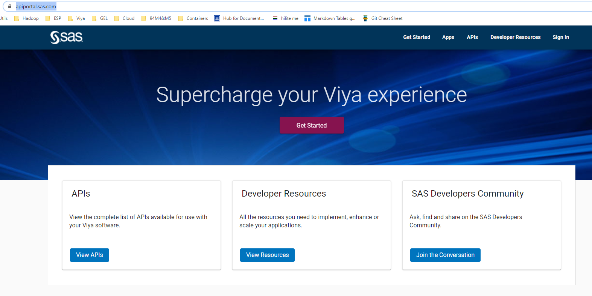
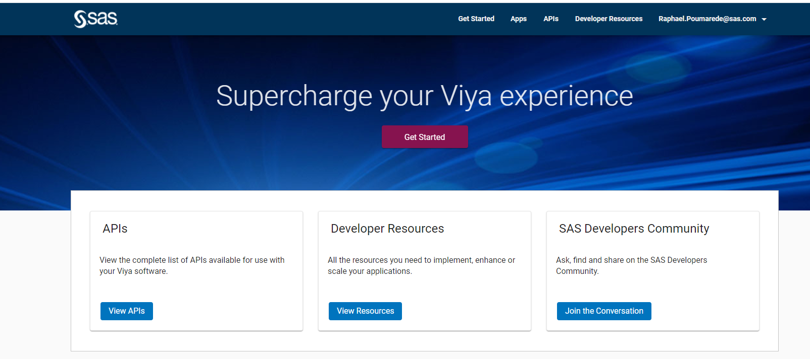
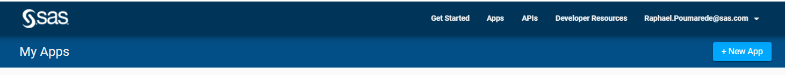
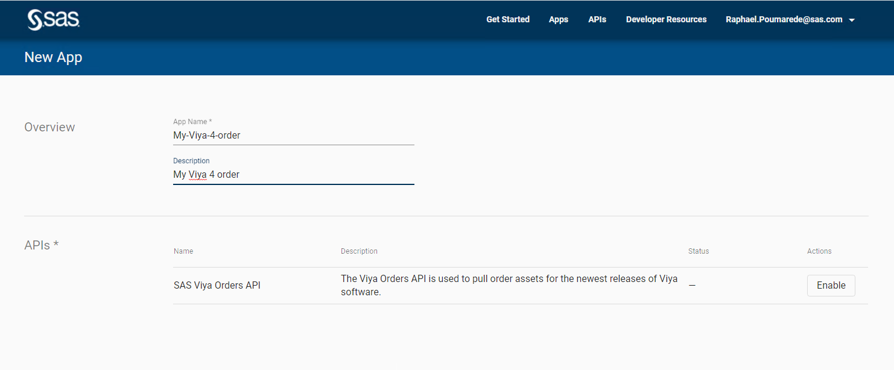
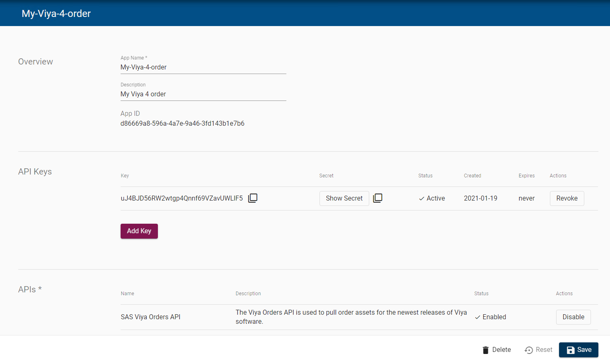

# Getting the Order with the CLI

* [Intro](#intro)
* [Requirements](#requirements)
* [Getting the Order CLI](#getting-the-order-cli)
  * [Method 1: Building the Go Version of the Order CLI](#method-1-building-the-go-version-of-the-order-cli)
  * [Method 2: Building the docker image of the Order CLI](#method-2-building-the-docker-image-of-the-order-cli)
  * [Method 3: Use the pre-built binary file](#method-3-use-the-pre-built-binary-file)
* [Getting your own API keys from the portal](#getting-your-own-api-keys-from-the-portal)
* [Getting the Deployment Assets](#getting-the-deployment-assets)
  * [Method 1: Using the go version](#method-1-using-the-go-version)
  * [Method 2: Using docker](#method-2-using-docker)
  * [Method 3: Using the pre-built binary](#method-3-using-the-pre-built-binary)
  * [Clean up](#clean-up)
* [Navigation](#navigation)

_Note : In this hands-on we use our own Viya 4 order created with the internal application "makeorder.sas.com". If you are following this VLE as a partner, you skip this section. It is not a pre-requisite for the following hands-on._

## Intro

* The process for obtaining licenses, certificates or deployment assets for an order can be automated, thanks to a handy new command-line tool.
* The [viya4-orders-cli](https://github.com/sassoftware/viya4-orders-cli) has been developed to programmatically retrieve these files, by running it directly from the command-line or in a Docker image.
* It’s available on GitHub and anyone can download it.

## Requirements

* You need to have a SAS Profile (sas.com account)
* You need to have access to at least one order with your sas.com account.

## Getting the Order CLI

* If we want to use Go or docker we have to clone the viya4-orders-cli tool from GitHub

    ```sh
    cd ~
    git clone https://github.com/sassoftware/viya4-orders-cli.git

    # but choose a static version!
    cd ~/viya4-orders-cli
    git checkout 1.0.0

    ```

Then choose **one** of the following method : Go, docker or pre-built binary.

### Method 1: Building the Go Version of the Order CLI

* Build the go executable

    ```sh
    #first let's install go
    sudo yum install go -y
    go version

    cd ~/viya4-orders-cli
    go build main.go

    ```

### Method 2: Building the docker image of the Order CLI

* A very simple step, to build your own docker image of the Order CLI:

    ```sh
    cd ~/viya4-orders-cli
    docker build . -t viya4-orders-cli
    ```

* Note that this step might fail with an error like :

    ```log
    Sending build context to Docker daemon  12.18MB
    Step 1/16 : FROM golang:1.13 AS builder
    toomanyrequests: You have reached your pull rate limit. You may increase the limit by authenticating and upgrading: https://www.docker.com/increase-rate-limit
    ```

You did not make any mistake. It is just because since November 2020 Docker Hub restricts the number of anonymous and free autenthicated downloads.

When we build our order CLI Docker image, we build it from the public golang Docker image that we try to get from the Docker Hub.

If you face this issue, you can either try later or move on to one of the two alternative method ("Go" or "pre-built binary").

### Method 3: Use the pre-built binary file

* do the following to download the pre-built binary of the Order CLI:

    ```sh
    VERSION_ORDER_CLI=1.0.0
    URL_ORDER_CLI=https://github.com/sassoftware/viya4-orders-cli/releases/download/${VERSION_ORDER_CLI}/viya4-orders-cli_linux_amd64

    ansible localhost \
        -b --become-user=root \
        -m get_url \
        -a  "url=${URL_ORDER_CLI} \
            dest=/usr/local/bin/viya4-orders-cli \
            validate_certs=no \
            force=yes \
            owner=root \
            mode=0755 \
            backup=yes" \
        --diff
    ```

## Getting your own API keys from the portal

* Open the [SAS API Portal](https://apiportal.sas.com/)

    

* Sign in with your SAS.com account and click on "Apps" in the ribbon.

    

* Click on "New App"

    

* Provide a name and description, click on "enable", then click on "Create"

    

* An API token is created for you (Application ID and secret) an will allow you to access the Order API.

    

* Click on "Save"
* We will now copy the **API Key** and **secret** from the SAS Portal and "bas64" encode them (you can use the "Copy" button in the portal).
* Copy the code below in your favorite text editor, replace with your own API key and secret, then copy paste the code in your terminal ans run it.

    ```sh
    echo -n <your API key> | base64 > /tmp/clientid.txt
    echo -n <your secret> | base64 > /tmp/secret.txt
    echo "clientCredentialsId= "\"$(cat /tmp/clientid.txt)\" > $HOME/.viya4-orders-cli.env
    echo "clientCredentialsSecret= "\"$(cat /tmp/secret.txt)\" >> $HOME/.viya4-orders-cli.env
    ```

## Getting the Deployment Assets

* Set the order number. You will use the order number corresponding to the order that you have created in the previous [hands-on](03_051_Create_your_own_Viya_order.md).

    ```sh
    #ORDER_NUMBER=9CDZDD
    ORDER_NUMBER=<YOUR OWN ORDER NUMBER>
    ```

Depending on your choice in the previous section for the Order CLI method (go, docker, or pre-built binary), choose one of the following methods:

### Method 1: Using the go version

* Now you can use the order CLI tool to get the Deployment Assets. You have to provide your own order number ans a specific cadence release.

    ```sh
    CADENCE_NAME='stable'
    CADENCE_VERSION='2020.1.5'
    go run main.go -c $HOME/.viya4-orders-cli.env dep ${ORDER_NUMBER} ${CADENCE_NAME} ${CADENCE_VERSION}
    ```

* You should see something like:

    ```yaml
    2021/02/22 10:58:14 INFO: using config file: /home/cloud-user/.viya4-orders-cli.env
    OrderNumber: 9CDZDD
    AssetName: deploymentAssets
    AssetReqURL: https://api.sas.com/mysas/orders/9CDZDD/cadenceNames/stable/cadenceVersions/2020.1.3/deploymentAssets
    AssetLocation: /home/cloud-user/viya4-orders-cli/SASViyaV4_9CDZDD_stable_2020.1.3_20210219.1613697732393_deploymentAssets_2021-02-19T070151.tgz
    Cadence: Stable 2020.1.5
    CadenceRelease: 20210219.1613697732393
    ```

* Just type ```ls -alrt | grep SASViya``` to make sure there is now a Deployment Assets archive file in the current folder.

    ```log
    -rw-rw-r--   1 cloud-user cloud-user   364187 Feb 22 10:58 SASViyaV4_9CDZDD_stable_2020.1.3_20210219.1613697732393_deploymentAssets_2021-02-19T070151.tgz
    ```

### Method 2: Using docker

* Run the docker command to get the deployment assets in /tmp

    ```sh
    # copy the credential in a folder to be mounted in docker
    cp $HOME/.viya4-orders-cli.env /tmp
    # create an output subfolder in a folder to be mounted in docker
    mkdir /tmp/sasfiles

    CADENCE_NAME='stable'
    CADENCE_VERSION='2020.1.5'

    # download the deployment assets
    docker run -v /tmp:/sasstuff viya4-orders-cli deploymentAssets ${ORDER_NUMBER} ${CADENCE_NAME} ${CADENCE_VERSION} \
    --config /sasstuff/.viya4-orders-cli.env --file-path /sasstuff/sasfiles --file-name ${ORDER_NUMBER}_stable_depassets
    ```

* You should see

    ```log
    OrderNumber: 9CDZDD
    AssetName: deploymentAssets
    AssetReqURL: https://api.sas.com/mysas/orders/9CDZDD/cadenceNames/stable/cadenceVersions/2020.1.3/deploymentAssets
    AssetLocation: /sasstuff/sasfiles/9CDZDD_stable_depassets.tgz
    Cadence: Stable 2020.1.5
    CadenceRelease: 20210219.1613697732393
    [cloud-user@rext03-0289 viya4-orders-cli]$ ls /tmp/sasfiles/
    9CDZDD_stable_depassets.tgz
    ```

### Method 3: Using the pre-built binary

* Use the binary

    ```sh
    cd
    viya4-orders-cli --config $HOME/.viya4-orders-cli.env dep ${ORDER_NUMBER} ${CADENCE_NAME} ${CADENCE_VERSION}
    ```

* You should see

    ```log
    2021/02/22 11:07:06 INFO: using config file: /home/cloud-user/.viya4-orders-cli.env
    OrderNumber: 9CDZDD
    AssetName: deploymentAssets
    AssetReqURL: https://api.sas.com/mysas/orders/9CDZDD/cadenceNames/stable/cadenceVersions/2020.1.3/deploymentAssets
    Cadence: Stable 2020.1.5
    CadenceRelease: 20210219.1613697732393
    ```

### Clean up

* Now let's delete the Deployment Assets as we can not use internal orders in the deployment.

    ```sh
    # delete dep assets generated with go
    rm -Rf /home/cloud-user/viya4-orders-cli/SASViyaV4_${ORDER_NUMBER}*
    # delete dep assets generated with docker
    rm -Rf /tmp/sasfiles
    # delete dep assets generated with prebuilt binary
    rm -Rf  $HOME/SASViyaV4_${ORDER_NUMBER}*
    ```

* For the next hands-on you will use the deployment assets that we have already downloaded for you.

## Navigation

<!-- startnav -->
* [01 Introduction / 01 031 Booking a Lab Environment for the Workshop](/01_Introduction/01_031_Booking_a_Lab_Environment_for_the_Workshop.md)
* [01 Introduction / 01 032 Assess Readiness of Lab Environment](/01_Introduction/01_032_Assess_Readiness_of_Lab_Environment.md)
* [01 Introduction / 01 033 CheatCodes](/01_Introduction/01_033_CheatCodes.md)
* [02 Kubernetes and Containers Fundamentals / 02 131 Learning about Namespaces](/02_Kubernetes_and_Containers_Fundamentals/02_131_Learning_about_Namespaces.md)
* [03 Viya 4 Software Specifics / 03 011 Looking at a Viya 4 environment with Visual Tools DEMO](/03_Viya_4_Software_Specifics/03_011_Looking_at_a_Viya_4_environment_with_Visual_Tools_DEMO.md)
* [03 Viya 4 Software Specifics / 03 051 Create your own Viya order](/03_Viya_4_Software_Specifics/03_051_Create_your_own_Viya_order.md)
* [03 Viya 4 Software Specifics / 03 056 Getting the order with the CLI](/03_Viya_4_Software_Specifics/03_056_Getting_the_order_with_the_CLI.md)**<-- you are here**
* [04 Pre Requisites / 04 081 Pre Requisites automation with Viya4-ARK](/04_Pre-Requisites/04_081_Pre-Requisites_automation_with_Viya4-ARK.md)
* [05 Deployment tools / 05 121 Setup a Windows Client Machine](/05_Deployment_tools/05_121_Setup_a_Windows_Client_Machine.md)
* [06 Deployment Steps / 06 031 Deploying a simple environment](/06_Deployment_Steps/06_031_Deploying_a_simple_environment.md)
* [06 Deployment Steps / 06 051 Deploying Viya with Authentication](/06_Deployment_Steps/06_051_Deploying_Viya_with_Authentication.md)
* [06 Deployment Steps / 06 061 Deploying in a second namespace](/06_Deployment_Steps/06_061_Deploying_in_a_second_namespace.md)
* [06 Deployment Steps / 06 071 Removing Viya deployments](/06_Deployment_Steps/06_071_Removing_Viya_deployments.md)
* [06 Deployment Steps / 06 081 Deploying a programing only environment](/06_Deployment_Steps/06_081_Deploying_a_programing-only_environment.md)
* [06 Deployment Steps / 06 091 Deployment Operator setup](/06_Deployment_Steps/06_091_Deployment_Operator_setup.md)
* [06 Deployment Steps / 06 093 Using the DO with a Git Repository](/06_Deployment_Steps/06_093_Using_the_DO_with_a_Git_Repository.md)
* [06 Deployment Steps / 06 095 Using an inline configuration](/06_Deployment_Steps/06_095_Using_an_inline_configuration.md)
* [06 Deployment Steps / 06 097 Using the Orchestration Tool](/06_Deployment_Steps/06_097_Using_the_Orchestration_Tool.md)
* [06 Deployment Steps / 06 101 Create Viya Deployment Roles](/06_Deployment_Steps/06_101_Create_Viya_Deployment_Roles.md)
* [07 Deployment Customizations / 07 021 Configuring SASWORK](/07_Deployment_Customizations/07_021_Configuring_SASWORK.md)
* [07 Deployment Customizations / 07 051 Adding a local registry to k8s](/07_Deployment_Customizations/07_051_Adding_a_local_registry_to_k8s.md)
* [07 Deployment Customizations / 07 052 Using mirror manager to populate the local registry](/07_Deployment_Customizations/07_052_Using_mirror_manager_to_populate_the_local_registry.md)
* [07 Deployment Customizations / 07 053 Deploy from local registry](/07_Deployment_Customizations/07_053_Deploy_from_local_registry.md)
* [07 Deployment Customizations / 07 091 Configure SAS ACCESS Engine](/07_Deployment_Customizations/07_091_Configure_SAS_ACCESS_Engine.md)
* [07 Deployment Customizations / 07 101 Configure SAS ACCESS TO HADOOP](/07_Deployment_Customizations/07_101_Configure_SAS_ACCESS_TO_HADOOP.md)
* [07 Deployment Customizations / 07 102 Parallel loading with EP for Hadoop](/07_Deployment_Customizations/07_102_Parallel_loading_with_EP_for_Hadoop.md)
* [09 Validation / 09 011 Validate the Viya deployment](/09_Validation/09_011_Validate_the_Viya_deployment.md)
* [09 Validation / 09 021 SAS Viya deployment reports](/09_Validation/09_021_SAS_Viya_deployment_reports.md)
* [11 Azure AKS Deployment / 11 000 Navigating the AKS Hands on Deployment Options](/11_Azure_AKS_Deployment/11_000_Navigating_the_AKS_Hands-on_Deployment_Options.md)
* [11 Azure AKS Deployment / 11 999 Fast track with cheatcodes](/11_Azure_AKS_Deployment/11_999_Fast_track_with_cheatcodes.md)
* [11 Azure AKS Deployment/Fully Automated / 11 500 Full Automation of AKS Deployment](/11_Azure_AKS_Deployment/Fully_Automated/11_500_Full_Automation_of_AKS_Deployment.md)
* [11 Azure AKS Deployment/Fully Automated / 11 590 Cleanup](/11_Azure_AKS_Deployment/Fully_Automated/11_590_Cleanup.md)
* [11 Azure AKS Deployment/Standard / 11 100 Creating an AKS Cluster](/11_Azure_AKS_Deployment/Standard/11_100_Creating_an_AKS_Cluster.md)
* [11 Azure AKS Deployment/Standard / 11 110 Performing the prerequisites](/11_Azure_AKS_Deployment/Standard/11_110_Performing_the_prerequisites.md)
* [11 Azure AKS Deployment/Standard/Cleanup / 11 400 Cleanup](/11_Azure_AKS_Deployment/Standard/Cleanup/11_400_Cleanup.md)
* [11 Azure AKS Deployment/Standard/Manual / 11 200 Deploying Viya 4 on AKS](/11_Azure_AKS_Deployment/Standard/Manual/11_200_Deploying_Viya_4_on_AKS.md)
* [11 Azure AKS Deployment/Standard/Manual / 11 210 Deploy a second namespace in AKS](/11_Azure_AKS_Deployment/Standard/Manual/11_210_Deploy_a_second_namespace_in_AKS.md)
* [11 Azure AKS Deployment/Standard/Manual / 11 220 CAS Customizations](/11_Azure_AKS_Deployment/Standard/Manual/11_220_CAS_Customizations.md)
* [11 Azure AKS Deployment/Standard/Manual / 11 230 Install monitoring and logging](/11_Azure_AKS_Deployment/Standard/Manual/11_230_Install_monitoring_and_logging.md)
* [12 Amazon EKS Deployment / 12 010 Access Environments](/12_Amazon_EKS_Deployment/12_010_Access_Environments.md)
* [12 Amazon EKS Deployment / 12 020 Provision Resources](/12_Amazon_EKS_Deployment/12_020_Provision_Resources.md)
* [12 Amazon EKS Deployment / 12 030 Deploy SAS Viya](/12_Amazon_EKS_Deployment/12_030_Deploy_SAS_Viya.md)
* [13 Google GKE Deployment / 13 011 Creating a GKE Cluster](/13_Google_GKE_Deployment/13_011_Creating_a_GKE_Cluster.md)
* [13 Google GKE Deployment / 13 021 Performing Prereqs in GKE](/13_Google_GKE_Deployment/13_021_Performing_Prereqs_in_GKE.md)
* [13 Google GKE Deployment / 13 031 Deploying Viya 4 on GKE](/13_Google_GKE_Deployment/13_031_Deploying_Viya_4_on_GKE.md)
* [13 Google GKE Deployment / 13 041 Full Automation of GKE Deployment](/13_Google_GKE_Deployment/13_041_Full_Automation_of_GKE_Deployment.md)
* [13 Google GKE Deployment / 13 099 Fast track with cheatcodes](/13_Google_GKE_Deployment/13_099_Fast_track_with_cheatcodes.md)
<!-- endnav -->
