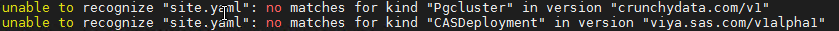

# Deploying a simple environment

* [Overview of steps](#overview-of-steps)
* [Cleaning for a failed attempt (Optional)](#cleaning-for-a-failed-attempt-optional)
* [Prep Steps](#prep-steps)
  * [Label and taint your nodes](#label-and-taint-your-nodes)
  * [Prepare standard folder structure](#prepare-standard-folder-structure)
  * [Obtain and extract the .tgz file](#obtain-and-extract-the-tgz-file)
  * [Creating a namespace](#creating-a-namespace)
  * [Creating a sitedefault file](#creating-a-sitedefault-file)
  * [Crunchy postgres needs a special file](#crunchy-postgres-needs-a-special-file)
  * [Create file for RWX Storage Class](#create-file-for-rwx-storage-class)
  * [Creating a TLS-related file in `./site-config/`](#creating-a-tls-related-file-in-site-config)
  * [Create your Kustomization.yaml file](#create-your-kustomizationyaml-file)
* [Build step](#build-step)
  * [Generate the manifest file](#generate-the-manifest-file)
* [Deploy step](#deploy-step)
  * [Apply the manifest file](#apply-the-manifest-file)
* [Store the URLs for later](#store-the-urls-for-later)
* [watching the environment come up in tmux](#watching-the-environment-come-up-in-tmux)
* [Validation](#validation)
* [Reset the default namespace](#reset-the-default-namespace)
* [Navigation](#navigation)

## Overview of steps

1. We will create a namespace called "lab"
1. We will use an ingress that has a prefix of "tryit.".
1. We will deploy viya env into Lab
1. We will configure full-stack TLS as this is now the default deployment

## Cleaning for a failed attempt (Optional)

If you need to re-run through this exercise and want to make sure that old content is not causing issues, you'd have to clean things up.

The following steps will only work if you go over all this a second time. Skip them the first time around.

1. Empty out the namespace

    ```sh
    ## writing it out the long way:

    kubectl -n lab delete deployments --all

    kubectl -n lab delete pods --all

    kubectl -n lab delete services --all

    kubectl -n lab delete persistentvolumeclaims  --all

    ```

1. But deleting the namespace will really make sure we have a clean slate, so just do it ;->

    ```bash
    ## or the short way
    kubectl delete ns lab

    ```

## Prep Steps

### Label and taint your nodes

Labelling and tainting your nodes allow you to:

* direct Viya pods to go on specific nodes
* make other pods stay away from these nodes

This topic is covered in more details in other places. For the time being, follow the instructions given to you here.  Of course, if you are curious Google can help explain that taints are a way of tagging nodes for specific workloads. Other parts of this workshop will dwelve more deeply into those topics.

The commands below will ensure that:

* Previous taints/labels are fully removed if any were present.
* Compute Server pods will start on INTNODE05
* CAS Pods will start on INTNODE04
* No other Pods than the CAS ones will be scheduled on INTNODE04

1. Review the Taints:

    ```bash
    kubectl get nodes -o=custom-columns=NODENAME:.metadata.name,TAINTS:.spec.taints
    ```

1. Review the Labels:

    ```bash
    kubectl get nodes -o=custom-columns=NODENAME:.metadata.name,LABELS:.metadata.labels
    ```

1. Remove taints and labels from nodes:

    ```bash
    kubectl label nodes intnode01 intnode02 intnode03 intnode04 intnode05 workload.sas.com/class-          --overwrite
    kubectl taint nodes intnode01 intnode02 intnode03 intnode04 intnode05 workload.sas.com/class-          --overwrite

    ```

1. If you don't have any taints or labels, the above commands will return some errors. That is expected.

1. Assign the new labels and taints

    ```bash
    # do all of the labels
    kubectl label nodes intnode01           workload.sas.com/class=stateful           --overwrite
    kubectl label nodes intnode02 intnode03 workload.sas.com/class=stateless          --overwrite
    kubectl label nodes intnode04           workload.sas.com/class=cas                --overwrite
    kubectl label nodes intnode05           workload.sas.com/class=compute            --overwrite

    # only do one of the taints
    #kubectl taint nodes intnode01                                               workload.sas.com/class=stateful:NoSchedule --overwrite
    #kubectl taint nodes intnode02 intnode03                                     workload.sas.com/class=stateless:NoSchedule --overwrite
    kubectl taint nodes intnode04                                               workload.sas.com/class=cas:NoSchedule --overwrite
    #kubectl taint nodes intnode05                                               workload.sas.com/class=compute:NoSchedule --overwrite

    ```

Now, it's possible that some pods could have started on **intnode04** before we assigned the taints.

Software such as cert-manager and the monitoring suite was auto-installed in kubernetes for you. Some of these pods may have ended up on intnode04, which we need to keep clear for CAS!

If so, they are still running on intnode04, and might take up too much space, therefore preventing the CAS pod from starting on it.

So, in case that has happened, we need to:

* cordon the node
* drain it
* un-cordon it

this is what the following commands will do for you.

```bash
# which pods are running on intnode04?
kubectl get pods -A -o wide | grep intnode04

# cordon the node so no new pods come to it:
kubectl cordon intnode04

# now we drain away all the pods from it.
kubectl drain  intnode04 --ignore-daemonsets --delete-local-data

# now check again. node should be mostly empty now
kubectl get pods -A -o wide | grep intnode04

# now, you really need to un-cordon that node
# so that future pods can come to it!
kubectl uncordon intnode04

```

### Prepare standard folder structure

1. Create a working dir for the lab environment

    ```bash
    rm -rf ~/project/deploy/lab/.git
    rm -rf ~/project/deploy/lab/*
    mkdir -p ~/project/deploy/lab
    mkdir -p ~/project/deploy/lab/site-config/

    ```

<!--
bash -x ~/PSGEL255-deploying-viya-4.0.1-on-kubernetes/scripts/loop/GEL.23.copy.orders.sh start
 -->

### Obtain and extract the .tgz file

1. In order to keep the materials in this course up to date, we will use a script to generate the assets.

1. In a normal scenario, you would :
   1. log in to the <https://my.sas.com/> portal and
   1. download a .tgz file containing your assets
   1. explode the .tgz into the `~/project/deploy/lab/` directory
   1. which would create `~/project/deploy/lab/sas-bases`

1. Instead, the script will do all of that for us.

1. Please run the following command (copy-paste all lines together)

    ```bash
    CADENCE_NAME='stable'
    CADENCE_VERSION='2020.1.5'

    bash /opt/gellow_code/scripts/common/generate_sas_bases.sh \
          --cadence-name ${CADENCE_NAME} \
          --cadence-version ${CADENCE_VERSION} \
          --order-nickname 'simple' \
          --output-folder ~/project/deploy/lab
    ```

1. Once that is done, list the content of the directory:

    ```bash
    ls -al ~/project/deploy/lab/sas-bases
    ```

1. You should see:

    ```log
    drwxr-xr-x  3 cloud-user cloud-user     93 Mar 27 02:01 base
    -r--r--r--  1 cloud-user cloud-user 359598 Mar 27 02:01 checksums.txt
    drwxr-xr-x  3 cloud-user cloud-user     22 Mar 27 02:01 components
    drwxrwxr-x  2 cloud-user cloud-user   8192 Mar 27 02:01 docs
    drwxr-xr-x 29 cloud-user cloud-user   4096 Mar 27 02:01 examples
    drwxr-xr-x  3 cloud-user cloud-user     43 Mar 27 02:01 .orchestration
    drwxr-xr-x 23 cloud-user cloud-user   4096 Mar 27 02:01 overlays
    -r--r--r--  1 cloud-user cloud-user   6786 Mar 27 02:01 README.md
    ```

1. To confirm the version of the assets you are using you, can look at the first few lines of the checksum file:

    ```bash
    head -n 15 ~/project/deploy/lab/sas-bases/checksums.txt
    ```

1. You should see something like:

    ```log
    #
    # Checksums as of 2021-03-27T06:01:38Z.
    #
    # Version:     1.41.1
    # Build Date:  20210319.1616121181095
    # Commit Hash: 0100c359af3355cba96c00951b02cfc9700cad7d
    #
    # Cadence Display Name: Stable 2020.1.5
    # Cadence Name:         stable
    # Cadence Version:      2020.1.5
    # Cadence Release:      20210326.1616785638833
    #
    4bf09335545a281339abb2ccf32db2b33252a483dc0a8b48b8785a3193fa433a  .orchestration/images.yaml
    f940aa1a2a87f1cf2ec20a69990385f30a2f5140521734283c010dabbe39575d  .orchestration/operations/deploy-assess-cas.yaml
    8a3959b6f5a739d0def06a3e8e06cf1a5956306392f9ed0c5cfb0a2f828eb9f3  .orchestration/operations/deploy-assess-consul-execute.yaml
    ```

<!--
1. For this series of exercises, we will use a specific, pre-created order.

1. The .tgz file that we need to use is the `~/orders` folder

1. We will store that name in a text file so we can re-use it later:

    ```bash
    CADENCE_NAME='stable'
    CADENCE_VERSION='2020.1.5'
    ORDER='9CFHCQ'

    ORDER_FILE=$(ls ~/orders/ \
        | grep ${ORDER} \
        | grep ${CADENCE_NAME} \
        | grep ${CADENCE_VERSION} \
        | sort \
        | tail -n 1 \
        )
    echo ${ORDER_FILE} | tee ~/simple_order.txt
    ```

1. If you list the contents of the folder `~/orders/`, you will see that it's one among other many other orders used in this workshop.

    ```bash
    ls ~/orders/

    ```

1. Let's copy this order into our "lab" working area:

    ```bash
    cp ~/orders/$(cat ~/simple_order.txt) ~/project/deploy/lab/
    cd ~/project/deploy/lab/
    ls -al
    ```

1. Explode the .tgz file

    ```bash
    cd ~/project/deploy/lab/
    tar xf $(cat ~/simple_order.txt)

    ```

1. Confirm that it created the `sas-bases` folder and content by typing ` ls -l ` :

    <details><summary>Click here to see the expected output</summary>

    ```log
    drwxrwxr-x 8 cloud-user cloud-user     140 Mar 18 11:22 sas-bases
    -rw-r--r-- 1 cloud-user cloud-user  621460 Mar 18 11:22 SASViyaV4_9CFHCQ_stable_2020.1.5_20210318.1616036841383_deploymentAssets_2021-03-18T134734.tgz
    drwxrwxr-x 4 cloud-user cloud-user      87 Mar 18 11:23 site-config
    ```

    </details>
    -->

### Creating a namespace

1. (re)Create lab namespace for our lab environment

    ```bash
    kubectl create ns lab
    kubectl get ns

    ```

1. Make it the default namespace:

    ```bash
    kubectl config set-context --current --namespace=lab

    ```

### Creating a sitedefault file

1. Generate a `sitedefault.yaml` just to define the default password for the sasboot account

    ```bash
    tee  ~/project/deploy/lab/site-config/sitedefault.yaml > /dev/null << "EOF"
    ---
    config:
      application:
        sas.logon.initial:
          user: sasboot
          password: lnxsas
    EOF
    ```

1. I know this is not technically required, but it will make your life so much easier, it's worth the extra file.

1. If you don't do this, you'll have to reset the sasboot password by following [these instructions](http://pubshelpcenter.unx.sas.com:8080/test/doc/en/itopscdc/v_011/dplyml0phy0dkr/n0jnud7mxkxkstn18ub6ylsdyl95.htm?homeOnFail)

### Crunchy postgres needs a special file

1. Following the instructions in the postgres README file, we are told to create this file

    ```bash
    cd ~/project/deploy/lab

    mkdir -p ./site-config/postgres

    cat ./sas-bases/examples/configure-postgres/internal/custom-config/postgres-custom-config.yaml | \
        sed 's|\-\ {{\ HBA\-CONF\-HOST\-OR\-HOSTSSL\ }}|- hostssl|g' | \
        sed 's|\ {{\ PASSWORD\-ENCRYPTION\ }}| scram-sha-256|g' \
        > ./site-config/postgres/postgres-custom-config.yaml

    ```

### Create file for RWX Storage Class

1. In stable-2020.1.4, we are instructed to create this file with the name of a Kubernetes Storage Class that is capable of doing RWX Volumes.

1. do a `kubectl get sc` to see it

1. In our environment, it's called "nfs-client"

1. So to create that file, we do:

    ```bash
    bash -c "cat << EOF > ~/project/deploy/lab/site-config/storageclass.yaml
    ---
    kind: RWXStorageClass
    metadata:
      name: wildcard
    spec:
      storageClassName: nfs-client
    EOF"

    ```

### Creating a TLS-related file in `./site-config/`

By default since the 2020.0.6 version, all internal communications are TLS encrypted.

* Prepare the TLS configuration

    ```bash
    cd ~/project/deploy/lab
    mkdir -p ./site-config/security/
    # create the certificate issuer called "sas-viya-issuer"
    sed 's|{{.*}}|sas-viya-issuer|g' ./sas-bases/examples/security/cert-manager-provided-ingress-certificate.yaml  \
        > ./site-config/security/cert-manager-provided-ingress-certificate.yaml
    ```

### Create your Kustomization.yaml file

1. The kustomization.yaml file should have the following content.

    ```bash
    INGRESS_SUFFIX=$(hostname -f)
    echo $INGRESS_SUFFIX

    bash -c "cat << EOF > ~/project/deploy/lab/kustomization.yaml
    ---
    namespace: lab
    resources:
      - sas-bases/base
      - sas-bases/overlays/cert-manager-issuer     # TLS
      - sas-bases/overlays/network/ingress
      - sas-bases/overlays/network/ingress/security   # TLS
      - sas-bases/overlays/internal-postgres
      - sas-bases/overlays/crunchydata
      - sas-bases/overlays/cas-server
      - sas-bases/overlays/internal-elasticsearch    # New Stable 2020.1.3
      - sas-bases/overlays/update-checker       # added update checker
      - sas-bases/overlays/cas-server/auto-resources    # CAS-related
    configurations:
      - sas-bases/overlays/required/kustomizeconfig.yaml
    transformers:
      - sas-bases/overlays/network/ingress/security/transformers/product-tls-transformers.yaml   # TLS
      - sas-bases/overlays/network/ingress/security/transformers/ingress-tls-transformers.yaml   # TLS
      - sas-bases/overlays/network/ingress/security/transformers/backend-tls-transformers.yaml   # TLS
      - sas-bases/overlays/internal-elasticsearch/sysctl-transformer.yaml                    # New Stable 2020.1.3
      - sas-bases/overlays/required/transformers.yaml
      - sas-bases/overlays/internal-postgres/internal-postgres-transformer.yaml
      - site-config/security/cert-manager-provided-ingress-certificate.yaml     # TLS
      - sas-bases/overlays/cas-server/auto-resources/remove-resources.yaml    # CAS-related
      - sas-bases/overlays/internal-elasticsearch/internal-elasticsearch-transformer.yaml    # New Stable 2020.1.3
      #- sas-bases/overlays/scaling/zero-scale/phase-0-transformer.yaml
      #- sas-bases/overlays/scaling/zero-scale/phase-1-transformer.yaml
    patches:        ## this is new in stable-2020.1.4
      - path: site-config/storageclass.yaml
        target:
          kind: PersistentVolumeClaim
          annotationSelector: sas.com/component-name in (sas-backup-job,sas-data-quality-services,sas-commonfiles)
    configMapGenerator:
      - name: ingress-input
        behavior: merge
        literals:
          - INGRESS_HOST=tryit.${INGRESS_SUFFIX}
      - name: sas-shared-config
        behavior: merge
        literals:
          - SAS_SERVICES_URL=https://tryit.${INGRESS_SUFFIX}
      # # This is to fix an issue that only appears in RACE Exnet.
      # # Do not do this at a customer site
      - name: sas-go-config
        behavior: merge
        literals:
          - SAS_BOOTSTRAP_HTTP_CLIENT_TIMEOUT_REQUEST='15m'
    secretGenerator:
      - name: sas-consul-config            ## This injects content into consul. You can add, but not replace
        behavior: merge
        files:
          - SITEDEFAULT_CONF=site-config/sitedefault.yaml ## with 2020.1.5, the sitedefault.yaml config becomes a secretGenerator
    generators:
      - site-config/postgres/postgres-custom-config.yaml

    EOF"

    ```

## Build step

### Generate the manifest file

1. At this point, we are ready to generate the manifest, it may take a minute or two

    ```bash
    cd ~/project/deploy/lab
    kustomize build -o site.yaml

    ```

## Deploy step

### Apply the manifest file

Although you theoretically can apply "the entire content of the manifest" in a single command, doing so the first time has downsides.

As instructed in the documentation, we will break it down into consecutive steps.

1. First apply the parts that require Cluster-Wide permissions

    ```bash
    cd ~/project/deploy/lab

    ## apply
    kubectl -n lab apply  -f site.yaml --selector="sas.com/admin=cluster-wide"

    ```

    <details><summary>Click here to see the expected output</summary>

    ```log
    ## Note the following output ending with 3 "unables":
    [cloud-user@rext03-0092 lab]$ kubectl -n lab apply  -f site.yaml --selector="sas.com/admin=cluster-wide"
    customresourcedefinition.apiextensions.k8s.io/opendistroclusters.opendistro.sas.com created
    customresourcedefinition.apiextensions.k8s.io/casdeployments.viya.sas.com created
    customresourcedefinition.apiextensions.k8s.io/pgclusters.crunchydata.com created
    customresourcedefinition.apiextensions.k8s.io/pgpolicies.crunchydata.com created
    customresourcedefinition.apiextensions.k8s.io/pgreplicas.crunchydata.com created
    customresourcedefinition.apiextensions.k8s.io/pgtasks.crunchydata.com created
    serviceaccount/pgo-backrest created
    serviceaccount/pgo-default created
    serviceaccount/pgo-pg created
    serviceaccount/pgo-target created
    serviceaccount/postgres-operator created
    serviceaccount/sas-cas-operator created
    serviceaccount/sas-cas-server created
    serviceaccount/sas-certframe created
    serviceaccount/sas-config-reconciler created
    serviceaccount/sas-data-server-utility created
    serviceaccount/sas-launcher created
    serviceaccount/sas-model-publish created
    serviceaccount/sas-opendistro-operator created
    serviceaccount/sas-prepull created
    serviceaccount/sas-programming-environment created
    serviceaccount/sas-rabbitmq-server created
    serviceaccount/sas-readiness created
    serviceaccount/sas-viya-backuprunner created
    role.rbac.authorization.k8s.io/pgo-backrest-role created
    role.rbac.authorization.k8s.io/pgo-pg-role created
    role.rbac.authorization.k8s.io/pgo-role created
    role.rbac.authorization.k8s.io/pgo-target-role created
    role.rbac.authorization.k8s.io/sas-cas-server created
    role.rbac.authorization.k8s.io/sas-certframe-role created
    role.rbac.authorization.k8s.io/sas-data-server-utility created
    role.rbac.authorization.k8s.io/sas-launcher created
    role.rbac.authorization.k8s.io/sas-model-publish created
    role.rbac.authorization.k8s.io/sas-opendistro-operator created
    role.rbac.authorization.k8s.io/sas-opendistro-operator-leader-election created
    role.rbac.authorization.k8s.io/sas-prepull created
    role.rbac.authorization.k8s.io/sas-programming-environment created
    role.rbac.authorization.k8s.io/sas-viya-backuprunner created
    role.rbac.authorization.k8s.io/sas-cas-operator created
    role.rbac.authorization.k8s.io/sas-config-reconciler created
    role.rbac.authorization.k8s.io/sas-rabbitmq-server created
    role.rbac.authorization.k8s.io/sas-readiness created
    clusterrole.rbac.authorization.k8s.io/sas-cas-operator created
    unable to recognize "site.yaml": no matches for kind "Pgcluster" in version "crunchydata.com/v1"
    unable to recognize "site.yaml": no matches for kind "OpenDistroCluster" in version "opendistro.sas.com/v1alpha1"
    unable to recognize "site.yaml": no matches for kind "CASDeployment" in version "viya.sas.com/v1alpha1"
    [cloud-user@rext03-0092 lab]$
    ```

    </details>

1. It is expected that on a first deployment, the above will end with:

    ```log
    unable to recognize "site.yaml": no matches for kind "Pgcluster" in version "crunchydata.com/v1"
    unable to recognize "site.yaml": no matches for kind "OpenDistroCluster" in version "opendistro.sas.com/v1alpha1"
    unable to recognize "site.yaml": no matches for kind "CASDeployment" in version "viya.sas.com/v1alpha1"
    ```

1. You could ignore that message and continue, but an even better practice is to re-run the command again and make sure that message goes away on the second try!

1. wait for these resources to exist:

    ```bash
    kubectl -n lab wait --for condition=established --timeout=60s -l "sas.com/admin=cluster-wide" crd

    ```

1. Then apply the Cluster-Local level items:

    ```bash
    cd ~/project/deploy/lab
    kubectl -n lab apply  --selector="sas.com/admin=cluster-local" -f site.yaml --prune

    ```

1. And finally, the namespace-level objects:

    ```bash
    cd ~/project/deploy/lab
    kubectl -n lab apply  --selector="sas.com/admin=namespace" -f site.yaml --prune

    ```

1. Doing this will create all required content in kubernetes and start up the process.

1. Although the `  -n lab  ` is not required (because it was hard-coded throughout the `site.yaml` file), I strongly encourage you to make it a habit to always specify it anyways. It can save you some confusion

1. If you receive messages similar to the following, rerun the apply command.

   

## Store the URLs for later

1. No point in connecting yet, but let's store the URLs in a file, for later user

    ```bash
    NS=lab
    DRIVE_URL="https://$(kubectl -n ${NS} get ing sas-drive-app -o custom-columns='hosts:spec.rules[*].host' --no-headers)/SASDrive/"
    EV_URL="https://$(kubectl -n ${NS} get ing sas-drive-app -o custom-columns='hosts:spec.rules[*].host' --no-headers)/SASEnvironmentManager/"

    printf "\n* [Viya Drive (lab) URL (HTTP**S**)](${DRIVE_URL} )\n\n" | tee -a /home/cloud-user/urls.md
    printf "\n* [Viya Environment Manager (lab) URL (HTTP**S**)](${EV_URL} )\n\n" | tee -a /home/cloud-user/urls.md
    ```

1. Whenever you want to see the URLs for YOUR environment, execute:

    ```bash
    cat ~/urls.md
    ```

## watching the environment come up in tmux

1. This will kick off a tmux session called "lab_watch":

    ```sh
    #watch kubectl get pods -o wide -n lab

    SessName=lab_watch

    tmux new -s $SessName -d
    tmux send-keys -t $SessName "watch 'kubectl get pods -o wide -n lab | grep 0/ | grep -v Completed ' "  C-m
    tmux split-window -v -t $SessName
    tmux send-keys -t $SessName "watch -n 5 \"kubectl -n lab logs --selector='app.kubernetes.io/name=sas-readiness'  | tail -n 1 | jq \""  C-m
    tmux split-window -v -t $SessName
    tmux send-keys -t $SessName "kubectl wait -n lab --for=condition=ready pod --selector='app.kubernetes.io/name=sas-readiness'  --timeout=2700s"  C-m

    ```

1. And this will attach you to it, consider the following notes:

    * In this split screen view, you will see a list of pods at the top, and a few more things in the bottom part
    * The top part is only showing the pods with `0/` in the number of containers. So as time goes by, the list of pods will shrink. When they are all ` 1/1   Running`, your environment is likely ready.
    * The middle pane showing the `sas-readiness` pod make take ~5-8 minutes to show useful information, then it will show how many endpoints remain and show get to zero left when everything is up
    * It is unlikely that your environment will be ready in less than 30 minutes, so be patient. (When the "oldest" pod is about 30-35 minutes old, things should be settling down.)

    ```sh
    tmux attach -t $SessName
    ```

To get out of tmux, either press `Ctrl-B followed by D` or press `Ctrl-C` and type `exit` until the green line disappears.

<!--
## Stopping a part of the environment (not recommended)

This is probably not going to be necessary, but if you are using the Single-Image collection, the entire software stack might no fit.

If that is the case, many pods will be **Pending** for a long time.

To free up some space, you could stop part of environment.

```sh
## Scale down parts of the environment to save on resources
kubectl -n lab scale deployments --replicas=0 \
    sas-text-analytics                             \
    sas-text-cas-data-management                   \
    sas-text-categorization                        \
    sas-text-concepts                              \
    sas-text-parsing                               \
    sas-text-sentiment                             \
    sas-text-topics                                \
    sas-connect                                    \
    sas-conversation-designer-app                  \
    sas-data-mining-models                         \
    sas-data-mining-project-settings               \
    sas-data-mining-results                        \
    sas-data-mining-services                       \
    sas-data-quality-services                      \
    sas-device-management                          \
    sas-esp-operator

```

However, keep in mind that if you do this, many of the endpoints will stop responding, and so if you were to re-run gel_OKViya, your environment will never get all the way up to 95% ready.
 -->

## Validation

At this point, once the environment has finished booting up, you should be able to connect to SASDrive.

To see the URL you should use, execute:

```bash
cat ~/urls.md | grep tryit | grep Drive

```

Ctrl-Click on the URL to access Viya, accept the security risk from the self-signed certificate, and then log in with:

* User: `sasboot`
* Password: `lnxsas`

Once inside the Application, you should be able to navigate around.

However, keep in mind that you would not be able to use CAS or Compute when logged in as sasboot.

## Reset the default namespace

1. Make 'default' the default namespace again:

    ```sh
    kubectl config set-context --current --namespace=default
    ```

## Navigation

<!-- startnav -->
* [01 Introduction / 01 031 Booking a Lab Environment for the Workshop](/01_Introduction/01_031_Booking_a_Lab_Environment_for_the_Workshop.md)
* [01 Introduction / 01 032 Assess Readiness of Lab Environment](/01_Introduction/01_032_Assess_Readiness_of_Lab_Environment.md)
* [01 Introduction / 01 033 CheatCodes](/01_Introduction/01_033_CheatCodes.md)
* [02 Kubernetes and Containers Fundamentals / 02 131 Learning about Namespaces](/02_Kubernetes_and_Containers_Fundamentals/02_131_Learning_about_Namespaces.md)
* [03 Viya 4 Software Specifics / 03 011 Looking at a Viya 4 environment with Visual Tools DEMO](/03_Viya_4_Software_Specifics/03_011_Looking_at_a_Viya_4_environment_with_Visual_Tools_DEMO.md)
* [03 Viya 4 Software Specifics / 03 051 Create your own Viya order](/03_Viya_4_Software_Specifics/03_051_Create_your_own_Viya_order.md)
* [03 Viya 4 Software Specifics / 03 056 Getting the order with the CLI](/03_Viya_4_Software_Specifics/03_056_Getting_the_order_with_the_CLI.md)
* [04 Pre Requisites / 04 081 Pre Requisites automation with Viya4-ARK](/04_Pre-Requisites/04_081_Pre-Requisites_automation_with_Viya4-ARK.md)
* [05 Deployment tools / 05 121 Setup a Windows Client Machine](/05_Deployment_tools/05_121_Setup_a_Windows_Client_Machine.md)
* [06 Deployment Steps / 06 031 Deploying a simple environment](/06_Deployment_Steps/06_031_Deploying_a_simple_environment.md)**<-- you are here**
* [06 Deployment Steps / 06 051 Deploying Viya with Authentication](/06_Deployment_Steps/06_051_Deploying_Viya_with_Authentication.md)
* [06 Deployment Steps / 06 061 Deploying in a second namespace](/06_Deployment_Steps/06_061_Deploying_in_a_second_namespace.md)
* [06 Deployment Steps / 06 071 Removing Viya deployments](/06_Deployment_Steps/06_071_Removing_Viya_deployments.md)
* [06 Deployment Steps / 06 081 Deploying a programing only environment](/06_Deployment_Steps/06_081_Deploying_a_programing-only_environment.md)
* [06 Deployment Steps / 06 091 Deployment Operator setup](/06_Deployment_Steps/06_091_Deployment_Operator_setup.md)
* [06 Deployment Steps / 06 093 Using the DO with a Git Repository](/06_Deployment_Steps/06_093_Using_the_DO_with_a_Git_Repository.md)
* [06 Deployment Steps / 06 095 Using an inline configuration](/06_Deployment_Steps/06_095_Using_an_inline_configuration.md)
* [06 Deployment Steps / 06 097 Using the Orchestration Tool](/06_Deployment_Steps/06_097_Using_the_Orchestration_Tool.md)
* [06 Deployment Steps / 06 101 Create Viya Deployment Roles](/06_Deployment_Steps/06_101_Create_Viya_Deployment_Roles.md)
* [07 Deployment Customizations / 07 021 Configuring SASWORK](/07_Deployment_Customizations/07_021_Configuring_SASWORK.md)
* [07 Deployment Customizations / 07 051 Adding a local registry to k8s](/07_Deployment_Customizations/07_051_Adding_a_local_registry_to_k8s.md)
* [07 Deployment Customizations / 07 052 Using mirror manager to populate the local registry](/07_Deployment_Customizations/07_052_Using_mirror_manager_to_populate_the_local_registry.md)
* [07 Deployment Customizations / 07 053 Deploy from local registry](/07_Deployment_Customizations/07_053_Deploy_from_local_registry.md)
* [07 Deployment Customizations / 07 091 Configure SAS ACCESS Engine](/07_Deployment_Customizations/07_091_Configure_SAS_ACCESS_Engine.md)
* [07 Deployment Customizations / 07 101 Configure SAS ACCESS TO HADOOP](/07_Deployment_Customizations/07_101_Configure_SAS_ACCESS_TO_HADOOP.md)
* [07 Deployment Customizations / 07 102 Parallel loading with EP for Hadoop](/07_Deployment_Customizations/07_102_Parallel_loading_with_EP_for_Hadoop.md)
* [09 Validation / 09 011 Validate the Viya deployment](/09_Validation/09_011_Validate_the_Viya_deployment.md)
* [09 Validation / 09 021 SAS Viya deployment reports](/09_Validation/09_021_SAS_Viya_deployment_reports.md)
* [11 Azure AKS Deployment / 11 000 Navigating the AKS Hands on Deployment Options](/11_Azure_AKS_Deployment/11_000_Navigating_the_AKS_Hands-on_Deployment_Options.md)
* [11 Azure AKS Deployment / 11 999 Fast track with cheatcodes](/11_Azure_AKS_Deployment/11_999_Fast_track_with_cheatcodes.md)
* [11 Azure AKS Deployment/Fully Automated / 11 500 Full Automation of AKS Deployment](/11_Azure_AKS_Deployment/Fully_Automated/11_500_Full_Automation_of_AKS_Deployment.md)
* [11 Azure AKS Deployment/Fully Automated / 11 590 Cleanup](/11_Azure_AKS_Deployment/Fully_Automated/11_590_Cleanup.md)
* [11 Azure AKS Deployment/Standard / 11 100 Creating an AKS Cluster](/11_Azure_AKS_Deployment/Standard/11_100_Creating_an_AKS_Cluster.md)
* [11 Azure AKS Deployment/Standard / 11 110 Performing the prerequisites](/11_Azure_AKS_Deployment/Standard/11_110_Performing_the_prerequisites.md)
* [11 Azure AKS Deployment/Standard/Cleanup / 11 400 Cleanup](/11_Azure_AKS_Deployment/Standard/Cleanup/11_400_Cleanup.md)
* [11 Azure AKS Deployment/Standard/Manual / 11 200 Deploying Viya 4 on AKS](/11_Azure_AKS_Deployment/Standard/Manual/11_200_Deploying_Viya_4_on_AKS.md)
* [11 Azure AKS Deployment/Standard/Manual / 11 210 Deploy a second namespace in AKS](/11_Azure_AKS_Deployment/Standard/Manual/11_210_Deploy_a_second_namespace_in_AKS.md)
* [11 Azure AKS Deployment/Standard/Manual / 11 220 CAS Customizations](/11_Azure_AKS_Deployment/Standard/Manual/11_220_CAS_Customizations.md)
* [11 Azure AKS Deployment/Standard/Manual / 11 230 Install monitoring and logging](/11_Azure_AKS_Deployment/Standard/Manual/11_230_Install_monitoring_and_logging.md)
* [12 Amazon EKS Deployment / 12 010 Access Environments](/12_Amazon_EKS_Deployment/12_010_Access_Environments.md)
* [12 Amazon EKS Deployment / 12 020 Provision Resources](/12_Amazon_EKS_Deployment/12_020_Provision_Resources.md)
* [12 Amazon EKS Deployment / 12 030 Deploy SAS Viya](/12_Amazon_EKS_Deployment/12_030_Deploy_SAS_Viya.md)
* [13 Google GKE Deployment / 13 011 Creating a GKE Cluster](/13_Google_GKE_Deployment/13_011_Creating_a_GKE_Cluster.md)
* [13 Google GKE Deployment / 13 021 Performing Prereqs in GKE](/13_Google_GKE_Deployment/13_021_Performing_Prereqs_in_GKE.md)
* [13 Google GKE Deployment / 13 031 Deploying Viya 4 on GKE](/13_Google_GKE_Deployment/13_031_Deploying_Viya_4_on_GKE.md)
* [13 Google GKE Deployment / 13 041 Full Automation of GKE Deployment](/13_Google_GKE_Deployment/13_041_Full_Automation_of_GKE_Deployment.md)
* [13 Google GKE Deployment / 13 099 Fast track with cheatcodes](/13_Google_GKE_Deployment/13_099_Fast_track_with_cheatcodes.md)
<!-- endnav -->

<!--
Waiting for it to be up
```bash
if  [ "$1" == "wait" ]
then
    time gel_OKViya4 -n lab --wait -ps
fi
```
-->
