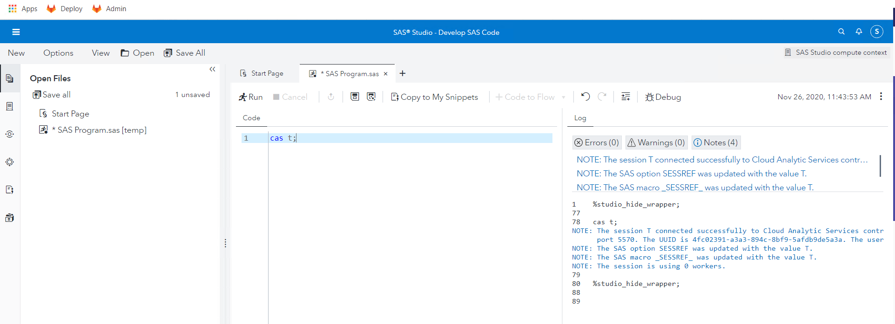

# Deploying a Programming-only environment

* [Overview of steps](#overview-of-steps)
* [Cleaning for a failed attempt (Optional)](#cleaning-for-a-failed-attempt-optional)
* [Prep Steps](#prep-steps)
  * [Prepare standard folder structure](#prepare-standard-folder-structure)
  * [Obtain and extract the Deployment assets](#obtain-and-extract-the-deployment-assets)
  * [Creating a namespace](#creating-a-namespace)
* [Deploy the GELLDAP utility into the "po" namespace](#deploy-the-gelldap-utility-into-the-po-namespace)
  * [TLS configuration](#tls-configuration)
    * [Configure Crunchy for TLS](#configure-crunchy-for-tls)
    * [Creating a TLS-related file in `./site-config/`](#creating-a-tls-related-file-in-site-config)
  * [Create file for RWX Storage Class](#create-file-for-rwx-storage-class)
  * [Label and taint your nodes](#label-and-taint-your-nodes)
  * [Create your Kustomization.yaml file](#create-your-kustomizationyaml-file)
* [Build step](#build-step)
  * [Generate the manifest file](#generate-the-manifest-file)
* [Deploy step](#deploy-step)
  * [Apply the manifest file](#apply-the-manifest-file)
* [Store the URLs for later](#store-the-urls-for-later)
* [watching the environment come up in tmux](#watching-the-environment-come-up-in-tmux)
* [Validation](#validation)
* [Stop and Restart](#stop-and-restart)
* [Clean up](#clean-up)
* [Navigation](#navigation)

## Overview of steps

1. We will create a namespace called "po"
1. We will create an ingress that has a prefix of "po.".
1. We will deploy a programming only viya env into the "po" namespace.

## Cleaning for a failed attempt (Optional)

If you need to re-run through this exercise and want to make sure that old content is not causing issues, you'd have to clean things up.

The following steps will only work if you go over all this a second time. Skip them the first time around.

1. Empty out the namespace

    ```sh
    ## writing it out the long way:

    kubectl -n po delete deployments --all

    kubectl -n po delete pods --all

    kubectl -n po delete services --all

    ## this one often gets stuck. Cancel and try again if that happens
    kubectl -n po delete persistentvolumeclaims  --all

    ```

1. But deleting the namespace will really make sure we have a clean slate

    ```bash
    kubectl delete ns po

    ```

If you don't have any "po" namespace , the above commands will return some errors. That is expected.

## Prep Steps

### Prepare standard folder structure

1. Create a working dir for the "po" environment

    ```bash
    rm -rf ~/project/deploy/po/.git
    rm -rf ~/project/deploy/po/*
    mkdir -p ~/project/deploy/po
    mkdir -p ~/project/deploy/po/site-config/
    ```

### Obtain and extract the Deployment assets

1. For this series of exercises, we will use a specific, pre-created order (SAS Data Science Programming)

1. Please run the following command (copy-paste all lines together)

    ```bash
    cd ~/project/deploy/po

    CADENCE_NAME='stable'
    CADENCE_VERSION='2020.1.5'

    bash /opt/gellow_code/scripts/common/generate_sas_bases.sh \
          --cadence-name ${CADENCE_NAME} \
          --cadence-version ${CADENCE_VERSION} \
          --order-nickname 'po' \
          --output-folder ~/project/deploy/po

    ```

1. Confirm that it created the `sas-bases` folder and content by typing ` ls -l ` :

    <details><summary>Click here to see the expected output</summary>

    ```log
    drwxrwxr-x 8 cloud-user cloud-user    140 Mar 29 11:42 sas-bases
    -rw-rw-r-- 1 cloud-user cloud-user 452563 Mar 29 11:42 SASViyaV4_9CF3T6_0_stable_2020.1.4_20210326.1616785638833_deploymentAssets_2021-03-29T154110.tgz
    -rw-rw-r-- 1 cloud-user cloud-user   4207 Mar 29 11:42 SASViyaV4_9CF3T6_certs.zip
    drwxrwxr-x 2 cloud-user cloud-user      6 Mar 29 11:27 site-config
    ```

    </details>

### Creating a namespace

1. Create a namespace for our "po" environment

    ```bash
    kubectl create ns po
    kubectl get ns

    ```

1. Make it the default namespace:

    ```bash
    kubectl config set-context --current --namespace=po
    ```

<!-- ### Creating a sitedefault file

1. Generate a `sitedefault.yaml` just to define the default password for the sasboot account

    ```bash
    tee  ~/project/deploy/po/site-config/sitedefault.yaml > /dev/null << "EOF"
    ---
    config:
      application:
        sas.logon.initial:
          user: sasboot
          password: lnxsas
    EOF
    ``` -->

## Deploy the GELLDAP utility into the "po" namespace

1. The GELLDAP project is located [here](https://gelgitlab.race.sas.com/GEL/utilities/gelldap)

1. Clone the GELLDAP project into the project directory

    ```bash
    cd ~/project/
    git clone https://gelgitlab.race.sas.com/GEL/utilities/gelldap.git
    cd ~/project/gelldap/
    git fetch --all
    GELLDAP_BRANCH=int_images
    git switch ${GELLDAP_BRANCH}

    ```

1. Deploy GELLDAP into the namespace (**do provide the namespace here**)

    ```bash

    cd ~/project/gelldap/
    kustomize build ./no_TLS/ | kubectl -n po apply -f -

    ```

1. Wait a few seconds and confirm that the service listens on port 389:

    ```bash
    # first, get the service IP:
    kubectl -n po get svc -l app.kubernetes.io/part-of=gelldap,app=gelldap-service -o=custom-columns='IP:spec.clusterIP' --no-headers
    # store it in a variable:
    IP_GELLDAP=$(kubectl -n po get svc -l app.kubernetes.io/part-of=gelldap,app=gelldap-service -o=custom-columns='IP:spec.clusterIP' --no-headers)
    # now curl it:
    curl -v ${IP_GELLDAP}:389

    ```

    You should see:

    ```log
    * About to connect() to 10.43.103.202 port 389 (#0)
    *   Trying 10.43.103.202...
    * Connected to 10.43.103.202 (10.43.103.202) port 389 (#0)
    > GET / HTTP/1.1
    > User-Agent: curl/7.29.0
    > Host: 10.43.103.202:389
    > Accept: */*
    >
    * Empty reply from server
    * Connection #0 to host 10.43.103.202 left intact
    curl: (52) Empty reply from server
    ```

1. The GELLDAP server comes with pre-written sitedefault and sssd information.

1. Let's copy the provided file in the proper location:

    ```bash
    cp ~/project/gelldap/no_TLS/gelldap-sitedefault.yaml \
       ~/project/deploy/po/site-config/

    ```

1. This file will be referenced in the kustomization file in the later steps

### TLS configuration

By default, since the 2020.0.6 version, the default Kustomization definition includes all the directive for TLS encryption of all the Viya communications.

#### Configure Crunchy for TLS

1. Following the instructions in the postgres README file, we are told to create this file

    ```bash
    cd ~/project/deploy/po

    mkdir -p ./site-config/postgres

    cat ./sas-bases/examples/configure-postgres/internal/custom-config/postgres-custom-config.yaml | \
        sed 's|\-\ {{\ HBA\-CONF\-HOST\-OR\-HOSTSSL\ }}|- hostssl|g' | \
        sed 's|\ {{\ PASSWORD\-ENCRYPTION\ }}| scram-sha-256|g' \
        > ./site-config/postgres/postgres-custom-config.yaml

    ```

#### Creating a TLS-related file in `./site-config/`

* Prepare the TLS configuration

    ```bash
    cd ~/project/deploy/po
    mkdir -p ./site-config/security/
    # create the certificate issuer called "sas-viya-issuer"
    sed 's|{{.*}}|sas-viya-issuer|g' ./sas-bases/examples/security/cert-manager-provided-ingress-certificate.yaml  \
        > ./site-config/security/cert-manager-provided-ingress-certificate.yaml
    ```

### Create file for RWX Storage Class

1. In stable-2020.1.4, we are instructed to create this file with the name of a Kubernetes Storage Class that is capable of doing RWX Volumes.

1. do a `kubectl get sc` to see it

1. In our environment, it's called "nfs-client"

1. So to create that file, we do:

    ```bash
    bash -c "cat << EOF > ~/project/deploy/po/site-config/storageclass.yaml
    ---
    kind: RWXStorageClass
    metadata:
      name: wildcard
    spec:
      storageClassName: nfs-client
    EOF"

    ```


### Label and taint your nodes

Labelling and tainting your nodes allow you to:
* direct Viya pods to go on specific nodes
* make other pods stay away from these nodes

This topic is covered in more details in other places. For the time being, follow the instructions given to you here.  Of course, if you are curious Google can help explain that taints are a way of tagging nodes for specific workloads. Other parts of this workshop will dwelve more deeply into those topics.

The commands below will ensure that:

* Previous taints/labels are fully removed if any were present.
* Compute pods will start on INTNODE05
* CAS Pods will start on INTNODE04
* No other Pods than the CAS ones will be scheduled on INTNODE04

1. Remove taints and labels from nodes:

    ```bash
    kubectl label nodes intnode01 intnode02 intnode03 intnode04 intnode05 workload.sas.com/class-          --overwrite
    kubectl taint nodes intnode01 intnode02 intnode03 intnode04 intnode05 workload.sas.com/class-          --overwrite

    ```

1. If you don't have any taints or labels, the above commands will return some errors. That is expected.

1. Assign the new labels and taints

    ```bash
    # do all of the labels
    kubectl label nodes intnode01           workload.sas.com/class=stateful           --overwrite
    kubectl label nodes intnode02 intnode03 workload.sas.com/class=stateless          --overwrite
    kubectl label nodes intnode04           workload.sas.com/class=cas                --overwrite
    kubectl label nodes intnode05           workload.sas.com/class=compute            --overwrite

    # only do one of the taints
    #kubectl taint nodes intnode01                                               workload.sas.com/class=stateful:NoSchedule --overwrite
    #kubectl taint nodes intnode02 intnode03                                     workload.sas.com/class=stateless:NoSchedule --overwrite
    kubectl taint nodes intnode04                                               workload.sas.com/class=cas:NoSchedule --overwrite
    #kubectl taint nodes intnode05                                               workload.sas.com/class=compute:NoSchedule --overwrite

    ```


### Create your Kustomization.yaml file

1. The kustomization.yaml file should have the following content.

    ```bash
    INGRESS_SUFFIX=$(hostname -f)
    echo $INGRESS_SUFFIX

    bash -c "cat << EOF > ~/project/deploy/po/kustomization.yaml
    ---
    namespace: po
    resources:
      - sas-bases/base
      - sas-bases/overlays/cert-manager-issuer     # TLS
      - sas-bases/overlays/network/ingress
      - sas-bases/overlays/network/ingress/security   # TLS
      - sas-bases/overlays/internal-postgres
      - sas-bases/overlays/crunchydata
      - sas-bases/overlays/cas-server
      # this line DOES NOT APPLY for programming-only offerings (data science)
      #- sas-bases/overlays/internal-elasticsearch    # New Stable 2020.1.3
      - sas-bases/overlays/update-checker       # added update checker
      - sas-bases/overlays/cas-server/auto-resources    # CAS-related
    configurations:
      - sas-bases/overlays/required/kustomizeconfig.yaml
    transformers:
      - sas-bases/overlays/network/ingress/security/transformers/product-tls-transformers.yaml   # TLS
      - sas-bases/overlays/network/ingress/security/transformers/ingress-tls-transformers.yaml   # TLS
      - sas-bases/overlays/network/ingress/security/transformers/backend-tls-transformers.yaml   # TLS
      # this line DOES NOT APPLY for programming-only offerings (data science)
      #- sas-bases/overlays/internal-elasticsearch/sysctl-transformer.yaml       # New Stable 2020.1.3
      - sas-bases/overlays/required/transformers.yaml
      - sas-bases/overlays/internal-postgres/internal-postgres-transformer.yaml
      - site-config/security/cert-manager-provided-ingress-certificate.yaml     # TLS
      - sas-bases/overlays/cas-server/auto-resources/remove-resources.yaml    # CAS-related
      # this line DOES NOT APPLY for programming-only offerings (data science)
      #- sas-bases/overlays/internal-elasticsearch/internal-elasticsearch-transformer.yaml    # New Stable 2020.1.3
      #- sas-bases/overlays/scaling/zero-scale/phase-0-transformer.yaml
      #- sas-bases/overlays/scaling/zero-scale/phase-1-transformer.yaml
    patches:        ## this is new in stable-2020.1.4
      - path: site-config/storageclass.yaml
        target:
          kind: PersistentVolumeClaim
          annotationSelector: sas.com/component-name in (sas-backup-job,sas-data-quality-services,sas-commonfiles)
    configMapGenerator:
      - name: ingress-input
        behavior: merge
        literals:
          - INGRESS_HOST=po.${INGRESS_SUFFIX}
      - name: sas-shared-config
        behavior: merge
        literals:
          - SAS_SERVICES_URL=https://po.${INGRESS_SUFFIX}
      # # This is to fix an issue that only appears in RACE Exnet.
      # # Do not do this at a customer site
      - name: sas-go-config
        behavior: merge
        literals:
          - SAS_BOOTSTRAP_HTTP_CLIENT_TIMEOUT_REQUEST='15m'
    secretGenerator:
      - name: sas-consul-config            ## This injects content into consul. You can add, but not replace
        behavior: merge
        files:
          - SITEDEFAULT_CONF=site-config/gelldap-sitedefault.yaml # with 2020.1.5, the sitedefault.yaml config becomes a secretGenerator
    generators:
      - site-config/postgres/postgres-custom-config.yaml
    EOF"
    ```

Note that this is different than the kustomization.yaml used so far: the "SAS Data Science Programming" offering does not include SAS Information Catalog, nor the Elasticsearch server.

```sh
# compare with the full order
icdiff -H ~/project/deploy/po/kustomization.yaml  ~/project/deploy/lab/kustomization.yaml

```

## Build step

### Generate the manifest file

1. At this point, we are ready to generate the manifest

    ```bash
    cd ~/project/deploy/po
    kustomize build -o site.yaml

    ```

## Deploy step

### Apply the manifest file

1. We are now ready to Apply this manifest to our cluster:

    For the first time, (because we want the operator to start first) :

    ```bash
    cd ~/project/deploy/po
    NS="po"

    kubectl -n ${NS} apply  -f site.yaml --selector="sas.com/admin=cluster-wide"

    kubectl -n ${NS} wait --for condition=established --timeout=60s -l "sas.com/admin=cluster-wide" crd

    kubectl -n ${NS} apply  --selector="sas.com/admin=cluster-local" -f site.yaml --prune

    kubectl -n ${NS} apply  --selector="sas.com/admin=namespace" -f site.yaml --prune

    ```

    For the next time just run :

    ```bash
    cd ~/project/deploy/po
    kubectl -n ${NS} apply  -f site.yaml

    ```

    Doing this will create all required content in kubernetes and start up the process.

1. If you receive messages similar to the following, rerun the apply command.

   

## Store the URLs for later

1. No point in connecting yet, but let's store the URLs in a file, for later user

    ```bash
    printf "\n* [Viya Studio (po) URL (HTTP )](http://po.$(hostname -f)/SASStudio )\n\n" | tee -a /home/cloud-user/urls.md
    printf "\n* [Viya Studio (po) URL (HTTP**S**)](https://po.$(hostname -f)/SASStudio )\n\n" | tee -a /home/cloud-user/urls.md
    printf "\n* [Viya Environment Manager (po) URL (HTTP)](http://po.$(hostname -f)/SASEnvironmentManager )\n\n" | tee -a /home/cloud-user/urls.md
    printf "\n* [Viya Environment Manager (po) URL (HTTP**S**)](https://po.$(hostname -f)/SASEnvironmentManager )\n\n" | tee -a /home/cloud-user/urls.md
    ```

1. Whenever you want to see the URLs for YOUR environment, execute:

    ```bash
    cat ~/urls.md
    ```

## watching the environment come up in tmux

1. This will kick off a tmux session called "po_watch":

    ```sh
    #watch kubectl get pods -o wide -n po

    SessName=po_watch

    tmux new -s $SessName -d
    tmux send-keys -t $SessName "time gel_OKViya4 -n po --manifest ~/project/deploy/po/site.yaml --wait --pod-status"  C-m
    tmux split-window -v -t $SessName
    tmux send-keys -t $SessName "watch 'kubectl get pods -o wide -n po | grep 0/ | grep -v Completed '"  C-m

    # or, wait for:
    kubectl wait -n po --for=condition=ready pod --selector='app.kubernetes.io/name=sas-readiness'  --timeout=2700s
    # to return

    ```

1. And this will attach you to it:

    ```sh
    tmux attach -t $SessName
    ```

In this split screen view, you will see a list of pods at the bottom, and a looping script in the top part.

The bottom part is only showing the pods with `0/` in the number of containers. So as time goes by, the list of pods will shrink. When they are all ` 1/1   Running`, your environment is likely ready.

It is unlikely that your environment will be ready in less than 30 minutes, so be patient. (When the "oldest" pod is about 30-35 minutes old, things should be settling down.)

To get out of tmux, press `Ctrl-C` and type `exit` until the green line disappears.

## Validation

At this point, once the environment has finished booting up, you should be able to connect to SAS Studio.

To see the URL you should use, execute:

```bash
cat ~/urls.md | grep po | grep Studio
```

Ctrl-Click on the URL to access it, and log in with:

* User: `sastest1` or `sasadm`
* Password: `lnxsas`

Once inside the SAS Studio Application, you need to wait a little bit for the Compute server to be ready (the Compute server image needs to be pulled on the node where the corresponding Pod has started).


* Connect to SAS Studio and run some code. For example, check that you can create a CAS session.

  

* Connect to SAS Environment manager as "sasadm" (password: lnxsas)

  

<!-- ## Configure CAS external access

### Ingress configuration

* Create the configmap for ingress

    ```sh
    bash -c "cat << EOF > ~/project/deploy/po/castcpservcm.yaml
    apiVersion: v1
    kind: ConfigMap
    metadata:
      name: tcp-services
      namespace: ingress-nginx
    data:
      5570: "po/sas-cas-server-default:5570"
    EOF"
    # apply the CM
    kubectl -n ingress-nginx apply -f ~/project/deploy/po/castcpservcm.yaml
    ```

kubectl get -n ingress-nginx service ingress-nginx -o yaml > ~/project/deploy/po/ingress-ngnx-service -->

## Stop and Restart

if the deployment did not work well the first time, you can try again.

* STOP

```sh
kubectl -n po scale deployments --all --replicas=0
kubectl -n po scale statefulsets --all --replicas=0
kubectl -n po delete casdeployment --all
kubectl -n po delete jobs --all
```

* RESTART

```sh
kubectl -n po apply -f ~/project/deploy/po/site.yaml
kubectl -n po scale deployments --all --replicas=1
kubectl -n po scale statefulsets --all --replicas=1
```

## Clean up

The easiest way to remove the programing-only deployment is to remove the namespace.

```sh
kubectl delete ns po
```

## Navigation

<!-- startnav -->
* [01 Introduction / 01 031 Booking a Lab Environment for the Workshop](/01_Introduction/01_031_Booking_a_Lab_Environment_for_the_Workshop.md)
* [01 Introduction / 01 032 Assess Readiness of Lab Environment](/01_Introduction/01_032_Assess_Readiness_of_Lab_Environment.md)
* [01 Introduction / 01 033 CheatCodes](/01_Introduction/01_033_CheatCodes.md)
* [02 Kubernetes and Containers Fundamentals / 02 131 Learning about Namespaces](/02_Kubernetes_and_Containers_Fundamentals/02_131_Learning_about_Namespaces.md)
* [03 Viya 4 Software Specifics / 03 011 Looking at a Viya 4 environment with Visual Tools DEMO](/03_Viya_4_Software_Specifics/03_011_Looking_at_a_Viya_4_environment_with_Visual_Tools_DEMO.md)
* [03 Viya 4 Software Specifics / 03 051 Create your own Viya order](/03_Viya_4_Software_Specifics/03_051_Create_your_own_Viya_order.md)
* [03 Viya 4 Software Specifics / 03 056 Getting the order with the CLI](/03_Viya_4_Software_Specifics/03_056_Getting_the_order_with_the_CLI.md)
* [04 Pre Requisites / 04 081 Pre Requisites automation with Viya4-ARK](/04_Pre-Requisites/04_081_Pre-Requisites_automation_with_Viya4-ARK.md)
* [05 Deployment tools / 05 121 Setup a Windows Client Machine](/05_Deployment_tools/05_121_Setup_a_Windows_Client_Machine.md)
* [06 Deployment Steps / 06 031 Deploying a simple environment](/06_Deployment_Steps/06_031_Deploying_a_simple_environment.md)
* [06 Deployment Steps / 06 051 Deploying Viya with Authentication](/06_Deployment_Steps/06_051_Deploying_Viya_with_Authentication.md)
* [06 Deployment Steps / 06 061 Deploying in a second namespace](/06_Deployment_Steps/06_061_Deploying_in_a_second_namespace.md)
* [06 Deployment Steps / 06 071 Removing Viya deployments](/06_Deployment_Steps/06_071_Removing_Viya_deployments.md)
* [06 Deployment Steps / 06 081 Deploying a programing only environment](/06_Deployment_Steps/06_081_Deploying_a_programing-only_environment.md)**<-- you are here**
* [06 Deployment Steps / 06 091 Deployment Operator setup](/06_Deployment_Steps/06_091_Deployment_Operator_setup.md)
* [06 Deployment Steps / 06 093 Using the DO with a Git Repository](/06_Deployment_Steps/06_093_Using_the_DO_with_a_Git_Repository.md)
* [06 Deployment Steps / 06 095 Using an inline configuration](/06_Deployment_Steps/06_095_Using_an_inline_configuration.md)
* [06 Deployment Steps / 06 097 Using the Orchestration Tool](/06_Deployment_Steps/06_097_Using_the_Orchestration_Tool.md)
* [06 Deployment Steps / 06 101 Create Viya Deployment Roles](/06_Deployment_Steps/06_101_Create_Viya_Deployment_Roles.md)
* [07 Deployment Customizations / 07 021 Configuring SASWORK](/07_Deployment_Customizations/07_021_Configuring_SASWORK.md)
* [07 Deployment Customizations / 07 051 Adding a local registry to k8s](/07_Deployment_Customizations/07_051_Adding_a_local_registry_to_k8s.md)
* [07 Deployment Customizations / 07 052 Using mirror manager to populate the local registry](/07_Deployment_Customizations/07_052_Using_mirror_manager_to_populate_the_local_registry.md)
* [07 Deployment Customizations / 07 053 Deploy from local registry](/07_Deployment_Customizations/07_053_Deploy_from_local_registry.md)
* [07 Deployment Customizations / 07 091 Configure SAS ACCESS Engine](/07_Deployment_Customizations/07_091_Configure_SAS_ACCESS_Engine.md)
* [07 Deployment Customizations / 07 101 Configure SAS ACCESS TO HADOOP](/07_Deployment_Customizations/07_101_Configure_SAS_ACCESS_TO_HADOOP.md)
* [07 Deployment Customizations / 07 102 Parallel loading with EP for Hadoop](/07_Deployment_Customizations/07_102_Parallel_loading_with_EP_for_Hadoop.md)
* [09 Validation / 09 011 Validate the Viya deployment](/09_Validation/09_011_Validate_the_Viya_deployment.md)
* [09 Validation / 09 021 SAS Viya deployment reports](/09_Validation/09_021_SAS_Viya_deployment_reports.md)
* [11 Azure AKS Deployment / 11 000 Navigating the AKS Hands on Deployment Options](/11_Azure_AKS_Deployment/11_000_Navigating_the_AKS_Hands-on_Deployment_Options.md)
* [11 Azure AKS Deployment / 11 999 Fast track with cheatcodes](/11_Azure_AKS_Deployment/11_999_Fast_track_with_cheatcodes.md)
* [11 Azure AKS Deployment/Fully Automated / 11 500 Full Automation of AKS Deployment](/11_Azure_AKS_Deployment/Fully_Automated/11_500_Full_Automation_of_AKS_Deployment.md)
* [11 Azure AKS Deployment/Fully Automated / 11 590 Cleanup](/11_Azure_AKS_Deployment/Fully_Automated/11_590_Cleanup.md)
* [11 Azure AKS Deployment/Standard / 11 100 Creating an AKS Cluster](/11_Azure_AKS_Deployment/Standard/11_100_Creating_an_AKS_Cluster.md)
* [11 Azure AKS Deployment/Standard / 11 110 Performing the prerequisites](/11_Azure_AKS_Deployment/Standard/11_110_Performing_the_prerequisites.md)
* [11 Azure AKS Deployment/Standard/Cleanup / 11 400 Cleanup](/11_Azure_AKS_Deployment/Standard/Cleanup/11_400_Cleanup.md)
* [11 Azure AKS Deployment/Standard/Manual / 11 200 Deploying Viya 4 on AKS](/11_Azure_AKS_Deployment/Standard/Manual/11_200_Deploying_Viya_4_on_AKS.md)
* [11 Azure AKS Deployment/Standard/Manual / 11 210 Deploy a second namespace in AKS](/11_Azure_AKS_Deployment/Standard/Manual/11_210_Deploy_a_second_namespace_in_AKS.md)
* [11 Azure AKS Deployment/Standard/Manual / 11 220 CAS Customizations](/11_Azure_AKS_Deployment/Standard/Manual/11_220_CAS_Customizations.md)
* [11 Azure AKS Deployment/Standard/Manual / 11 230 Install monitoring and logging](/11_Azure_AKS_Deployment/Standard/Manual/11_230_Install_monitoring_and_logging.md)
* [12 Amazon EKS Deployment / 12 010 Access Environments](/12_Amazon_EKS_Deployment/12_010_Access_Environments.md)
* [12 Amazon EKS Deployment / 12 020 Provision Resources](/12_Amazon_EKS_Deployment/12_020_Provision_Resources.md)
* [12 Amazon EKS Deployment / 12 030 Deploy SAS Viya](/12_Amazon_EKS_Deployment/12_030_Deploy_SAS_Viya.md)
* [13 Google GKE Deployment / 13 011 Creating a GKE Cluster](/13_Google_GKE_Deployment/13_011_Creating_a_GKE_Cluster.md)
* [13 Google GKE Deployment / 13 021 Performing Prereqs in GKE](/13_Google_GKE_Deployment/13_021_Performing_Prereqs_in_GKE.md)
* [13 Google GKE Deployment / 13 031 Deploying Viya 4 on GKE](/13_Google_GKE_Deployment/13_031_Deploying_Viya_4_on_GKE.md)
* [13 Google GKE Deployment / 13 041 Full Automation of GKE Deployment](/13_Google_GKE_Deployment/13_041_Full_Automation_of_GKE_Deployment.md)
* [13 Google GKE Deployment / 13 099 Fast track with cheatcodes](/13_Google_GKE_Deployment/13_099_Fast_track_with_cheatcodes.md)
<!-- endnav -->


