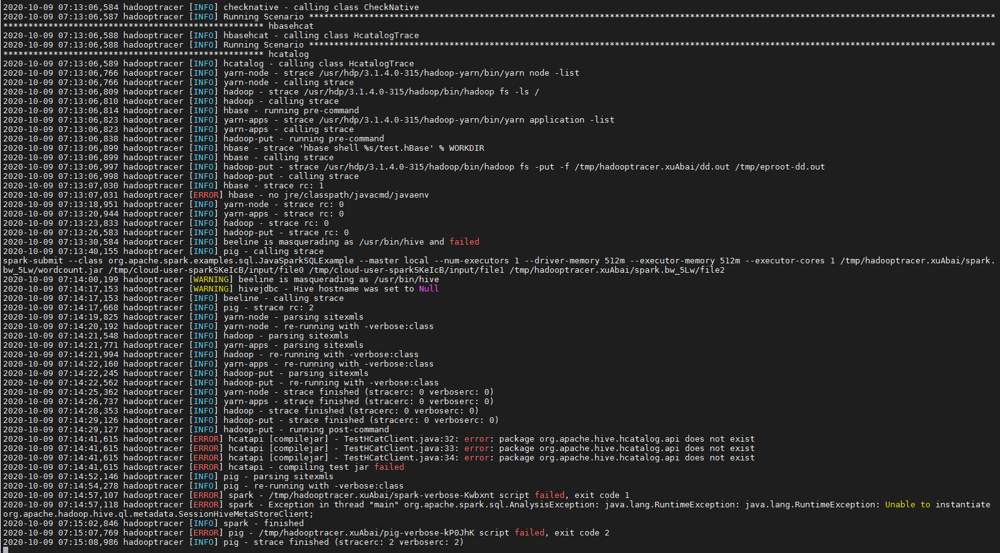

# Configure a SAS/ACCESS to Hadoop

* [RACE environment and namespaces](#race-environment-and-namespaces)
* [Configure the connection to the remote Hadoop cluster (F2F only)](#configure-the-connection-to-the-remote-hadoop-cluster-f2f-only)
* [Configure the Hive connection account](#configure-the-hive-connection-account)
* [Run the hadoop-tracer on the remote Hadoop cluster](#run-the-hadoop-tracer-on-the-remote-hadoop-cluster)
  * [Use HadoopTracer to collect the Hadoop jar files](#use-hadooptracer-to-collect-the-hadoop-jar-files)
  * [Determine if the hadooptracer run was Successful](#determine-if-the-hadooptracer-run-was-successful)
* [Configure the Persistent Storage for our Hadoop client files](#configure-the-persistent-storage-for-our-hadoop-client-files)
* [Reference Hadoop Clients volume using Kustomize PatchTransformers files](#reference-hadoop-clients-volume-using-kustomize-patchtransformers-files)
  * [Create PatchTransformers for CAS, sas-compute-job-config and sas-launcher-job-config pods](#create-patchtransformers-for-cas-sas-compute-job-config-and-sas-launcher-job-config-pods)
  * [Add the patchTransformers in the kustomization.yaml file](#add-the-patchtransformers-in-the-kustomizationyaml-file)
* [Configure sas-access.properties](#configure-sas-accessproperties)
* [Configure database Host resolution for the pods](#configure-database-host-resolution-for-the-pods)
  * [Prepare for defining HostAliases for SAS Viya using Kustomize PatchTransformers files](#prepare-for-defining-hostaliases-for-sas-viya-using-kustomize-patchtransformers-files)
  * [Update the base kustomization.yaml file](#update-the-base-kustomizationyaml-file)
* [Update and re-apply the manifests](#update-and-re-apply-the-manifests)
* [Test SAS Libraries and CASLIBs](#test-sas-libraries-and-caslibs)

## RACE environment and namespaces

* You can do this hands-on from the C2 (AUTO-DEPLOYED) Collection or after your own deployment from the C1 collection.
* Simply adjust the deploy directories and namespaces accordingly.
* In the sample commands here we use `gelenv`

## Configure the connection to the remote Hadoop cluster (F2F only)

First thing first, our CAS controller must be able to contact the remote Hive server.

As there is no remote hadoop cluster as part of this collection, in this particular Hands-on we use a common Hadoop collection which is part of the VLE/workshop standby collection):

<!-- * Hive Server IP: < **10.96.8.245** or ask the instructor> (original long term reservation without EP)-->
<!-- * Hive Server IP: < **10.96.17.182** or ask the instructor
* Hive Server Hostname: sashdp02.race.sas.com
<!-- * HDFS NameNode IP: **10.96.5.184** (original long term reservation without EP)
* HDFS NameNode IP: **10.96.11.106**
* HDFS NameNode Hostname: sashdp01.race.sas.com
* Ambari URL: <http://10.96.5.184:8080/>
 -->
* Let's set environment variables for our Hadoop servers IP addresses (ask the instructor to check if the IP addresses are correct):

    ```sh
    export HIVE_IP="10.96.17.182"
    export HDFS_IP="10.96.8.28"
    ```

Check the IP addresses with the instructor as they are subject to change.

With this information, update ```/etc/hosts``` on our Ansible controller:

* Open the file with your favorite text editor:

    ```sh
    sudo vi /etc/hosts
    ```

* Then add the 2 lines below at the end of the file.

    ```log
    ${HIVE_IP} sashdp02.race.sas.com sashdp02
    ${HDFS_IP} sashdp01.race.sas.com sashdp01
    ```

* You can also do it automatically running this command :

    ```sh
    ansible localhost -m lineinfile -a "dest=/etc/hosts line='${HIVE_IP} sashdp02.race.sas.com sashdp02'" -b --diff
    ansible localhost -m lineinfile -a "dest=/etc/hosts line='${HDFS_IP} sashdp01.race.sas.com sashdp01'" -b --diff
    ```

* Ensure that you can "ssh" to this machine, then exit:

    ```sh
    ssh sashdp01.race.sas.com
    ```

* When prompted, type "y", then you should see :

    ```log
    [cloud-user@rext03-0182 ~]$ ssh sashdp01.race.sas.com
    The authenticity of host 'sashdp01.race.sas.com (10.96.11.106)' can't be established.
    ECDSA key fingerprint is SHA256:U0grULXFL26w+xOoL3+c5/4OsgpMOJz/dcbsvrcd6EQ.
    ECDSA key fingerprint is MD5:73:df:44:4d:a3:28:e3:6f:76:de:ce:be:4f:e3:4e:aa.
    Are you sure you want to continue connecting (yes/no)? yes
    Warning: Permanently added 'sashdp01.race.sas.com,10.96.11.106' (ECDSA) to the list of known hosts.
    Last login: Tue Sep 22 09:40:16 2020 from 172.16.58.33
    ```

    **Then don't forget to type ```exit``` to log out.**

* Test the Hive port

    ```sh
    #test Hive connection
    nc -zv ${HIVE_IP} 10000
    ```

* You should see something like:

    ```log
    Ncat: Version 7.50 ( https://nmap.org/ncat )
    Ncat: Connected to 10.96.17.182:10000.
    Ncat: 0 bytes sent, 0 bytes received in 0.03 seconds.
    ```

## Configure the Hive connection account

Then, to use the hadoop tracer playbook to collect the config xml and JARs files, we need an account:

1. That can be used to SSH from the ansible controller to the Hive server (without providing a password)

1. With a home directory in HDFS with write access

here, we will use the ```cloud-user``` account to run the hadoop tracer on the remote Hive machine.

## Run the hadoop-tracer on the remote Hadoop cluster

We assume that all the checks have been done on the Hadoop side to run the tool that will extract the required configuration and libraries (Python, strace, and wget installed, HDFS Home folder existing for the account running hadoop tracer, Hive is running, etc...).

### Use HadoopTracer to collect the Hadoop jar files

**Important : All the instructions in this section have to be executed on the remote Hadoop cluster.**

* Connect to sashdp01 and create a temporary folder

    ```sh
    ssh sashdp01.race.sas.com
    ```

    ```sh
    # we use the EPOCH datetime to ensure each attendee is working inside its own temporary folder
    EPOCHDATENOW=$(date +'%s')
    echo $EPOCHDATENOW
    mkdir /tmp/htracer.${EPOCHDATENOW}
    ```

* Download the hadooptracer.zip file from the following FTP site to the directory that you created: ftp.sas.com/techsup/download/blind/access/hadooptracer.zip

    ```sh
    curl http://ftp.sas.com/techsup/download/blind/access/hadooptracer.zip -o /tmp/htracer.${EPOCHDATENOW}/hadooptracer.zip
    cd /tmp/htracer.${EPOCHDATENOW}
    unzip hadooptracer.zip
    ```

* Change permissions on the hadooptracer_py file to include the Execute permission:

    ```sh
    chmod 755 ./hadooptracer_py
    ```

* Run the hadooptracer

    ```sh
    time python ./hadooptracer_py --filterby=latest --postprocess --jsonfile ./driver.json -b /tmp/htracer.${EPOCHDATENOW}/
    ```

* It will take a while (around 20 minutes if you are the only one running the hadoop tracer on the machine)
* ...and you may also notice some errors...



But the most important is to know if the jar files and configuration have been extracted and placed in the /tmp folders.

**Extract from the official documentation :**

_Most errors with the Hadoop tracer script stem from improper usage or an incorrect cluster configuration. If there are a problems with the Hadoop cluster, they will typically show up in the stdout of the Hadoop tracer script in the form of Java traceback information._

_Another common problem occurs when users try to run the Hadoop tracer script on a cluster node that doesn't have Hadoop/Hive/HDFS/Yarn/Pig/etc in an available PATH. For example,_

```log
2020-04-07 12:16:51,036 hadooptracer [ERROR] pig is not found in the $PATH
```

_Inspect the hadooptracer.log file, located in "/tmp" by default, and use the rest of this troubleshooting section to resolve common issues. Some error messages in the console output for hadooptracer_py are normal and do not necessarily indicate a problem with the JAR and configuration file collection process._

_However, if the files are not collected as expected or if you experience problems connecting to Hadoop with the collected files, contact SAS Technical Support and include the hadooptracer.log and the hadooptracer.json files._

### Determine if the hadooptracer run was Successful

* Run this command to check it something was extracted

    ```sh
    ls -l /tmp/htracer.${EPOCHDATENOW}
    ```

* You should see :

    ```log
    total 8304
    -rw-r--r--. 1 cloud-user cloud-user 4264249 Oct  9 10:09 hadooptracer.json
    -rw-r--r--. 1 cloud-user cloud-user 4161268 Oct  9 10:09 hadooptracer.log
    -rw-r--r--. 1 cloud-user cloud-user   48576 Oct  9 06:39 hadooptracer.zip
    drwxr-xr-x. 4 cloud-user cloud-user   16384 Oct  9 10:09 jars
    drwxr-xr-x. 2 cloud-user cloud-user    4096 Oct  9 10:09 sitexmls
    ```

* Ensure that the required Hadoop JAR files are collected from the Hadoop cluster and placed in the ./jars directory.

    ```sh
    ls -l /tmp/htracer.${EPOCHDATENOW}/jars
    ```

* Ensure that the required Hadoop configuration files are collected from the Hadoop cluster and placed in ./sitexmls directory.

    ```sh
    ls -l /tmp/htracer.${EPOCHDATENOW}/sitexmls
    ```

<!-- * Commented as already done on the machine

    ```sh
    # move the files from the timestamped folder to the /tmp folder
    mkdir -p /tmp/jars
    mkdir -p /tmp/sitexmls
    cp /tmp/htracer.${EPOCHDATENOW}/jars/* /tmp/jars/
    cp -R /tmp/htracer.${EPOCHDATENOW}/jars/hive_warehouse_connector/ /tmp/jars/
    cp -R /tmp/htracer.${EPOCHDATENOW}/jars/spark/ /tmp/jars/
    cp /tmp/htracer.${EPOCHDATENOW}/sitexmls/* sitexmls/
    ```
-->

* Now exit from sashdp01 and come back to your session on sasnode01.

    ```sh
    exit
    ```

## Configure the Persistent Storage for our Hadoop client files

We need to provision a Kubernetes Persistent Volume to store the database third-party libraries and configuration files that are required for your data sources.
In the RACE environment, our Kubernetes cluster is using NFS for the persistent storage.

* Now that we have collected the files we need and place them in a directory on the NFS server, then we will export this directory as an NFS mount point for the Kuberbnetes Nodes.

    ```sh
    #create a directory on the NFS server (node01)
    sudo mkdir -p /opt/access-clients/hadoop
    # make cloud-user owner
    sudo chown -R cloud-user:cloud-user /opt/access-clients

* Get the Hadoop jars and configuration folders from sashdp01

    _Note: here we copy the foders in "/tmp" that should be the same as the ones your created in your own directory "/tmp/htracer{EPOCH}"._

    ```sh
    scp -r cloud-user@sashdp01:/tmp/prebuilt-htracer/jars /opt/access-clients/hadoop
    scp -r cloud-user@sashdp01:/tmp/prebuilt-htracer/sitexmls /opt/access-clients/hadoop
    ```

__If you have already completed the [Configure SAS ACCESS engine](/07_Deployment_Customizations/07_010_Configure_SAS_ACCESS_Engine.md) hands-on, you can skip the next steps this section and move to the next one__

* Then we need to export our access-clients directory
* On node1.race.sas.com, edit ```/etc/exports``` and add the following line:

    ```log
    /opt/access-clients   *(rw,sync,no_root_squash)
    ```

* Run the command below to do it automatically

    ```sh
    # add an shared dir
    ansible localhost -m lineinfile -a "dest=/etc/exports line='/opt/access-clients   *(rw,sync,no_root_squash)'" -b --diff
    ```

* Refresh the exports:

    ```sh
    # refresh NFS export
    sudo exportfs -a
    ```

_Note: in a Cloud deployment, you would likely use something like a file storage service for that._

## Reference Hadoop Clients volume using Kustomize PatchTransformers files

_IMPORTANT : If you have already completed the [Configure SAS ACCESS engine](/07_Deployment_Customizations/07_010_Configure_SAS_ACCESS_Engine.md) hands-on, skip the next steps this section and go directly the next [section](#configure-sas-accessproperties)_

* Create site-config/data-access

    ```sh
    mkdir -p ~/project/deploy/gelenv-sasaccess/site-config/data-access
    ```

### Create PatchTransformers for CAS, sas-compute-job-config and sas-launcher-job-config pods

* Create a PatchTransformer in site-config/data-access/data-mounts-cas.yaml

    ```yaml
    cat > ~/project/deploy/gelenv-sasaccess/site-config/data-access/data-mounts-cas.yaml << EOF
    # General example for adding mounts to CAS workers
    # PatchTransformer
    apiVersion: builtin
    kind: PatchTransformer
    metadata:
        name: data-mounts-cas
    patch: |- ## NFS path example - kubernetes will mount these for you
      - op: add
        path: /spec/controllerTemplate/spec/containers/0/volumeMounts/-
        value:
            name: db-client-access
            mountPath: "/access-clients"
      - op: add
        path: /spec/controllerTemplate/spec/volumes/-
        value:
            name: db-client-access
            nfs:
                path: /opt/access-clients
                server: intnode01.race.sas.com
    target:
        kind: CASDeployment
        annotationSelector: sas.com/sas-access-config=true
    EOF
    ```

<!-- for cheatcode
    ```sh
    cat > ~/project/deploy/gelenv-sasaccess/site-config/data-access/data-mounts-cas.yaml << EOF
    # General example for adding mounts to CAS workers
    # PatchTransformer
    apiVersion: builtin
    kind: PatchTransformer
    metadata:
        name: data-mounts-cas
    patch: |- ## NFS path example - kubernetes will mount these for you
      - op: add
        path: /spec/controllerTemplate/spec/containers/0/volumeMounts/-
        value:
            name: db-client-access
            mountPath: "/access-clients"
      - op: add
        path: /spec/controllerTemplate/spec/volumes/-
        value:
            name: db-client-access
            nfs:
                path: /opt/access-clients
                server: intnode01.race.sas.com
    target:
        kind: CASDeployment
        annotationSelector: sas.com/sas-access-config=true
    EOF
    ```
-->

* Create a PatchTransformer in site-config/data-access/data-mounts-job.yaml

    ```yaml
    cat > ~/project/deploy/gelenv-sasaccess/site-config/data-access/data-mounts-job.yaml << EOF
    # General example for adding mounts to SAS containers with a
    # PatchTransformer
    apiVersion: builtin
    kind: PatchTransformer
    metadata:
        name: data-mounts-job
    patch: |- ## NFS path example - kubernetes will mount these for you
      - op: add
        path: /template/spec/containers/0/volumeMounts/-
        value:
            name: db-client-access
            mountPath: "/access-clients"
      - op: add
        path: /template/spec/volumes/-
        value:
            name: db-client-access
            nfs:
                path: /opt/access-clients
                server: intnode01.race.sas.com
    target:
        kind: PodTemplate
        annotationSelector: sas.com/sas-access-config=true
    EOF
    ```

<!-- for cheatcode
    ```sh
    cat > ~/project/deploy/gelenv-sasaccess/site-config/data-access/data-mounts-job.yaml << EOF
    # General example for adding mounts to SAS containers with a
    # PatchTransformer
    apiVersion: builtin
    kind: PatchTransformer
    metadata:
        name: data-mounts-job
    patch: |- ## NFS path example - kubernetes will mount these for you
      - op: add
        path: /template/spec/containers/0/volumeMounts/-
        value:
            name: db-client-access
            mountPath: "/access-clients"
      - op: add
        path: /template/spec/volumes/-
        value:
            name: db-client-access
            nfs:
                path: /opt/access-clients
                server: intnode01.race.sas.com
    target:
        kind: PodTemplate
        annotationSelector: sas.com/sas-access-config=true
    EOF
    ```
-->

### Add the patchTransformers in the kustomization.yaml file

* Either manually add the following lines in the transformers section:

    ```yaml
    transformers:
    ...
    - site-config/data-access/data-mounts-cas.yaml
    - site-config/data-access/data-mounts-job.yaml
    ```

* Or execute this code for the new transformers references

    ```sh
    # backup just in case
    cp ~/project/deploy/gelenv/kustomization.yaml ~/project/deploy/gelenv-sasaccess/kustomization.yaml.backup
    # add transformers lines with yq
    yq write  -i ~/project/deploy/gelenv-sasaccess/kustomization.yaml "transformers[+]" "site-config/data-access/data-mounts-cas.yaml"
    yq write  -i ~/project/deploy/gelenv-sasaccess/kustomization.yaml "transformers[+]" "site-config/data-access/data-mounts-job.yaml"
    ```

## Configure sas-access.properties

* For SAS/ACCESS to HADOOP, SAS does not recommend setting these as environment variables within your sas-access.properties file, as they would then be used for any connections from your Viya cluster.
* Instead, within your SAS program, we will use:

    ```sh
    options set=SAS_HADOOP_JAR_PATH=$(PATH_TO_HADOOP_JARs);
    options set=SAS_HADOOP_CONFIG_PATH=$(PATH_TO_HADOOP_CONFIG);
    ```

## Configure database Host resolution for the pods

The machine where the Hive server resides might not be referenced in the DNS and thus might not be accessible through a logical name but rather using its IP address.

Adding an appropriate entry in /etc/hosts on each Kubernetes cluster node does not solve the problem.

To use logical names, host aliases can be defined directly at the container "spec" level using Kustomize PatchTransformers.

### Prepare for defining HostAliases for SAS Viya using Kustomize PatchTransformers files

* Create the site-config/network directory

    ```sh
    mkdir -p ~/project/deploy/gelenv-sasaccess/site-config/network
    ```

* Make sure the environment variable for the Hive IP address is still there

    ```sh
    echo ${HIVE_IP}
    echo ${HDFS_IP}
    ```

* Create the site-config/network/etc-hosts-cas-for-hive.yaml file for CAS-related pods:

    ```yaml
    cat > ~/project/deploy/gelenv-sasaccess/site-config/network/etc-hosts-cas-for-hive.yaml << EOF
    # General example for adding hosts to CAS workers
    # PatchTransformer
    apiVersion: builtin
    kind: PatchTransformer
    metadata:
        name: etc-hosts-cas-hive
    patch: |-
      - op: add
        path: /spec/controllerTemplate/spec/hostAliases
        value:
          - ip: "${HIVE_IP}"
            hostnames:
            - "sashdp02.race.sas.com"
          - ip: "${HDFS_IP}"
            hostnames:
            - "sashdp01.race.sas.com"
    target:
        kind: CASDeployment
        annotationSelector: sas.com/sas-access-config=true
    EOF
    ```

<!-- for cheatcode
    ```sh
    cat > ~/project/deploy/gelenv-sasaccess/site-config/network/etc-hosts-cas-for-hive.yaml << EOF
    # General example for adding hosts to CAS workers
    # PatchTransformer
    apiVersion: builtin
    kind: PatchTransformer
    metadata:
        name: etc-hosts-cas-hive
    patch: |-
      - op: add
        path: /spec/controllerTemplate/spec/hostAliases
        value:
          - ip: "${HIVE_IP}"
            hostnames:
            - "sashdp02.race.sas.com"
          - ip: "${HDFS_IP}"
            hostnames:
            - "sashdp01.race.sas.com"
    target:
        kind: CASDeployment
        annotationSelector: sas.com/sas-access-config=true
    EOF
    ```
-->

* Create site-config/network/etc-hosts-job-for-hive.yaml for sas-compute-job-config and sas-launcher-job-config pods:

    ```yaml
    cat > ~/project/deploy/gelenv-sasaccess/site-config/network/etc-hosts-job-for-hive.yaml << EOF
    # General example for adding hosts to SAS containers with a
    # PatchTransformer
    apiVersion: builtin
    kind: PatchTransformer
    metadata:
        name: etc-hosts-job-hive
    patch: |-
      - op: add
        path: /template/spec/hostAliases
        value:
          - ip: "${HIVE_IP}"
            hostnames:
            - "sashdp02.race.sas.com"
          - ip: "${HDFS_IP}"
            hostnames:
            - "sashdp01.race.sas.com"
    target:
        kind: PodTemplate
        annotationSelector: sas.com/sas-access-config=true
    EOF
    ```

<!-- for cheatcode
    ```sh
    cat > ~/project/deploy/gelenv/site-config/network/etc-hosts-job-for-hive.yaml << EOF
    # General example for adding hosts to SAS containers with a
    # PatchTransformer
    apiVersion: builtin
    kind: PatchTransformer
    metadata:
        name: etc-hosts-job-hive
    patch: |-
      - op: add
        path: /template/spec/hostAliases
        value:
          - ip: "${HIVE_IP}"
            hostnames:
            - "sashdp02.race.sas.com"
          - ip: "${HDFS_IP}"
            hostnames:
            - "sashdp01.race.sas.com"
    target:
        kind: PodTemplate
        annotationSelector: sas.com/sas-access-config=true
    EOF
    ```
-->

_Note : If you have already completed the [Configure SAS ACCESS engine](/07_Deployment_Customizations/07_010_Configure_SAS_ACCESS_Engine.md) hands-on, be aware that by running the above commands we remove the Oracle DB reference in the pods_

### Update the base kustomization.yaml file

* Either manually add the following lines in the transformers section:

    ```yaml
    transformers:
    ...
    - site-config/network/etc-hosts-cas-for-hive.yaml
    - site-config/network/etc-hosts-job-for-hive.yaml
    ```

* Or execute this code for the new transformers references

    ```sh
    yq write  -i ~/project/deploy/gelenv-sasaccess/kustomization.yaml "transformers[+]" "site-config/network/etc-hosts-cas-for-hive.yaml"
    yq write  -i ~/project/deploy/gelenv-sasaccess/kustomization.yaml "transformers[+]" "site-config/network/etc-hosts-job-for-hive.yaml"
    ```

## Update and re-apply the manifests

* Build site.yaml

    ```sh
    cd ~/project/deploy/gelenv-sasaccess/
    mv site.yaml site-backup.yaml
    kustomize build -o site.yaml
    ```

* Check the differences

    ```sh
    icdiff site-backup.yaml site.yaml
    ```

    If you have already completed the [Configure SAS ACCESS engine](/07_Deployment_Customizations/07_010_Configure_SAS_ACCESS_Engine.md) hands-on, you can see that the HostAliases have been rewritten with only the Hadoop machines hostname.

* Apply new site.yaml

    ```sh
    kubectl apply -n gelenv -f site.yaml
    ```

* Restart CAS

    ```sh
    kubectl -n gelenv delete pod --selector='app.kubernetes.io/managed-by=sas-cas-operator'
    ```

* Restart Compute et launcher

    ```sh
    kubectl -n gelenv delete pod --selector='app=sas-compute'
    kubectl -n gelenv delete pod --selector='app=sas-launcher'
    ```

    <!--

    ```bash
    #give some time to CAS for the restart before the checks
    echo "waiting for CAS pods to come back..."
    sleep 300
    ```

    -->

* Make sure they have restarted

    ```sh
    kubectl get po --sort-by=.status.startTime -n gelenv
    ```

* Check the access client

    ```sh
    kubectl -n gelenv exec -it sas-cas-server-default-worker-0 -- ls -al /access-clients/hadoop
    ```

* Check the pod alias

    ```sh
    kubectl -n gelenv exec -it sas-cas-server-default-worker-0 -- cat /etc/hosts
    ```

* You should see something like :

    ```log
    Defaulting container name to cas.
    Use 'kubectl describe pod/sas-cas-server-default-worker-0 -n gelenv' to see all of the containers in this pod.
    # Kubernetes-managed hosts file.
    127.0.0.1       localhost
    ::1     localhost ip6-localhost ip6-loopback
    fe00::0 ip6-localnet
    fe00::0 ip6-mcastprefix
    fe00::1 ip6-allnodes
    fe00::2 ip6-allrouters
    10.42.0.96      worker-0.sas-cas-server-default.gelenv.svc.cluster.local worker-0

    # Entries added by HostAliases.
    10.96.17.182     sashdp02.race.sas.com
    ```

## Test SAS Libraries and CASLIBs

* Open SASStudio and run the following code, to make sure you can access the Hive tables and load them into CAS.

    ```sh
    options set=SAS_HADOOP_JAR_PATH="/access-clients/hadoop/jars";
    options set=SAS_HADOOP_CONFIG_PATH="/access-clients/hadoop/sitexmls";

    /* Test the libname engine */
    libname hivelib hadoop user=hive server="sashdp02.race.sas.com";

    /*delete the baseball table in case it exists*/
    proc datasets lib=hivelib;
        delete baseball;
    run;
    quit;

    /* create the baseball table */
    /*access to sashdp01 (HDFS NN) is required to do that*/
    data hivelib.baseball;
        set sashelp.baseball ;
    run;

    /* Test the caslib */
    cas mysession sessopts=(metrics=true) ;

    /*declare the Hive caslib*/
    *caslib cashive clear;
    caslib cashive datasource=(srctype="hadoop",server="sashdp02.race.sas.com",
    username="hive",
    hadoopconfigdir="/access-clients/hadoop/sitexmls",
    hadoopjarpath="/access-clients/hadoop/jars");

    /*show the caslib in SAS Studio*/
    libname cashive cas caslib="cashive";

    /*list the Hive tables and load one Hive table in CAS*/
    proc casutil;
    list files incaslib="cashive";
    list tables incaslib="cashive";
    quit;
    proc casutil;
    load casdata="baseball" casout="baseball" outcaslib="cashive";
    contents casdata="baseball" incaslib="cashive"; /* show contents of the table in cas */
    quit ;
    cas mysession terminate;
    ```

<!-- startnav -->
* [01 Introduction / 01 031 Booking a Lab Environment for the Workshop](/01_Introduction/01_031_Booking_a_Lab_Environment_for_the_Workshop.md)
* [01 Introduction / 01 032 Assess Readiness of Lab Environment](/01_Introduction/01_032_Assess_Readiness_of_Lab_Environment.md)
* [01 Introduction / 01 033 CheatCodes](/01_Introduction/01_033_CheatCodes.md)
* [02 Kubernetes and Containers Fundamentals / 02 131 Learning about Namespaces](/02_Kubernetes_and_Containers_Fundamentals/02_131_Learning_about_Namespaces.md)
* [03 Viya 4 Software Specifics / 03 011 Looking at a Viya 4 environment with Visual Tools DEMO](/03_Viya_4_Software_Specifics/03_011_Looking_at_a_Viya_4_environment_with_Visual_Tools_DEMO.md)
* [03 Viya 4 Software Specifics / 03 051 Create your own Viya order](/03_Viya_4_Software_Specifics/03_051_Create_your_own_Viya_order.md)
* [03 Viya 4 Software Specifics / 03 056 Getting the order with the CLI](/03_Viya_4_Software_Specifics/03_056_Getting_the_order_with_the_CLI.md)
* [04 Pre Requisites / 04 081 Pre Requisites automation with Viya4-ARK](/04_Pre-Requisites/04_081_Pre-Requisites_automation_with_Viya4-ARK.md)
* [05 Deployment tools / 05 121 Setup a Windows Client Machine](/05_Deployment_tools/05_121_Setup_a_Windows_Client_Machine.md)
* [06 Deployment Steps / 06 031 Deploying a simple environment](/06_Deployment_Steps/06_031_Deploying_a_simple_environment.md)
* [06 Deployment Steps / 06 051 Deploying Viya with Authentication](/06_Deployment_Steps/06_051_Deploying_Viya_with_Authentication.md)
* [06 Deployment Steps / 06 061 Deploying in a second namespace](/06_Deployment_Steps/06_061_Deploying_in_a_second_namespace.md)
* [06 Deployment Steps / 06 071 Removing Viya deployments](/06_Deployment_Steps/06_071_Removing_Viya_deployments.md)
* [06 Deployment Steps / 06 081 Deploying a programing only environment](/06_Deployment_Steps/06_081_Deploying_a_programing-only_environment.md)
* [06 Deployment Steps / 06 091 Deployment Operator setup](/06_Deployment_Steps/06_091_Deployment_Operator_setup.md)
* [06 Deployment Steps / 06 093 Using the DO with a Git Repository](/06_Deployment_Steps/06_093_Using_the_DO_with_a_Git_Repository.md)
* [06 Deployment Steps / 06 095 Using an inline configuration](/06_Deployment_Steps/06_095_Using_an_inline_configuration.md)
* [06 Deployment Steps / 06 097 Using the Orchestration Tool](/06_Deployment_Steps/06_097_Using_the_Orchestration_Tool.md)
* [06 Deployment Steps / 06 101 Create Viya Deployment Roles](/06_Deployment_Steps/06_101_Create_Viya_Deployment_Roles.md)
* [07 Deployment Customizations / 07 021 Configuring SASWORK](/07_Deployment_Customizations/07_021_Configuring_SASWORK.md)
* [07 Deployment Customizations / 07 051 Adding a local registry to k8s](/07_Deployment_Customizations/07_051_Adding_a_local_registry_to_k8s.md)
* [07 Deployment Customizations / 07 052 Using mirror manager to populate the local registry](/07_Deployment_Customizations/07_052_Using_mirror_manager_to_populate_the_local_registry.md)
* [07 Deployment Customizations / 07 053 Deploy from local registry](/07_Deployment_Customizations/07_053_Deploy_from_local_registry.md)
* [07 Deployment Customizations / 07 091 Configure SAS ACCESS Engine](/07_Deployment_Customizations/07_091_Configure_SAS_ACCESS_Engine.md)
* [07 Deployment Customizations / 07 101 Configure SAS ACCESS TO HADOOP](/07_Deployment_Customizations/07_101_Configure_SAS_ACCESS_TO_HADOOP.md)**<-- you are here**
* [07 Deployment Customizations / 07 102 Parallel loading with EP for Hadoop](/07_Deployment_Customizations/07_102_Parallel_loading_with_EP_for_Hadoop.md)
* [09 Validation / 09 011 Validate the Viya deployment](/09_Validation/09_011_Validate_the_Viya_deployment.md)
* [09 Validation / 09 021 SAS Viya deployment reports](/09_Validation/09_021_SAS_Viya_deployment_reports.md)
* [11 Azure AKS Deployment / 11 000 Navigating the AKS Hands on Deployment Options](/11_Azure_AKS_Deployment/11_000_Navigating_the_AKS_Hands-on_Deployment_Options.md)
* [11 Azure AKS Deployment / 11 999 Fast track with cheatcodes](/11_Azure_AKS_Deployment/11_999_Fast_track_with_cheatcodes.md)
* [11 Azure AKS Deployment/Fully Automated / 11 500 Full Automation of AKS Deployment](/11_Azure_AKS_Deployment/Fully_Automated/11_500_Full_Automation_of_AKS_Deployment.md)
* [11 Azure AKS Deployment/Fully Automated / 11 590 Cleanup](/11_Azure_AKS_Deployment/Fully_Automated/11_590_Cleanup.md)
* [11 Azure AKS Deployment/Standard / 11 100 Creating an AKS Cluster](/11_Azure_AKS_Deployment/Standard/11_100_Creating_an_AKS_Cluster.md)
* [11 Azure AKS Deployment/Standard / 11 110 Performing the prerequisites](/11_Azure_AKS_Deployment/Standard/11_110_Performing_the_prerequisites.md)
* [11 Azure AKS Deployment/Standard/Cleanup / 11 400 Cleanup](/11_Azure_AKS_Deployment/Standard/Cleanup/11_400_Cleanup.md)
* [11 Azure AKS Deployment/Standard/Manual / 11 200 Deploying Viya 4 on AKS](/11_Azure_AKS_Deployment/Standard/Manual/11_200_Deploying_Viya_4_on_AKS.md)
* [11 Azure AKS Deployment/Standard/Manual / 11 210 Deploy a second namespace in AKS](/11_Azure_AKS_Deployment/Standard/Manual/11_210_Deploy_a_second_namespace_in_AKS.md)
* [11 Azure AKS Deployment/Standard/Manual / 11 220 CAS Customizations](/11_Azure_AKS_Deployment/Standard/Manual/11_220_CAS_Customizations.md)
* [11 Azure AKS Deployment/Standard/Manual / 11 230 Install monitoring and logging](/11_Azure_AKS_Deployment/Standard/Manual/11_230_Install_monitoring_and_logging.md)
* [12 Amazon EKS Deployment / 12 010 Access Environments](/12_Amazon_EKS_Deployment/12_010_Access_Environments.md)
* [12 Amazon EKS Deployment / 12 020 Provision Resources](/12_Amazon_EKS_Deployment/12_020_Provision_Resources.md)
* [12 Amazon EKS Deployment / 12 030 Deploy SAS Viya](/12_Amazon_EKS_Deployment/12_030_Deploy_SAS_Viya.md)
* [13 Google GKE Deployment / 13 011 Creating a GKE Cluster](/13_Google_GKE_Deployment/13_011_Creating_a_GKE_Cluster.md)
* [13 Google GKE Deployment / 13 021 Performing Prereqs in GKE](/13_Google_GKE_Deployment/13_021_Performing_Prereqs_in_GKE.md)
* [13 Google GKE Deployment / 13 031 Deploying Viya 4 on GKE](/13_Google_GKE_Deployment/13_031_Deploying_Viya_4_on_GKE.md)
* [13 Google GKE Deployment / 13 041 Full Automation of GKE Deployment](/13_Google_GKE_Deployment/13_041_Full_Automation_of_GKE_Deployment.md)
* [13 Google GKE Deployment / 13 099 Fast track with cheatcodes](/13_Google_GKE_Deployment/13_099_Fast_track_with_cheatcodes.md)
<!-- endnav -->
