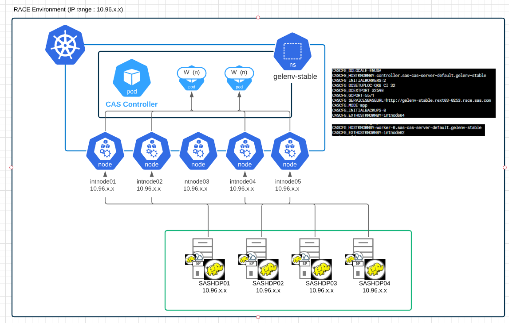
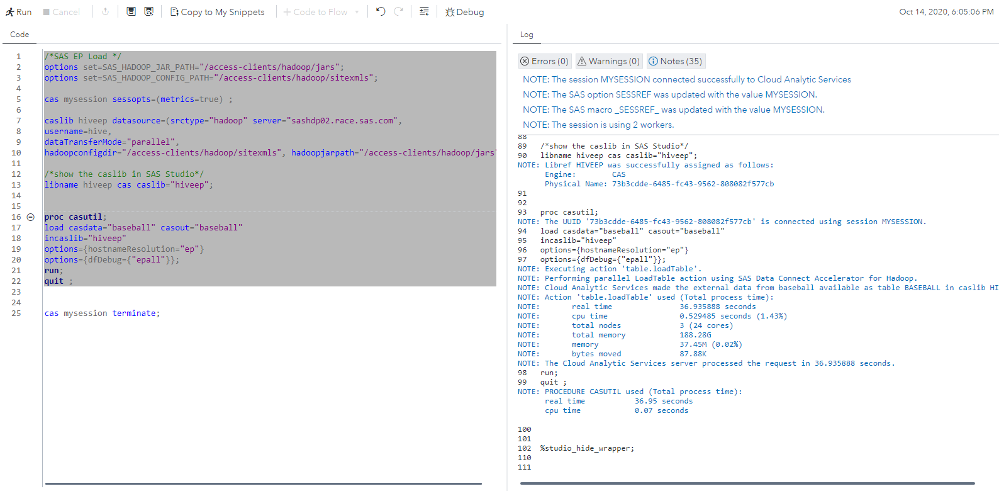
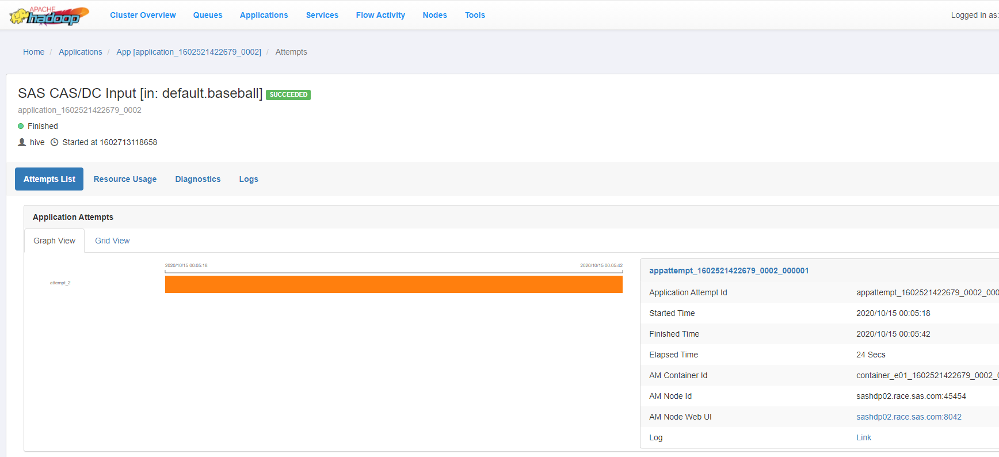

* [Architecture overview](#architecture-overview)
* [Configure Data Connector Node Port service for the EP](#configure-data-connector-node-port-service-for-the-ep)
  * [Add the publishDCNodePortServices in Kustomize](#add-the-publishdcnodeportservices-in-kustomize)
  * [Rebuild the manifests](#rebuild-the-manifests)
  * [Configure Hadoop nodes for NodePort connection](#configure-hadoop-nodes-for-nodeport-connection)
  * [Test a parallel loading with the Embedded Process (NodePort)](#test-a-parallel-loading-with-the-embedded-process-nodeport)

# Parallel loading with the Embedded process for Hadoop

## Architecture overview

The aim of the diagrams below is to illustrate the implementation of the Parrallel loading into CAS from Hadoop using the Data Connect Accelerators and the Embedded Process.
There are basically two possible ways to configure the connection from the EP (located on the Remote Hadoop cluster) to the CAS pods.
Either using the NodePort service or the LoadBalancer service type.

In this hands-on we cover the Node port way.



## Configure Data Connector Node Port service for the EP

<!-- JIRA Epic : https://rndjira.sas.com/browse/ASRCAS-169 -->

### Add the publishDCNodePortServices in Kustomize

* Either manually add the following lines in the transformers section:

    ```yaml
    transformers:
    ...
    - sas-bases/overlays/data-access/enable-dc-ports.yaml
    ```

* Or execute this code for the new transformers references

    ```sh
    yq write  -i ~/project/deploy/gelenv/kustomization.yaml "transformers[+]" "sas-bases/overlays/data-access/enable-dc-ports.yaml"
    ```

### Rebuild the manifests

* Build site.yaml

    ```sh
    cd ~/project/deploy/gelenv/
    mv site.yaml site-backup.yaml
    kustomize build -o site.yaml
    ```

* Check the differences

    ```sh
    icdiff site-backup.yaml site.yaml
    ```

* Apply new site.yaml

    ```sh
    kubectl apply -n gelenv -f site.yaml
    ```

* Restart CAS

    ```sh
    kubectl -n gelenv delete pod --selector='app.kubernetes.io/managed-by=sas-cas-operator'
    ```

### Configure Hadoop nodes for NodePort connection

Only one person can do it

* Prepare the /etc/hosts file

    <!-- #echo "$(hostname -i)  controller.sas-cas-server-default.gelenv worker-0.sas-cas-server-default.gelenv worker-1.sas-cas-server-default.gelenv" > /tmp/casnodeporthost.txt
    # or (more likely): -->

  * Get nodes IP address

    ```sh
    NODE1=$(grep sasnode01 /etc/hosts | awk '{print $1}')
    NODE2=$(grep sasnode02 /etc/hosts | awk '{print $1}')
    NODE3=$(grep sasnode03 /etc/hosts | awk '{print $1}')
    NODE4=$(grep sasnode04 /etc/hosts | awk '{print $1}')
    NODE5=$(grep sasnode05 /etc/hosts | awk '{print $1}')
    ```

  * Prepare hosts block

    ```sh
    echo "$NODE1  intnode01" > /tmp/casnodeporthost.txt
    echo "$NODE2  intnode02" >> /tmp/casnodeporthost.txt
    echo "$NODE3  intnode03" >> /tmp/casnodeporthost.txt
    echo "$NODE4  intnode04" >> /tmp/casnodeporthost.txt
    echo "$NODE5  intnode05" >> /tmp/casnodeporthost.txt
    ```

* Transfer

    ```sh
    scp /tmp/casnodeporthost.txt cloud-user@sashdp01:/tmp
    ```

* Connect to sashdp01

    ```sh
    ssh sashdp01
    ```

* Update the /etc/hosts files

    ```sh
    # remove previous entries for intnodes
    ansible -i inventory.ini all -m lineinfile -a "path=/etc/hosts regex='intnode' state=absent backup=yes" -b --diff
    sudo cp /etc/hosts /etc/hosts.orig
    # add the K8s nodes hosts block
    sudo bash -c "cat /tmp/casnodeporthost.txt >> /etc/hosts"
    # distribute /etc/hosts file on all hadoop nodes
    ansible -i inventory.ini all -m copy -a "src=/etc/hosts dest=/etc/hosts owner=root group=root mode=0644" -b --diff
    ```

### Test a parallel loading with the Embedded Process (NodePort)

* Open SASStudio and run the following code, to make sure you can access the Oracle Database tables and load them into CAS.

    ```sh
    /*SAS EP Load */
    options set=SAS_HADOOP_JAR_PATH="/access-clients/hadoop/jars";
    options set=SAS_HADOOP_CONFIG_PATH="/access-clients/hadoop/sitexmls";

    cas mysession sessopts=(metrics=true) ;

    caslib hiveep datasource=(srctype="hadoop" server="sashdp02.race.sas.com",
    username=hive,
    dataTransferMode="parallel",
    hadoopconfigdir="/access-clients/hadoop/sitexmls", hadoopjarpath="/access-clients/hadoop/jars");

    /*show the caslib in SAS Studio*/
    libname hiveep cas caslib="hiveep";


    proc casutil;
    load casdata="baseball" casout="baseball"
    incaslib="hiveep"
    /* don't forget the hostnameResolution option */
    options={hostnameResolution="ep"}
    options={dfDebug={"epall"}};
    run;
    quit ;

    cas mysession terminate;
    ```

* Here is what you should see

    

* See the corresponding YARN application : http://10.96.11.106:8088/ui2/index.html#/yarn-apps/apps :

    

<!-- ## Configure Data Connector LoadBalancer service for the EP

TODO with 0.6
Reference : <http://pubshelpcenter.unx.sas.com:8080/test/?cdcId=itopscdc&cdcVersion=v_006&docsetId=dplyml0phy0dkr&docsetTarget=n08u2yg8tdkb4jn18u8zsi6yfv3d.htm&locale=en#> (search for  LoadBalancer) -->

<!-- startnav -->
* [01 Introduction / 01 031 Booking a Lab Environment for the Workshop](/01_Introduction/01_031_Booking_a_Lab_Environment_for_the_Workshop.md)
* [01 Introduction / 01 032 Assess Readiness of Lab Environment](/01_Introduction/01_032_Assess_Readiness_of_Lab_Environment.md)
* [01 Introduction / 01 033 CheatCodes](/01_Introduction/01_033_CheatCodes.md)
* [02 Kubernetes and Containers Fundamentals / 02 131 Learning about Namespaces](/02_Kubernetes_and_Containers_Fundamentals/02_131_Learning_about_Namespaces.md)
* [03 Viya 4 Software Specifics / 03 011 Looking at a Viya 4 environment with Visual Tools DEMO](/03_Viya_4_Software_Specifics/03_011_Looking_at_a_Viya_4_environment_with_Visual_Tools_DEMO.md)
* [03 Viya 4 Software Specifics / 03 051 Create your own Viya order](/03_Viya_4_Software_Specifics/03_051_Create_your_own_Viya_order.md)
* [03 Viya 4 Software Specifics / 03 056 Getting the order with the CLI](/03_Viya_4_Software_Specifics/03_056_Getting_the_order_with_the_CLI.md)
* [04 Pre Requisites / 04 081 Pre Requisites automation with Viya4-ARK](/04_Pre-Requisites/04_081_Pre-Requisites_automation_with_Viya4-ARK.md)
* [05 Deployment tools / 05 121 Setup a Windows Client Machine](/05_Deployment_tools/05_121_Setup_a_Windows_Client_Machine.md)
* [06 Deployment Steps / 06 031 Deploying a simple environment](/06_Deployment_Steps/06_031_Deploying_a_simple_environment.md)
* [06 Deployment Steps / 06 051 Deploying Viya with Authentication](/06_Deployment_Steps/06_051_Deploying_Viya_with_Authentication.md)
* [06 Deployment Steps / 06 061 Deploying in a second namespace](/06_Deployment_Steps/06_061_Deploying_in_a_second_namespace.md)
* [06 Deployment Steps / 06 071 Removing Viya deployments](/06_Deployment_Steps/06_071_Removing_Viya_deployments.md)
* [06 Deployment Steps / 06 081 Deploying a programing only environment](/06_Deployment_Steps/06_081_Deploying_a_programing-only_environment.md)
* [06 Deployment Steps / 06 091 Deployment Operator setup](/06_Deployment_Steps/06_091_Deployment_Operator_setup.md)
* [06 Deployment Steps / 06 093 Using the DO with a Git Repository](/06_Deployment_Steps/06_093_Using_the_DO_with_a_Git_Repository.md)
* [06 Deployment Steps / 06 095 Using an inline configuration](/06_Deployment_Steps/06_095_Using_an_inline_configuration.md)
* [06 Deployment Steps / 06 097 Using the Orchestration Tool](/06_Deployment_Steps/06_097_Using_the_Orchestration_Tool.md)
* [06 Deployment Steps / 06 101 Create Viya Deployment Roles](/06_Deployment_Steps/06_101_Create_Viya_Deployment_Roles.md)
* [07 Deployment Customizations / 07 021 Configuring SASWORK](/07_Deployment_Customizations/07_021_Configuring_SASWORK.md)
* [07 Deployment Customizations / 07 051 Adding a local registry to k8s](/07_Deployment_Customizations/07_051_Adding_a_local_registry_to_k8s.md)
* [07 Deployment Customizations / 07 052 Using mirror manager to populate the local registry](/07_Deployment_Customizations/07_052_Using_mirror_manager_to_populate_the_local_registry.md)
* [07 Deployment Customizations / 07 053 Deploy from local registry](/07_Deployment_Customizations/07_053_Deploy_from_local_registry.md)
* [07 Deployment Customizations / 07 091 Configure SAS ACCESS Engine](/07_Deployment_Customizations/07_091_Configure_SAS_ACCESS_Engine.md)
* [07 Deployment Customizations / 07 101 Configure SAS ACCESS TO HADOOP](/07_Deployment_Customizations/07_101_Configure_SAS_ACCESS_TO_HADOOP.md)
* [07 Deployment Customizations / 07 102 Parallel loading with EP for Hadoop](/07_Deployment_Customizations/07_102_Parallel_loading_with_EP_for_Hadoop.md)**<-- you are here**
* [09 Validation / 09 011 Validate the Viya deployment](/09_Validation/09_011_Validate_the_Viya_deployment.md)
* [09 Validation / 09 021 SAS Viya deployment reports](/09_Validation/09_021_SAS_Viya_deployment_reports.md)
* [11 Azure AKS Deployment / 11 000 Navigating the AKS Hands on Deployment Options](/11_Azure_AKS_Deployment/11_000_Navigating_the_AKS_Hands-on_Deployment_Options.md)
* [11 Azure AKS Deployment / 11 999 Fast track with cheatcodes](/11_Azure_AKS_Deployment/11_999_Fast_track_with_cheatcodes.md)
* [11 Azure AKS Deployment/Fully Automated / 11 500 Full Automation of AKS Deployment](/11_Azure_AKS_Deployment/Fully_Automated/11_500_Full_Automation_of_AKS_Deployment.md)
* [11 Azure AKS Deployment/Fully Automated / 11 590 Cleanup](/11_Azure_AKS_Deployment/Fully_Automated/11_590_Cleanup.md)
* [11 Azure AKS Deployment/Standard / 11 100 Creating an AKS Cluster](/11_Azure_AKS_Deployment/Standard/11_100_Creating_an_AKS_Cluster.md)
* [11 Azure AKS Deployment/Standard / 11 110 Performing the prerequisites](/11_Azure_AKS_Deployment/Standard/11_110_Performing_the_prerequisites.md)
* [11 Azure AKS Deployment/Standard/Cleanup / 11 400 Cleanup](/11_Azure_AKS_Deployment/Standard/Cleanup/11_400_Cleanup.md)
* [11 Azure AKS Deployment/Standard/Manual / 11 200 Deploying Viya 4 on AKS](/11_Azure_AKS_Deployment/Standard/Manual/11_200_Deploying_Viya_4_on_AKS.md)
* [11 Azure AKS Deployment/Standard/Manual / 11 210 Deploy a second namespace in AKS](/11_Azure_AKS_Deployment/Standard/Manual/11_210_Deploy_a_second_namespace_in_AKS.md)
* [11 Azure AKS Deployment/Standard/Manual / 11 220 CAS Customizations](/11_Azure_AKS_Deployment/Standard/Manual/11_220_CAS_Customizations.md)
* [11 Azure AKS Deployment/Standard/Manual / 11 230 Install monitoring and logging](/11_Azure_AKS_Deployment/Standard/Manual/11_230_Install_monitoring_and_logging.md)
* [12 Amazon EKS Deployment / 12 010 Access Environments](/12_Amazon_EKS_Deployment/12_010_Access_Environments.md)
* [12 Amazon EKS Deployment / 12 020 Provision Resources](/12_Amazon_EKS_Deployment/12_020_Provision_Resources.md)
* [12 Amazon EKS Deployment / 12 030 Deploy SAS Viya](/12_Amazon_EKS_Deployment/12_030_Deploy_SAS_Viya.md)
* [13 Google GKE Deployment / 13 011 Creating a GKE Cluster](/13_Google_GKE_Deployment/13_011_Creating_a_GKE_Cluster.md)
* [13 Google GKE Deployment / 13 021 Performing Prereqs in GKE](/13_Google_GKE_Deployment/13_021_Performing_Prereqs_in_GKE.md)
* [13 Google GKE Deployment / 13 031 Deploying Viya 4 on GKE](/13_Google_GKE_Deployment/13_031_Deploying_Viya_4_on_GKE.md)
* [13 Google GKE Deployment / 13 041 Full Automation of GKE Deployment](/13_Google_GKE_Deployment/13_041_Full_Automation_of_GKE_Deployment.md)
* [13 Google GKE Deployment / 13 099 Fast track with cheatcodes](/13_Google_GKE_Deployment/13_099_Fast_track_with_cheatcodes.md)
<!-- endnav -->
