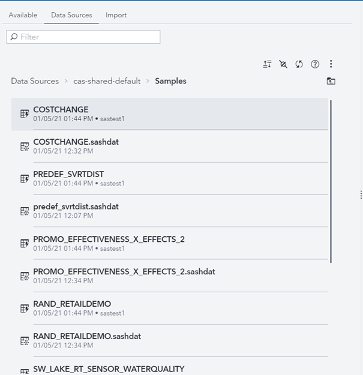
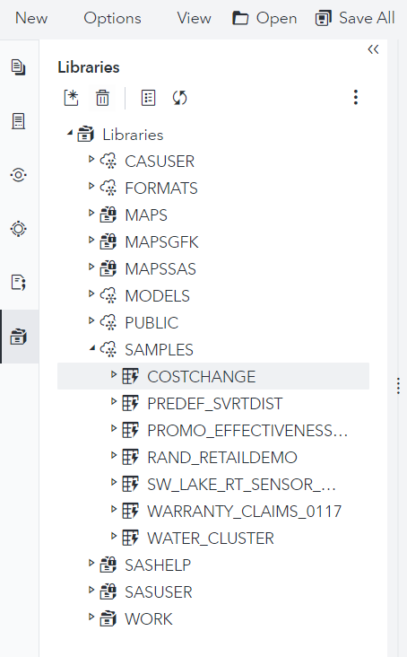
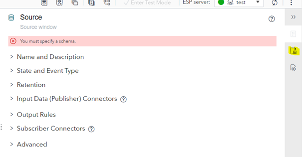
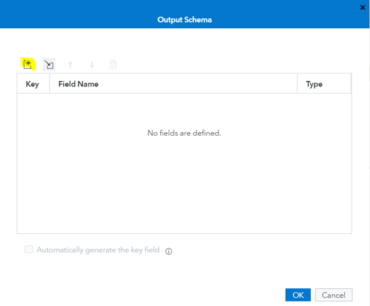
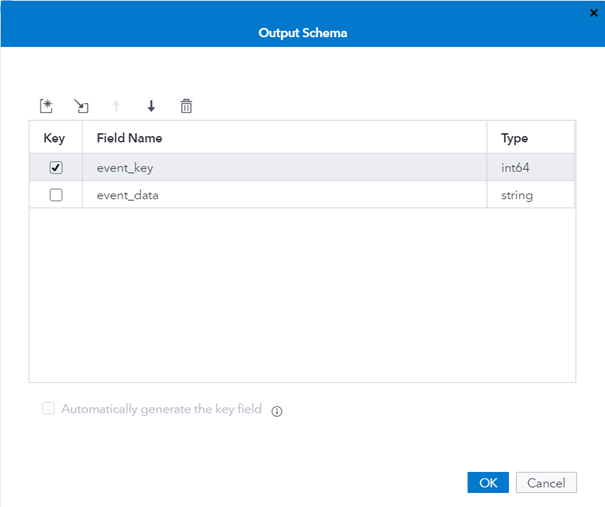
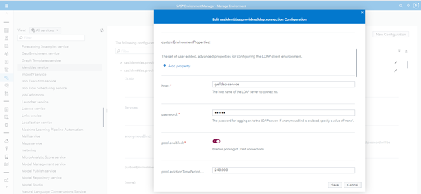

# Validate the Viya deployment

* [General end user validation](#general-end-user-validation)
  * [Load data in CAS](#load-data-in-cas)
  * [Open a report](#open-a-report)
  * [Create your own report](#create-your-own-report)
  * [Create your SAS program](#create-your-sas-program)
* [Validate Event Stream Processing](#validate-event-stream-processing)
* [Administrator validation](#administrator-validation)

There are many ways to validate a deployment and ensure that it performs as expected and can be made available to the end-users. In this hands-on we provide some simple manual steps to ensure the general availability of the system that we have just deployed.

However it is NOT an exhaustive and complete validation procedure for all potential SAS Viya products or offering that can be deployed.
## General end user validation

* Let's build the URL to access the Viya Web applications

    ```bash
    NS=gelenv
    DRIVE_URL="https://$(kubectl -n ${NS} get ing sas-drive-app -o custom-columns='hosts:spec.rules[*].host' --no-headers)/SASDrive/"
    EV_URL="https://$(kubectl -n ${NS} get ing sas-drive-app -o custom-columns='hosts:spec.rules[*].host' --no-headers)/SASEnvironmentManager/"

    printf "\n* [Viya Drive (lab) URL (HTTP**S**)](${DRIVE_URL} )\n\n" | tee -a /home/cloud-user/urls.md
    printf "\n* [Viya Environment Manager (lab) URL (HTTP**S**)](${EV_URL} )\n\n" | tee -a /home/cloud-user/urls.md
    ```

* Click on the link to open the SAS Drive web application.

    

* Sign-in as "sastest1" (password is "lnxsas")

    

* Click on "Skip setup"

    

* Click on "Let's go"

    

* Close the window
* And click on the "hamburger" icon on the top left to show the applications menu.

    

### Load data in CAS

* Click on "Manage data"

    

* Click on "Data sources"

    

* Click on "cas-shared-default"

    

* Click on "Samples"

    

* Select each table and click on "Load" to load them into CAS

    

* Load all the samples tables

    

* Click on the "Available" tab, you should see all the sample tables that have been loaded into CAS

    

### Open a report

* Click on the "hamburger" icon on the top left to show the applications menu.
* Select "Explore and Visualize", it correspond to the Visual Analytics application.

    

* Click on "All reports"

    

* Naviguate to "All Reports > Products > SAS Visual Analytics > Samples"

    

* Select the "Retail insights" report

    

* Open the report

    

* Click on the "Geographic Effectiveness" tab to display the Geographic report (using ESRI)

    

### Create your own report

* You can also create your own report and see if you can save it.
* For example, choose the COSTCHANGE table, bring the Ship Year category variable and choose the total_claim_count measure.

    

* Save the report with a new name

    

* Now the report has a new name

    

### Create your SAS program

* Click on the "hamburger" icon on the top left to show the applications menu.
* Select "Develop SAS Code", it correspond to the SAS Studio application.

    ![develop SAS code]img/develop-sas-code.png)

* It opens SAS Studio

    

* Wait until the SAS Compute server is ready.
* The first time you open SAS Studio, the SAS Compute server is initializing.

    

* After about 1 or 2 minutes, then you should see :

    

* Several compute contexts are now available

    

* Click on "Program in SAS"
* Submit the following code to validate that you can start a CAS session

    ```sh
    cas mysession;
    caslib _ALL_ ASSIGN;
    ```

* You should see something like the screen below

    

* The `caslib _ALL_ ASSIGN` statement creates SAS librefs for existing caslibs so that they are visible in the SAS Studio Libraries tree.

    

* Save the program

    

## Validate Event Stream Processing

* Click on the "hamburger" icon on the top left to show the applications menu.
* Select "Design Streaming Projects", it correspond to the SAS ESP Studio application.

    

* Create a new project

    

* Drag and drop a "Source" window into the project canevas

    

* Click on "Output schema" button on the right bar menu

    

* Click on the "pen" icon to edit the fields

    

* Click on the "new" icon to add the new fields

    

* Add 2 fields as in the screenshot below,

    

* then click on "OK"

    

* Click on "Save", then click on "Enter Test Mode" 
* Then Click on "Run test" 
* It opens a new window

    

* Uncheck "Use default settings", to see the deployment settings

    

    That's where you can change the resources request and limits for the ESP container.

* Click on "OK" twice
* After a little while you will see that a new ESP container has been started to run your project

    

* Sign out

## Administrator validation

* Sign in as "sasadm" (lnxsas)

    

* Click on "yes"
* Click on the "hamburger" icon on the top left to show the applications menu.
* Select "Manage environment", it correspond to the SAS Environment Manager application.

    

* Start with the "Servers" menu and make sure that you can see the CAS default server.

    

* Open the "Users" menu

    

* Check the licensed products

    

* Check the identities service configuration



* Sign out

<!-- startnav -->
* [01 Introduction / 01 031 Booking a Lab Environment for the Workshop](/01_Introduction/01_031_Booking_a_Lab_Environment_for_the_Workshop.md)
* [01 Introduction / 01 032 Assess Readiness of Lab Environment](/01_Introduction/01_032_Assess_Readiness_of_Lab_Environment.md)
* [01 Introduction / 01 033 CheatCodes](/01_Introduction/01_033_CheatCodes.md)
* [02 Kubernetes and Containers Fundamentals / 02 131 Learning about Namespaces](/02_Kubernetes_and_Containers_Fundamentals/02_131_Learning_about_Namespaces.md)
* [03 Viya 4 Software Specifics / 03 011 Looking at a Viya 4 environment with Visual Tools DEMO](/03_Viya_4_Software_Specifics/03_011_Looking_at_a_Viya_4_environment_with_Visual_Tools_DEMO.md)
* [03 Viya 4 Software Specifics / 03 051 Create your own Viya order](/03_Viya_4_Software_Specifics/03_051_Create_your_own_Viya_order.md)
* [03 Viya 4 Software Specifics / 03 056 Getting the order with the CLI](/03_Viya_4_Software_Specifics/03_056_Getting_the_order_with_the_CLI.md)
* [04 Pre Requisites / 04 081 Pre Requisites automation with Viya4-ARK](/04_Pre-Requisites/04_081_Pre-Requisites_automation_with_Viya4-ARK.md)
* [05 Deployment tools / 05 121 Setup a Windows Client Machine](/05_Deployment_tools/05_121_Setup_a_Windows_Client_Machine.md)
* [06 Deployment Steps / 06 031 Deploying a simple environment](/06_Deployment_Steps/06_031_Deploying_a_simple_environment.md)
* [06 Deployment Steps / 06 051 Deploying Viya with Authentication](/06_Deployment_Steps/06_051_Deploying_Viya_with_Authentication.md)
* [06 Deployment Steps / 06 061 Deploying in a second namespace](/06_Deployment_Steps/06_061_Deploying_in_a_second_namespace.md)
* [06 Deployment Steps / 06 071 Removing Viya deployments](/06_Deployment_Steps/06_071_Removing_Viya_deployments.md)
* [06 Deployment Steps / 06 081 Deploying a programing only environment](/06_Deployment_Steps/06_081_Deploying_a_programing-only_environment.md)
* [06 Deployment Steps / 06 091 Deployment Operator setup](/06_Deployment_Steps/06_091_Deployment_Operator_setup.md)
* [06 Deployment Steps / 06 093 Using the DO with a Git Repository](/06_Deployment_Steps/06_093_Using_the_DO_with_a_Git_Repository.md)
* [06 Deployment Steps / 06 095 Using an inline configuration](/06_Deployment_Steps/06_095_Using_an_inline_configuration.md)
* [06 Deployment Steps / 06 097 Using the Orchestration Tool](/06_Deployment_Steps/06_097_Using_the_Orchestration_Tool.md)
* [06 Deployment Steps / 06 101 Create Viya Deployment Roles](/06_Deployment_Steps/06_101_Create_Viya_Deployment_Roles.md)
* [07 Deployment Customizations / 07 021 Configuring SASWORK](/07_Deployment_Customizations/07_021_Configuring_SASWORK.md)
* [07 Deployment Customizations / 07 051 Adding a local registry to k8s](/07_Deployment_Customizations/07_051_Adding_a_local_registry_to_k8s.md)
* [07 Deployment Customizations / 07 052 Using mirror manager to populate the local registry](/07_Deployment_Customizations/07_052_Using_mirror_manager_to_populate_the_local_registry.md)
* [07 Deployment Customizations / 07 053 Deploy from local registry](/07_Deployment_Customizations/07_053_Deploy_from_local_registry.md)
* [07 Deployment Customizations / 07 091 Configure SAS ACCESS Engine](/07_Deployment_Customizations/07_091_Configure_SAS_ACCESS_Engine.md)
* [07 Deployment Customizations / 07 101 Configure SAS ACCESS TO HADOOP](/07_Deployment_Customizations/07_101_Configure_SAS_ACCESS_TO_HADOOP.md)
* [07 Deployment Customizations / 07 102 Parallel loading with EP for Hadoop](/07_Deployment_Customizations/07_102_Parallel_loading_with_EP_for_Hadoop.md)
* [09 Validation / 09 011 Validate the Viya deployment](/09_Validation/09_011_Validate_the_Viya_deployment.md)**<-- you are here**
* [09 Validation / 09 021 SAS Viya deployment reports](/09_Validation/09_021_SAS_Viya_deployment_reports.md)
* [11 Azure AKS Deployment / 11 000 Navigating the AKS Hands on Deployment Options](/11_Azure_AKS_Deployment/11_000_Navigating_the_AKS_Hands-on_Deployment_Options.md)
* [11 Azure AKS Deployment / 11 999 Fast track with cheatcodes](/11_Azure_AKS_Deployment/11_999_Fast_track_with_cheatcodes.md)
* [11 Azure AKS Deployment/Fully Automated / 11 500 Full Automation of AKS Deployment](/11_Azure_AKS_Deployment/Fully_Automated/11_500_Full_Automation_of_AKS_Deployment.md)
* [11 Azure AKS Deployment/Fully Automated / 11 590 Cleanup](/11_Azure_AKS_Deployment/Fully_Automated/11_590_Cleanup.md)
* [11 Azure AKS Deployment/Standard / 11 100 Creating an AKS Cluster](/11_Azure_AKS_Deployment/Standard/11_100_Creating_an_AKS_Cluster.md)
* [11 Azure AKS Deployment/Standard / 11 110 Performing the prerequisites](/11_Azure_AKS_Deployment/Standard/11_110_Performing_the_prerequisites.md)
* [11 Azure AKS Deployment/Standard/Cleanup / 11 400 Cleanup](/11_Azure_AKS_Deployment/Standard/Cleanup/11_400_Cleanup.md)
* [11 Azure AKS Deployment/Standard/Manual / 11 200 Deploying Viya 4 on AKS](/11_Azure_AKS_Deployment/Standard/Manual/11_200_Deploying_Viya_4_on_AKS.md)
* [11 Azure AKS Deployment/Standard/Manual / 11 210 Deploy a second namespace in AKS](/11_Azure_AKS_Deployment/Standard/Manual/11_210_Deploy_a_second_namespace_in_AKS.md)
* [11 Azure AKS Deployment/Standard/Manual / 11 220 CAS Customizations](/11_Azure_AKS_Deployment/Standard/Manual/11_220_CAS_Customizations.md)
* [11 Azure AKS Deployment/Standard/Manual / 11 230 Install monitoring and logging](/11_Azure_AKS_Deployment/Standard/Manual/11_230_Install_monitoring_and_logging.md)
* [12 Amazon EKS Deployment / 12 010 Access Environments](/12_Amazon_EKS_Deployment/12_010_Access_Environments.md)
* [12 Amazon EKS Deployment / 12 020 Provision Resources](/12_Amazon_EKS_Deployment/12_020_Provision_Resources.md)
* [12 Amazon EKS Deployment / 12 030 Deploy SAS Viya](/12_Amazon_EKS_Deployment/12_030_Deploy_SAS_Viya.md)
* [13 Google GKE Deployment / 13 011 Creating a GKE Cluster](/13_Google_GKE_Deployment/13_011_Creating_a_GKE_Cluster.md)
* [13 Google GKE Deployment / 13 021 Performing Prereqs in GKE](/13_Google_GKE_Deployment/13_021_Performing_Prereqs_in_GKE.md)
* [13 Google GKE Deployment / 13 031 Deploying Viya 4 on GKE](/13_Google_GKE_Deployment/13_031_Deploying_Viya_4_on_GKE.md)
* [13 Google GKE Deployment / 13 041 Full Automation of GKE Deployment](/13_Google_GKE_Deployment/13_041_Full_Automation_of_GKE_Deployment.md)
* [13 Google GKE Deployment / 13 099 Fast track with cheatcodes](/13_Google_GKE_Deployment/13_099_Fast_track_with_cheatcodes.md)
<!-- endnav -->
