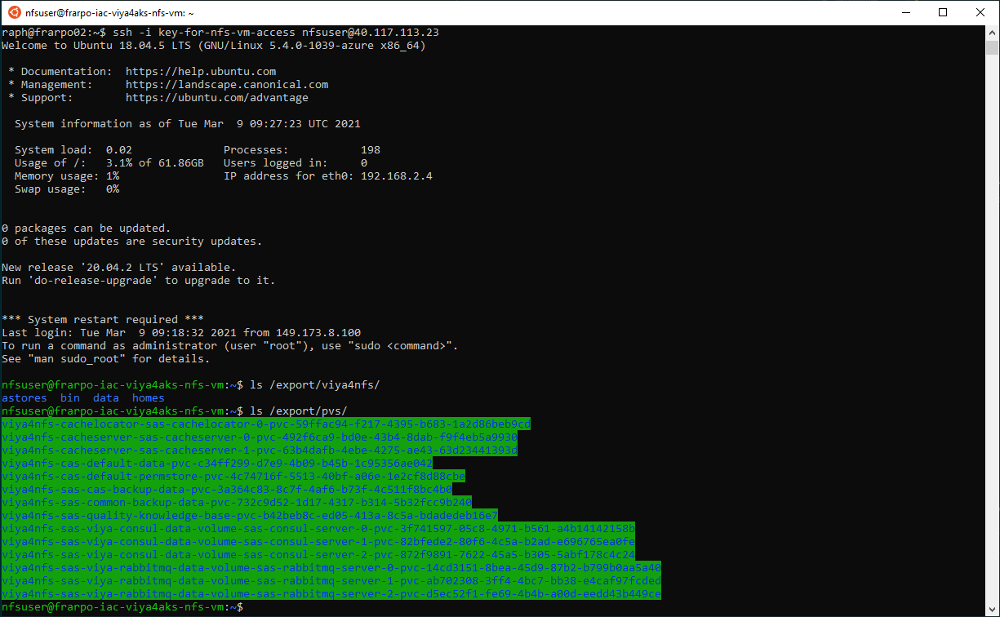

<!--
```bash
#!/bin/bash -x

```
 -->

# Full automation of deployment

* [Create working folder](#create-working-folder)
* [Preparing tools](#preparing-tools)
  * [Getting the github projects cloned](#getting-the-github-projects-cloned)
  * [Building the docker images](#building-the-docker-images)
* [Authenticating to Azure and getting static credentials for Terraform](#authenticating-to-azure-and-getting-static-credentials-for-terraform)
* [Authenticate to Azure](#authenticate-to-azure)
  * [Figure the username of who just logged in](#figure-the-username-of-who-just-logged-in)
  * [Create an Azure Service Principal and store its info in a file](#create-an-azure-service-principal-and-store-its-info-in-a-file)
* [Prep the required files for the creation of the AKS cluster](#prep-the-required-files-for-the-creation-of-the-aks-cluster)
  * [Create and copy our public ssh key in the workspace](#create-and-copy-our-public-ssh-key-in-the-workspace)
* [Full automated deployment with NFS Storage (gel02)](#full-automated-deployment-with-nfs-storage-gel02)
  * [Create a .tfvars file for a deployment with NFS storage (gel02)](#create-a-tfvars-file-for-a-deployment-with-nfs-storage-gel02)
  * [Deploy new AKS cluster (with NFS storage)](#deploy-new-aks-cluster-with-nfs-storage)
    * [Build the Terraform plan](#build-the-terraform-plan)
    * [Show the plan](#show-the-plan)
    * [Apply the plan to build the AKS cluster](#apply-the-plan-to-build-the-aks-cluster)
    * [Get the kubeconfig](#get-the-kubeconfig)
    * [Validate AKS access (and NFS storage class)](#validate-aks-access-and-nfs-storage-class)
  * [Precreate the NFS folders](#precreate-the-nfs-folders)
  * [Prepare AKS and deploy Viya in it using NFS storage (gel02)](#prepare-aks-and-deploy-viya-in-it-using-nfs-storage-gel02)
    * [Create vars.yaml for gel02](#create-varsyaml-for-gel02)
    * [Create directory structure](#create-directory-structure)
    * [Deploy Pre-reqs in AKS with NFS storage](#deploy-pre-reqs-in-aks-with-nfs-storage)
    * [Deploy Viya with NFS storage](#deploy-viya-with-nfs-storage)
    * [Deploy logging and monitoring](#deploy-logging-and-monitoring)
* [Post-Deployment tasks](#post-deployment-tasks)
  * [Create the DNS aliases](#create-the-dns-aliases)
    * [Automated method to associate a DNS name in Azure for the Web applications](#automated-method-to-associate-a-dns-name-in-azure-for-the-web-applications)
    * [Access the monitoring and logging](#access-the-monitoring-and-logging)
  * [Validate your deployment](#validate-your-deployment)
  * [Optional : Configure Ephemeral Storage](#optional--configure-ephemeral-storage)
* [Optional : SSH to your NFS VM](#optional--ssh-to-your-nfs-vm)
* [Destroy everything](#destroy-everything)
* [Use the cheat codes to build your Viya platform](#use-the-cheat-codes-to-build-your-viya-platform)

# Introduction

In this hands-on we use the GitHub [SAS Viya 4 resources](https://github.com/sassoftware/viya4-resource-guide) open source projects to fully automate the build of the Kubernetes cluster in Azure (with the [SAS Viya 4 Infrastructure as Code (IaC) for Microsoft Azure](https://github.com/sassoftware/viya4-iac-azure)), then the pre-requisite installation and finally the Viya 4 deployment (with the [SAS Viya 4 Deployment](https://github.com/sassoftware/viya4-deployment))

* We will use a RACE machine as a jumphost to interact with AKS
* We will use the "Docker" method to run the tools, so we only need a machine with Docker installed on it.

    So for example we could use the "single machine K3s" [collection](http://race.exnet.sas.com/Reservations?action=new&imageId=333991&imageKind=C&comment=%20GELLOW%20DEV%20VMWare&purpose=PST&sso=PSGEL255&schedtype=SchedTrainEDU&startDate=now&endDateLength=0&discardonterminate=y) which comes with one Windows client and one Linux machine where docker is already installed.

## Create working folder

* Create a working folder for the hands-on

    ```bash
    # create a working folder
    sudo rm -rf ~/jumphost/
    mkdir -p ~/jumphost/
    mkdir -p ~/jumphost/workspace
    ```

* We need to choose a default region

    ```bash
    # set AZURE region
    AZUREREGION=${AZUREREGION:-eastus}

    echo ${AZUREREGION} > ~/jumphost/workspace/.azureregion.txt

    ```

## Preparing tools

### Getting the github projects cloned

1. Clone the IAC project

    ```bash
    # clone the viya4-iac project
    cd  ~/jumphost/
    git clone https://github.com/sassoftware/viya4-iac-azure.git
    cd ~/jumphost/viya4-iac-azure
    #git fetch --all
    #git reset --hard 1.0.1
    #git reset --hard 2.0.0 commented as latest "main" branch seems better
    ```

1. Clone the Deployment Project

    ```bash
    # clone the viya4-deployment project
    cd  ~/jumphost/
    git clone https://github.com/sassoftware/viya4-deployment.git
    cd ~/jumphost/viya4-deployment
    git fetch --all
    #git reset --hard 1.0.1
    #git reset --hard 2.2.0
    #git reset --hard 3.0.0 - commented as this release is broken : see https://github.com/sassoftware/viya4-deployment/issues/65
    ```

### Building the docker images

1. Before you build the viya4-iac and viya-deploy image, make sure the ubuntu and terraform images are already on the machine (we pre-pulled them in advance during the RACE machine bootstrap to avoid the [docker hub rate limit](https://www.docker.com/increase-rate-limits) issue.)

    ```bash
    ## check if ubuntu and terraform images are there
    docker image ls

    ```

    If you don't see the ubuntu and terraform images, make sure the RACE machine bootstrap has completed. See [these instructions](../01_Introduction/01_032_Assess_Readiness_of_Lab_Environment.md).

<!-- 1. Update the Dockerfile so the images are built from local versions of ubuntu and terraform

    ```bash
    ## update the viya4-iac docker file so it uses the local image of Terraform
    ansible localhost -m lineinfile -a "dest=~/jumphost/viya4-iac-azure/Dockerfile regexp='FROM hashicorp/terraform' line='FROM gelharbor.race.sas.com/dockerhubstaticcache/hashicorp/terraform:\$TERRAFORM_VERSION as terraform'" --diff
    ## update the viya4-deploy docker file so it uses the local image of ubuntu
    ansible localhost -m lineinfile -a "dest=~/jumphost/viya4-deployment/Dockerfile regexp='FROM ubuntu:20.04' line='FROM gelharbor.race.sas.com/dockerhubstaticcache/ubuntu:20.04 as baseline'" --diff
    ``` -->

1. Build the IAC container image

    ```bash
    ## build docker images (iac)
    cd  ~/jumphost/viya4-iac-azure
    time docker image build -t viya4-iac-azure .
    ## this should take about 1m20s

    ```

1. Build the deployment container image

    ```bash
    ## build docker images (deploy)
    cd  ~/jumphost/viya4-deployment
    time docker image build -t viya4-deployment .
    ## this should take about 6m30s

    ```

1. Confirm that both image have been built

    ```bash
    #check docker images locally
    docker image ls | grep viya4\-

    ```

1. Should return:

    ```log
    viya4-deployment  latest      176fce5e225a        10 seconds ago      1.1GB
    viya4-iac-azure   latest      0665c1cfc1a6        48 seconds ago      1.12GB
    ```

## Authenticating to Azure and getting static credentials for Terraform

## Authenticate to Azure

1. Do an AZ login first.

    ```bash
    # Do an AZ login to get az credentials
    if [ ! -d "$HOME/jumphost/workspace/.azure" ]; then
        echo "the Azure credentials directory is missing. Prompting you to authenticate"
        docker container  run -it --rm \
            -v $HOME/jumphost/workspace/.azure/:/root/.azure/ \
            --entrypoint az \
            viya4-iac-azure \
            login
    fi
    ```

### Figure the username of who just logged in

1. Determine the userid of the person who just authenticated:

    ```bash
    # Get the userid
    docker container  run  --rm \
        -v $HOME/jumphost/workspace/.azure/:/root/.azure/ \
        --entrypoint az \
        viya4-iac-azure \
        ad signed-in-user show --query mailNickname \
            | sed  's|["\ ]||g' \
            | tee ~/jumphost/workspace/.student.txt
    # Get the user email
    docker container  run  --rm \
        -v $HOME/jumphost/workspace/.azure/:/root/.azure/ \
        --entrypoint az \
        viya4-iac-azure \
        ad signed-in-user show --query userPrincipalName \
            | sed  's|["\ ]||g' \
            | tee ~/jumphost/workspace/.email.txt

    ```

1. Confirm this user id is yours

    ```bash
    #store student info
    STUDENT=$(cat ~/jumphost/workspace/.student.txt)
    EMAIL=$(cat ~/jumphost/workspace/.email.txt)
    printf "\nThis should be your SAS Account:\n   ${STUDENT} (${EMAIL})  \nIf not, do not continue\n"

    if  [ "${STUDENT}" == "" ]; then
        echo "Can't figure out your student ID. Exiting"
        exit
    fi

    ```

### Create an Azure Service Principal and store its info in a file

1. Generate a Service Principal and store in a file

    ```bash
    STUDENT=$(cat ~/jumphost/workspace/.student.txt)

    TFCREDFILE=~/jumphost/workspace/.tf_creds

    if [ ! -f "$TFCREDFILE" ]; then
        touch ${TFCREDFILE}
        # Generate a Service Principal and get his password
        docker container  run  --rm \
            -v $HOME/jumphost/workspace/.azure/:/root/.azure/ \
            --entrypoint az \
            viya4-iac-azure \
            ad sp \
            create-for-rbac --skip-assignment \
            --name http://${STUDENT} --query password \
            --output tsv \
            | grep -v "Found\ an\ existing" \
            | head -n 1 \
            | sed 's/^/TF_VAR_client_secret=/' \
            | tee -a ${TFCREDFILE}


        docker container run  --rm \
            -v $HOME/jumphost/workspace/.azure/:/root/.azure/ \
            --entrypoint az \
            viya4-iac-azure \
            ad sp show --id http://${STUDENT} \
            --query appId --output tsv \
            | grep -v "Found\ an\ existing" \
            | head -n 1 \
            | sed 's/^/TF_VAR_client_id=/' \
            | tee -a ${TFCREDFILE}

        ## we need the APPID in an ENV var
        source <( grep TF_VAR_client_id ${TFCREDFILE}   )

        # set sas-gelsandbox as default subscription
        docker container  run -it --rm \
            -v $HOME/jumphost/workspace/.azure/:/root/.azure/ \
            --entrypoint az \
            viya4-iac-azure \
            account set -s "sas-gelsandbox"

        ## assign the contributor role
        docker container  run -it --rm \
            -v $HOME/jumphost/workspace/.azure/:/root/.azure/ \
            --entrypoint az \
            viya4-iac-azure \
            role assignment create \
            --assignee ${TF_VAR_client_id}  --role Contributor

        # set subscription_id for TF
        docker container  run  --rm \
            -v $HOME/jumphost/workspace/.azure/:/root/.azure/ \
            --entrypoint az \
            viya4-iac-azure \
            account list --query "[?name=='sas-gelsandbox'].{TF_VAR_subscription_id:id}" \
            -o tsv \
            |  sed 's/^/TF_VAR_subscription_id=/' \
            | tee -a ${TFCREDFILE}

        # set tenant_id for TF
        docker container  run  --rm \
            -v $HOME/jumphost/workspace/.azure/:/root/.azure/ \
            --entrypoint az \
            viya4-iac-azure \
            account list --query "[?name=='sas-gelsandbox'].{TF_VAR_tenant_id:tenantId}" \
            -o tsv \
            |  sed 's/^/TF_VAR_tenant_id=/' \
            | tee -a ${TFCREDFILE}

    fi

    ```

1. review the content of the file:

    ```bash
    #show TF credentials
    cat  ${TFCREDFILE}
    ```

1. should look like:

    ```log
    [cloud-user@pdcesx02213 viya4-iac-azure]$ cat  ${TFCREDFILE}
    TF_VAR_client_secret=fjqAFbO-gI6xFzf.ZGL6MHG05kHstRCQQk
    TF_VAR_client_id=35965272-ed22-4ec7-a216-73b8d2da06d9
    TF_VAR_subscription_id=c963059c-87f4-4d89-8724-a0da5fe4ad5c
    TF_VAR_tenant_id=b1c14d5c-3625-45b3-a430-9559373a0c2f
    [cloud-user@pdcesx02213 viya4-iac-azure]$
    ```

## Prep the required files for the creation of the AKS cluster

### Create and copy our public ssh key in the workspace

1. just run this:

    ```bash
    ssh-keygen -t rsa -b 4096 -f ~/.ssh/jumpuser_idrsa <<< y
    # Copy our public ssh key in the workspace
    cp  ~/.ssh/jumpuser_idrsa.pub \
        ~/jumphost/workspace/jumpuser_idrsa.pub

    ```

## Full automated deployment with NFS Storage (gel02)

In this hands-on we perform a fully automated deployment of Viya 4 in AKS, but this time, instead of the default "dev" storage, we use an NFS based storage for the Viya 4 applications persistent volumes.

### Create a .tfvars file for a deployment with NFS storage (gel02)

* Let's create the Terraform variables file (gel02)

    ```bash

    AZUREREGION=$(cat ~/jumphost/workspace/.azureregion.txt )
    STUDENT=$(cat ~/jumphost/workspace/.student.txt)
    EMAIL=$(cat ~/jumphost/workspace/.email.txt)


    tee  ~/jumphost/workspace/gel02-vars.tfvars > /dev/null << EOF

    prefix                               = "${STUDENT}-iac-viya4aks"
    location                             = "${AZUREREGION}"

    ## public ssh key for VMs (access to the NFS Server VM with nfsuser account and the private key)
    ssh_public_key                       = "/workspace/jumpuser_idrsa.pub"

    ## General config
    kubernetes_version                   = "1.19.9"

    # jump host machine (Reminder we can not SSH to outside from the RACE.EXNET machine)
    create_jump_vm                       = false

    # tags in azure
    tags                                 = { "resourceowner" = "${EMAIL}" , project_name = "sasviya4", environment = "dev", gel_project = "deployviya4" }

    ## Admin Access
    # IP Ranges allowed to access all created cloud resources
    # remove JUMPHOST otherhise get overlapping network issues
    default_public_access_cidrs         = ["109.232.56.224/27", "149.173.0.0/16", "194.206.69.176/28"]
    vm_public_access_cidrs              = ["149.173.0.0/16"]

    ## Storage
    # "dev" creates AzureFile, "standard" creates NFS server VM, "ha" creates Azure Netapp Files
    storage_type                         = "standard"
    # we want to be able to access our NFS server VM form the outside.
    create_nfs_public_ip                 = true

    default_nodepool_vm_type             = "Standard_D4_v2"
    default_nodepool_min_nodes           = 1

    node_pools_proximity_placement       = false

    default_nodepool_availability_zones  = ["1"]
    node_pools_availability_zone         = "1"

    # AKS Node Pools config
    node_pools = {
    cas = {
        "machine_type" = "Standard_E4s_v3"         # # 4x32 w 64GBSSD @0.25
        "os_disk_size" = 200
        "min_nodes" = 1
        "max_nodes" = 8
        "max_pods"  = 110
        "node_taints" = ["workload.sas.com/class=cas:NoSchedule"]
        "node_labels" = {
        "workload.sas.com/class" = "cas"
        }
    },
    compute = {
        "machine_type" = "Standard_L8s_v2"        # # 8x64 w 80GBSSD 1.9TB NVMe @ 0.62
        "os_disk_size" = 200
        "min_nodes" = 1
        "max_nodes" = 1
        "max_pods"  = 110
        "node_taints" = ["workload.sas.com/class=compute:NoSchedule"]
        "node_labels" = {
        "workload.sas.com/class"        = "compute"
        "launcher.sas.com/prepullImage" = "sas-programming-environment"
        }
    },
        connect = {
        "machine_type" = "Standard_L8s_v2"          # # 8x64 w 80GBSSD 1.9TB NVMe @ 0.62
        "os_disk_size" = 200
        "min_nodes" = 0
        "max_nodes" = 1
        "max_pods"  = 110
        "node_taints" = ["workload.sas.com/class=connect:NoSchedule"]
        "node_labels" = {
            "workload.sas.com/class"        = "connect"
            "launcher.sas.com/prepullImage" = "sas-programming-environment"
        }
        },
    stateless = {
        "machine_type" = "Standard_D8s_v3"           # # 4x16 w 32GBSSD @ 0.19
        "os_disk_size" = 200
        "min_nodes" = 0
        "max_nodes" = 3
        "max_pods"  = 110
        "node_taints" = ["workload.sas.com/class=stateless:NoSchedule"]
        "node_labels" = {
        "workload.sas.com/class" = "stateless"
        }
    },
    stateful = {
        "machine_type" = "Standard_D8s_v3"          # # 4x16 w 32GBSSD @ 0.19
        "os_disk_size" = 200
        "min_nodes" = 0
        "max_nodes" = 3
        "max_pods"  = 110
        "node_taints" = ["workload.sas.com/class=stateful:NoSchedule"]
        "node_labels" = {
        "workload.sas.com/class" = "stateful"
        }
    }
    }

    # Azure Postgres config
    # # set this to "false" when using internal Crunchy Postgres and Azure Postgres is NOT needed
    create_postgres                  = false


    # Azure Container Registry
    # We will use external orders and pull images from SAS Hosted registries
    create_container_registry           = false
    EOF

    ```

### Deploy new AKS cluster (with NFS storage)

#### Build the Terraform plan

* Run the command to build the terraform plan (inside the docker image)

    ```bash
    # plan
    docker container run --rm -it \
        --env-file $HOME/jumphost/workspace/.tf_creds \
        -v $HOME/jumphost/workspace:/workspace \
        viya4-iac-azure \
        plan \
        -var-file /workspace/gel02-vars.tfvars \
        -state /workspace/gel02-vars.tfstate \
        -out /workspace/gel02-vars.plan

    ```

#### Show the plan

* Run the command to show the terraform plan

    ```bash
    docker container  run --rm -it \
        --env-file $HOME/jumphost/workspace/.tf_creds \
        -v $HOME/jumphost/workspace:/workspace \
        viya4-iac-azure \
        show \
        /workspace/gel02-vars.plan

    ```

#### Apply the plan to build the AKS cluster

* Run the command to apply the terraform plan (from inside the docker image)

    ```bash
    time docker container  run --rm -it \
        --env-file $HOME/jumphost/workspace/.tf_creds \
        -v $HOME/jumphost/workspace:/workspace \
        viya4-iac-azure \
        apply \
        -auto-approve \
        -var-file /workspace/gel02-vars.tfvars \
        -state /workspace/gel02-vars.tfstate
    ## this should take between 2 and 16 minutes.
    ```

* If the command is succesful, then the AKS cluster and the required infrastructure has been created in Azure.
* You can check that in the Azure portal and notice that an NFS vm and associated disks have been provisionned.

    

#### Get the kubeconfig

* Let's grab our KUBECONFIG file with terraform

    ```bash
    ## get the kubeconfig file
    docker container  run --rm \
        --env-file $HOME/jumphost/workspace/.tf_creds \
        -v $HOME/jumphost/workspace:/workspace \
        viya4-iac-azure \
        output \
        -state /workspace/gel02-vars.tfstate\
        kube_config > $HOME/jumphost/workspace/.kubeconfig_aks

    mv ~/.kube/config ~/.kube/config_old
    ln -s  $HOME/jumphost/workspace/.kubeconfig_aks  $HOME/.kube/config
    #secure the KUBECONFIG file
    chmod 700 $HOME/.kube/config

    ```

* or with az ( in case you lost your tfstate file)

    ```sh
    rm -rf $HOME/jumphost/workspace/.kubeconfig_aks
    touch $HOME/jumphost/workspace/.kubeconfig_aks
    docker container  run  --rm \
        -v $HOME/jumphost/workspace/.azure/:/root/.azure/ \
        -v $HOME/jumphost/workspace/.kubeconfig_aks:/root/.kube/config \
        --entrypoint az \
        viya4-iac-azure \
        aks \
        get-credentials \
        --name ${STUDENT}-iac-viya4aks-aks \
        --resource-group ${STUDENT}-iac-viya4aks-rg

    ```

#### Validate AKS access (and NFS storage class)

* run this command to see if you can list the Kubernetes nodes

    ```bash
    kubectl get nodes
    kubectl get sc
    ```

### Precreate the NFS folders

* Reference: [SAS Viya 4 deployment](https://github.com/sassoftware/viya4-deployment)
* In order to use NFS-based storage, the Viya 4 automated deployment assume that there is a specific sub-folder structure for the NFS shared folder.

* Below is the required nfs exports folder structure

    ```log
    <export_dir>        <- nfs export path
    /pvs              <- location for persistent volumes
    /<namespace>      <- folder per namespace
        /bin            <- location for open source directories
        /data           <- location for SAS and CAS Data
        /homes          <- location for user home directories to be mounted
        /astores        <- location for astores
    ```

* It is important to note that a part of the structure depends on the **namespace** name. that's the reason why it can not be pre-created in advance.

* If you combine the viya4-iac and the viya4-deployment tools, assuming that you provide the terraform state file ("tfstate") generated by the first tool as an inupt for the second tool, then this sub-folder structure can be created **automatically** by the viya4-deployment tool with the proper namespace.

* The way it is done rely on an ssh access from our client machine (with docker) to the Azure Jumpbox VM from where the command to create the directory structure will run.

* Unfortunately in RACE.EXNET, there is a firewall rule that only allow access to the outside (Internet) on port 80 and 443. As a consequence we can not ssh (with port 22) to the Jump VM running in Azure.

* So we will manage the NFS server by ourselves and in this case the Jumpbox is not required (we will assume that our intial namespace for the viya deployment is called "viya4nfs")

    ```bash
    # set the NFS VM name
    NFSVMNAME=${STUDENT}-iac-viya4aks-nfs-vm
    echo ${NFSVMNAME}
    # Get rwx_filestore_path
    docker container run --rm \
        --env-file $HOME/jumphost/workspace/.tf_creds \
        -v $HOME/jumphost/workspace:/workspace \
        viya4-iac-azure \
        output \
        -state /workspace/gel02-vars.tfstate \
        rwx_filestore_path > $HOME/jumphost/workspace/.NFSSHAREPATH.txt

    NFSSHAREPATH=$(cat $HOME/jumphost/workspace/.NFSSHAREPATH.txt)
    echo ${NFSSHAREPATH}
    # set the NAMESPACE name for the initial deployment
    NS="viya4nfs"
    ## Now we run the "az vm run-command invoke" inside Docker to create the required diretcory structure in our NFS Server VM.
    docker container  run  --rm \
        -v $HOME/jumphost/workspace/.azure/:/root/.azure/ \
        -v $HOME/jumphost/workspace/.kubeconfig_aks:/root/.kube/config \
        --entrypoint az \
        viya4-iac-azure \
        vm run-command invoke \
        --name ${NFSVMNAME} \
        --command-id RunShellScript \
        --scripts "mkdir -p /${NFSSHAREPATH}/pvs && mkdir -p /${NFSSHAREPATH}/${NS}/bin && mkdir -p /${NFSSHAREPATH}/${NS}/data && mkdir -p /${NFSSHAREPATH}/${NS}/homes && mkdir -p /${NFSSHAREPATH}/${NS}/astores" \
        --resource-group ${STUDENT}-iac-viya4aks-rg
    ```

### Prepare AKS and deploy Viya in it using NFS storage (gel02)

#### Create vars.yaml for gel02

* Let's prepare our vars.yaml for the automated Viya 4 deployment.

    ```bash
    export NS="viya4nfs"
    AZUREREGION=$(cat ~/jumphost/workspace/.azureregion.txt )
    STUDENT=$(cat ~/jumphost/workspace/.student.txt)
    V4_CFG_INGRESS_FQDN=${STUDENT}vk.${AZUREREGION}.cloudapp.azure.com

    tee  ~/jumphost/workspace/gel02-vars.yaml > /dev/null << EOF
    ## Cluster
    PROVIDER: azure
    CLUSTER_NAME: ${STUDENT}-iac-viya4aks-aks
    NAMESPACE: ${NS}

    ## MISC
    DEPLOY: true # Set to false to stop at generating the manifest

    #LOADBALANCER_SOURCE_RANGES: ['<cluster_nat_ip>/32']
    LOADBALANCER_SOURCE_RANGES: ["109.232.56.224/27", "149.173.0.0/16", "194.206.69.176/28"]

    ## Storage - we let the tool create the SC for us
    V4_CFG_MANAGE_STORAGE: true
    JUMP_SVR_RWX_FILESTORE_PATH: /export

    ## JUMP VM ACCESS TO PREPARE NFS DIRECTORIES
    # JUMP_SVR_PRIVATE_KEY: '/config/jump_svr_private_key'

    ## SAS API Access
    V4_CFG_SAS_API_KEY: 'otHGJtno8QGTqys9vRGxmgLOCnVsHWG2'
    V4_CFG_SAS_API_SECRET: 'banKYbGZyNkDXbBO'
    V4_CFG_ORDER_NUMBER: 9CDZDD

    ## CR Access
    # V4_CFG_CR_USER: <container_registry_user>
    # V4_CFG_CR_PASSWORD: <container_registry_password>

    ## Ingress
    V4_CFG_INGRESS_TYPE: ingress
    V4_CFG_INGRESS_FQDN: "${V4_CFG_INGRESS_FQDN}"
    V4_CFG_TLS_MODE: "full-stack" # [full-stack|front-door|disabled]

    ## Postgres
    V4_CFG_POSTGRES_TYPE: internal


    ## LDAP
    V4_CFG_EMBEDDED_LDAP_ENABLE: true

    ## Consul UI
    #V4_CFG_CONSUL_ENABLE_LOADBALANCER: false

    ## SAS/CONNECT
    V4_CFG_CONNECT_ENABLE_LOADBALANCER: false

    ## Cadence and version
    V4_CFG_CADENCE_NAME: 'stable'
    V4_CFG_CADENCE_VERSION: '2020.1.5'

    ## CAS Configuration
    V4_CFG_CAS_WORKER_COUNT: '3'
    V4_CFG_CAS_ENABLE_BACKUP_CONTROLLER: true
    V4_CFG_CAS_ENABLE_LOADBALANCER: true

    # Monitoring and logging tools
    V4M_BASE_DOMAIN: ${STUDENT}.gelsandbox.aks.unx.sas.com

    # allow ELASTIC SEARCH to be properly configured
    V4_CFG_ELASTICSEARCH_ENABLE: true

    EOF
    ```

#### Create directory structure

* The viya4-deployment tool fully manages the kustomization.yaml file.
* Users can make change by adding custom overlays into sub-folders under the site-config folder.
* we can pre-create our local directory structure and add any specific customization we want there.

    ```bash
    # create local directories
    mkdir -p $HOME/jumphost/workspace/deploy/
    mkdir -p $HOME/jumphost/workspace/deploy/${STUDENT}-iac-viya4aks-aks
    mkdir -p $HOME/jumphost/workspace/deploy/${STUDENT}-iac-viya4aks-aks/${NS}
    mkdir -p $HOME/jumphost/workspace/deploy/${STUDENT}-iac-viya4aks-aks/${NS}/site-config
    ```

#### Deploy Pre-reqs in AKS with NFS storage

* Simply run the command below to deploy all the pre-requisites for Viya 4 ("baseline")

    ```bash
    # Deploy all the pre-requisites for Viya 4
    docker container run -it \
    -v $HOME/jumphost/workspace/deploy:/data \
    -v $HOME/jumphost/workspace/.kubeconfig_aks:/config/kubeconfig \
    -v $HOME/jumphost/workspace/gel02-vars.yaml:/config/config \
    -v $HOME/jumphost/workspace/gel02-vars.tfstate:/config/tfstate \
    viya4-deployment \
        --tags "baseline,install"
    ```

#### Deploy Viya with NFS storage

* Now we deploy Viya 4 (with the NFS storage class)

    ```bash
    # Deploy Viya 4
    docker container run -it \
        -v $HOME/jumphost/workspace/deploy:/data \
        -v $HOME/jumphost/workspace/.kubeconfig_aks:/config/kubeconfig \
        -v $HOME/jumphost/workspace/gel02-vars.yaml:/config/config \
        -v $HOME/jumphost/workspace/gel02-vars.tfstate:/config/tfstate \
        viya4-deployment \
        --tags "baseline,viya,install"

    ```

#### Deploy logging and monitoring

* We can also deploy the monitoring and logging tools

    ```sh
    # Deploy Monioring and Logging tools
    docker container run -it \
        -v $HOME/jumphost/workspace/deploy:/data \
        -v $HOME/jumphost/workspace/.kubeconfig_aks:/config/kubeconfig \
        -v $HOME/jumphost/workspace/gel02-vars.yaml:/config/config \
        -v $HOME/jumphost/workspace/gel02-vars.tfstate:/config/tfstate \
        viya4-deployment \
        --tags "baseline,viya,cluster-logging,cluster-monitoring,viya-monitoring,install"
    ```


## Post-Deployment tasks

### Create the DNS aliases

* As explained in the viya4-deployment project README file :

    _When running the baseline action an ingress will be created. You will need to register this ingress ip with your dns provider such that:_

  * _An A record (ex. example.com) points to the <ingress_ip>_
  * _A wildcard (ex *.example.com) points to the <ingress_ip>_

    _When running the viya action with V4_CFG_CONNECT_ENABLE_LOADBALANCER true a load balancer will be created to allow external SAS/CONNECT clients to connect to Viya._
    _You will need to register this load balancer ip with your dns provider such that an A record (ex. connect.example.com) points to the <connect_load_balancer_ip>_

* In Azure we can associate only **one** DNS alias to our public IP, so we will do it for the web application.
* For things like the SAS CONNECT service or the logging and monitoring domain (grafana.xxx, alertmanager.xxx) ingresses, we could rely on our internal [SAS DNS registry](https://names.sas.com) to create the required DNS aliases.

    See an example in this [Hands-on](11_043_Deploy_a_second_namespace_in_AKS.md).

#### Automated method to associate a DNS name in Azure for the Web applications

Let's use the Azure CLI to associate the DNS to the newly created Public IP address.

* First we need to get the LB Public IP id (as defined in the Azure Cloud).

    <!-- for cheat codes
    ```bash
    # before creating the DNS alias, we need to let some time for azure to create the public IP after we applied the ingress manifest
    sleep 30
    ```
    -->

    ```bash
    export LBIP=$(kubectl get service -n ingress-nginx | grep LoadBalancer | awk '{print $4}')
    echo $LBIP
    ```

    ```bash
    # Get Public IP id
    STUDENT=$(cat ~/jumphost/workspace/.student.txt)
    AZUREREGION=$(cat ~/jumphost/workspace/.azureregion.txt)
    LBIP=$(kubectl get service -n ingress-nginx | grep LoadBalancer | awk '{print $4}')
    docker container  run  --rm \
        -v $HOME/jumphost/workspace/.azure/:/root/.azure/ \
        --entrypoint az \
        viya4-iac-azure \
        network public-ip list \
        -g MC_${STUDENT}-iac-viya4aks-rg_${STUDENT}-iac-viya4aks-aks_${AZUREREGION} \
        --out table | grep ${LBIP} | awk '{print $1}'\
        | tee ~/jumphost/workspace/.publicIP.name.txt
    ```

* Now, we can use the Public IP Id to create and associate a DNS alias:

    ```bash
    #use the Id to associate a DNS alias
    PublicIPName=$(cat ~/jumphost/workspace/.publicIP.name.txt)
    docker container  run  --rm \
        -v $HOME/jumphost/workspace/.azure/:/root/.azure/ \
        --entrypoint az \
        viya4-iac-azure \
        network public-ip update \
        -g MC_${STUDENT}-iac-viya4aks-rg_${STUDENT}-iac-viya4aks-aks_${AZUREREGION} \
        --name ${PublicIPName} --dns-name ${STUDENT}vk
    ```

* Validate that the DNS name is working

    ```bash
    #get the FQDN
    #FQDN=$(az network public-ip show --name "${PublicIPName}" --query "{ fqdn: dnsSettings.fqdn }" --out tsv)
    FQDN=$(docker container  run  --rm \
        -v $HOME/jumphost/workspace/.azure/:/root/.azure/ \
        --entrypoint az \
        viya4-iac-azure \
        network public-ip show --name "${PublicIPName}" \
        -g MC_${STUDENT}-iac-viya4aks-rg_${STUDENT}-iac-viya4aks-aks_${AZUREREGION} \
        --query "{ fqdn: dnsSettings.fqdn }" --out tsv)
    echo $FQDN
    # curl it
    curl $FQDN
    ```

* Here is what you are supposed to see:

    ```html
    <html>
    <head><title>308 Permanent Redirect</title></head>
    <body>
    <center><h1>308 Permanent Redirect</h1></center>
    <hr><center>nginx</center>
    </body>
    </html>
    ```

#### Access the monitoring and logging

* If you deploy the monitoring and logging tools, new "name based" ingresses will be created for you, such as **"grafana.\<StudentID\>.gelsandbox.aks.unx.sas.com"**.
* Unfortunately, Azure lets you create only one DNS name for your ingress external IP address.
* If you want to be able to access these applications, you need to create either a wild card DNS alias (see this [hands-on](11_043_Deploy_a_second_namespace_in_AKS.md) for instructions) or one DNS alias for each application (alertmanager, elasticsearch, kibana, grafana, prometheus) pointing on the azure DNS name.

### Validate your deployment

* Once all your pods are READY, open the url corresponding to the Viya web application ingress and login as `viya_admin` or `user1` (password : `Password123`).

    ```bash
    echo " click on : https://$FQDN"
    ```

### Optional : Configure Ephemeral Storage

* Run the code below to also provision ephemeral storage for our deployment

    ```bash
    cd $HOME/jumphost/
    git clone https://gelgitlab.race.sas.com/GEL/deployment/kev
    cd $HOME/jumphost/kev/nodestrap
    kustomize build | kubectl apply -f -
    ```

This very handy tool called KEV (Kubernetes Ephemral Volumes) will deploy a Kubernetes daemonset and other resources in the "nodestrap" namespace that can take care to prepare a deicated directory for things like CAS Disk cache and SASWORK on the CAS, Compute and Connect nodes.

If the Azure instance comes with ephemeral storage suche as NVMe Drives on LSv2 instances, it will also fromat, strip and mount them.

What remains to do, though,  is to configure our Viya deployment so CAS, Compute and Connect pods can use those mountpoints as HostPath instead of the default emptyDir volume type (visit the other Hands-on of this VLE to know how to do it).

Consult this [page](https://gelgitlab.race.sas.com/GEL/deployment/kev) for additional details.

## Optional : SSH to your NFS VM

<!-- * There is currently a bug in the IaC tool and the NSG will not be automatically created if you don't choose to have a jump VM (eventhough you ask for a public IP to be created for the NFS server). See the GitHub [issue](https://github.com/sassoftware/viya4-iac-azure/issues/102) for additional information.

* In order to allow the SSH connection to the NFS server you need to add an inbound rule as below in your NSG group as below.

    ```log
    access                      = "Allow"
    description                 = "Allow SSH from source"
    destination_address_prefix  = "*"
    destination_port_range      = "22"
    direction                   = "Inbound"
    priority                    = 120
    protocol                    = "Tcp"
    source_address_prefixes    = ["149.173.0.0/16"]
    source_port_range           = "*"
    ```
-->

* You should be able to ssh to the NFS server from **you own laptop** (but not from the RACE.EXNET machine as internal firewall prevents SSH outbound connection from the RACE.EXNET network)

    ```sh
    # Get nfs_public_ip
    docker container run --rm \
        --env-file $HOME/jumphost/workspace/.tf_creds \
        -v $HOME/jumphost/workspace:/workspace \
        viya4-iac-azure \
        output \
        -state /workspace/gel02-vars.tfstate \
        nfs_public_ip
    ```

    ```sh
    ssh -v -i jumpuser_idrsa nfsuser@<NFS PUBLIC IP>
    ```

* Example :

  

## Destroy everything

Once you have finished the Hands-on, don't forget to clean-up the resources in the Cloud ! follow the steps [there](11_590_Cleanup.md)

## Use the cheat codes to build your Viya platform

* Run the code below to generate the cheat codes

    ```sh
    cd ~/PSGEL255-deploying-viya-4.0.1-on-kubernetes/
    git pull
    # optionnaly you can switch to a diffent version branch
    # ex:
    # git checkout "release/stable-2020.1.5"
    /opt/gellow_code/scripts/cheatcodes/create.cheatcodes.sh /home/cloud-user/PSGEL255-deploying-viya-4.0.1-on-kubernetes/11_Azure_AKS_Deployment/

* Run this command to execute the fully automated deployment

    ```sh
    bash -x /home/cloud-user/PSGEL255-deploying-viya-4.0.1-on-kubernetes/11_Azure_AKS_Deployment/Fully_Automated/11_500_Full_Automation_of_AKS_Deployment.sh 2>&1 \
    | tee -a ~/11_500_Full_Automation_of_AKS_Deployment.log
    ```

* If you don't have your Azure credentials, yet :
  * The script will stop at the "az login" interactive step and wait for you to login in Azure with the authorization code and your credentials.
  * it will then populate your `~/jumphost/workspace/.azure` and `~/jumphost/workspace/.tf_creds` files so you won't have to do it the next time you run the cheat code.

* You can also select, copy and paste the appropriate lines in `/home/cloud-user/PSGEL255-deploying-viya-4.0.1-on-kubernetes/11_Azure_AKS_Deployment/11_101_Full_Automation_of_AKS_Deployment.sh` depending on the kind of deployment you want to perform.

<!-- startnav -->
* [01 Introduction / 01 031 Booking a Lab Environment for the Workshop](/01_Introduction/01_031_Booking_a_Lab_Environment_for_the_Workshop.md)
* [01 Introduction / 01 032 Assess Readiness of Lab Environment](/01_Introduction/01_032_Assess_Readiness_of_Lab_Environment.md)
* [01 Introduction / 01 033 CheatCodes](/01_Introduction/01_033_CheatCodes.md)
* [02 Kubernetes and Containers Fundamentals / 02 131 Learning about Namespaces](/02_Kubernetes_and_Containers_Fundamentals/02_131_Learning_about_Namespaces.md)
* [03 Viya 4 Software Specifics / 03 011 Looking at a Viya 4 environment with Visual Tools DEMO](/03_Viya_4_Software_Specifics/03_011_Looking_at_a_Viya_4_environment_with_Visual_Tools_DEMO.md)
* [03 Viya 4 Software Specifics / 03 051 Create your own Viya order](/03_Viya_4_Software_Specifics/03_051_Create_your_own_Viya_order.md)
* [03 Viya 4 Software Specifics / 03 056 Getting the order with the CLI](/03_Viya_4_Software_Specifics/03_056_Getting_the_order_with_the_CLI.md)
* [04 Pre Requisites / 04 081 Pre Requisites automation with Viya4-ARK](/04_Pre-Requisites/04_081_Pre-Requisites_automation_with_Viya4-ARK.md)
* [05 Deployment tools / 05 121 Setup a Windows Client Machine](/05_Deployment_tools/05_121_Setup_a_Windows_Client_Machine.md)
* [06 Deployment Steps / 06 031 Deploying a simple environment](/06_Deployment_Steps/06_031_Deploying_a_simple_environment.md)
* [06 Deployment Steps / 06 051 Deploying Viya with Authentication](/06_Deployment_Steps/06_051_Deploying_Viya_with_Authentication.md)
* [06 Deployment Steps / 06 061 Deploying in a second namespace](/06_Deployment_Steps/06_061_Deploying_in_a_second_namespace.md)
* [06 Deployment Steps / 06 071 Removing Viya deployments](/06_Deployment_Steps/06_071_Removing_Viya_deployments.md)
* [06 Deployment Steps / 06 081 Deploying a programing only environment](/06_Deployment_Steps/06_081_Deploying_a_programing-only_environment.md)
* [06 Deployment Steps / 06 091 Deployment Operator setup](/06_Deployment_Steps/06_091_Deployment_Operator_setup.md)
* [06 Deployment Steps / 06 093 Using the DO with a Git Repository](/06_Deployment_Steps/06_093_Using_the_DO_with_a_Git_Repository.md)
* [06 Deployment Steps / 06 095 Using an inline configuration](/06_Deployment_Steps/06_095_Using_an_inline_configuration.md)
* [06 Deployment Steps / 06 097 Using the Orchestration Tool](/06_Deployment_Steps/06_097_Using_the_Orchestration_Tool.md)
* [06 Deployment Steps / 06 101 Create Viya Deployment Roles](/06_Deployment_Steps/06_101_Create_Viya_Deployment_Roles.md)
* [07 Deployment Customizations / 07 021 Configuring SASWORK](/07_Deployment_Customizations/07_021_Configuring_SASWORK.md)
* [07 Deployment Customizations / 07 051 Adding a local registry to k8s](/07_Deployment_Customizations/07_051_Adding_a_local_registry_to_k8s.md)
* [07 Deployment Customizations / 07 052 Using mirror manager to populate the local registry](/07_Deployment_Customizations/07_052_Using_mirror_manager_to_populate_the_local_registry.md)
* [07 Deployment Customizations / 07 053 Deploy from local registry](/07_Deployment_Customizations/07_053_Deploy_from_local_registry.md)
* [07 Deployment Customizations / 07 091 Configure SAS ACCESS Engine](/07_Deployment_Customizations/07_091_Configure_SAS_ACCESS_Engine.md)
* [07 Deployment Customizations / 07 101 Configure SAS ACCESS TO HADOOP](/07_Deployment_Customizations/07_101_Configure_SAS_ACCESS_TO_HADOOP.md)
* [07 Deployment Customizations / 07 102 Parallel loading with EP for Hadoop](/07_Deployment_Customizations/07_102_Parallel_loading_with_EP_for_Hadoop.md)
* [09 Validation / 09 011 Validate the Viya deployment](/09_Validation/09_011_Validate_the_Viya_deployment.md)
* [09 Validation / 09 021 SAS Viya deployment reports](/09_Validation/09_021_SAS_Viya_deployment_reports.md)
* [11 Azure AKS Deployment / 11 000 Navigating the AKS Hands on Deployment Options](/11_Azure_AKS_Deployment/11_000_Navigating_the_AKS_Hands-on_Deployment_Options.md)
* [11 Azure AKS Deployment / 11 999 Fast track with cheatcodes](/11_Azure_AKS_Deployment/11_999_Fast_track_with_cheatcodes.md)
* [11 Azure AKS Deployment/Fully Automated / 11 500 Full Automation of AKS Deployment](/11_Azure_AKS_Deployment/Fully_Automated/11_500_Full_Automation_of_AKS_Deployment.md)**<-- you are here**
* [11 Azure AKS Deployment/Fully Automated / 11 590 Cleanup](/11_Azure_AKS_Deployment/Fully_Automated/11_590_Cleanup.md)
* [11 Azure AKS Deployment/Standard / 11 100 Creating an AKS Cluster](/11_Azure_AKS_Deployment/Standard/11_100_Creating_an_AKS_Cluster.md)
* [11 Azure AKS Deployment/Standard / 11 110 Performing the prerequisites](/11_Azure_AKS_Deployment/Standard/11_110_Performing_the_prerequisites.md)
* [11 Azure AKS Deployment/Standard/Cleanup / 11 400 Cleanup](/11_Azure_AKS_Deployment/Standard/Cleanup/11_400_Cleanup.md)
* [11 Azure AKS Deployment/Standard/Manual / 11 200 Deploying Viya 4 on AKS](/11_Azure_AKS_Deployment/Standard/Manual/11_200_Deploying_Viya_4_on_AKS.md)
* [11 Azure AKS Deployment/Standard/Manual / 11 210 Deploy a second namespace in AKS](/11_Azure_AKS_Deployment/Standard/Manual/11_210_Deploy_a_second_namespace_in_AKS.md)
* [11 Azure AKS Deployment/Standard/Manual / 11 220 CAS Customizations](/11_Azure_AKS_Deployment/Standard/Manual/11_220_CAS_Customizations.md)
* [11 Azure AKS Deployment/Standard/Manual / 11 230 Install monitoring and logging](/11_Azure_AKS_Deployment/Standard/Manual/11_230_Install_monitoring_and_logging.md)
* [12 Amazon EKS Deployment / 12 010 Access Environments](/12_Amazon_EKS_Deployment/12_010_Access_Environments.md)
* [12 Amazon EKS Deployment / 12 020 Provision Resources](/12_Amazon_EKS_Deployment/12_020_Provision_Resources.md)
* [12 Amazon EKS Deployment / 12 030 Deploy SAS Viya](/12_Amazon_EKS_Deployment/12_030_Deploy_SAS_Viya.md)
* [13 Google GKE Deployment / 13 011 Creating a GKE Cluster](/13_Google_GKE_Deployment/13_011_Creating_a_GKE_Cluster.md)
* [13 Google GKE Deployment / 13 021 Performing Prereqs in GKE](/13_Google_GKE_Deployment/13_021_Performing_Prereqs_in_GKE.md)
* [13 Google GKE Deployment / 13 031 Deploying Viya 4 on GKE](/13_Google_GKE_Deployment/13_031_Deploying_Viya_4_on_GKE.md)
* [13 Google GKE Deployment / 13 041 Full Automation of GKE Deployment](/13_Google_GKE_Deployment/13_041_Full_Automation_of_GKE_Deployment.md)
* [13 Google GKE Deployment / 13 099 Fast track with cheatcodes](/13_Google_GKE_Deployment/13_099_Fast_track_with_cheatcodes.md)
<!-- endnav -->
