# Creating an AKS cluster (Using a RACE JumpHost)

* [Introduction](#introduction)
  * [GitHub Project: SAS Viya 4 IaC for Azure](#github-project-sas-viya-4-iac-for-azure)
  * [Request your gel-sandbox access](#request-your-gel-sandbox-access)
* [Book a RACE Collection](#book-a-race-collection)
* [Connect to the Azure Portal](#connect-to-the-azure-portal)
* [Review the SAS Viya 4 IaC for Azure prerequisites](#review-the-sas-viya-4-iac-for-azure-prerequisites)
* [Connect to your Collection](#connect-to-your-collection)
  * [Has the Collection finished bootstrapping?](#has-the-collection-finished-bootstrapping)
  * [Make sure kubectl is installed](#make-sure-kubectl-is-installed)
  * [Make sure jq is installed](#make-sure-jq-is-installed)
  * [Install Azure CLI](#install-azure-cli)
  * [Set the Azure CLI defaults](#set-the-azure-cli-defaults)
  * [Student Differentiation](#student-differentiation)
  * [Set up Terraform](#set-up-terraform)
  * [Obtain the Terraform templates](#obtain-the-terraform-templates)
  * [Figure out some Azure credentials for Terraform](#figure-out-some-azure-credentials-for-terraform)
  * [Initialize Terraform](#initialize-terraform)
* [Provision the AKS cluster with Terraform](#provision-the-aks-cluster-with-terraform)
  * [Create an ssh key](#create-an-ssh-key)
  * [Get the email for the Azure tags](#get-the-email-for-the-azure-tags)
  * [Customize the Terraform variables](#customize-the-terraform-variables)
  * [Generate a Terraform plan](#generate-a-terraform-plan)
* [Stand up AKS cluster and Validate](#stand-up-aks-cluster-and-validate)
  * [Apply the Terraform plan](#apply-the-terraform-plan)
  * [In case it did not work for you](#in-case-it-did-not-work-for-you)
    * [Terraform authentication issues](#terraform-authentication-issues)
    * [Azure API quota (too many request for the subscription)](#azure-api-quota-too-many-request-for-the-subscription)
  * [Getting the kubectl config file for your newly built AKS cluster](#getting-the-kubectl-config-file-for-your-newly-built-aks-cluster)
  * [Disable the authorized IP range for the Kubernetes API](#disable-the-authorized-ip-range-for-the-kubernetes-api)
  * [Configure kubectl auto-completion](#configure-kubectl-auto-completion)
* [Next steps](#next-steps)
* [Troubleshooting API Requests Quota](#troubleshooting-api-requests-quota)
* [References](#references)
* [Navigation](#navigation)

## Introduction

### GitHub Project: SAS Viya 4 IaC for Azure

There is a publicly available project called "SAS Viya 4 IaC for Azure" that uses Terraform and Modules from Terraform Registry to create and configure Azure infrastructure components needed to deploy SAS Viya 4.x products on AKS.

<https://github.com/sassoftware/viya4-iac-azure>

We will get and use the Terraform templates from there to automate the AKS cluster provisioning.

### Request your gel-sandbox access

* Send this [email](mailto:dlmanager@wnt.sas.com?subject=SUBSCRIBE%20azure_gelsandbox) without any change.

* If the link above does not open your default email program, see [this](https://duckduckgo.com/?q=mailto+protocol+default) or simply email dlmanager@wnt.sas.com with subject "SUBSCRIBE azure_gelsandbox".

* DLManager will send an email response in a few minutes confirming your membership in the GELSANDBOX Azure subscription.

  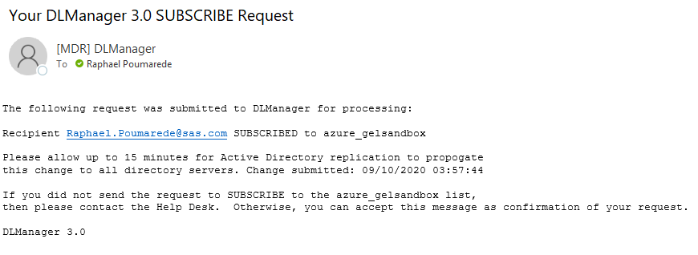

* As said in the email you will have to wait for about **15 minutes** (for the AD replication to propagate the change) before continuing with the prerequisite steps.

**IMPORTANT**

* If you are doing the VLE, on your own time, keep going with the rest of this page, at your own pace.
* However, if you are doing this step as a pre-req to a live workshop of this content, you should STOP HERE and NOT continue with the rest of these instructions yet. You will be instructed as to when to do the rest of these steps DURING the live workshop.
* (Although, if you want to run through these instructions once, before the live workshop, that is acceptable, just not required.)

## Book a RACE Collection

* We will use a RACE machine as a jumphost to interact with AKS

* Book the "single machine K3s" [collection](http://race.exnet.sas.com/Reservations?action=new&imageId=333991&imageKind=C&comment=%20GELLOW%20DEV%20VMWare&purpose=PST&sso=PSGEL255&schedtype=SchedTrainEDU&startDate=now&endDateLength=0&discardonterminate=y) which comes with one Windows client and one Linux machine.

* Once the collection has been started, you should receive an email like the one below.

    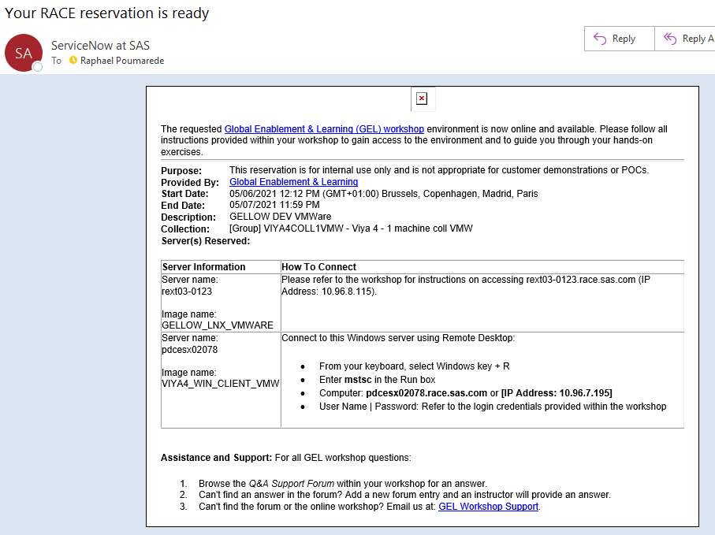

## Connect to the Azure Portal

From your own SAS Laptop, go to [https://portal.azure.com/#home](https://portal.azure.com/#home) and sign-in.

Be sure to connect using your **SAS email** address, check the signed-in account at the top-right corner of the Azure Portal:

Check if you have access to the correct subscription (sas-gelsandbox):

## Review the SAS Viya 4 IaC for Azure prerequisites

* In this exercise, we will us the [SAS Viya 4 IaC for Azure](https://github.com/sassoftware/viya4-iac-azure) project.
* The project is available in GitHub and has several pre-requisites, such as :
  * Access to an Azure Subscription and Identity with 'Contributor' role
  * Terraform or Docker

## Connect to your Collection

* Connect to the Windows Machine of your RACE collection (as Student/Metadata0).
* In the following steps, **we will run the commands run from the sasnode1 session from within MobaXterm** on the RACE client machine.

### Has the Collection finished bootstrapping?

If you connect to the collection as soon as you receive the confirmation e-mail, the collection is probably still in the process of self-configuring.

You need to wait until that process is done. (around 10 minutes, usually).

In order to confirm that the bootstrapping is finished and successful, do the following:

1. Execute the following command on sasnode01:

    ```sh
    tail -f /opt/gellow_work/logs/gellow_summary.log
    ```

1. Wait for the last line to say:

    ```log
    PASS Final message: It seems everything deployed successfully!
    PASS Final message: You can start using this collection

    #####################################################################################
    ####### DONE WITH THE BOOTSTRAPPING OF THE MACHINE ##################################
    #####################################################################################
    ```

1. Now, you can hit `Ctrl +C` keys to exit the interactive "tail" command.

### Make sure kubectl is installed

* Run the command below to show the installed version

    ```bash
    kubectl version
    ```

### Make sure jq is installed

* Run the command below to show the installed version

    ```bash
    jq --version
    ```

### Install Azure CLI

1. Install the azure CLI client

    ```bash
    sudo rpm --import https://packages.microsoft.com/keys/microsoft.asc
    echo -e "[azure-cli]
    name=Azure CLI
    baseurl=https://packages.microsoft.com/yumrepos/azure-cli
    enabled=1
    gpgcheck=1
    gpgkey=https://packages.microsoft.com/keys/microsoft.asc" | sudo tee /etc/yum.repos.d/azure-cli.repo
    sudo yum install azure-cli
    ```

1. Login to the Azure CLI.

    ```bash
    # Use a device code login
    az login --use-device-code
    ```

    You should see something like

    ```log
    [cloud-user@pdcesx04215 ~]$ az login --use-device-code
    To sign in, use a web browser to open the page https://microsoft.com/devicelogin and enter the code EVRVE768B to authenticate.
    ```

1. on your workstation, open the web browser and paste the URL [https://microsoft.com/devicelogin](https://microsoft.com/devicelogin)

    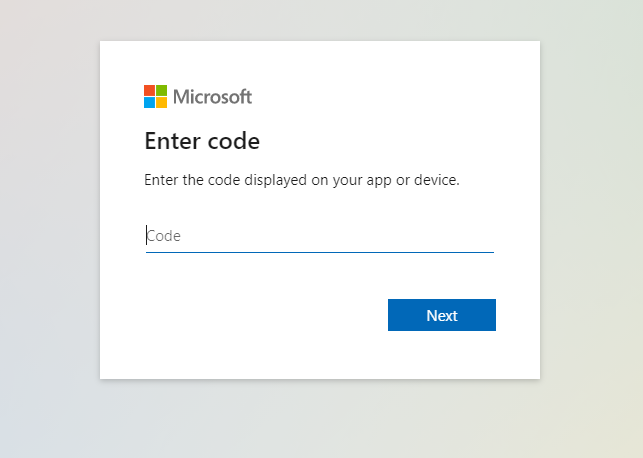

1. Now copy and paste the device code in the Web form and click "Next"

    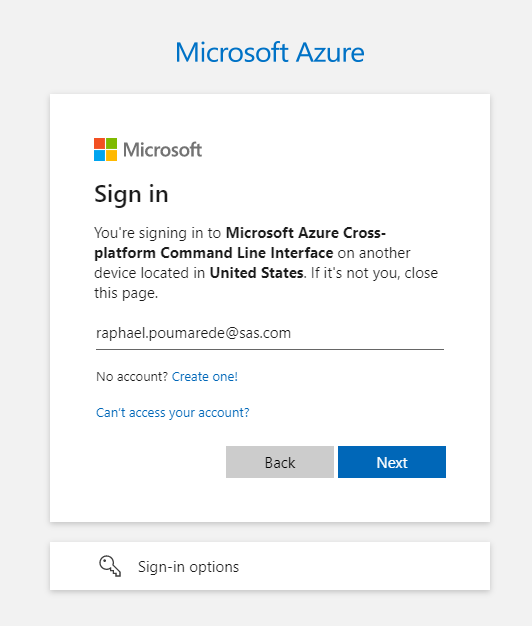

    You should see a window confirming that you are logged.

    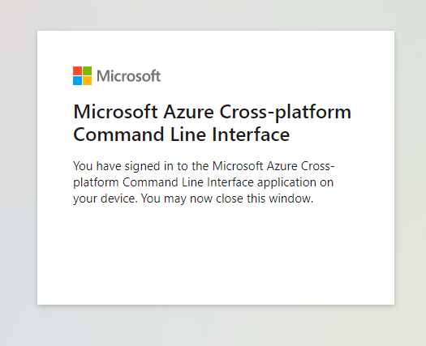

1. Back to your terminal, make sure it worked

    You should see something like

    ```log
    [
    {
        "cloudName": "AzureCloud",
        "homeTenantId": "b1c14d5c-3625-45b3-a430-9552373a0c2f",
        "id": "c973059c-87f4-4d89-8724-a0da5fe4ad5c",
        "isDefault": true,
        "managedByTenants": [],
        "name": "sas-gelsandbox",
        "state": "Enabled",
        "tenantId": "b1c14d5c-3625-45b3-a430-9552373a0c2f",
        "user": {
        "name": "Raphael.Poumarede@sas.com",
        "type": "user"
        }
    },
    {
    ...
    ```

### Set the Azure CLI defaults

* First, let's list the subscriptions we have access to and choose the default one:

    ```sh
    az account list -o table
    ```

  if `sas-gelsandbox` is not the default, then set it :

  ```bash
  az account set -s "sas-gelsandbox"
  ```

  <details><summary>Click here to see the expected output</summary>

  ```log
  [cloud-user@pdcesx04215 ~]$ az account list -o table
  Name            CloudName    SubscriptionId                        State    IsDefault
  --------------  -----------  ------------------------------------  -------  -----------
  sas-gelsandbox  AzureCloud   c973059c-87f4-4d89-8724-a0da5fe4ad5c  Enabled  True
  AzureforTED     AzureCloud   2728c865-4b99-4603-a382-19d9a4613af4  Enabled  False
  GEL             AzureCloud   b91ae007-b39e-488f-bbbf-bc504d0a8917  Enabled  False
  GELDM           AzureCloud   41baf198-cc93-4165-9882-6804e5fb95c0  Enabled  False
  TRG             AzureCloud   bbf0b4a7-b371-4130-9b19-95f13d9988d5  Enabled  False
  ```

</details>

* Now, we need to define the location we want. Let's list the locations, and choose one (eastus):

    ```bash
    az account list-locations -o table
    az configure --defaults location=eastus

    # The default region we choose is "eastus" but you can choose something else if you want:
    AZUREREGION=${AZUREREGION:-eastus}

    echo ${AZUREREGION} > ~/azureregion.txt
    cat ~/azureregion.txt
    az configure --defaults location=${AZUREREGION}
    # Save the AZUREREGION info for next time we re-login
    ansible localhost -m lineinfile \
        -a "dest=~/.bashrc \
            regexp='^export AZUREREGION' \
            line='export AZUREREGION=$(cat ~/azureregion.txt)'" \
            --diff

    ```

  <details><summary>Click here to see a sample output of the available regions</summary>

  ```log
  [cloud-user@pdcesx04215 ~]$ az account list-locations -o table
  DisplayName               Name                 RegionalDisplayName
  ------------------------  -------------------  -------------------------------------
  East US                   eastus               (US) East US
  East US 2                 eastus2              (US) East US 2
  South Central US          southcentralus       (US) South Central US
  West US 2                 westus2              (US) West US 2
  Australia East            australiaeast        (Asia Pacific) Australia East
  Southeast Asia            southeastasia        (Asia Pacific) Southeast Asia
  North Europe              northeurope          (Europe) North Europe
  UK South                  uksouth              (Europe) UK South
  West Europe               westeurope           (Europe) West Europe
  Central US                centralus            (US) Central US
  North Central US          northcentralus       (US) North Central US
  West US                   westus               (US) West US
  South Africa North        southafricanorth     (Africa) South Africa North
  Central India             centralindia         (Asia Pacific) Central India
  East Asia                 eastasia             (Asia Pacific) East Asia
  Japan East                japaneast            (Asia Pacific) Japan East
  Korea Central             koreacentral         (Asia Pacific) Korea Central
  Canada Central            canadacentral        (Canada) Canada Central
  France Central            francecentral        (Europe) France Central
  Germany West Central      germanywestcentral   (Europe) Germany West Central
  Norway East               norwayeast           (Europe) Norway East
  Switzerland North         switzerlandnorth     (Europe) Switzerland North
  UAE North                 uaenorth             (Middle East) UAE North
  Brazil South              brazilsouth          (South America) Brazil South
  Central US (Stage)        centralusstage       (US) Central US (Stage)
  East US (Stage)           eastusstage          (US) East US (Stage)
  East US 2 (Stage)         eastus2stage         (US) East US 2 (Stage)
  North Central US (Stage)  northcentralusstage  (US) North Central US (Stage)
  South Central US (Stage)  southcentralusstage  (US) South Central US (Stage)
  West US (Stage)           westusstage          (US) West US (Stage)
  West US 2 (Stage)         westus2stage         (US) West US 2 (Stage)
  Asia                      asia                 Asia
  Asia Pacific              asiapacific          Asia Pacific
  Australia                 australia            Australia
  Brazil                    brazil               Brazil
  Canada                    canada               Canada
  Europe                    europe               Europe
  Global                    global               Global
  India                     india                India
  Japan                     japan                Japan
  United Kingdom            uk                   United Kingdom
  United States             unitedstates         United States
  East Asia (Stage)         eastasiastage        (Asia Pacific) East Asia (Stage)
  Southeast Asia (Stage)    southeastasiastage   (Asia Pacific) Southeast Asia (Stage)
  Central US EUAP           centraluseuap        (US) Central US EUAP
  East US 2 EUAP            eastus2euap          (US) East US 2 EUAP
  West Central US           westcentralus        (US) West Central US
  West US 3                 westus3              (US) West US 3
  South Africa West         southafricawest      (Africa) South Africa West
  Australia Central         australiacentral     (Asia Pacific) Australia Central
  Australia Central 2       australiacentral2    (Asia Pacific) Australia Central 2
  Australia Southeast       australiasoutheast   (Asia Pacific) Australia Southeast
  Japan West                japanwest            (Asia Pacific) Japan West
  Korea South               koreasouth           (Asia Pacific) Korea South
  South India               southindia           (Asia Pacific) South India
  West India                westindia            (Asia Pacific) West India
  Canada East               canadaeast           (Canada) Canada East
  France South              francesouth          (Europe) France South
  Germany North             germanynorth         (Europe) Germany North
  Norway West               norwaywest           (Europe) Norway West
  Switzerland West          switzerlandwest      (Europe) Switzerland West
  UK West                   ukwest               (Europe) UK West
  UAE Central               uaecentral           (Middle East) UAE Central
  Brazil Southeast          brazilsoutheast      (South America) Brazil Southeast
  [cloud-user@pdcesx04215 ~]$ az configure --defaults location=eastus
  [cloud-user@pdcesx04215 ~]$
  ```

  </details>

### Student Differentiation

This step is important and **mandatory** as it will ensure that what you create in Azure will have your SAS ID in its name. It will prevents conflicts and ease the tracking of the resources and costs.

* Run the command below to add your SAS user ID in the STUDENT variable:

  ```bash
  # add your SAS user ID in the STUDENT variable
  STUDENT=$(az ad signed-in-user show --query mailNickname | sed -e 's/^"//' -e 's/"$//')
  #STUDENT=$(az ad signed-in-user show --query displayName | sed -e 's/^"//' -e 's/"$//' | tr -d ' ')
  echo $STUDENT > ~/student.txt
  cat ~/student.txt
  # Save the STUDENT info for next time we re-login
  ansible localhost -m lineinfile \
    -a "dest=~/.bashrc \
        regexp='^export STUDENT' \
        line='export STUDENT=$(cat ~/student.txt)'" \
        --diff
  ```

_Note: the ansible commands might results in a message saying “CryptographyDeprecationWarning: Python 2 is no longer supported by the Python core team. Support for it is now deprecated in cryptography, and will be removed in a future release.” And then a separate Ansible warning about no inventory have been parsed. This is fine – we use an ansible version based on Python 2 and we ran the command on localhost, neither of these messages are anything to worry about._

### Set up Terraform

* Install the Terraform YUM repository

    ```bash
    ## Install yum-config-manager to manage your repositories.
    sudo yum install -y yum-utils
    ## Use yum-config-manager to add the official HashiCorp Linux repository.
    sudo yum-config-manager --add-repo https://rpm.releases.hashicorp.com/RHEL/hashicorp.repo
    ```

* We want to pin our Terraform version to the version required by the "SAS Viya 4 IaC for GCP" tool.

    ```bash
    # we stick to 13.4 bc it is the required version to use with the viya4-iac version that works with azure files storage
    ## Install
    yum --showduplicate list terraform
    ## Pick up the version that is supported with viya4-iac
    sudo yum install terraform-0.13.4-1 -y
    ```

### Obtain the Terraform templates

The Terraform templates that we need comes from this [project](https://github.com/sassoftware/viya4-iac-azure).
Since they are public, they are not included in the payload tarball.

* Get the Terraform artifacts from github and checkout a specific version

    ```bash
    rm -Rf ~/project/aks/viya4-iac-azure
    mkdir -p ~/project/aks/
    cd ~/project/aks/
    git clone https://github.com/sassoftware/viya4-iac-azure.git

    # Instead of being at the mercy of the latest changes, we pin to a specific version
    cd ~/project/aks/viya4-iac-azure/
    git fetch --all
    IAC_AZURE_TAG=1.0.1

    git checkout tags/${IAC_AZURE_TAG}

    ```

### Figure out some Azure credentials for Terraform

* Create an Azure service principal

  We need to create and grant an azure Service Principal.
  See this [page](https://github.com/sassoftware/viya4-iac-azure/blob/main/docs/user/AzureHelpTopics.md) for more details.
  A Service Principal is effectively a "user" that you create to use with automated tools, like Terraform, to access Azure services on your behalf. You give it a role with only the permissions needed to execute the tasks that the Service Principal performs on your behalf.

  If you have sent us an email to request your sas-gelsandbox access (in this [step](#request-your-gel-sandbox-access)), we  have added you in the group that gives you the required permissions to do so.

  Note that if you are going through these instructions **for the second time**, you can skip this step (because in the following insructions we ask you to  stored the credential information in the TFCREDFILE file).

1. Generate a Service Principal and store in a file

    ```bash
    STUDENT=$(cat ~/student.txt)

    TFCREDFILE=~/.aztf_creds

    if [ ! -f "$TFCREDFILE" ]; then
        touch ${TFCREDFILE}
        # Generate a Service Principal and get his password
        az ad sp \
        create-for-rbac --skip-assignment \
        --name http://${STUDENT} --query password \
        --output tsv \
        | grep -v "Found\ an\ existing" \
        | head -n 1 \
        | sed 's/^/TF_VAR_client_secret=/' \
        | tee -a ${TFCREDFILE}

        az ad sp show --id http://${STUDENT} \
            --query appId --output tsv \
            | grep -v "Found\ an\ existing" \
            | head -n 1 \
            | sed 's/^/TF_VAR_client_id=/' \
            | tee -a ${TFCREDFILE}

        ## we need the APPID in an ENV var
        source <( grep TF_VAR_client_id ${TFCREDFILE}   )

        # set sas-gelsandbox as default subscription
        az account set -s "sas-gelsandbox"

        ## assign the contributor role
        az role assignment create \
            --assignee ${TF_VAR_client_id}  --role Contributor

        # set subscription_id for TF
        az account list --query "[?name=='sas-gelsandbox'].{TF_VAR_subscription_id:id}" \
            -o tsv \
            |  sed 's/^/TF_VAR_subscription_id=/' \
            | tee -a ${TFCREDFILE}

        # set tenant_id for TF
        az account list --query "[?name=='sas-gelsandbox'].{TF_VAR_tenant_id:tenantId}" \
            -o tsv \
            |  sed 's/^/TF_VAR_tenant_id=/' \
            | tee -a ${TFCREDFILE}
    fi

    ```

1. Review the content of the file.

    ```bash
    #show TF credentials
    cat  ${TFCREDFILE}
    ```

    The output should look similar to the following.

    ```log
    [cloud-user@pdcesx02213 viya4-iac-azure]$ cat  ${TFCREDFILE}
    TF_VAR_client_secret=fjqAFbO-gI6xFzf.ZGL6MHG05kHstRCQQk
    TF_VAR_client_id=35965272-ed22-4ec7-a216-73b8d2da06d9
    TF_VAR_subscription_id=c963059c-87f4-4d89-8724-a0da5fe4ad5c
    TF_VAR_tenant_id=b1c14d5c-3625-45b3-a430-9559373a0c2f
    [cloud-user@pdcesx02213 viya4-iac-azure]$
    ```

1. Export all the Terraform environment variables

    ```bash
    while read l; do
        echo "export $l"
        export $l
    done <${TFCREDFILE}
    ```


### Initialize Terraform

* Run this command to initialize terraform in our environment.

  ```bash
  cd ~/project/aks/viya4-iac-azure
  #terraform init
  terraform init
  ```

* the end of the output should look like:

  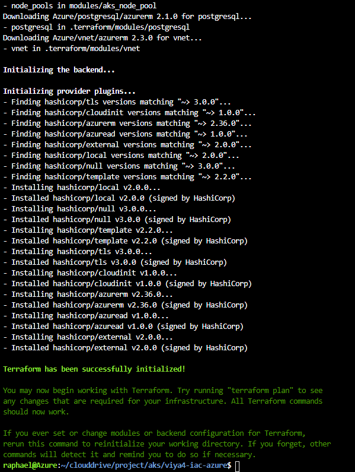

  The important part is **"Terraform has been successfully initialized!"**

## Provision the AKS cluster with Terraform

### Create an ssh key

* An ssh key needs to be created in case we create a jumphost VM with Terraform

    ```bash
    # ensure there is a .ssh dir in $HOME
    ansible localhost -m file \
        -a "path=$HOME/.ssh mode=0700 state=directory"


    # ensure there is an ssh key that we can use
    ansible localhost -m openssh_keypair \
        -a "path=~/.ssh/id_rsa type=rsa size=2048" --diff
    ```

### Get the email for the Azure tags

* Get the student's email as we will use it to tag our Azure resources

    ```bash
    # get azure user email address
    az ad signed-in-user show --query userPrincipalName \
            | sed  's|["\ ]||g' \
            | tee ~/.email.txt
    # store email address in a variable to use later in TF variable
    EMAIL=$(cat ~/.email.txt)
    ```

### Customize the Terraform variables

There are many variables/settings/options that you can modify/edit within the TF templates using the variables.
See this [page](https://github.com/sassoftware/viya4-iac-azure/blob/main/variables.tf) in the IAC-Azure project for the list of available variables and default values.

You can also consult [this page](https://github.com/sassoftware/viya4-iac-azure/blob/main/docs/CONFIG-VARS.md) for a complete and readable list.

As an example, try to find which variable to use to increase the sizing of my Azure Database for PostgreSQL.

Let's create our Terraform variables file:

* ```gel-vars.tfvars``` with multiple node pools specialized : cas node pool, compute node pool, stateless and stateful node pool.
<!-- * ```gel-vars-minimal.tfvars``` minimal version with a default node pool containing only one node (if more resources are needed we rely on the AKS autoscaling feature) -->

* Run this block of commands to populate the TF variables file:

  ```bash
  # Populate the TF variables file
  cd ~/project/aks/viya4-iac-azure

  AZUREREGION=$(cat ~/azureregion.txt)

  tee  ~/project/aks/viya4-iac-azure/gel-vars.tfvars > /dev/null << EOF

  prefix                               = "${STUDENT}viya4aks"
  location                             = "${AZUREREGION}"
  ssh_public_key                       = "~/.ssh/id_rsa.pub"

  ## General config
  kubernetes_version                   = "1.19.9"

  # no jump host machine
  create_jump_public_ip                = false

  # tags in azure
  tags                                 = { "resourceowner" = "${EMAIL}" , project_name = "sasviya4", environment = "dev", gel_project = "deployviya4" }

  ## Azure Auth
  # not required if already set in TF environment variables
  #tenant_id                            = ${TENANT_ID}
  #subscription_id                      = ${SUBSCRIPTION_ID}
  #client_id                            = ${CLIENT_ID}
  #client_secret                        = ${CLIENT_SECRET}

  ## Admin Access
  # IP Ranges allowed to access all created cloud resources
  default_public_access_cidrs         = ["109.232.56.224/27", "149.173.0.0/16", "194.206.69.176/28"]

  ## Storage
  # "dev" creates AzureFile, "standard" creates NFS server VM, "ha" creates Azure Netapp Files
  storage_type                         = "dev"

  # Default node pool
  default_nodepool_vm_type             = "Standard_D4_v2"
  default_nodepool_min_nodes           = 1
  default_nodepool_max_nodes           = 2
  default_nodepool_availability_zones  = ["1"]

  # Additional node pools
  node_pools_availability_zone         = "1"
  node_pools_proximity_placement       = false

  # AKS Node Pools config
  node_pools = {
    cas = {
      "machine_type" = "Standard_E4s_v3"         # # 4x32 w 64GBSSD @0.25
      "os_disk_size" = 200
      "min_nodes" = 1
      "max_nodes" = 8
      "node_taints" = ["workload.sas.com/class=cas:NoSchedule"]
      "node_labels" = {
        "workload.sas.com/class" = "cas"
      }
    },
    compute = {
      "machine_type" = "Standard_L8s_v2"        # # 8x64 w 80GBSSD 1.9TB NVMe @ 0.62
      "os_disk_size" = 200
      "min_nodes" = 1
      "max_nodes" = 1
      "node_taints" = ["workload.sas.com/class=compute:NoSchedule"]
      "node_labels" = {
        "workload.sas.com/class"        = "compute"
        "launcher.sas.com/prepullImage" = "sas-programming-environment"
      }
    },
      connect = {
        "machine_type" = "Standard_L8s_v2"          # # 8x64 w 80GBSSD 1.9TB NVMe @ 0.62
        "os_disk_size" = 200
        "min_nodes" = 0
        "max_nodes" = 1
        "node_taints" = ["workload.sas.com/class=connect:NoSchedule"]
        "node_labels" = {
          "workload.sas.com/class"        = "connect"
          "launcher.sas.com/prepullImage" = "sas-programming-environment"
        }
      },
    stateless = {
      "machine_type" = "Standard_D8s_v3"           # # 8x32 w 64GBSSD @ 0.38
      "os_disk_size" = 200
      "min_nodes" = 0
      "max_nodes" = 3
      "node_taints" = ["workload.sas.com/class=stateless:NoSchedule"]
      "node_labels" = {
        "workload.sas.com/class" = "stateless"
      }
    },
    stateful = {
      "machine_type" = "Standard_D8s_v3"          # # 8x32 w 64GBSSD @ 0.38
      "os_disk_size" = 200
      "min_nodes" = 0
      "max_nodes" = 3
      "node_taints" = ["workload.sas.com/class=stateful:NoSchedule"]
      "node_labels" = {
        "workload.sas.com/class" = "stateful"
      }
    }
  }

  # Azure Postgres config
  # # set this to "false" when using internal Crunchy Postgres and Azure Postgres is NOT needed
  create_postgres                  = true

  postgres_sku_name                = "GP_Gen5_8"
  postgres_administrator_login     = "pgadmin"
  postgres_administrator_password  = "LNX_sas_123"
  postgres_ssl_enforcement_enabled = true

  # Azure Container Registry
  # We will use external orders and pull images from SAS Hosted registries
  create_container_registry           = false
  container_registry_sku              = "Standard"
  container_registry_admin_enabled    = "false"
  container_registry_geo_replica_locs = null
  EOF
  ```

* Take a moment to review and understand the content of the files. It defines how our Kubernetes cluster will look like in Azure.

  ```sh
  less ~/project/aks/viya4-iac-azure/gel-vars.tfvars
  ```

* It defines the node pools and what kind of Azure Instance sizes will be used for the Kubernetes Workers

* Hit "q" to quit from the interactive "less" command.

### Generate a Terraform plan

* Let's generate the TF plan corresponding to the AKS cluster with multiple node pools :

  ```bash
  # generate the TF plan corresponding to the AKS cluster with multiple node pools
  cd ~/project/aks/viya4-iac-azure
  #terraform plan -input=false \
  terraform plan -input=false \
      -var-file=./gel-vars.tfvars \
      -out ./my-aks.plan
  ```

* Now you should see something like that :

  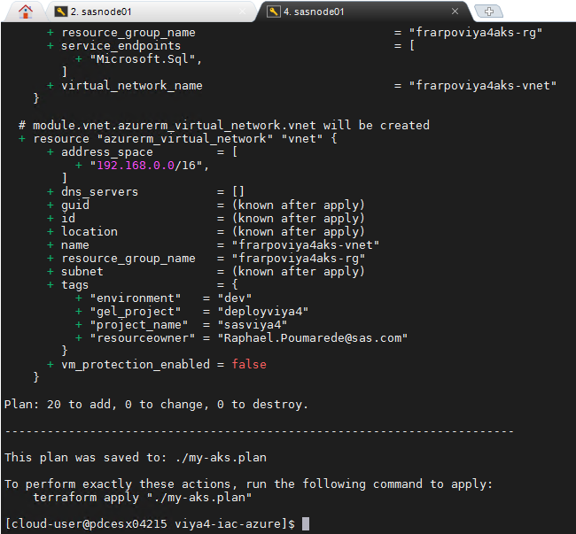

* Review the generated plan

  ```sh
  #TFPLAN=my-aks-minimal.plan
  TFPLAN=my-aks.plan
  cd ~/project/aks/viya4-iac-azure
  #terraform show ${TFPLAN}
  terraform show ${TFPLAN}
  ```

* The plan shows all the infrastructure components that will be created in Azure to support the Viya deployment : Virtual network, Subnets, Public IPs, Network Security Groups, an Azure Postgres DB, an Azure Kubernetes Cluster with several node pools and associated instance types.
* A first resource group named per your SAS ID or NAME (```<YOUR SAS ID>```viya4aks-rg) is created to hold all the provisioned components.
* Then when the AKS cluster is created in the first Resource group, it will trigger the creation of the second resource group (the name starts with "MC" and also contains your SAS ID) that will contains all the Kubernetes cluster infrastructure (VM scalesets, Disks, Storage accounts, Public IP, etc...)

## Stand up AKS cluster and Validate

### Apply the Terraform plan

* Now we can deploy the AKS cluster with the TF plan.
* In our testing it takes less than 10 minutes.

    ```bash
    # Deploy the AKS cluster with the TF plan
    TFPLAN=my-aks.plan
    # by default, we go with the multi node pools AKS cluster but you can choose the minimal one to test
    cd ~/project/aks/viya4-iac-azure
    # apply the TS plan and generate a log in case of disconnection.
    time terraform apply "./${TFPLAN}" 2>&1 \
    | tee -a /tmp/terraform-apply.log
    ```

* Now, you can see the progress of the Terraform plan being executed to provision the AKS infrastructure.

    

* You can also notice in the Azure Portal that the new resource groups (the primary and the one generated to hold the AKS cluster infrastructure, named "MCxxx") start to get populated.

  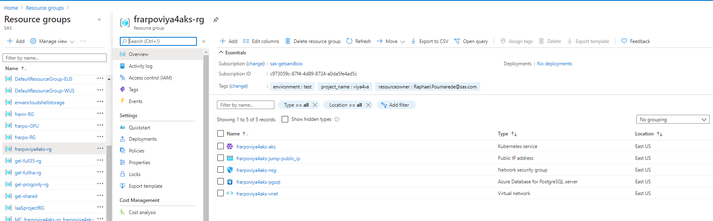

    and

  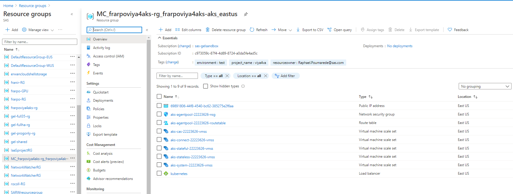

* Finally, you should see some green text reporting that the TF plan run is now complete.  FYI, the TF output provides some detail for some hosts, then some additional text, then the remaining details about the hosts.

  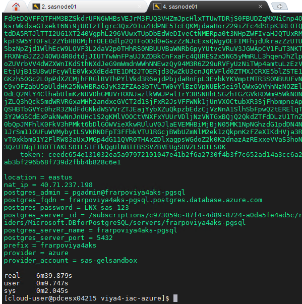

* Browse in the Azure portal to see all resources created in the resource group.
* An additional Resource group has been created with the infrastrcuture components of the AKS cluster (disks, load-balancer, etc...).

  _Note: If you don't see your resource group, you might not be looking in the correct subscription. If you don't see the sas-gelsandbox subscription you might have to change the global subscription filter in the "Subscription" menu_

  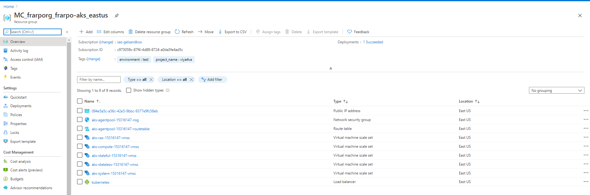

### In case it did not work for you

#### Terraform authentication issues

* If, during the Terraform apply command execution, you see an error message like :

    ```log
    Error: Unable to list provider registration status, it is possible that this is due to invalid credentials or the service principal does not have permissionto use the Resource Manager API, Azure error: resources.ProvidersClient#List: Failure responding to request: StatusCode=403 -- Original Error: autorest/azure: Service returned an error. Status=403 Code="AuthorizationFailed" Message="The client 'ad3b1992-e72b-4960-b1b0-bf92ad73d51a' with object id 'ad3b1992-e72b-4960-b1b0-bf92ad73d51a' does not have authorization to perform action 'Microsoft.Resources/subscriptions/providers/read' over scope '/subscriptions/c973059c-87f4-4d89-8724-a0da5fe4ad5c' or the scope is invalid. If access was recently granted, please refresh your credentials."
    ```

* Then, there are two possible explanations:
  * The az CLI is not set to use the sas-gelsandbox subscription - go back to this [section](#set-the-azure-cli-defaults)
  * There is an issue with the Azure credentials generated to be used with Terraform - run the code from this [snippet](https://gitlab.sas.com/GEL/workshops/PSGEL255-deploying-viya-4.0.1-on-kubernetes/-/snippets/1286) to see if it solves the issue.

#### Azure API quota (too many request for the subscription)

* If, during the Terraform apply command execution, you see an error message like :

  ```log
  Error: waiting for creation of Managed Kubernetes Cluster "shkcslviya4aks-aks" (Resource Group "shkcslviya4aks-rg"): Code="CreateVMSSAgentPoolFailed" Message="VMSSAgentPoolReconciler retry failed: autorest/azure: Service returned an error. Status=429 Code=\"OperationNotAllowed\" Message=\"The server rejected the request because too many requests have been received for this subscription.\" Details=[{\"code\":\"TooManyRequests\",\"message\":\"{\\\"operationGroup\\\":\\\"HighCostGetVMScaleSet30Min\\\",\\\"startTime\\\":\\\"2021-01-28T03:48:16.7336912+00:00\\\",\\\"endTime\\\":\\\"2021-01-28T03:50:00+00:00\\\",\\\"allowedRequestCount\\\":1643,\\\"measuredRequestCount\\\":1883}\",\"target\":\"HighCostGetVMScaleSet30Min\"}] InnerError={\"internalErrorCode\":\"TooManyRequestsReceived\"}"
  ```

* It is not your fault, it simply means that the Azure Resourec Manager APIs quota has been exceeded. Refer to the [Troubleshooting API requests quota](#troubleshooting-api-requests-quota) section for more information. You will have to try another time, but later.

### Getting the kubectl config file for your newly built AKS cluster

* First, let's generate the config file with a recognizable name:

  ```bash
  # generate the config file with a recognizable name
  cd ~/project/aks/viya4-iac-azure
  mkdir -p ~/.kube
  terraform output kube_config > ~/.kube/${STUDENT}-aks-kubeconfig.conf
  ```

* Then, let's make a symlink to it for easier access:

  ```bash
  SOURCEFOLDER=~/.kube/${STUDENT}-aks-kubeconfig.conf
  ansible localhost -m file \
    -a "src=$SOURCEFOLDER \
        dest=~/.kube/config state=link" \
    --diff

  ```

* You can use that config file to configure Lens.
* You can also download and install the latest version of [Lens](https://k8slens.dev/) on the RACE client machine.
* If you have the application "Lens" on your desktop, and if you are VPN'ed directly to Cary, that will work too.

* Now run the kubectl command to check if your cluster is there !

    ```sh
    kubectl get nodes
    ```

    You should see something like the following:

    ```log
    NAME                              STATUS   ROLES   AGE     VERSION
    aks-cas-22223626-vmss000000       Ready    agent   8m33s   v1.19.9
    aks-compute-22223626-vmss000000   Ready    agent   8m34s   v1.19.9
    aks-system-22223626-vmss000000    Ready    agent   10m     v1.19.9
    ```

    _Note : Don't worry if you don't see more nodes (for example stateful and stateless), they will be dynamically provisionned by the cluster auto-scaler during the deployment._

* Run the following command to list the StorageClass information.

    ```sh
    # Get the StorageClass information
    kubectl get sc
    ```

    You should see output similar to the following.

    ```log
    NAME                PROVISIONER                RECLAIMPOLICY   VOLUMEBINDINGMODE      ALLOWVOLUMEEXPANSION   AGE
    azurefile           kubernetes.io/azure-file   Delete          Immediate              true                   8m57s
    azurefile-premium   kubernetes.io/azure-file   Delete          Immediate              true                   8m57s
    default (default)   kubernetes.io/azure-disk   Delete          WaitForFirstConsumer   true                   8m57s
    managed-premium     kubernetes.io/azure-disk   Delete          WaitForFirstConsumer   true                   8m57s
    ```

### Disable the authorized IP range for the Kubernetes API

reference : <https://docs.microsoft.com/en-us/azure/aks/api-server-authorized-ip-ranges#update-or-disable-authorized-ip-ranges>

* Here is the command you should run:

  ```bash
  az aks update -n ${STUDENT}viya4aks-aks \
      -g ${STUDENT}viya4aks-rg --api-server-authorized-ip-ranges ""
  ```

It might take a while to run.
if you see "Running", **DO NOT INTERRUPT THE EXECUTION OF THE COMMAND !**

### Configure kubectl auto-completion

The Kubernetes command-line tool, `kubectl`, allows you to run commands against Kubernetes clusters. You can use `kubectl` to deploy applications, inspect and manage cluster resources, and view logs.

`kubectl` provides autocompletion support for Bash and Zsh, which can save you a lot of typing.

* Run the command below to enable it in your environment:

  ```bash
  source <(kubectl completion bash)
  ansible localhost \
      -m lineinfile \
      -a "dest=~/.bashrc \
          line='source <(kubectl completion bash)' \
          state=present" \
      --diff
  ```

---

## Next steps

**Congratulations ! You should now have a running AKS cluster :)**.

You now need to prepare the cluster for running SAS Viya. Click [here](./11_110_Performing_the_prerequisites.md) to proceed to the next steps.

---

## Troubleshooting API Requests Quota

* During the workshop you might hit this error, when you run the Terraform apply command to create the AKS cluster:

  ```log
  Error: waiting for creation of Managed Kubernetes Cluster "shkcslviya4aks-aks" (Resource Group "shkcslviya4aks-rg"): Code="CreateVMSSAgentPoolFailed" Message="VMSSAgentPoolReconciler retry failed: autorest/azure: Service returned an error. Status=429 Code=\"OperationNotAllowed\" Message=\"The server rejected the request because too many requests have been received for this subscription.\" Details=[{\"code\":\"TooManyRequests\",\"message\":\"{\\\"operationGroup\\\":\\\"HighCostGetVMScaleSet30Min\\\",\\\"startTime\\\":\\\"2021-01-28T03:48:16.7336912+00:00\\\",\\\"endTime\\\":\\\"2021-01-28T03:50:00+00:00\\\",\\\"allowedRequestCount\\\":1643,\\\"measuredRequestCount\\\":1883}\",\"target\":\"HighCostGetVMScaleSet30Min\"}] InnerError={\"internalErrorCode\":\"TooManyRequestsReceived\"}"
  ```

* This problem is documented [there](https://docs.microsoft.com/en-us/azure/aks/troubleshooting#im-receiving-429---too-many-requests-errors)

  **When a kubernetes cluster on Azure (AKS or no) does a frequent scale up/down or uses the cluster autoscaler (CA), those operations can result in a large number of HTTP calls that in turn exceed the assigned subscription quota leading to failure**

* Let's see how we can check the remaining calls for example for this specific operation that happens when we create the AKS cluster.

  ```sh
  # list VMSS state
  # Get the rquest parameters values
  ResourceGroup="MC_${STUDENT}viya4aks-rg_${STUDENT}viya4aks-aks_$(cat ~/azureregion.txt)"
  # Paramaters check
  echo Subscription $TF_VAR_subscription_id
  echo ResourceGroup $ResourceGroup
  # Get the number of remaining API requests
  declare response=$(az account get-access-token)
  declare token=$(echo $response | jq ".accessToken" -r)
  # get the first node pool VMSS
  vmss=$(az vmss list --resource-group ${ResourceGroup} -o tsv --query [0].name)
  echo VM SCALE SET: $vmss
  curl -s -I -X GET -H "Authorization: Bearer $token" "https://management.azure.com/subscriptions/"${TF_VAR_subscription_id}"/resourceGroups/"${ResourceGroup}"/providers/Microsoft.Compute/virtualMachineScaleSets/${vmss}/virtualMachines?api-version=2020-12-01" | grep "remaining-resource" | awk -F "[:;,]" '{{print $1 "=> 3mn-limit:" $3 " 30mn-limit:" $5}}'
  ```

* In case you see the error

  ```sh
  ResourceGroup="MC_${STUDENT}viya4aks-rg_${STUDENT}viya4aks-aks_$(cat ~/azureregion.txt)"
  # Paramaters check
  echo Subscription $TF_VAR_subscription_id
  echo ResourceGroup $ResourceGroup
  # Get the number of remaining API requests
  declare response=$(az account get-access-token)
  declare token=$(echo $response | jq ".accessToken" -r)
  vmss=$(az vmss list --resource-group ${ResourceGroup} -o tsv --query [0].name)
  echo VM SCALE SET: $vmss
  curl -s -I -X GET -H "Authorization: Bearer $token" "https://management.azure.com/subscriptions/"${TF_VAR_subscription_id}"/resourceGroups/"${ResourceGroup}"/providers/Microsoft.Compute/virtualMachineScaleSets/${vmss}/virtualMachines?api-version=2020-12-01"
  ```

  The response should include a `Retry-After` value, which specifies the number of seconds you should wait (or sleep) before sending the next request.

## References

* AKS cluster auto-scaling: <https://docs.microsoft.com/en-us/azure/aks/cluster-autoscaler>

## Navigation

<!-- startnav -->
* [01 Introduction / 01 031 Booking a Lab Environment for the Workshop](/01_Introduction/01_031_Booking_a_Lab_Environment_for_the_Workshop.md)
* [01 Introduction / 01 032 Assess Readiness of Lab Environment](/01_Introduction/01_032_Assess_Readiness_of_Lab_Environment.md)
* [01 Introduction / 01 033 CheatCodes](/01_Introduction/01_033_CheatCodes.md)
* [02 Kubernetes and Containers Fundamentals / 02 131 Learning about Namespaces](/02_Kubernetes_and_Containers_Fundamentals/02_131_Learning_about_Namespaces.md)
* [03 Viya 4 Software Specifics / 03 011 Looking at a Viya 4 environment with Visual Tools DEMO](/03_Viya_4_Software_Specifics/03_011_Looking_at_a_Viya_4_environment_with_Visual_Tools_DEMO.md)
* [03 Viya 4 Software Specifics / 03 051 Create your own Viya order](/03_Viya_4_Software_Specifics/03_051_Create_your_own_Viya_order.md)
* [03 Viya 4 Software Specifics / 03 056 Getting the order with the CLI](/03_Viya_4_Software_Specifics/03_056_Getting_the_order_with_the_CLI.md)
* [04 Pre Requisites / 04 081 Pre Requisites automation with Viya4-ARK](/04_Pre-Requisites/04_081_Pre-Requisites_automation_with_Viya4-ARK.md)
* [05 Deployment tools / 05 121 Setup a Windows Client Machine](/05_Deployment_tools/05_121_Setup_a_Windows_Client_Machine.md)
* [06 Deployment Steps / 06 031 Deploying a simple environment](/06_Deployment_Steps/06_031_Deploying_a_simple_environment.md)
* [06 Deployment Steps / 06 051 Deploying Viya with Authentication](/06_Deployment_Steps/06_051_Deploying_Viya_with_Authentication.md)
* [06 Deployment Steps / 06 061 Deploying in a second namespace](/06_Deployment_Steps/06_061_Deploying_in_a_second_namespace.md)
* [06 Deployment Steps / 06 071 Removing Viya deployments](/06_Deployment_Steps/06_071_Removing_Viya_deployments.md)
* [06 Deployment Steps / 06 081 Deploying a programing only environment](/06_Deployment_Steps/06_081_Deploying_a_programing-only_environment.md)
* [06 Deployment Steps / 06 091 Deployment Operator setup](/06_Deployment_Steps/06_091_Deployment_Operator_setup.md)
* [06 Deployment Steps / 06 093 Using the DO with a Git Repository](/06_Deployment_Steps/06_093_Using_the_DO_with_a_Git_Repository.md)
* [06 Deployment Steps / 06 095 Using an inline configuration](/06_Deployment_Steps/06_095_Using_an_inline_configuration.md)
* [06 Deployment Steps / 06 097 Using the Orchestration Tool](/06_Deployment_Steps/06_097_Using_the_Orchestration_Tool.md)
* [06 Deployment Steps / 06 101 Create Viya Deployment Roles](/06_Deployment_Steps/06_101_Create_Viya_Deployment_Roles.md)
* [07 Deployment Customizations / 07 021 Configuring SASWORK](/07_Deployment_Customizations/07_021_Configuring_SASWORK.md)
* [07 Deployment Customizations / 07 051 Adding a local registry to k8s](/07_Deployment_Customizations/07_051_Adding_a_local_registry_to_k8s.md)
* [07 Deployment Customizations / 07 052 Using mirror manager to populate the local registry](/07_Deployment_Customizations/07_052_Using_mirror_manager_to_populate_the_local_registry.md)
* [07 Deployment Customizations / 07 053 Deploy from local registry](/07_Deployment_Customizations/07_053_Deploy_from_local_registry.md)
* [07 Deployment Customizations / 07 091 Configure SAS ACCESS Engine](/07_Deployment_Customizations/07_091_Configure_SAS_ACCESS_Engine.md)
* [07 Deployment Customizations / 07 101 Configure SAS ACCESS TO HADOOP](/07_Deployment_Customizations/07_101_Configure_SAS_ACCESS_TO_HADOOP.md)
* [07 Deployment Customizations / 07 102 Parallel loading with EP for Hadoop](/07_Deployment_Customizations/07_102_Parallel_loading_with_EP_for_Hadoop.md)
* [09 Validation / 09 011 Validate the Viya deployment](/09_Validation/09_011_Validate_the_Viya_deployment.md)
* [09 Validation / 09 021 SAS Viya deployment reports](/09_Validation/09_021_SAS_Viya_deployment_reports.md)
* [11 Azure AKS Deployment / 11 000 Navigating the AKS Hands on Deployment Options](/11_Azure_AKS_Deployment/11_000_Navigating_the_AKS_Hands-on_Deployment_Options.md)
* [11 Azure AKS Deployment / 11 999 Fast track with cheatcodes](/11_Azure_AKS_Deployment/11_999_Fast_track_with_cheatcodes.md)
* [11 Azure AKS Deployment/Fully Automated / 11 500 Full Automation of AKS Deployment](/11_Azure_AKS_Deployment/Fully_Automated/11_500_Full_Automation_of_AKS_Deployment.md)
* [11 Azure AKS Deployment/Fully Automated / 11 590 Cleanup](/11_Azure_AKS_Deployment/Fully_Automated/11_590_Cleanup.md)
* [11 Azure AKS Deployment/Standard / 11 100 Creating an AKS Cluster](/11_Azure_AKS_Deployment/Standard/11_100_Creating_an_AKS_Cluster.md)**<-- you are here**
* [11 Azure AKS Deployment/Standard / 11 110 Performing the prerequisites](/11_Azure_AKS_Deployment/Standard/11_110_Performing_the_prerequisites.md)
* [11 Azure AKS Deployment/Standard/Cleanup / 11 400 Cleanup](/11_Azure_AKS_Deployment/Standard/Cleanup/11_400_Cleanup.md)
* [11 Azure AKS Deployment/Standard/Manual / 11 200 Deploying Viya 4 on AKS](/11_Azure_AKS_Deployment/Standard/Manual/11_200_Deploying_Viya_4_on_AKS.md)
* [11 Azure AKS Deployment/Standard/Manual / 11 210 Deploy a second namespace in AKS](/11_Azure_AKS_Deployment/Standard/Manual/11_210_Deploy_a_second_namespace_in_AKS.md)
* [11 Azure AKS Deployment/Standard/Manual / 11 220 CAS Customizations](/11_Azure_AKS_Deployment/Standard/Manual/11_220_CAS_Customizations.md)
* [11 Azure AKS Deployment/Standard/Manual / 11 230 Install monitoring and logging](/11_Azure_AKS_Deployment/Standard/Manual/11_230_Install_monitoring_and_logging.md)
* [12 Amazon EKS Deployment / 12 010 Access Environments](/12_Amazon_EKS_Deployment/12_010_Access_Environments.md)
* [12 Amazon EKS Deployment / 12 020 Provision Resources](/12_Amazon_EKS_Deployment/12_020_Provision_Resources.md)
* [12 Amazon EKS Deployment / 12 030 Deploy SAS Viya](/12_Amazon_EKS_Deployment/12_030_Deploy_SAS_Viya.md)
* [13 Google GKE Deployment / 13 011 Creating a GKE Cluster](/13_Google_GKE_Deployment/13_011_Creating_a_GKE_Cluster.md)
* [13 Google GKE Deployment / 13 021 Performing Prereqs in GKE](/13_Google_GKE_Deployment/13_021_Performing_Prereqs_in_GKE.md)
* [13 Google GKE Deployment / 13 031 Deploying Viya 4 on GKE](/13_Google_GKE_Deployment/13_031_Deploying_Viya_4_on_GKE.md)
* [13 Google GKE Deployment / 13 041 Full Automation of GKE Deployment](/13_Google_GKE_Deployment/13_041_Full_Automation_of_GKE_Deployment.md)
* [13 Google GKE Deployment / 13 099 Fast track with cheatcodes](/13_Google_GKE_Deployment/13_099_Fast_track_with_cheatcodes.md)
<!-- endnav -->
