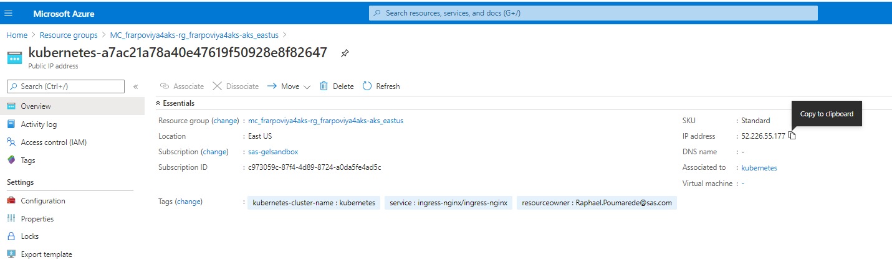

# Prepare the cluster for SAS Viya

* [Introduction](#introduction)
* [Create the project folder](#create-the-project-folder)
* [Prep the cluster](#prep-the-cluster)
  * [Install cert-manager](#install-cert-manager)
  * [Install the NGINX ingress controller](#install-the-nginx-ingress-controller)
  * [Install Metrics server (for HPA)](#install-metrics-server-for-hpa)
  * [Create New StorageClass to support RWX](#create-new-storageclass-to-support-rwx)
  * [Optional: Update default storage class to support statefulset on multiple AZ](#optional-update-default-storage-class-to-support-statefulset-on-multiple-az)
* [Set-up the DNS Aliases](#set-up-the-dns-aliases)
  * [Step 1. Define a DNS entry in Azure for the public IP](#step-1-define-a-dns-entry-in-azure-for-the-public-ip)
    * [Automated method to define a DNS entry in Azure for public IP](#automated-method-to-define-a-dns-entry-in-azure-for-public-ip)
    * [Manual Method (using the Azure Portal)](#manual-method-using-the-azure-portal)
  * [Step 2. Create the wildcard DNS alias for your cluster](#step-2-create-the-wildcard-dns-alias-for-your-cluster)
* [Attached the GEL Registry to your AKS cluster](#attached-the-gel-registry-to-your-aks-cluster)
* [Set-up additional tools](#set-up-additional-tools)
  * [Install Kustomize](#install-kustomize)
  * [Copy the OKViya script](#copy-the-okviya-script)
  * [Install yq](#install-yq)
  * [Set-up GELLDAP](#set-up-gelldap)
* [Next steps](#next-steps)
* [References](#references)
* [Navigation](#navigation)

## Introduction

At this point you should have completed the steps to create the AKS cluster, see [here](./11_100_Creating_an_AKS_Cluster.md).

If you look at the namespaces in the cluster (kubectl get ns) you should see the following.

```log
$ kubectl get ns
NAME              STATUS   AGE
default           Active   17m
kube-node-lease   Active   17m
kube-public       Active   17m
kube-system       Active   17m
```

Before you can deploy SAS Viya in your AKS cluster there are a number of prerequisites that need to be implemented, including:

* An Ingress controller and
* cert-manager.

The following steps guide you through implementing the prerequisites.

There is also "nice to have" stuff such as the OKViya4 tool to monitor services startup, mirror manager (in case  we'd like to setup our own registry), the tools for monitoring and alerting, etc...

## Create the project folder

* Create create a working directory for your project work.

    ```bash
    # create the project folder
    mkdir -p ~/project/deploy/test
    ```

## Prep the cluster

### Install cert-manager

* We install cert-manager in its own namespace

    ```bash
    # not idempotent, to recreate, you'll need to delete the cert-manager crds
    kubectl create namespace cert-manager
    helm repo add jetstack https://charts.jetstack.io
    helm repo update
    helm install cert-manager jetstack/cert-manager \
        --namespace cert-manager \
        --version v1.1.0  \
        --set installCRDs=true \
        --set extraArgs='{--enable-certificate-owner-ref=true}'
    ```

_Note : it is required to configure front door TLS, enable internal Via services communications encryption, and also to deploy the Viya logging tool (Kibana) with TLS._

### Install the NGINX ingress controller

We will install the NGINX ingress controller by simply applying their manifests in our AKS cluster.
The manifest files are named ```mandatory.yaml``` and ```cloud-generic.yaml``` and are stored in our payload directory.

* You can open and review them to get an idea of what they do (the kind of Kubernetes objects that they create, the access level that is needed, etc...):

    ```sh
    cat ~/payload/nginx/mandatory.yaml
    cat ~/payload/nginx/cloud-generic.yaml
    ```

* Let's copy them in our project folder:

    ```bash
    # copy Ingress deployment manifests from the payload
    cp ~/payload/nginx/mandatory.yaml ~/project/deploy/test
    cp ~/payload/nginx/cloud-generic.yaml ~/project/deploy/test
    ```

  The second manifest (cloud-generic.yaml) will create a Kubernetes Service with a type "LoadBalancer" which will trigger the creation of an external load-balancer in Azure.

  But before doing so, we need to configure it to allow access only from the SAS network and from our own Cloud Shell machine (unless you'd like to receive an "Azure Security Violation" email from the SAS IT team :) ).

* We want to insert in the NGINX Ingress service definition several IP ranges to allow Access from Cary, Marlow subnets and also from the other nodes). We use ansible to do that.

    ```bash
    cd ~/project/deploy/test/
    # use ansible to update the Ingress deployment with authorized IP ranges
    cat > ./insertAuthorizeIPs.yml << EOF
    ---
    - hosts: localhost
      tasks:
      - name: Insert Auth IP block in ingress definition
        blockinfile:
          path: ~/project/deploy/test/cloud-generic.yaml
          insertafter: "spec:"
          marker: "  # {mark} ANSIBLE MANAGED BLOCK : source ranges"
          block: |2
              loadBalancerSourceRanges:
                - 10.244.0.0/16 #Pod CIDR
                - 109.232.56.224/27 #Marlow
                - 149.173.0.0/16 #Cary
    EOF

    ## apply
    ansible-playbook ./insertAuthorizeIPs.yml --diff
    ```

* Look at the result :

    ```bash
    # check the Ingress deployment manifest with authorized IPs
    cat ~/project/deploy/test/cloud-generic.yaml
    ```

* OK, now we can apply the NGINX ingress controller manifests :

  ```bash
  # Deploy and configure the Ingress controller (nginx)
  kubectl apply -f ~/project/deploy/test/mandatory.yaml
  kubectl apply -f ~/project/deploy/test/cloud-generic.yaml
  ```

* After you deployed nginx, you can run:

    ```sh
    kubectl get svc -n ingress-nginx
    ```

    You should see output similar to the following.

    ```log
    NAME            TYPE           CLUSTER-IP     EXTERNAL-IP    PORT(S)                      AGE
    ingress-nginx   LoadBalancer   10.0.235.184   20.81.25.197   80:30380/TCP,443:30991/TCP   26s
    ```

* Let's store the external IP of the Load Balancer for that IP as an environment variable.

  ```sh
  LBIP=$(kubectl get service -n ingress-nginx | grep LoadBalancer | awk '{print $4}')
  echo $LBIP
  ```

  It is a useful information and you will see that we use it later.

  It corresponds to the public IP assigned to the AKS cluster which is also visible in the Azure portal (go the "MC_" resource group that corresponds to your own cluster and you will see a new Public IP address resource starting with "kubernetes").

  

  The public IP allows the access to our Viya 4 applications from the outside.

### Install Metrics server (for HPA)

* Install the K8s metrics server

    ```sh
    kubectl apply -f https://github.com/kubernetes-sigs/metrics-server/releases/download/v0.3.6/components.yaml
    ```

### Create New StorageClass to support RWX

By default, PVCs are owned by the root user. In Microsoft Azure environments, we must define a storageClass in which we explicitly set mountOptions for each PVC in order to allow non-root users to access them.

If we do not allow access by the sas user account, at a minimum, we will see permission errors.

In your custom storageClass definition, the UID and GID mount options must match the container process ID (which is 1001, sas, by default).

* Let's create our "sas-azurefile" custom storage class.

    ```bash
    #Create custom StorageClass to support RWX
    cd ~/project/deploy/test
    cat << 'EOF' > StorageClass-RWX.yaml
    kind: StorageClass
    apiVersion: storage.k8s.io/v1
    metadata:
      name: sas-azurefile
    provisioner: kubernetes.io/azure-file
    mountOptions:
      - dir_mode=0777
      - file_mode=0777
      - uid=1001
      - gid=1001
    parameters:
      skuName: Standard_LRS
    allowVolumeExpansion: true
    EOF
    ```

* Now let's apply the manifest

    ```bash
    # Create the storage class
    kubectl apply -f StorageClass-RWX.yaml
    ```

    You can use `kubectl get sc` to confirm that the "sas-azurefile" storage class has been created. For example.

    ```log
    $ kubectl get sc
    NAME                PROVISIONER                RECLAIMPOLICY   VOLUMEBINDINGMODE      ALLOWVOLUMEEXPANSION   AGE
    azurefile           kubernetes.io/azure-file   Delete          Immediate              true                   105m
    azurefile-premium   kubernetes.io/azure-file   Delete          Immediate              true                   105m
    default (default)   kubernetes.io/azure-disk   Delete          WaitForFirstConsumer   true                   2m12s
    managed-premium     kubernetes.io/azure-disk   Delete          WaitForFirstConsumer   true                   105m
    sas-azurefile       kubernetes.io/azure-file   Delete          Immediate              true                   17s
    ```

### Optional: Update default storage class to support statefulset on multiple AZ

When creating AKS cluster with nodes/(node pools) in multiple AZs, there is a need to create a storage class with the plugin - 'WaitForFirstConsumer'.

Currently Dynamic Volumes for Viya pods - consul, rabbit & cacheserver, are created with 'VolumeBindingMode' set to 'Immediate' with default(AzureDisk) Storage.

Reference : <https://gitlab.sas.com/CloudOps4Viya/k8s-quickstarts-tf/azure-aks-4-viya/-/issues/13>

* Run the code below to update the default storage class, (it has to be done before deploying Viya):

    ```sh
    cat << 'EOF' > ~/project/deploy/test/DefaultStorageClassUpdate.yaml
    ## Reference: https://kubernetes.io/docs/concepts/storage/storage-classes/#volume-binding-mode
    kind: StorageClass
    apiVersion: storage.k8s.io/v1
    allowVolumeExpansion: true
    metadata:
      annotations:
        storageclass.beta.kubernetes.io/is-default-class: "true"
      labels:
        kubernetes.io/cluster-service: "true"
      name: default
    provisioner: kubernetes.io/azure-disk
    parameters:
      storageaccounttype: Standard_LRS
      kind: managed
    volumeBindingMode: WaitForFirstConsumer
    ## TODO: if needed
    ## allowedTopologies:
    ## - matchLabelExpressions:
    ##   - key: failure-domain.beta.kubernetes.io/zone
    ##     values:
    ##     - us-east2-a
    ##     - us-east2-b
    EOF

    # now let's apply the manifest
    kubectl delete sc default

    kubectl apply -f ~/project/deploy/test/DefaultStorageClassUpdate.yaml
    # verify default sc is updated
    kubectl get sc default
    ```

    You should see output similar to the following.

    ```log
    NAME                PROVISIONER                RECLAIMPOLICY   VOLUMEBINDINGMODE      ALLOWVOLUMEEXPANSION   AGE
    default (default)   kubernetes.io/azure-disk   Delete          WaitForFirstConsumer   true                   0s
    ```

## Set-up the DNS Aliases

You will need to register this ingress IP with your DNS provider such that:

* An A record (ex. example.com) points to the <ingress_ip>

* A wildcard (ex *.example.com) is also needed that points to the <ingress_ip>

### Step 1. Define a DNS entry in Azure for the public IP

#### Automated method to define a DNS entry in Azure for public IP

Let's use the Azure CLI to associate the DNS to the newly created Public IP address.

* First we need to get the LB Public IP id (as defined in the Azure Cloud).

    <!-- cheatcodes
    ```bash
    # before creating the DNS alias, we need to let some time for azure to create the public IP after we applied the ingress manifest
    sleep 60
    ```
    -->

    ```bash
    STUDENT=$(cat ~/student.txt)
    # get the LB Public IP id (as defined in the Azure Cloud)
    PublicIPId=$(az network lb show \
      -g MC_${STUDENT}viya4aks-rg_${STUDENT}viya4aks-aks_$(cat ~/azureregion.txt) \
      -n kubernetes \
      --query "frontendIpConfigurations[].publicIpAddress.id" \
      --out table | grep kubernetes\
      )
    echo $PublicIPId
    ```

  <!-- some az query examples
  PublicIPId=$(az network lb show -g MC_${STUDENT}viya4aks-rg_${STUDENT}viya4aks-aks_$(cat ~/azureregion.txt) -n kubernetes --query "frontendIpConfigurations[].publicIpAddress.id" --out tsv)
  PublicIPId=$(az network lb show -g MC_${STUDENT}viya4aks-rg_${STUDENT}viya4aks-aks_$(cat ~/azureregion.txt) -n kubernetes --query "frontendIpConfigurations[].publicIpAddress.id" --out table |grep kubernetes | awk -F "/" '{print $(NF)}')
  -->

* Now,  we use the Public IP Id to create and associate a DNS alias:

  ```bash
  #use the Id to associate a DNS alias
  az network public-ip update \
    -g MC_${STUDENT}viya4aks-rg_${STUDENT}viya4aks-aks_$(cat ~/azureregion.txt) \
    --ids $PublicIPId --dns-name ${STUDENT}vk
  ```

* Validate that the DNS name is working using nslookup

    ```bash
    #get the FQDN
    FQDN=$(az network public-ip show --ids "${PublicIPId}" --query "{ fqdn: dnsSettings.fqdn }" --out tsv)
    echo $FQDN

    # Use nslookup for the FQDN
    nslookup $FQDN
    ```

    You should see output similar to the following.

    ```log
    Server:         149.173.5.54
    Address:        149.173.5.54#53

    Non-authoritative answer:
    Name:   frarpovk.eastus.cloudapp.azure.com
    Address: 40.88.203.62
    ```

    This confirms that the DNS name is working.

#### Manual Method (using the Azure Portal)

* Open the Azure portal and navigate to the "MC_" resource group (which was created "behind the scene" for your AKS cluster).

    

* Then click on the Public IP address item for kubernetes (the name of the Public IP starts with "kubernetes"), select "Configuration" and type a DNS label as below.
* Please use your SAS ID and concatenate it with "vk" (for Viya Kubernetes)

    

### Step 2. Create the wildcard DNS alias for your cluster

* In Azure we can associate only **one** DNS alias to our public IP, so we will do it for the web application.
* For things like the SAS CONNECT service or the logging and monitoring domain (grafana.xxx, alertmanager.xxx) ingresses, we can use our internal [SAS DNS registry](https://names.sas.com) to create the required DNS aliases.
* A wildcard alias would also be needed if you were to run multiple SAS Viya namespaces in your cluster, making them available to the outside world using the Ingress controller.

Real life customers will likely have their own domains and be in position to request named or wildcard DNS aliases to support as many Viya environments as they want in the same AKS cluster.

We will now illustrate this concept by using our SAS internal DNS server <https://names.sas.com>.

Use the following step to create the wildcard DNS alias.

1. Go to <https://names.na.sas.com>, enter your credentials, and select on the Home screen the option to add a new Alias :

    

1. Since we want to add an alias to an existing host, select that option:

    

1. The next screen asks to type the Hostname to which you want to add an Alias, type the `FQDN` value that corresponds to the initial DNS name that we have defined and associated to our Public IP address :

    

1. The next screen asks to type the Alias in the `alias` field. Theoretically, you could type any alias (as long as it is not used/reserved and allowed), but let's stick to some convention:

   `*.<yourSASuserId>.gelsandbox.aks.unx.sas.com`

    where `*` represent anything (it's a wildcard) and `<yourSASuserId>` is your SAS user ID (6 letters).

   Example: `*.frarpo.gelsandbox.aks.unx.sas.com`

1. **IMPORTANT**:
   * Make sure you keep the word `gelsandbox` in your alias. This way, we (the GEL team) can periodically clean up those stale aliases out of the DNS! (in case you forget to do it).
   * If you are doing this outside of the workshop, **DO NOT** use the word `gelsandbox` in your alias!

1. Let's note this new alias as `<YOUR_GENERIC_ALIAS>`.

   

1. The next 2 screens are confirmation screens (be sure to read all the information). You also have the possibility to get a confirmation email when the alias creation is done. I suggest you do so.

1. Don't forget to click **Submit** on the last screen:

    

## Attached the GEL Registry to your AKS cluster

Within the '**sas-gelsandbox**' subscription we have step-up an Azure Container Registry (ACR) instance to cache images to avoid problems with the Docker pull limits and to provide images for tools such as GELLDAP.

You need to attach your cluster to the registry in order to access it.

1. Run the following to attach the GEL Registry to your AKS cluster.

    ```bash
    az aks update \
    -n ${STUDENT}viya4aks-aks -g ${STUDENT}viya4aks-rg \
    --attach-acr /subscriptions/c973059c-87f4-4d89-8724-a0da5fe4ad5c/resourceGroups/gel-common-RG/providers/Microsoft.ContainerRegistry/registries/gelregistry
    ```

## Set-up additional tools

### Install Kustomize

* Create a  Kustomize  directory under payload

    ```bash
    ansible localhost -m file \
        -a "path=$HOME/payload/kustomize \
            mode=0777 \
            state=directory" \
        --diff
    ```

* Install Kustomize in that directory:

    ```bash
    ansible localhost \
        -m get_url -a  \
            "url=https://github.com/kubernetes-sigs/kustomize/releases/download/kustomize%2Fv3.7.0/kustomize_v3.7.0_linux_amd64.tar.gz \
            dest=~/kustomize.tgz \
            validate_certs=no \
            force=yes \
            mode=0755 \
            backup=yes" \
        --diff

    cd
    tar xf ~/kustomize.tgz
    rm ~/kustomize.tgz
    mv kustomize $HOME/payload/kustomize/kustomize
    chmod 777 $HOME/payload/kustomize/kustomize

    ```

* Run the command below to add Kustomize in the PATH for the current bash session.

  ```bash
  # Configure and check Kustomize
  export PATH=$PATH:$HOME/payload/kustomize
  kustomize version
  ```

* Now let's save the modified path for the next time.

  ```bash
  ansible localhost \
      -m lineinfile \
      -a "dest=~/.bashrc \
          line='export PATH=\$PATH:\$HOME/payload/kustomize' \
          state=present" \
      --diff
  ```

### Copy the OKViya script

* The OKViya script is a very handy tool to manage the Viya 4 applications (get status, start, stop), let's get him from the payload tarball.

    ```bash
    # Copy the OKViya script from the payload
    cp ~/payload/gel_OKViya4/gel_OKViya4.sh* \
        ~/project/deploy/test
    ```

### Install yq

* **yq** is a very handy tool to manipulate yaml files. Let's install it.

    ```bash
    mkdir -p ~/bin/yd

    VERSION=3.4.0
    BINARY=yq_linux_386
    wget https://github.com/mikefarah/yq/releases/download/${VERSION}/${BINARY} -O $HOME/bin/yq &&\
        chmod +x $HOME/bin/yq
    $HOME/bin/yq --version
    ```

### Set-up GELLDAP

During the lab exercises you will use GELLDAP (an instance of OpenLDAP) for identities. Perform the following steps to prepare the files for deployment.

1. Clone the GELLDAP project into the project directory.

    ```bash
    #clean up
    rm -Rf ~/project/gelldap
    cd ~/project/
    # git clone the GELLDAP project
    git clone https://gelgitlab.race.sas.com/GEL/utilities/gelldap.git
    cd ~/project/gelldap/
    git fetch --all
    GELLDAP_BRANCH=int_images
    # switch to the desired branch
    git reset --hard origin/${GELLDAP_BRANCH}
    ```

1. Build the GELLDAP manifest (gelldap-build.yaml)

    ```bash
    cd ~/project/gelldap/no_TLS
    kustomize build -o ~/project/gelldap/gelldap-build.yaml
    ```

1. Edit the build YAML to set the image registry to the Azure GEL Registry (gelregistry.azurecr.io).

    ```bash
    cd ~/project/gelldap/
    sed -i 's/gelharbor.race.sas.com/gelregistry.azurecr.io/' ./gelldap-build.yaml
    ```

---

## Next steps

This completes the initial configuration.
Now continue with the deployment path that you are following.

Either :

* [Manual deployment](./Manual/11_200_Deploying_Viya_4_on_AKS.md)

Or :

* [Using the Deployment Operator](./DepOp/11_300_Deployment_Operator_environment_set-up.md)

---

## References

<https://rndconfluence.sas.com/confluence/display/RNDDEVOPS/Azure+How+To+Articles>

## Navigation

<!-- startnav -->
* [01 Introduction / 01 031 Booking a Lab Environment for the Workshop](/01_Introduction/01_031_Booking_a_Lab_Environment_for_the_Workshop.md)
* [01 Introduction / 01 032 Assess Readiness of Lab Environment](/01_Introduction/01_032_Assess_Readiness_of_Lab_Environment.md)
* [01 Introduction / 01 033 CheatCodes](/01_Introduction/01_033_CheatCodes.md)
* [02 Kubernetes and Containers Fundamentals / 02 131 Learning about Namespaces](/02_Kubernetes_and_Containers_Fundamentals/02_131_Learning_about_Namespaces.md)
* [03 Viya 4 Software Specifics / 03 011 Looking at a Viya 4 environment with Visual Tools DEMO](/03_Viya_4_Software_Specifics/03_011_Looking_at_a_Viya_4_environment_with_Visual_Tools_DEMO.md)
* [03 Viya 4 Software Specifics / 03 051 Create your own Viya order](/03_Viya_4_Software_Specifics/03_051_Create_your_own_Viya_order.md)
* [03 Viya 4 Software Specifics / 03 056 Getting the order with the CLI](/03_Viya_4_Software_Specifics/03_056_Getting_the_order_with_the_CLI.md)
* [04 Pre Requisites / 04 081 Pre Requisites automation with Viya4-ARK](/04_Pre-Requisites/04_081_Pre-Requisites_automation_with_Viya4-ARK.md)
* [05 Deployment tools / 05 121 Setup a Windows Client Machine](/05_Deployment_tools/05_121_Setup_a_Windows_Client_Machine.md)
* [06 Deployment Steps / 06 031 Deploying a simple environment](/06_Deployment_Steps/06_031_Deploying_a_simple_environment.md)
* [06 Deployment Steps / 06 051 Deploying Viya with Authentication](/06_Deployment_Steps/06_051_Deploying_Viya_with_Authentication.md)
* [06 Deployment Steps / 06 061 Deploying in a second namespace](/06_Deployment_Steps/06_061_Deploying_in_a_second_namespace.md)
* [06 Deployment Steps / 06 071 Removing Viya deployments](/06_Deployment_Steps/06_071_Removing_Viya_deployments.md)
* [06 Deployment Steps / 06 081 Deploying a programing only environment](/06_Deployment_Steps/06_081_Deploying_a_programing-only_environment.md)
* [06 Deployment Steps / 06 091 Deployment Operator setup](/06_Deployment_Steps/06_091_Deployment_Operator_setup.md)
* [06 Deployment Steps / 06 093 Using the DO with a Git Repository](/06_Deployment_Steps/06_093_Using_the_DO_with_a_Git_Repository.md)
* [06 Deployment Steps / 06 095 Using an inline configuration](/06_Deployment_Steps/06_095_Using_an_inline_configuration.md)
* [06 Deployment Steps / 06 097 Using the Orchestration Tool](/06_Deployment_Steps/06_097_Using_the_Orchestration_Tool.md)
* [06 Deployment Steps / 06 101 Create Viya Deployment Roles](/06_Deployment_Steps/06_101_Create_Viya_Deployment_Roles.md)
* [07 Deployment Customizations / 07 021 Configuring SASWORK](/07_Deployment_Customizations/07_021_Configuring_SASWORK.md)
* [07 Deployment Customizations / 07 051 Adding a local registry to k8s](/07_Deployment_Customizations/07_051_Adding_a_local_registry_to_k8s.md)
* [07 Deployment Customizations / 07 052 Using mirror manager to populate the local registry](/07_Deployment_Customizations/07_052_Using_mirror_manager_to_populate_the_local_registry.md)
* [07 Deployment Customizations / 07 053 Deploy from local registry](/07_Deployment_Customizations/07_053_Deploy_from_local_registry.md)
* [07 Deployment Customizations / 07 091 Configure SAS ACCESS Engine](/07_Deployment_Customizations/07_091_Configure_SAS_ACCESS_Engine.md)
* [07 Deployment Customizations / 07 101 Configure SAS ACCESS TO HADOOP](/07_Deployment_Customizations/07_101_Configure_SAS_ACCESS_TO_HADOOP.md)
* [07 Deployment Customizations / 07 102 Parallel loading with EP for Hadoop](/07_Deployment_Customizations/07_102_Parallel_loading_with_EP_for_Hadoop.md)
* [09 Validation / 09 011 Validate the Viya deployment](/09_Validation/09_011_Validate_the_Viya_deployment.md)
* [09 Validation / 09 021 SAS Viya deployment reports](/09_Validation/09_021_SAS_Viya_deployment_reports.md)
* [11 Azure AKS Deployment / 11 000 Navigating the AKS Hands on Deployment Options](/11_Azure_AKS_Deployment/11_000_Navigating_the_AKS_Hands-on_Deployment_Options.md)
* [11 Azure AKS Deployment / 11 999 Fast track with cheatcodes](/11_Azure_AKS_Deployment/11_999_Fast_track_with_cheatcodes.md)
* [11 Azure AKS Deployment/Fully Automated / 11 500 Full Automation of AKS Deployment](/11_Azure_AKS_Deployment/Fully_Automated/11_500_Full_Automation_of_AKS_Deployment.md)
* [11 Azure AKS Deployment/Fully Automated / 11 590 Cleanup](/11_Azure_AKS_Deployment/Fully_Automated/11_590_Cleanup.md)
* [11 Azure AKS Deployment/Standard / 11 100 Creating an AKS Cluster](/11_Azure_AKS_Deployment/Standard/11_100_Creating_an_AKS_Cluster.md)
* [11 Azure AKS Deployment/Standard / 11 110 Performing the prerequisites](/11_Azure_AKS_Deployment/Standard/11_110_Performing_the_prerequisites.md)**<-- you are here**
* [11 Azure AKS Deployment/Standard/Cleanup / 11 400 Cleanup](/11_Azure_AKS_Deployment/Standard/Cleanup/11_400_Cleanup.md)
* [11 Azure AKS Deployment/Standard/Manual / 11 200 Deploying Viya 4 on AKS](/11_Azure_AKS_Deployment/Standard/Manual/11_200_Deploying_Viya_4_on_AKS.md)
* [11 Azure AKS Deployment/Standard/Manual / 11 210 Deploy a second namespace in AKS](/11_Azure_AKS_Deployment/Standard/Manual/11_210_Deploy_a_second_namespace_in_AKS.md)
* [11 Azure AKS Deployment/Standard/Manual / 11 220 CAS Customizations](/11_Azure_AKS_Deployment/Standard/Manual/11_220_CAS_Customizations.md)
* [11 Azure AKS Deployment/Standard/Manual / 11 230 Install monitoring and logging](/11_Azure_AKS_Deployment/Standard/Manual/11_230_Install_monitoring_and_logging.md)
* [12 Amazon EKS Deployment / 12 010 Access Environments](/12_Amazon_EKS_Deployment/12_010_Access_Environments.md)
* [12 Amazon EKS Deployment / 12 020 Provision Resources](/12_Amazon_EKS_Deployment/12_020_Provision_Resources.md)
* [12 Amazon EKS Deployment / 12 030 Deploy SAS Viya](/12_Amazon_EKS_Deployment/12_030_Deploy_SAS_Viya.md)
* [13 Google GKE Deployment / 13 011 Creating a GKE Cluster](/13_Google_GKE_Deployment/13_011_Creating_a_GKE_Cluster.md)
* [13 Google GKE Deployment / 13 021 Performing Prereqs in GKE](/13_Google_GKE_Deployment/13_021_Performing_Prereqs_in_GKE.md)
* [13 Google GKE Deployment / 13 031 Deploying Viya 4 on GKE](/13_Google_GKE_Deployment/13_031_Deploying_Viya_4_on_GKE.md)
* [13 Google GKE Deployment / 13 041 Full Automation of GKE Deployment](/13_Google_GKE_Deployment/13_041_Full_Automation_of_GKE_Deployment.md)
* [13 Google GKE Deployment / 13 099 Fast track with cheatcodes](/13_Google_GKE_Deployment/13_099_Fast_track_with_cheatcodes.md)
<!-- endnav -->
