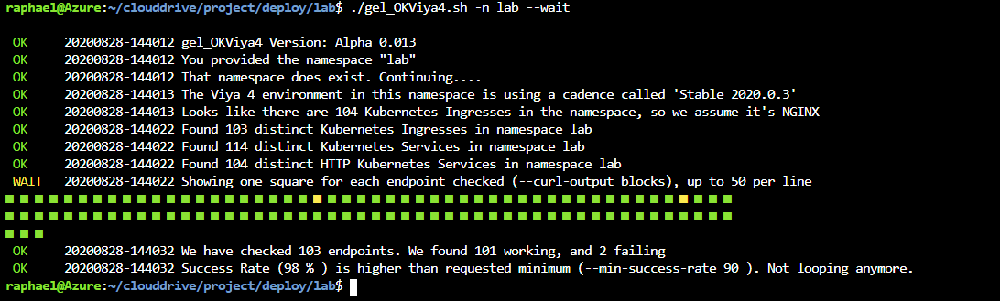
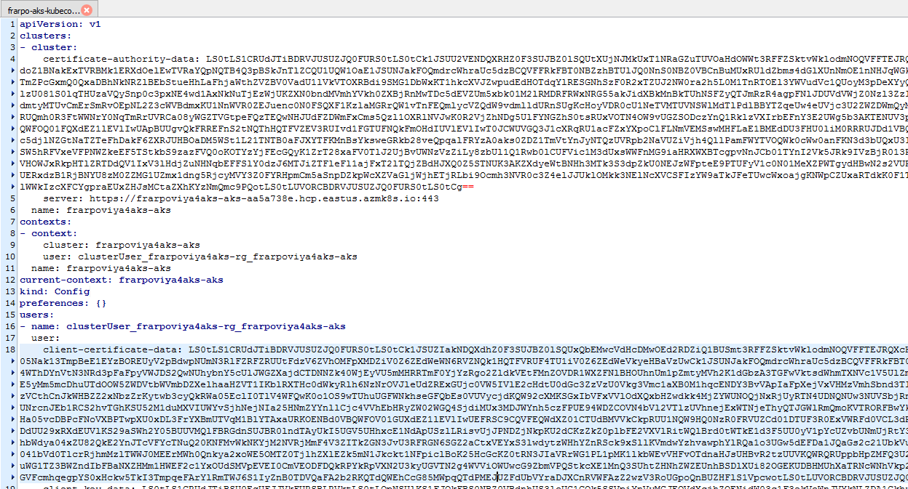
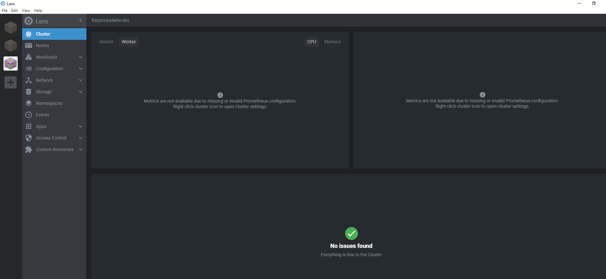
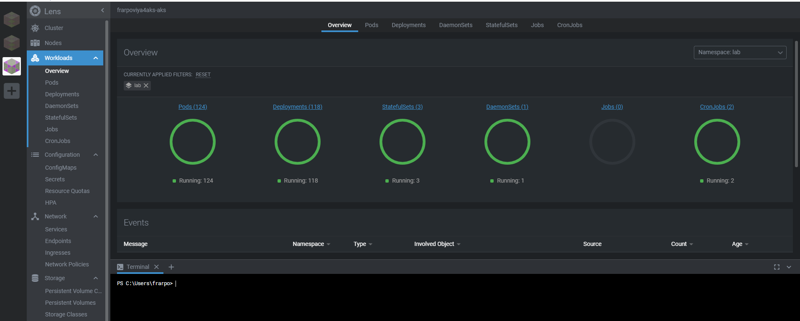
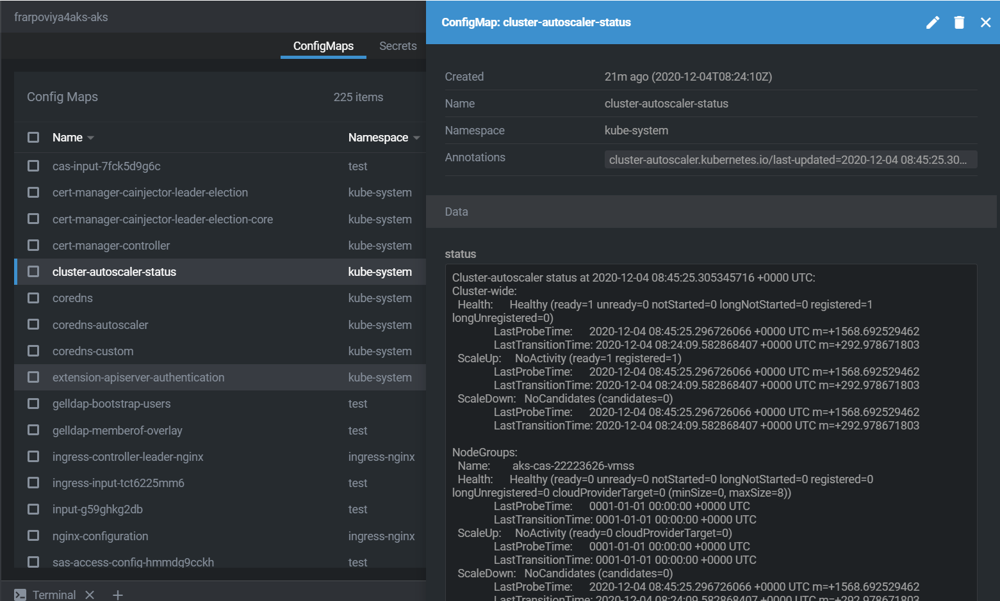
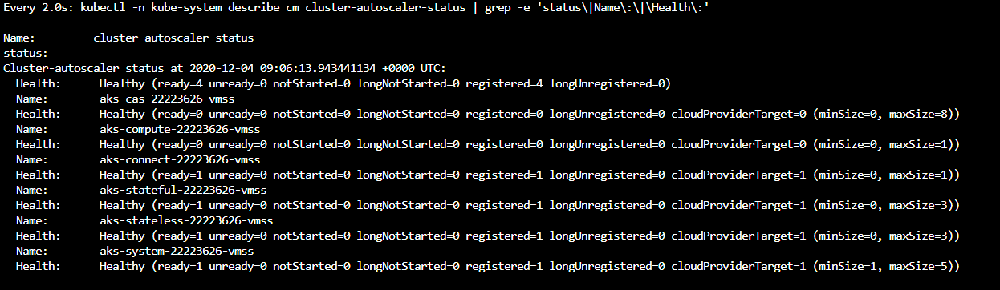

# Deploy Viya 4 in AKS

* [Prepare the Order's Deployment Assets](#prepare-the-orders-deployment-assets)
* [Create a site-config directory](#create-a-site-config-directory)
* [Creating a sitedefault file](#creating-a-sitedefault-file)
* [Creating a TLS-related file in `./site-config/`](#creating-a-tls-related-file-in-site-config)
* [How to configure the external PostgreSQL for a customer ? (optional)](#how-to-configure-the-external-postgresql-for-a-customer--optional)
  * [Create secretGenerator and configMapGenerator](#create-secretgenerator-and-configmapgenerator)
  * [Configure Transformers](#configure-transformers)
* [Deploy Viya in our AKS cluster](#deploy-viya-in-our-aks-cluster)
  * [Create the namespace for Viya](#create-the-namespace-for-viya)
  * [Deploy the GELLDAP app in our AKS Cluster](#deploy-the-gelldap-app-in-our-aks-cluster)
  * [Kustomize the TEST deployment](#kustomize-the-test-deployment)
    * [Create the storage class patch for azure files](#create-the-storage-class-patch-for-azure-files)
    * [Create the kustomization file](#create-the-kustomization-file)
  * [Configure CAS MPP](#configure-cas-mpp)
  * [Build step](#build-step)
  * [Deployment : Apply the Kubernetes manifests](#deployment--apply-the-kubernetes-manifests)
* [Monitor the Viya services startup](#monitor-the-viya-services-startup)
  * [Waiting for the environment to report "ready" state](#waiting-for-the-environment-to-report-ready-state)
  * [Monitor with OKViya](#monitor-with-okviya)
    * [Watching the environment come up](#watching-the-environment-come-up)
  * [Monitor the cluster with lens](#monitor-the-cluster-with-lens)
  * [Monitor the Cluster-autoscaler](#monitor-the-cluster-autoscaler)
* [Validation](#validation)
  * [Connect to your Viya applications](#connect-to-your-viya-applications)
  * [Make sure you are on the Cary Network](#make-sure-you-are-on-the-cary-network)
* [Remove the Viya Deployment](#remove-the-viya-deployment)
  * [Delete the namespace](#delete-the-namespace)
* [Troubleshooting](#troubleshooting)
  * [The deployment is stuck with only 30 to 50% of the pods in a running state](#the-deployment-is-stuck-with-only-30-to-50-of-the-pods-in-a-running-state)
  * [Almost all my pods are fully READY except a few ones...](#almost-all-my-pods-are-fully-ready-except-a-few-ones)
  * [A Consul pod is not running](#a-consul-pod-is-not-running)
* [Navigation](#navigation)

## Prepare the Order's Deployment Assets

1. In order to keep the materials in this course up to date, we will use a script to generate the assets.

1. In a normal scenario, you would :
   1. log in to the <https://my.sas.com/> portal and
   1. download a .tgz file containing your assets
   1. explode the .tgz into the `~/project/deploy/gcptest/` directory
   1. which would create `~/project/deploy/gcptest/sas-bases`

1. Instead, the script will do all of that for us.

1. Please run the following command (copy-paste all lines together)

    ```bash
    CADENCE_NAME='stable'
    CADENCE_VERSION='2020.1.5'

    bash /opt/gellow_code/scripts/common/generate_sas_bases.sh \
          --cadence-name ${CADENCE_NAME} \
          --cadence-version ${CADENCE_VERSION} \
          --order-nickname 'simple' \
          --output-folder ~/project/deploy/test
    ```

## Create a site-config directory

* We need to create a "site-config" to store our specific configuration (it is a separated space from the Software provided manifests).

    ```bash
    mkdir -p ~/project/deploy/test/site-config/
    cd ~/project/deploy/test

    ```

## Creating a sitedefault file

* Since we installed GELLDAP we can pre-configure the LDAP access.
* Let's copy the provided file in the proper location:

    ```bash
    # Copy the gelldap site-default
    cp ~/project/gelldap/no_TLS/gelldap-sitedefault.yaml \
       ~/project/deploy/test/site-config/

    ```

<!-- * Generate a sitedefault.yaml just to define the default password for the sasboot account

    ```sh
    tee  ~/project/deploy/test/site-config/sitedefault.yaml > /dev/null << "EOF"
    ---
    config:
      application:
        sas.logon.initial:
          user: sasboot
          password: lnxsas
    EOF
    ```
-->

## Creating a TLS-related file in `./site-config/`

By default since the 2020.0.6 version, all internal communications are TLS encrypted.

* Prepare the TLS configuration

    ```bash
    cd ~/project/deploy/test
    mkdir -p ./site-config/security/
    # create the certificate issuer called "sas-viya-issuer"
    sed 's|{{.*}}|sas-viya-issuer|g' ./sas-bases/examples/security/cert-manager-provided-ingress-certificate.yaml  \
        > ./site-config/security/cert-manager-provided-ingress-certificate.yaml

    ```

## How to configure the external PostgreSQL for a customer ? (optional)

The recommended way to do that is to go to the ```$deploy/sas-bases/overlays/external—postgres directory``` and follow the instructions in the README file.

You can also see an example of a completed base kustomization.yaml  file for an external PostgreSQL instance, you can look at
```$deploy/sas-bases/examples/configure-postgres/external-kustomization.yaml```.

_Note: In our case, $deploy corresponds to ```~/project/deploy/test```_.

If you want to try to do this configuration by yourself (like in a real customer environment) you can follow the instructions below that come from the README file, to configure your kustomization.yaml file for an external Postgres Database (you must also add the custom storage class patch as explained in the next section).

Otherwhise, if you want to deploy Viya with the pre-canned configuration that we have for you, then just follow the steps in the next [section](#deploy-viya-in-our-aks-cluster).

### Create secretGenerator and configMapGenerator

To populate the SAS deployment with the information that you gathered in the "Prerequisites" section, you must add some generators to the base kustomization.yaml file.

In the base kustomization.yaml file (`$deploy/kustomization.yaml`), add a secretGenerator and a configMapGenerator, both of which are described below.

In the generators, you will see tags that look like `{{ VARIABLE-NAME }}` corresponding to the PostgresSQL Database Service attributes (remembre that the Azure PostgresSQL Database Service was previously create by the Terraform templates).
Replace these tags with the appropriate values gathered in the "Prerequisites" section.

The mapping of tags to values is as follows:

* Database Role Username: `{{ EXTERNAL-ADMIN-USERNAME }}`
* Database Role Password: `{{ EXTERNAL-ADMIN-PASSWORD }}`
* Server Host: `{{ EXTERNAL-HOST }}`
* Server Port: `{{ EXTERNAL-PORT }}`

* Add the following secretGenerator to the base kustomization.yaml file:

    ```yaml
    secretGenerator:
    - name: postgres-sas-user  # THIS IS FOR INTERNAL USE ONLY - DO NOT EDIT
      literals:
      - username={{ EXTERNAL-ADMIN-USERNAME }}
      - password={{ EXTERNAL-ADMIN-PASSWORD }}
    ```

* Then add the following configMapGenerator:

    ```yaml
    configMapGenerator:
    - name: sas-postgres-config  # THIS IS FOR INTERNAL USE ONLY - DO NOT EDIT
      behavior: merge
      literals:
      - DATABASE_HOST={{ EXTERNAL-HOST }}
      - DATABASE_PORT={{ EXTERNAL-PORT }}
      - DATABASE_SSL_ENABLED="true"
      - DATABASE_NAME=SharedServices  # THIS IS FOR INTERNAL USE ONLY - DO NOT EDIT
      - EXTERNAL_DATABASE="true"  # THIS IS FOR INTERNAL USE ONLY - DO NOT EDIT
      - SAS_DATABASE_DATABASESERVERNAME="postgres"
    ```

### Configure Transformers

Kustomize needs to know where to look for the external PostgreSQL transformer.

* Add the overlay file reference to the transformers block of the base kustomization.yaml file:

    ```yaml
    transformers:
    ...
    - sas-bases/overlays/external-postgres/external-postgres-transformer.yaml
    ...
    ```

<!-- Finally here is an example with the Azure provide PostgreSQL database : <https://gitlab.sas.com/xeno/viya4-azure/-/blob/master/kustomization.yaml> -->

## Deploy Viya in our AKS cluster

### Create the namespace for Viya

* Run this command to create the "test" namespace in our AKS cluster

    ```bash
    kubectl create ns test
    ```

### Deploy the GELLDAP app in our AKS Cluster

* In the previous step, we prepared the manifest file for the GELLAP app, but we did not install it.
* Let's do it now by running the command below.

    ```bash
    kubectl apply -f ~/project/gelldap/gelldap-build.yaml -n test
    ```

### Kustomize the TEST deployment

In this step we edit the kustomization.yaml file in order to generate Kubernetes manifests that are :

* Using a custom Storage Class to support RWX access for components that needs it (CAS, backup manager, etc...)
* Using an external Azure postgres in our Lab environment.

* First, let's create the patch that we will refer to for the storage class.

#### Create the storage class patch for azure files

* Run this code to create a patch that we will reference in our kustomization.yaml file

    ```bash
    mkdir -p ~/project/deploy/test/site-config/
    cat > ~/project/deploy/test/site-config/storageclass.yaml <<-EOF
    kind: PersistentStorageClass
    metadata:
      name: wildcard
    spec:
      storageClassName: sas-azurefile #azurefile with sas UID/GID
    EOF
    ```

#### Create the kustomization file

* Then create the kustomization.yaml file with the external postgres DB configuration and the reference to the storage class path.

    ```bash
    STUDENT=$(cat ~/student.txt)
    echo $STUDENT
    INGRESS_SUFFIX=${STUDENT}vk.$(cat ~/azureregion.txt).cloudapp.azure.com

    cat > ~/project/deploy/test/kustomization.yaml <<-EOF
    ---
    namespace: test
    resources:
      - sas-bases/base
      - sas-bases/overlays/cert-manager-issuer     # TLS
      - sas-bases/overlays/network/ingress
      - sas-bases/overlays/network/ingress/security   # TLS
      # - sas-bases/overlays/internal-postgres
      # - sas-bases/overlays/crunchydata
      - sas-bases/overlays/cas-server
      - sas-bases/overlays/update-checker       # added update checker
      - sas-bases/overlays/cas-server/auto-resources    # CAS-related
      - sas-bases/overlays/internal-elasticsearch   # Stable 2020.1.3
    configurations:
      - sas-bases/overlays/required/kustomizeconfig.yaml  # required for 0.6
    transformers:
      - sas-bases/overlays/network/ingress/security/transformers/product-tls-transformers.yaml   # TLS
      - sas-bases/overlays/network/ingress/security/transformers/ingress-tls-transformers.yaml   # TLS
      - sas-bases/overlays/network/ingress/security/transformers/backend-tls-transformers.yaml   # TLS
      - sas-bases/overlays/internal-elasticsearch/internal-elasticsearch-transformer.yaml    # Stable 2020.1.3
      - sas-bases/overlays/internal-elasticsearch/sysctl-transformer.yaml                    # Stable 2020.1.3 (must be after TLS but before required/transformers)
      - sas-bases/overlays/required/transformers.yaml
      # - sas-bases/overlays/internal-postgres/internal-postgres-transformer.yaml
      - sas-bases/overlays/external-postgres/external-postgres-transformer.yaml
      - site-config/security/cert-manager-provided-ingress-certificate.yaml     # TLS
      - sas-bases/overlays/cas-server/auto-resources/remove-resources.yaml    # CAS-related
      # - sas-bases/overlays/scaling/zero-scale/phase-0-transformer.yaml
      # - sas-bases/overlays/scaling/zero-scale/phase-1-transformer.yaml

    # set a custom Storage Class for PersistentVolumeClaims, as it's not currently possible to change the default SC in AKS
    # a new SC is required to support ReadWriteMany access
    # Note: annotationSelector is how we limit which PV use azurefiles/RWX versus default RWO.
    patches:
    - path: site-config/storageclass.yaml
      target:
        kind: PersistentVolumeClaim
        annotationSelector: sas.com/component-name in (sas-cas-operator,sas-backup-job,sas-event-stream-processing-studio-app,sas-reference-data-deploy-utilities,sas-data-quality-services,sas-model-publish,sas-commonfiles) # becomes default for sas-backup-job,sas-data-quality-services,sas-commonfiles with 2020.1.4

    configMapGenerator:
      - name: ingress-input
        behavior: merge
        literals:
          - INGRESS_HOST=${INGRESS_SUFFIX}

      - name: sas-shared-config
        behavior: merge
        literals:
          - SAS_SERVICES_URL=https://${INGRESS_SUFFIX}


      - name: sas-postgres-config
        behavior: merge
        literals:
          - DATABASE_HOST=${STUDENT}viya4aks-pgsql.postgres.database.azure.com
          - DATABASE_PORT=5432
          - DATABASE_SSL_ENABLED="true"
          - DATABASE_NAME=SharedServices
          - EXTERNAL_DATABASE="true"
          - SAS_DATABASE_DATABASESERVERNAME="postgres"

    secretGenerator:
      - name: postgres-sas-user
        literals:
          - username=pgadmin@${STUDENT}viya4aks-pgsql
          - password=LNX_sas_123

      - name: sas-consul-config            ## This injects content into consul. You can add, but not replace
        behavior: merge
        files:
          - SITEDEFAULT_CONF=site-config/gelldap-sitedefault.yaml ## with 2020.1.5, the sitedefault.yaml config becomes a secretGenerator
    EOF
    ```

After you revise the base kustomization.yaml file, continue your SAS Viya deployment as documented.

### Configure CAS MPP

* By default CAS is installed with SMP
* Run the commands below to configure CAS with 3 workers.

    ```bash
    # Copy the PatchTransformer from the examples
    cp -p ~/project/deploy/test/sas-bases/examples/cas/configure/cas-manage-workers.yaml \
          ~/project/deploy/test/site-config/cas-manage-workers.yaml

    # Set the required number of workers
    _numberOfWorkers=3

    # Modify the project site-config/cas-manage-workers.yaml file with the required number of workers
    sed -i "s/{{ NUMBER-OF-WORKERS }}/${_numberOfWorkers}/g" \
         ~/project/deploy/test/site-config/cas-manage-workers.yaml

    # Add a new transformer
    printf "
    - command: update
      path: transformers[+]
      value:
        site-config/cas-manage-workers.yaml
    " | $HOME/bin/yq -I 4 w -i -s - ~/project/deploy/test/kustomization.yaml
    ```

### Build step

* At this point, we are ready to generate or populate the Kubernetes manifest files with Kustomize.

    ```bash
    cd ~/project/deploy/test
    kustomize build -o site.yaml
    ```

### Deployment : Apply the Kubernetes manifests

* We are now ready to apply the manifests in our AKS cluster to deploy and start the Viya 4 containers:

  There are 3 level of admin in the resources defined in the site.yaml :
  * "cluster-wide" (operators/crds, service accounts, roles)
  * "cluster-local" (rolebindings, pvc, config map, secrets, podtemplates)
  * "namespace" (the rest of the resources)

  Each resource has a label for it, the key is "sas.com/admin" and the value is one of the 3 levels
  (You can search for "sas.com/admin: <administration scope level>" keyword in the site.yaml to see the corresponding resources)

  To show that a different K8s permission level is required depending on the type of resources created, we will use 3 distinct commands for the deployment.

    ```bash
    cd ~/project/deploy/test
    # Apply the "cluster wide" configuration in site.yaml (CRDs, Roles, Service Accounts)
    kubectl apply --selector="sas.com/admin=cluster-wide" -f site.yaml
    # Wait for Custom Resource Deployment to be deployed
    kubectl wait --for condition=established --timeout=60s -l "sas.com/admin=cluster-wide" crd
    ```

    The previous commands requires a cluster level access (cluster-admin role) and create "cluster wide" resources (that do not ony applies to a namespace but to the cluster in general : such as operators, roles and service accounts)

    The next command required a cluster-local permission.

    ```bash
    #Apply the "cluster local" configuration in site.yaml and delete all the other "cluster local" resources that are not in the file (essentially config maps)
    kubectl apply --selector="sas.com/admin=cluster-local" -f site.yaml --prune
    ```

    Finally the next command can be run by a namespace admin.

    ```bash
    # Apply the configuration in manifest.yaml that matches label "sas.com/admin=namespace" and delete all the other resources that are not in the file and match label "sas.com/admin=namespace".
    kubectl apply --selector="sas.com/admin=namespace" -f site.yaml --prune
    ```

    Doing this will create all required content in kubernetes and start up the process.

* For the next time we want to start the Viya 4 containers, you can simply reapply the site.yaml file with the command below (since the components created outside of the namespace scope will already be there)

    ```sh
    cd ~/project/deploy/test
    kubectl -n test apply -f site.yaml
    ```

## Monitor the Viya services startup

* There are several ways to monitor your Viya deployment progress.
* Pick one of the method presented below (sas-readiness, GEL_OKViya4 script, Lens)
* If after 50-70 minutes your environment is still not ready ...it's time to start debugging.
* Make sure you are not in one of the situation described in the [Troubleshooting](#troubleshooting) paragraph.
* If not you can use commands like "kubectl describe" or "kubectl logs" to troubleshoot your issues.

_Note: The Kubernetes Lens tool is also very handy to look at logs and Kuberenetes events (you can learn a lot about Kubernetes just by using it)._

### Waiting for the environment to report "ready" state

* The following command will only return when the environment is ready (or after 45 minutes):

    ```sh
    time kubectl -n test wait \
         --for=condition=ready \
         pod \
         --selector='app.kubernetes.io/name=sas-readiness' \
          --timeout=2700s

    ```

* The following command will monitor the log of the readiness pod:

    ```sh
    watch -c -n 20 'kubectl -n test logs \
         --selector=app.kubernetes.io/name=sas-readiness \
          | tail -n 1  '

    ```

### Monitor with OKViya

#### Watching the environment come up

* With the `gel_OKViya4.sh` script:

    ```bash
    cd ~/project/deploy/test
    ./gel_OKViya4.sh -n test --wait -ps -hs "https://"
    ```

* If you prefer to see the tested URL (showing the curl command with the ingress host), you can type :

    ```sh
    cd ~/project/deploy/test
    ./gel_OKViya4.sh -n test --wait -ps -co lines -hs "https://"
    ```

* At the end you should see something like :

  

* You can also use tmux to have a multi-windows monitoring:

* This will kick off a tmux session called "test_watch":

    ```sh
    #watch kubectl get pods -o wide -n test

    SessName=test_watch

    tmux new -s $SessName -d
    tmux send-keys -t $SessName "time ~/project/deploy/test/gel_OKViya4.sh -n test --wait --pod-status"  C-m
    tmux split-window -v -t $SessName
    tmux send-keys -t $SessName "watch 'kubectl get pods -o wide -n test | grep 0/ | grep -v Completed '"  C-m

    ```

* And this will attach you to it:

    ```sh
    tmux attach -t $SessName
    ```

### Monitor the cluster with lens

* What is [Lens](https://github.com/lensapp/lens/) ?

  * Lens is a great IDE to take control of your Kubernetes cluster.
  * It is a standalone application for MacOS, Windows and Linux operating systems.
  * It is open source and free.

* In the Lens github project, click on "Releases", then download and install Lens on your machine.

* Get your Cluster config file

You can use the MobaXterm integrated text editor

* Then browse in the Files view to display the content of .kube/config file

  

* Copy the content of the config file.

* Open Lens, click on "Add cluster" for "Choose config", select "Custom"

  

* and paste the content of the config file.

* Click on "Add Cluster" and then you should see something that looks like that :

  

* You can see the nodes, pods, configuration, logs etc... very easily. You can also start a Terminal from there to run kubectl commands against your Cluster.

* A successful deployment would look like that in Lens:

  

### Monitor the Cluster-autoscaler

During the deployment, then when you stop and restart the Viya services, the Azure Cluster autoscaler will either provision additionnal nodes or decomission them to meet the pods requests.
There is a way to monitor the progress of the Cloud autoscaler (and potentially identify if it is stalled) in Kubernetes.
Kubernetes keep track of the autoscaler status in the cluster-auto-scaler configMap (in the kube-system namespace).

* If you are using Lens you can see it easily:

  

* Otherwhise you can run the command to get the cluster auto-scaler status at a point in time :

    ```sh
    kubectl -n kube-system describe cm cluster-autoscaler-status
    ```

* Monitor the status in real time

    ```sh
    watch "kubectl -n kube-system describe cm cluster-autoscaler-status | grep -e 'status\|Name\:\|\Health\:'"
    ```

* You should see something like this :

    

* Finally you can also monitor the Kubernetes events and filter on a specific pattern, for example :

    ```sh
    kubectl get events --sort-by=.metadata.creationTimestamp -n test | grep ScaleUp
    ```

## Validation

### Connect to your Viya applications

* Run the command below to get the url printed in the shell terminal, then you can just click on it (with the CTRL key).

    ```bash
    echo "https://${STUDENT}vk.$(cat ~/azureregion.txt).cloudapp.azure.com/"
    ```

If the SAS Logon page appears, then connect as ```sastest1``` or ```sasadm``` (password is "lnxsas"). Otherwhise look at the next section.

### Make sure you are on the Cary Network

* If you see something like that when you try to open the url :

  

  It is likely that your workstation has an IP that is not in the authorized IP range to access the environment.

  By default in the ingress definition, we allowed the Cary Headquarter IP range. So the best way to get an IP in this range from your own workstation is to be on the Cary Direct VPN (profile 3 usually).

## Remove the Viya Deployment

### Delete the namespace

* To get rid of the environment delete the whole namespace.

    ```sh
    kubectl delete ns test
    ```

Note that everything will be deleted, including the persistent volumes holding user's content and data.

## Troubleshooting

### The deployment is stuck with only 30 to 50% of the pods in a running state

* Symptoms :
  * sas-data-mining-services is not running
  * One 3rd of the Pods are running the others are crashlooping

* Hints:
  * The microservice logs show a problem to contact the sas-authorization service
  * The sas-authorization pod log shows errors in the SSL connection to PostgreSQL

* Root cause :
  * sas-authorization fails in the initial SSL "hand shake" with PostgreSQL (possibly because of the [Java version](https://stackoverflow.com/questions/21245796/javax-net-ssl-sslhandshakeexception-remote-host-closed-connection-during-handsh), as a consequence many pods can not start because they can not talk to sas-authorization microservice.

* Solution : restart the sas-authorization pod.

    ```sh
    kubectl -n test get po -l "app=sas-authorization" | awk '{ print $1 }' | xargs -I % kubectl delete pod % -n test
    ```

### Almost all my pods are fully READY except a few ones...

* Symptoms :
  * a few pods not ready (READY column shows 0/1)
  * containers with the "waiting status"
  * containers fails to contact postgres (EOFException: SSL peer shut down incorrectly)

* Hints:
  * The microsservice logs show a problem to contact the sas-authorization service

* Root cause :
  * potentially cluster autoscaling RACE condition and SSL negociation failure with postgreSQL because of different protocol versions.

* Solution : restart the pods that are not READY.

    ```sh
    kubectl -n test get po | grep "0/" | awk '{ print $1 }' | xargs -I % kubectl delete pod % -n test
    ```

### A Consul pod is not running

* Symptoms :
  * Consul has 2 running pods not READY ("0/1") and 1 pod is "pending"

* Root cause :
  * The stateful additional node was not properly started by the azure autoscaler (network issues).

* Solution : increase max count for the stateful node pools in azure portal, the missing consul instance should restart automatically.

<!-- If you restart then the env does not come up bc of RabbitMQ "mnesia" database issues.

* You can scale rabbit to 0, delete the rabbit PVCs, then scale back to 3. I hope to have this patch promoted later today or tomorrow.

    ```sh
    kubectl delete pvc sas-viya-rabbitmq-data-volume-sas-rabbitmq-server-0
    kubectl delete pvc sas-viya-rabbitmq-data-volume-sas-rabbitmq-server-1
    kubectl delete pvc sas-viya-rabbitmq-data-volume-sas-rabbitmq-server-2
    ```

from <https://rndjira.sas.com/browse/NGMTS-15211>
 -->

## Navigation

<!-- startnav -->
* [01 Introduction / 01 031 Booking a Lab Environment for the Workshop](/01_Introduction/01_031_Booking_a_Lab_Environment_for_the_Workshop.md)
* [01 Introduction / 01 032 Assess Readiness of Lab Environment](/01_Introduction/01_032_Assess_Readiness_of_Lab_Environment.md)
* [01 Introduction / 01 033 CheatCodes](/01_Introduction/01_033_CheatCodes.md)
* [02 Kubernetes and Containers Fundamentals / 02 131 Learning about Namespaces](/02_Kubernetes_and_Containers_Fundamentals/02_131_Learning_about_Namespaces.md)
* [03 Viya 4 Software Specifics / 03 011 Looking at a Viya 4 environment with Visual Tools DEMO](/03_Viya_4_Software_Specifics/03_011_Looking_at_a_Viya_4_environment_with_Visual_Tools_DEMO.md)
* [03 Viya 4 Software Specifics / 03 051 Create your own Viya order](/03_Viya_4_Software_Specifics/03_051_Create_your_own_Viya_order.md)
* [03 Viya 4 Software Specifics / 03 056 Getting the order with the CLI](/03_Viya_4_Software_Specifics/03_056_Getting_the_order_with_the_CLI.md)
* [04 Pre Requisites / 04 081 Pre Requisites automation with Viya4-ARK](/04_Pre-Requisites/04_081_Pre-Requisites_automation_with_Viya4-ARK.md)
* [05 Deployment tools / 05 121 Setup a Windows Client Machine](/05_Deployment_tools/05_121_Setup_a_Windows_Client_Machine.md)
* [06 Deployment Steps / 06 031 Deploying a simple environment](/06_Deployment_Steps/06_031_Deploying_a_simple_environment.md)
* [06 Deployment Steps / 06 051 Deploying Viya with Authentication](/06_Deployment_Steps/06_051_Deploying_Viya_with_Authentication.md)
* [06 Deployment Steps / 06 061 Deploying in a second namespace](/06_Deployment_Steps/06_061_Deploying_in_a_second_namespace.md)
* [06 Deployment Steps / 06 071 Removing Viya deployments](/06_Deployment_Steps/06_071_Removing_Viya_deployments.md)
* [06 Deployment Steps / 06 081 Deploying a programing only environment](/06_Deployment_Steps/06_081_Deploying_a_programing-only_environment.md)
* [06 Deployment Steps / 06 091 Deployment Operator setup](/06_Deployment_Steps/06_091_Deployment_Operator_setup.md)
* [06 Deployment Steps / 06 093 Using the DO with a Git Repository](/06_Deployment_Steps/06_093_Using_the_DO_with_a_Git_Repository.md)
* [06 Deployment Steps / 06 095 Using an inline configuration](/06_Deployment_Steps/06_095_Using_an_inline_configuration.md)
* [06 Deployment Steps / 06 097 Using the Orchestration Tool](/06_Deployment_Steps/06_097_Using_the_Orchestration_Tool.md)
* [06 Deployment Steps / 06 101 Create Viya Deployment Roles](/06_Deployment_Steps/06_101_Create_Viya_Deployment_Roles.md)
* [07 Deployment Customizations / 07 021 Configuring SASWORK](/07_Deployment_Customizations/07_021_Configuring_SASWORK.md)
* [07 Deployment Customizations / 07 051 Adding a local registry to k8s](/07_Deployment_Customizations/07_051_Adding_a_local_registry_to_k8s.md)
* [07 Deployment Customizations / 07 052 Using mirror manager to populate the local registry](/07_Deployment_Customizations/07_052_Using_mirror_manager_to_populate_the_local_registry.md)
* [07 Deployment Customizations / 07 053 Deploy from local registry](/07_Deployment_Customizations/07_053_Deploy_from_local_registry.md)
* [07 Deployment Customizations / 07 091 Configure SAS ACCESS Engine](/07_Deployment_Customizations/07_091_Configure_SAS_ACCESS_Engine.md)
* [07 Deployment Customizations / 07 101 Configure SAS ACCESS TO HADOOP](/07_Deployment_Customizations/07_101_Configure_SAS_ACCESS_TO_HADOOP.md)
* [07 Deployment Customizations / 07 102 Parallel loading with EP for Hadoop](/07_Deployment_Customizations/07_102_Parallel_loading_with_EP_for_Hadoop.md)
* [09 Validation / 09 011 Validate the Viya deployment](/09_Validation/09_011_Validate_the_Viya_deployment.md)
* [09 Validation / 09 021 SAS Viya deployment reports](/09_Validation/09_021_SAS_Viya_deployment_reports.md)
* [11 Azure AKS Deployment / 11 000 Navigating the AKS Hands on Deployment Options](/11_Azure_AKS_Deployment/11_000_Navigating_the_AKS_Hands-on_Deployment_Options.md)
* [11 Azure AKS Deployment / 11 999 Fast track with cheatcodes](/11_Azure_AKS_Deployment/11_999_Fast_track_with_cheatcodes.md)
* [11 Azure AKS Deployment/Fully Automated / 11 500 Full Automation of AKS Deployment](/11_Azure_AKS_Deployment/Fully_Automated/11_500_Full_Automation_of_AKS_Deployment.md)
* [11 Azure AKS Deployment/Fully Automated / 11 590 Cleanup](/11_Azure_AKS_Deployment/Fully_Automated/11_590_Cleanup.md)
* [11 Azure AKS Deployment/Standard / 11 100 Creating an AKS Cluster](/11_Azure_AKS_Deployment/Standard/11_100_Creating_an_AKS_Cluster.md)
* [11 Azure AKS Deployment/Standard / 11 110 Performing the prerequisites](/11_Azure_AKS_Deployment/Standard/11_110_Performing_the_prerequisites.md)
* [11 Azure AKS Deployment/Standard/Cleanup / 11 400 Cleanup](/11_Azure_AKS_Deployment/Standard/Cleanup/11_400_Cleanup.md)
* [11 Azure AKS Deployment/Standard/Manual / 11 200 Deploying Viya 4 on AKS](/11_Azure_AKS_Deployment/Standard/Manual/11_200_Deploying_Viya_4_on_AKS.md)**<-- you are here**
* [11 Azure AKS Deployment/Standard/Manual / 11 210 Deploy a second namespace in AKS](/11_Azure_AKS_Deployment/Standard/Manual/11_210_Deploy_a_second_namespace_in_AKS.md)
* [11 Azure AKS Deployment/Standard/Manual / 11 220 CAS Customizations](/11_Azure_AKS_Deployment/Standard/Manual/11_220_CAS_Customizations.md)
* [11 Azure AKS Deployment/Standard/Manual / 11 230 Install monitoring and logging](/11_Azure_AKS_Deployment/Standard/Manual/11_230_Install_monitoring_and_logging.md)
* [12 Amazon EKS Deployment / 12 010 Access Environments](/12_Amazon_EKS_Deployment/12_010_Access_Environments.md)
* [12 Amazon EKS Deployment / 12 020 Provision Resources](/12_Amazon_EKS_Deployment/12_020_Provision_Resources.md)
* [12 Amazon EKS Deployment / 12 030 Deploy SAS Viya](/12_Amazon_EKS_Deployment/12_030_Deploy_SAS_Viya.md)
* [13 Google GKE Deployment / 13 011 Creating a GKE Cluster](/13_Google_GKE_Deployment/13_011_Creating_a_GKE_Cluster.md)
* [13 Google GKE Deployment / 13 021 Performing Prereqs in GKE](/13_Google_GKE_Deployment/13_021_Performing_Prereqs_in_GKE.md)
* [13 Google GKE Deployment / 13 031 Deploying Viya 4 on GKE](/13_Google_GKE_Deployment/13_031_Deploying_Viya_4_on_GKE.md)
* [13 Google GKE Deployment / 13 041 Full Automation of GKE Deployment](/13_Google_GKE_Deployment/13_041_Full_Automation_of_GKE_Deployment.md)
* [13 Google GKE Deployment / 13 099 Fast track with cheatcodes](/13_Google_GKE_Deployment/13_099_Fast_track_with_cheatcodes.md)
<!-- endnav -->
