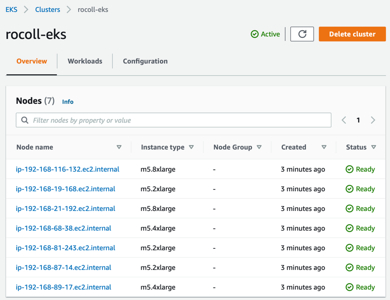

# Provision the resources in AWS

- [Acquiring tools](#acquiring-tools)
- [Configure Terraform](#configure-terraform)
  - [*Troubleshooting*](#troubleshooting)
- [Deploy the AWS infrastructure](#deploy-the-aws-infrastructure)
- [Validate the environment](#validate-the-environment)
- [Setup kubectl](#setup-kubectl)
- [Appendix](#appendix)
- [Navigation](#navigation)

To stand up the infrastructure we need to deploy SAS Viya, we will rely on the [viya4-iac-aws project](https://github.com/sassoftware/viya4-iac-aws) available from SAS in Github. 
## Acquiring tools 

1. Clone the viya4-iac-aws project and build the Docker container [viya4-iac-aws](https://github.com/sassoftware/viya4-iac-aws/blob/main/docs/user/DockerUsage.md) we'll use:

   ```bash
   # as cloud-user on your Linux host in RACE
   cd ~

   # clone the viya4-iac-aws repo
   git clone https://github.com/sassoftware/viya4-iac-aws

   cd ~/viya4-iac-aws

   # Build the viya4-iac-aws container
   docker build -t viya4-iac-aws .
   ```

2. Try running the viya4-iac-aws container

   ```bash
   # as cloud-user on your Linux host in RACE

   docker container run --rm -it viya4-iac-aws -version
   ```

   Results similar to:

   ```log
   Terraform v1.0.0
   on linux_amd64
   + provider registry.terraform.io/hashicorp/aws v3.43.0
   + provider registry.terraform.io/hashicorp/cloudinit v2.2.0
   + provider registry.terraform.io/hashicorp/external v2.1.0
   + provider registry.terraform.io/hashicorp/kubernetes v2.2.0
   + provider registry.terraform.io/hashicorp/local v2.1.0
   + provider registry.terraform.io/hashicorp/null v3.1.0
   + provider registry.terraform.io/hashicorp/random v3.1.0
   + provider registry.terraform.io/hashicorp/template v2.2.0
   + provider registry.terraform.io/terraform-aws-modules/http v2.4.1
   ```

   Note: Terraform is the default entry point of the container. And because we requested the version, it shows its own version as well as the other components it relies on. 

3. Make note of the Terraform version for later. Terraform v1.0.0 introduces a new syntax for some items and we need to know which to use.

   ```bash
   # as cloud-user on your Linux host in RACE

   # keep only the first digit of Terraforms version number
   TF_VERSION=`docker container run --rm --entrypoint terraform  viya4-iac-aws -version | grep "Terraform v" | awk -F "v" '{print $2}' | awk -F "." '{print $1}'`

   # if old version of Terraform, then use old syntax, else use the new syntax
   (($TF_VERSION == 0)) && { echo "Use the original Terraform 0.13.x syntax"; } || { echo "Use the new Terraform 1.0.0 syntax"; }
   ```

4. Confirm that the AWS-CLI in the viya4-iac-aws container has access to your AWS tokens:

   ```bash
   # as cloud-user on your Linux host in RACE

   # aws configure list
   docker container run --rm --group-add root \
     --user $(id -u):$(id -g) \
     -v $HOME/.aws:/.aws \
     --entrypoint aws \
     viya4-iac-aws configure list

   # aws sts get-caller-identity
   docker container run --rm --group-add root \
     --user $(id -u):$(id -g) \
     -v $HOME/.aws:/.aws \
     --entrypoint aws \
     viya4-iac-aws sts get-caller-identity \
       --output json
   ```

   Results similar to:

   ```log
         Name                    Value             Type    Location
         ----                    -----             ----    --------
      profile                <not set>             None    None
   access_key     ****************IQP6 shared-credentials-file
   secret_key     ****************3J+B shared-credentials-file
       region                us-east-1      config-file    ~/.aws/config
   ```

   and

   ```log
   {
    "UserId": "AROAII3YLHREVLVPPDQDU:Rob.Collum@sas.com",
    "Account": "182696677754",
    "Arn": "arn:aws:sts::182696677754:assumed-role/testers/Rob.Collum@sas.com"
   }
   ```

4. Remember your AWS name 

   ```bash
   # as cloud-user on your Linux host in RACE

   # Parse out the userid from your email address known by AWS
   docker container run --rm --group-add root \
   --user $(id -u):$(id -g) \
   -v $HOME/.aws:/.aws  \
   --entrypoint aws \
   viya4-iac-aws sts get-caller-identity \
      --query UserId \
      --output text | awk -F: '{print $2}' | awk -F@ '{print $1}' | sed 's/[\+\-\_\~\.]//g' > ~/MY_AWSNAME.txt
   # We can reference the ~/MY_AWSNAME.txt file later   

   MY_AWSNAME=`cat ~/MY_AWSNAME.txt`
   echo -e "\n\nYour AWS Name is: ${MY_AWSNAME,,}\n\n"   # shown all lowercase
   ```

## Configure Terraform

1. Setup an SSH key

   ```bash
   # as cloud-user on your Linux host in RACE

   # ensure there is a .ssh dir in $HOME
   ansible localhost -m file \
      -a "path=$HOME/.ssh mode=0700 state=directory"

   # ensure there is an ssh key that we can use
   ansible localhost -m openssh_keypair \
      -a "path=~/.ssh/id_rsa type=rsa size=2048" --diff

   # the resulting ~/.ssh/id_rsa file is searched by default when ssh'ing, unless a different file is specified using the -i switch.
   ```

2. Setup the tfvars file

   ```bash
   # as cloud-user on your Linux host in RACE

   # Get your name in AWS
   MY_AWSNAME=`cat ~/MY_AWSNAME.txt`
   MY_AWSNAME=${MY_AWSNAME,,}        # convert to all lower-case

   # Populate the TF variables file
   cd ~/viya4-iac-aws

   tee  ~/viya4-iac-aws/sasviya4aws.tfvars > /dev/null << EOF
   # !NOTE! - These are only a subset of variables.tf provided for sample.
   # Customize this file to add any variables from 'variables.tf' that you want 
   # to change their default values. 

   # ****************  REQUIRED VARIABLES  ****************
   # These required variables' values MUST be provided by the User
   prefix                                  = "$MY_AWSNAME"
   location                                = "us-east-1" # e.g., "us-east-1"
   ssh_public_key                          = "~/.ssh/id_rsa.pub"
   create_static_kubeconfig                = true
   # ****************  REQUIRED VARIABLES  ****************

   # !NOTE! - Without specifying your CIDR block access rules, ingress traffic
   #          to your cluster will be blocked by default.

   # **************  RECOMENDED  VARIABLES  ***************
   # Include CIDR ranges for the sas.com domains
   default_public_access_cidrs             = ["149.173.0.0/16","71.135.0.0/16"]  # e.g., ["123.45.6.89/32"]
   # **************  RECOMENDED  VARIABLES  ***************

   # Tags for all tagable items in your cluster.
   # tags = { "resourceowner" = "$MY_AWSNAME" , project_name = "sasviya4aws", environment = "dev", gel_project = "deployviya4aws" } # e.g., { "key1" = "value1", "key2" = "value2" }
   tags = { "resourceowner" = "$MY_AWSNAME" , project_name = "sasviya4aws" } 

   ## Cluster config
   kubernetes_version                      = "1.19"
   default_nodepool_node_count             = 2
   default_nodepool_vm_type                = "m5.2xlarge"
   default_nodepool_custom_data            = ""

   ## General 
   efs_performance_mode                    = "generalPurpose"
   storage_type                            = "standard"

   ## Cluster Node Pools config
   node_pools = {
     cas = {
       "vm_type" = "m5.2xlarge"
       "os_disk_type" = "gp2"
       "os_disk_size" = 200
       "os_disk_iops" = 0
       "min_nodes" = 1
       "max_nodes" = 5
       "node_taints" = ["workload.sas.com/class=cas:NoSchedule"]
       "node_labels" = {
         "workload.sas.com/class" = "cas"
       }
       "custom_data" = ""
       "metadata_http_endpoint"               = "enabled"
       "metadata_http_tokens"                 = "required"
       "metadata_http_put_response_hop_limit" = 1
     },
     compute = {
       "vm_type" = "m5.8xlarge"
       "os_disk_type" = "gp2"
       "os_disk_size" = 200
       "os_disk_iops" = 0
       "min_nodes" = 1
       "max_nodes" = 5
       "node_taints" = ["workload.sas.com/class=compute:NoSchedule"]
       "node_labels" = {
         "workload.sas.com/class"        = "compute"
         "launcher.sas.com/prepullImage" = "sas-programming-environment"
       }
       "custom_data" = ""
       "metadata_http_endpoint"               = "enabled"
       "metadata_http_tokens"                 = "required"
       "metadata_http_put_response_hop_limit" = 1
     },
     connect = {
       "vm_type" = "m5.8xlarge"
       "os_disk_type" = "gp2"
       "os_disk_size" = 200
       "os_disk_iops" = 0
       "min_nodes" = 1
       "max_nodes" = 5
       "node_taints" = ["workload.sas.com/class=connect:NoSchedule"]
       "node_labels" = {
         "workload.sas.com/class"        = "connect"
         "launcher.sas.com/prepullImage" = "sas-programming-environment"
       }
       "custom_data" = ""
       "metadata_http_endpoint"               = "enabled"
       "metadata_http_tokens"                 = "required"
       "metadata_http_put_response_hop_limit" = 1
     },
     stateless = {
       "vm_type" = "m5.4xlarge"
       "os_disk_type" = "gp2"
       "os_disk_size" = 200
       "os_disk_iops" = 0
       "min_nodes" = 1
       "max_nodes" = 5
       "node_taints" = ["workload.sas.com/class=stateless:NoSchedule"]
       "node_labels" = {
         "workload.sas.com/class" = "stateless"
       }
       "custom_data" = ""
       "metadata_http_endpoint"               = "enabled"
       "metadata_http_tokens"                 = "required"
       "metadata_http_put_response_hop_limit" = 1
     },
     stateful = {
       "vm_type" = "m5.4xlarge"
       "os_disk_type" = "gp2"
       "os_disk_size" = 200
       "os_disk_iops" = 0
       "min_nodes" = 1
       "max_nodes" = 3
       "node_taints" = ["workload.sas.com/class=stateful:NoSchedule"]
       "node_labels" = {
         "workload.sas.com/class" = "stateful"
       }
       "custom_data" = ""
       "metadata_http_endpoint"               = "enabled"
       "metadata_http_tokens"                 = "required"
       "metadata_http_put_response_hop_limit" = 1
     }
   }

   # Jump Server
   create_jump_vm                        = true

   # Cloud Postgres values config
   create_postgres                       = false # set this to "false" when using internal Crunchy Postgres and AWS Postgres is NOT needed
   postgres_administrator_password       = "mySup3rS3cretPassw0rd"
   EOF
   ```

   Note in the `REQUIRED VARIABLES` section that we've included `create_static_kubeconfig = true`. This will embed a static key for kubectl (and other k8s clients, like Lens) in its config file. That is, it won't be tied to the short-lived AWS tokens generated by the `getawskey` utility.

   <hr>

   ### *Troubleshooting*

   Sometimes unexpected things happen. When building this workshop, we chose to use live projects which are continuously updated over time. Sometimes those projects introduct breaking changes we could not foresee and which you must deal with... not unlike the real world.

   If you have persistent problems in the next steps when attempting to generate or apply the Terraform plan, then you might need an *older* version of **viya4-iac-aws**. See our [Troubleshooting Tips page](/12_Amazon_EKS_Deployment/12_999_Troubleshooting_Tips.md) for [selecting a specific version of a git project](/12_Amazon_EKS_Deployment/12_999_Troubleshooting_Tips.md#selecting-a-specific-version-of-a-git-project). 

   <hr>
   
3. Generate a Terraform plan

   Let's generate the TF plan for building AWS resources:

   ```bash
   # as cloud-user on your Linux host in RACE
   cd ~/viya4-iac-aws

   # generate the TF plan corresponding to the AWS cluster with multiple node pools
   TFPLAN=/workspace/sasviya4aws.plan    # path inside the container
   TFVARS=/workspace/sasviya4aws.tfvars  # path inside the container

   # terraform plan
   docker container run --rm --group-add root \
    --user $(id -u):$(id -g) \
    -v $HOME/.aws:/.aws \
    -v $HOME/.ssh:/.ssh \
    -v $(pwd):/workspace \
    --entrypoint terraform \
    viya4-iac-aws plan \
       -input=false \
       -var-file=${TFVARS} \
       -out ${TFPLAN}
   # runs in seconds


   #tterraform plan -input=false \
   #    -var-file=/workspace/sasviya4aws.tfvars \
   #    -out /workspace/sasviya4aws.plan
   ```

   Results:

   ```log
   Refreshing Terraform state in-memory prior to plan...
   The refreshed state will be used to calculate this plan, but will not be
   persisted to local or remote state storage.

   data.external.git_hash: Refreshing state...
   data.external.iac_tooling_version: Refreshing state...

   // lines ommitted //

   ------------------------------------------------------------------------

   An execution plan has been generated and is shown below.
   Resource actions are indicated with the following symbols:
     + create
    <= read (data resources)

   Terraform will perform the following actions:

   // lines ommitted //

     # module.db.module.db_subnet_group.aws_db_subnet_group.this[0] will be created
     + resource "aws_db_subnet_group" "this" {
         + arn         = (known after apply)
         + description = "Database subnet group for rocolldb"
         + id          = (known after apply)
         + name        = (known after apply)
         + name_prefix = "rocolldb-"
         + subnet_ids  = (known after apply)
         + tags        = {
             + "Name"          = "rocolldb"
             + "environment"   = "dev"
             + "gel_project"   = "deployviya4aws"
             + "project_name"  = "sasviya4aws"
             + "resourceowner" = "rocoll"
           }
       }

   Plan: 93 to add, 0 to change, 0 to destroy.

   ------------------------------------------------------------------------

   This plan was saved to: /workspace/sasviya4aws.plan

   To perform exactly these actions, run the following command to apply:
       terraform apply "./sasviya4aws.plan"
   ```

   Note the instruction to run `terraform` directly will not work in our environment as we're running the `viya4-iac-aws` container with `terraform` inside it.

4. Review the generated plan:

   ```bash
   # as cloud-user on your Linux host in RACE
   cd ~/viya4-iac-aws

   TFPLAN=/workspace/sasviya4aws.plan    # path inside the container

   # terraform show 
   docker container run --rm --group-add root \
    --user $(id -u):$(id -g) \
    -v $HOME/.aws:/.aws \
    -v $HOME/.ssh:/.ssh \
    -v $(pwd):/workspace \
    --entrypoint terraform \
    viya4-iac-aws show ${TFPLAN}
   ```

   The plan shows all the infrastructure components that will be created in AWS to support the Viya deployment : Virtual network, Subnets, Public IPs, Network Security Groups, an EKS Kubernetes Cluster with several node pools and associated instance types.

## Deploy the AWS infrastructure 

5. Apply the Terraform plan

   Now let's deploy the AWS infrastructure for our EKS cluster with the TF plan.

   ```bash
   # as cloud-user on your Linux host in RACE
   cd ~/viya4-iac-aws

   # Deploy the AWS cluster with the TF plan
   TFPLAN=/workspace/sasviya4aws.plan      # path inside the container
   TFVARS=/workspace/sasviya4aws.tfvars    # path inside the container
   TFSTATE=/workspace/sasviya4aws.tfstate  # path inside the container

   # terraform apply
   time docker container run --rm --group-add root \
    --user $(id -u):$(id -g) \
    -v $HOME/.aws:/.aws \
    -v $HOME/.ssh:/.ssh \
    -v $(pwd):/workspace \
    --entrypoint terraform \
    viya4-iac-aws apply \
       -state ${TFSTATE} \
       "${TFPLAN}" \
       2>&1 | tee -a ./terraform-apply.log
   # runs in 10-15min

   # consider storing state remotely in S3:
   #   terraform remote config -backend=S3 \ 
   #   -backend-config="bucket=<bucket>" \
   #   -backend-config="key=<path to file>"
   ```

   Results:

   ```   
   module.eks.aws_iam_policy.cluster_elb_sl_role_creation[0]: Creating...
   module.iam_policy.aws_iam_policy.policy: Creating...
   aws_resourcegroups_group.aws_rg: Creating...
   module.eks.aws_iam_role.cluster[0]: Creating...
   module.vpc.aws_vpc.this[0]: Creating...
   module.nfs.aws_key_pair.admin: Creating...
   module.nfs.aws_ebs_volume.raid_disk[1]: Creating...
   module.nfs.aws_ebs_volume.raid_disk[3]: Creating...
   module.nfs.aws_ebs_volume.raid_disk[2]: Creating...
   ...

   <lines ommitted>
   
   ...
   location = us-east-1
   nat_ip = 52.200.184.120
   nfs_admin_username = nfsuser
   nfs_private_ip = 192.168.50.147
   nsf_private_dns = ip-192-168-50-147.ec2.internal
   postgres_admin =
   postgres_fqdn =
   postgres_password = <sensitive>
   postgres_server_name =
   postgres_server_port =
   prefix = rocoll
   provider = aws
   rwx_filestore_endpoint = ip-192-168-50-147.ec2.internal
   rwx_filestore_path = /export
   worker_iam_role_arn = arn:aws:iam::182696677754:role/rocoll-eks20210511150232963200000009

   real    12m31.840s
   user    0m0.113s
   sys     0m0.089s
   ```

   Notice the rwx_filestore and NFS server info shown at the end.

## Validate the environment

6. See your resources in AWS

   AWS relies on **tags** to help [manage resources](https://docs.aws.amazon.com/ARG/latest/userguide/welcome.html). Still, it doesn't bundle everything together for you in a tidy grouping like [Azure's resource groups](https://docs.microsoft.com/en-us/azure/azure-resource-manager/management/manage-resource-groups-portal). But it's a start. Just remember that if something isn't tagged (or tagged _differently_) then you might not find it easily.

   * Logon to AWS Console and visit Services > [Resource Groups & Tag Editor](https://console.aws.amazon.com/resource-groups/home?region=us-east-1)
   * Under **Saved Resource Groups**, you should see your newly created resource group named `<userid>-rg` with approximately 35 items.

      How does this compare to when you viewed the TFPLAN and the number of items that Terraform created?

   * From the left-side nav menu, also try the **Tag Editor**. Select the region, "All Resource Types", and then for _Tag Key_ try selecting "resourceowner" and "Name" individually. Then click in the _Optional Tag Value_ field for the list of possible values. Notice that your `<userid>` appears in many items. But also that some items, like `<userid>_ebs_csi_policy` are _not_ shown.

      Is there a way to wildcard the tag values?

      One common complaint about AWS is that it can be difficult to find every item you've created. Terraform helps, because it keeps track of the state of the environment and knows what's out there. However if, like me, you misconfigure Terraform, then you're on the hook with manually deleting items from AWS... and that can be tricky to get complete. Please share any suggestions you have.

   * Check out [your EKS cluster](https://console.aws.amazon.com/eks/home?region=us-east-1#/clusters) `<userid>-eks`. Note the Kubernetes version and the machine nodes.

        

## Setup kubectl

1. Configure kubectl for your EKS cluster

   * Use terraform to create a k8s config file
     ```bash
     # as cloud-user on your Linux host in RACE
     cd ~/viya4-iac-aws

     # Generate a kubectl configuration file
     TFPLAN=/workspace/sasviya4aws.plan      # path inside the container
     TFVARS=/workspace/sasviya4aws.tfvars    # path inside the container
     TFSTATE=/workspace/sasviya4aws.tfstate  # path inside the container
     
     # determine whether to use old 0.13.x or new 1.0.0 syntax); 
     (( $TF_VERSION == 0 )) && { TF_CMD="docker container run --rm --group-add root --user $(id -u):$(id -g) -v $HOME/.aws:/.aws -v $HOME/.ssh:/.ssh -v $(pwd):/workspace --entrypoint terraform viya4-iac-aws output -state ${TFSTATE} kube_config"; } || { TF_CMD="docker container run --rm --group-add root --user $(id -u):$(id -g) -v $HOME/.aws:/.aws -v $HOME/.ssh:/.ssh -v $(pwd):/workspace --entrypoint terraform viya4-iac-aws output -state ${TFSTATE} -raw kube_config"; }

     # terraform output kube_config
     echo -e "\nExecute this command to get your kube config file:\n\n$TF_CMD > ./sasviya4aws.kube.conf\n"
     ```
  
   * Execute the command shown so terraform will create a k8s config file
   <!-- Figure out how to get that tf command to execute from the variable - everything I tried didn't work -->

   * Backup any existing kube config, just in case

     ```bash
     # as cloud-user on your Linux host in RACE

     # If there's already a .kube directory, rename it
     [[ -d ~/.kube ]] && mv ~/.kube ~/.kube-backup
     ```

   * Place the kube config file for our Viya cluster in the default location

     ```bash
     # as cloud-user on your Linux host in RACE
     cd ~/viya4-iac-aws

     mkdir -p ~/.kube

     # Duplicate the file with a simpler name - don't use symlink (its real path won't resolve inside the container)
     cp -p ./sasviya4aws.kube.conf   ~/.kube/config
     ```

   * Try it out

     ```bash
     # as cloud-user on your Linux host in RACE

     # Use kubectl inside the viya4-iac-aws container
     docker container run --rm --group-add root \
      --user $(id -u):$(id -g) \
      -v $HOME/.aws:/.aws \
      -v $HOME/.ssh:/.ssh \
      -v $HOME/.kube:/.kube \
      --entrypoint kubectl \
      viya4-iac-aws get nodes

     # But since we also have kubectl installed locally and we're providing the default named configuration file...
     kubectl get nodes           
     ```

     Results:

     ```log
     NAME                              STATUS   ROLES    AGE   VERSION
     ip-192-168-116-132.ec2.internal   Ready    <none>   55m   v1.19.6-eks-49a6c0
     ip-192-168-19-168.ec2.internal    Ready    <none>   55m   v1.19.6-eks-49a6c0
     ip-192-168-21-192.ec2.internal    Ready    <none>   55m   v1.19.6-eks-49a6c0
     ip-192-168-68-38.ec2.internal     Ready    <none>   55m   v1.19.6-eks-49a6c0
     ip-192-168-81-243.ec2.internal    Ready    <none>   55m   v1.19.6-eks-49a6c0
     ip-192-168-87-14.ec2.internal     Ready    <none>   55m   v1.19.6-eks-49a6c0
     ip-192-168-89-17.ec2.internal     Ready    <none>   56m   v1.19.6-eks-49a6c0
     ```


# End

You've provisioned the infrastructure we'll use to run SAS Viya in the Amazon Web Services envrionment using the viya4-iac-aws project from SAS. 

## Appendix

_When needed, destroy the Terraform build_

Don't try this yet. We will continue to use these AWS resources to deploy SAS Viya.

```bash
# as cloud-user on your Linux host in RACE
cd ~/viya4-iac-aws

# Delete all AWS resources created by the Terraform plan and tracked in the Terraform state file.
TFVARS=/workspace/sasviya4aws.tfvars    # path inside the container
TFSTATE=/workspace/sasviya4aws.tfstate  # path inside the container

# terraform destroy
time docker container run --rm --group-add root \
--user $(id -u):$(id -g) \
-v $HOME/.aws:/.aws \
-v $HOME/.ssh:/.ssh \
-v $(pwd):/workspace \
--entrypoint terraform \
viya4-iac-aws destroy -auto-approve \
  -var-file ${TFVARS} \
  -state ${TFSTATE} 

# Only after SUCCESSFUL destroy, then 
# remove the TF state, so next time we start clean
rm ~/viya4-iac-aws/sasviya4aws.tfstate
```

If, for some reason, Terraform is unable to tear down your environment in AWS, then refer to the GEL blog post _[Manually destroying AWS infrastructure for SAS Viya](http://sww.sas.com/blogs/wp/gate/44278/manually-destroying-aws-infrastructure-for-sas-viya/rocoll/2021/05/06)_ for additional guidance. 

## Navigation

<!-- startnav -->
* [01 Introduction / 01 031 Booking a Lab Environment for the Workshop](/01_Introduction/01_031_Booking_a_Lab_Environment_for_the_Workshop.md)
* [01 Introduction / 01 032 Assess Readiness of Lab Environment](/01_Introduction/01_032_Assess_Readiness_of_Lab_Environment.md)
* [01 Introduction / 01 033 CheatCodes](/01_Introduction/01_033_CheatCodes.md)
* [02 Kubernetes and Containers Fundamentals / 02 131 Learning about Namespaces](/02_Kubernetes_and_Containers_Fundamentals/02_131_Learning_about_Namespaces.md)
* [03 Viya 4 Software Specifics / 03 011 Looking at a Viya 4 environment with Visual Tools DEMO](/03_Viya_4_Software_Specifics/03_011_Looking_at_a_Viya_4_environment_with_Visual_Tools_DEMO.md)
* [03 Viya 4 Software Specifics / 03 051 Create your own Viya order](/03_Viya_4_Software_Specifics/03_051_Create_your_own_Viya_order.md)
* [03 Viya 4 Software Specifics / 03 056 Getting the order with the CLI](/03_Viya_4_Software_Specifics/03_056_Getting_the_order_with_the_CLI.md)
* [04 Pre Requisites / 04 081 Pre Requisites automation with Viya4-ARK](/04_Pre-Requisites/04_081_Pre-Requisites_automation_with_Viya4-ARK.md)
* [05 Deployment tools / 05 121 Setup a Windows Client Machine](/05_Deployment_tools/05_121_Setup_a_Windows_Client_Machine.md)
* [06 Deployment Steps / 06 031 Deploying a simple environment](/06_Deployment_Steps/06_031_Deploying_a_simple_environment.md)
* [06 Deployment Steps / 06 051 Deploying Viya with Authentication](/06_Deployment_Steps/06_051_Deploying_Viya_with_Authentication.md)
* [06 Deployment Steps / 06 061 Deploying in a second namespace](/06_Deployment_Steps/06_061_Deploying_in_a_second_namespace.md)
* [06 Deployment Steps / 06 071 Removing Viya deployments](/06_Deployment_Steps/06_071_Removing_Viya_deployments.md)
* [06 Deployment Steps / 06 081 Deploying a programing only environment](/06_Deployment_Steps/06_081_Deploying_a_programing-only_environment.md)
* [06 Deployment Steps / 06 091 Deployment Operator setup](/06_Deployment_Steps/06_091_Deployment_Operator_setup.md)
* [06 Deployment Steps / 06 093 Using the DO with a Git Repository](/06_Deployment_Steps/06_093_Using_the_DO_with_a_Git_Repository.md)
* [06 Deployment Steps / 06 095 Using an inline configuration](/06_Deployment_Steps/06_095_Using_an_inline_configuration.md)
* [06 Deployment Steps / 06 097 Using the Orchestration Tool](/06_Deployment_Steps/06_097_Using_the_Orchestration_Tool.md)
* [06 Deployment Steps / 06 101 Create Viya Deployment Roles](/06_Deployment_Steps/06_101_Create_Viya_Deployment_Roles.md)
* [07 Deployment Customizations / 07 021 Configuring SASWORK](/07_Deployment_Customizations/07_021_Configuring_SASWORK.md)
* [07 Deployment Customizations / 07 051 Adding a local registry to k8s](/07_Deployment_Customizations/07_051_Adding_a_local_registry_to_k8s.md)
* [07 Deployment Customizations / 07 052 Using mirror manager to populate the local registry](/07_Deployment_Customizations/07_052_Using_mirror_manager_to_populate_the_local_registry.md)
* [07 Deployment Customizations / 07 053 Deploy from local registry](/07_Deployment_Customizations/07_053_Deploy_from_local_registry.md)
* [07 Deployment Customizations / 07 091 Configure SAS ACCESS Engine](/07_Deployment_Customizations/07_091_Configure_SAS_ACCESS_Engine.md)
* [07 Deployment Customizations / 07 101 Configure SAS ACCESS TO HADOOP](/07_Deployment_Customizations/07_101_Configure_SAS_ACCESS_TO_HADOOP.md)
* [07 Deployment Customizations / 07 102 Parallel loading with EP for Hadoop](/07_Deployment_Customizations/07_102_Parallel_loading_with_EP_for_Hadoop.md)
* [09 Validation / 09 011 Validate the Viya deployment](/09_Validation/09_011_Validate_the_Viya_deployment.md)
* [09 Validation / 09 021 SAS Viya deployment reports](/09_Validation/09_021_SAS_Viya_deployment_reports.md)
* [11 Azure AKS Deployment / 11 000 Navigating the AKS Hands on Deployment Options](/11_Azure_AKS_Deployment/11_000_Navigating_the_AKS_Hands-on_Deployment_Options.md)
* [11 Azure AKS Deployment / 11 999 Fast track with cheatcodes](/11_Azure_AKS_Deployment/11_999_Fast_track_with_cheatcodes.md)
* [11 Azure AKS Deployment/Fully Automated / 11 500 Full Automation of AKS Deployment](/11_Azure_AKS_Deployment/Fully_Automated/11_500_Full_Automation_of_AKS_Deployment.md)
* [11 Azure AKS Deployment/Fully Automated / 11 590 Cleanup](/11_Azure_AKS_Deployment/Fully_Automated/11_590_Cleanup.md)
* [11 Azure AKS Deployment/Standard / 11 100 Creating an AKS Cluster](/11_Azure_AKS_Deployment/Standard/11_100_Creating_an_AKS_Cluster.md)
* [11 Azure AKS Deployment/Standard / 11 110 Performing the prerequisites](/11_Azure_AKS_Deployment/Standard/11_110_Performing_the_prerequisites.md)
* [11 Azure AKS Deployment/Standard/Cleanup / 11 400 Cleanup](/11_Azure_AKS_Deployment/Standard/Cleanup/11_400_Cleanup.md)
* [11 Azure AKS Deployment/Standard/Manual / 11 200 Deploying Viya 4 on AKS](/11_Azure_AKS_Deployment/Standard/Manual/11_200_Deploying_Viya_4_on_AKS.md)
* [11 Azure AKS Deployment/Standard/Manual / 11 210 Deploy a second namespace in AKS](/11_Azure_AKS_Deployment/Standard/Manual/11_210_Deploy_a_second_namespace_in_AKS.md)
* [11 Azure AKS Deployment/Standard/Manual / 11 220 CAS Customizations](/11_Azure_AKS_Deployment/Standard/Manual/11_220_CAS_Customizations.md)
* [11 Azure AKS Deployment/Standard/Manual / 11 230 Install monitoring and logging](/11_Azure_AKS_Deployment/Standard/Manual/11_230_Install_monitoring_and_logging.md)
* [12 Amazon EKS Deployment / 12 010 Access Environments](/12_Amazon_EKS_Deployment/12_010_Access_Environments.md)
* [12 Amazon EKS Deployment / 12 020 Provision Resources](/12_Amazon_EKS_Deployment/12_020_Provision_Resources.md)**<-- you are here**
* [12 Amazon EKS Deployment / 12 030 Deploy SAS Viya](/12_Amazon_EKS_Deployment/12_030_Deploy_SAS_Viya.md)
* [13 Google GKE Deployment / 13 011 Creating a GKE Cluster](/13_Google_GKE_Deployment/13_011_Creating_a_GKE_Cluster.md)
* [13 Google GKE Deployment / 13 021 Performing Prereqs in GKE](/13_Google_GKE_Deployment/13_021_Performing_Prereqs_in_GKE.md)
* [13 Google GKE Deployment / 13 031 Deploying Viya 4 on GKE](/13_Google_GKE_Deployment/13_031_Deploying_Viya_4_on_GKE.md)
* [13 Google GKE Deployment / 13 041 Full Automation of GKE Deployment](/13_Google_GKE_Deployment/13_041_Full_Automation_of_GKE_Deployment.md)
* [13 Google GKE Deployment / 13 099 Fast track with cheatcodes](/13_Google_GKE_Deployment/13_099_Fast_track_with_cheatcodes.md)
<!-- endnav -->
