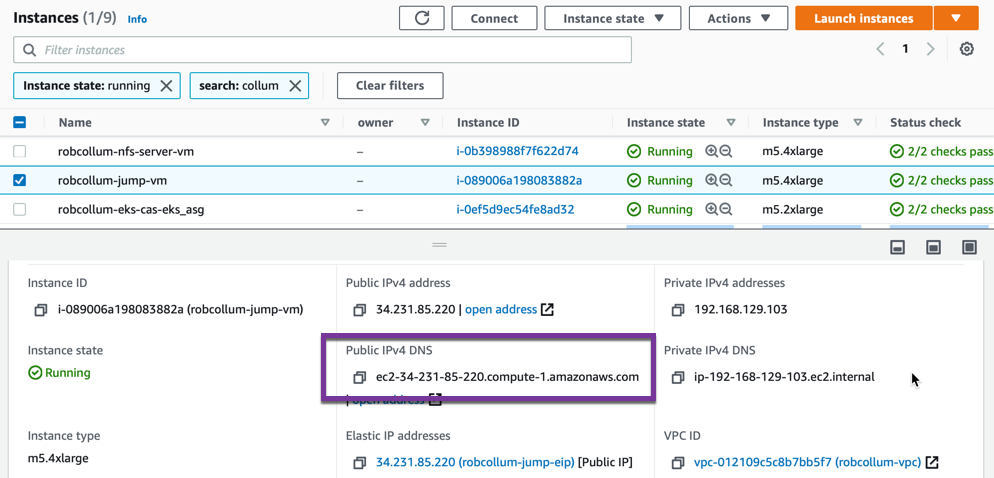
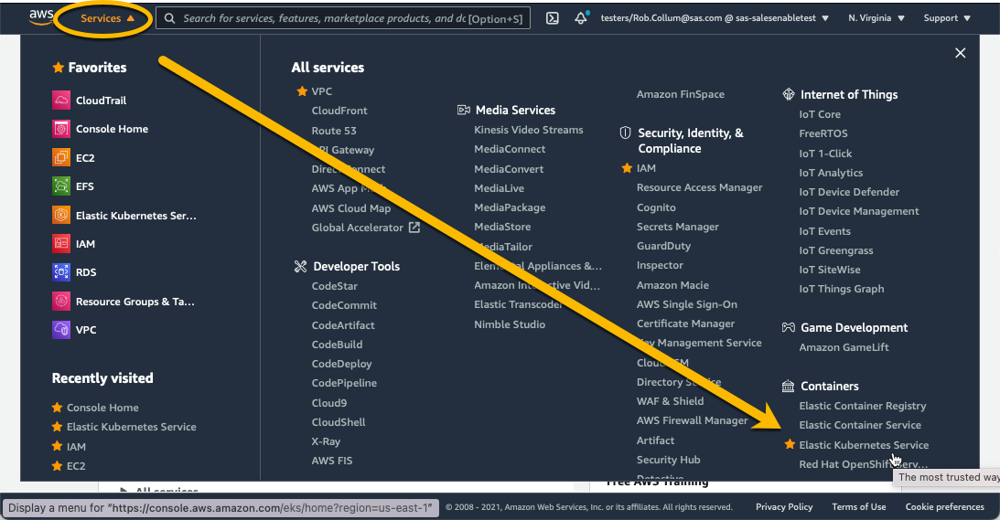
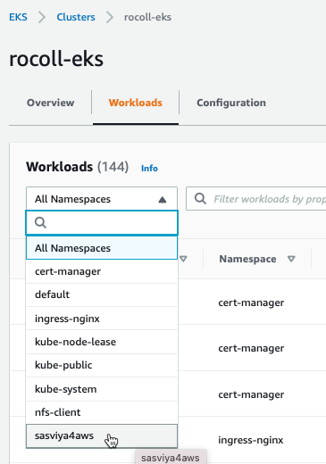
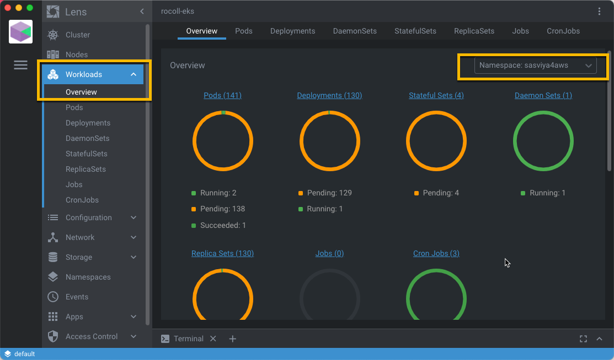
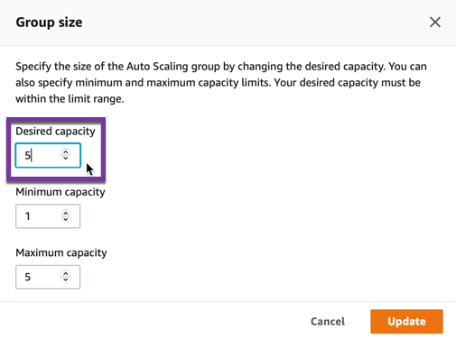
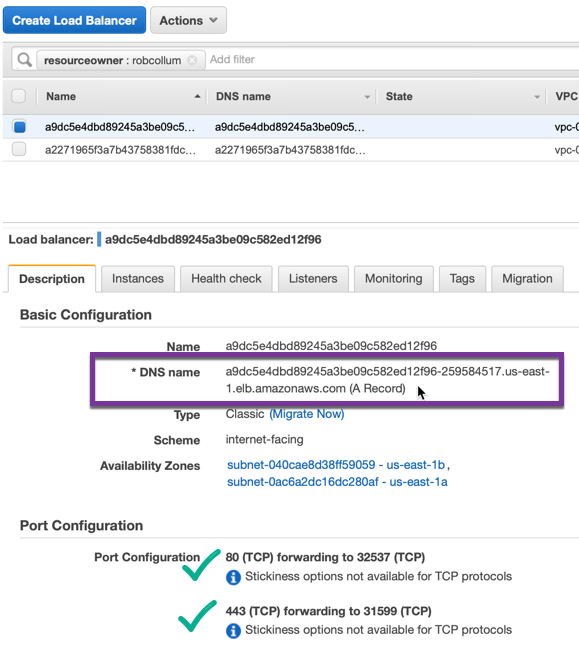

# Deploy SAS Viya in AWS

- [Acquiring tools](#acquiring-tools)
- [Prepare the local machine](#prepare-the-local-machine)
- [Prepare the NFS directory structure in AWS](#prepare-the-nfs-directory-structure-in-aws)
- [Configure the deployment of SAS Viya](#configure-the-deployment-of-sas-viya)
  - [*Troubleshooting*](#troubleshooting)
- [Deploy SAS Viya](#deploy-sas-viya)
- [Monitor SAS Viya using AWS](#monitor-sas-viya-using-aws)
- [Monitor SAS Viya using Lens](#monitor-sas-viya-using-lens)
- [Establish a DNS alias for the Ingress to SAS Viya](#establish-a-dns-alias-for-the-ingress-to-sas-viya)
- [Validation](#validation)
- [Appendix](#appendix)
- [Navigation](#navigation)

We will use the [viya4-deployment project](https://github.com/sassoftware/viya4-deployment) available from SAS in Github to deploy the SAS Viya software. 
## Acquiring tools 

1. Clone the viya4-deployment project and build the Docker container [viya4-deployement](https://github.com/sassoftware/viya4-deployment) we'll use:

   ```bash
   # as cloud-user on your Linux host in RACE
   cd ~

   # clone the viya4-deployment repo
   git clone https://github.com/sassoftware/viya4-deployment

   cd ~/viya4-deployment

   # Build the viya4-deployment container
   docker build -t viya4-deployment .
   ```

2. Try running the viya4-deployment container

   ```bash
   # as cloud-user on your Linux host in RACE
   
   docker container run --rm -it viya4-deployment --version
   ```

   Results:

   ```log
   Running: ansible-playbook -e BASE_DIR=/data -e *=/config/* --version playbooks/playbook.yaml
   ansible-playbook 2.10.9
     config file = /viya4-deployment/ansible.cfg
     configured module search path = ['/usr/share/ansible', '/viya4-deployment/plugins/modules']
     ansible python module location = /usr/local/lib/python3.8/dist-packages/ansible
     executable location = /usr/local/bin/ansible-playbook
     python version = 3.8.5 (default, Jan 27 2021, 15:41:15) [GCC 9.3.0]
   ```

   Note: The default entrypoint for this container is a shell script that expects to run an Ansible playbook. By specifying the `--version` parameter, we got this output instead.

## Prepare the local machine

1. Build a project directory structure 
   
   ```bash
   # as cloud-user on your Linux host in RACE
   export NS=sasviya4aws           # or whatever you want to call this
   
   mkdir -p ~/project/deploy/${NS}
   ```

## Prepare the NFS directory structure in AWS

When using Terraform to deploy our infrastructure in AWS, we configured it to stand up two hosts _outside_ of the EKS cluster: the **jumpbox** and the **nfs-server**. 

The viya4-iac-aws tool created a new `id_rsa` SSH keypair in your `cloud-user`'s `.ssh` directory. And it placed that key in the EC2 hosts it created for our access, including the jumpbox and nfs-server. 

The jumpbox has a public IP address that can be reached from the outside world. However, the nfs-server (and the rest of our EKS nodes) do not - but they can be accessed from the jumpbox, if needed. 

One more thing, our hosts in RACE only have the ability to communicate with the outside world over HTTP/S. They cannot use SSH to reach the jumpbox. 

We need to create a simple directory structure on the **nfs-server**. We can do that by SSH'ing to the **jumpbox** where the top-level of the shared directory structure is already mounted. But SSH *from where?*

The `cldlgn.fyi.sas.com` host isn't in RACE and *does* have the ability to SSH to EC2 instances in AWS directly. So we need to copy the `id_rsa` private key created by the viya4_iac_aws utility back over to `cldlgn.fyi.sas.com`... but be careful not to overwrite the *other* `id_rsa` private key we created earlier for use with the `getawskey` tool. 

1. Copy the `id_rsa` key created by viya4-iac-aws on your RACE host over to the `cldlgn.fyi.sas.com` host.

   ```bash
   # As <your CARYNT userid> on cldlgn.fyi.sas.com

   # Enter appropriate values for the target host in RACE
   user=cloud-user    
   host=<HOST>.race.sas.com   # e.g. pdcesx01234.race.sas.com

   # Copy over the id_rsa key, but give it a new name here
   scp ${user}@${host}:/home/cloud-user/.ssh/id_rsa ~/.ssh/id_rsa_FROM_RACE

2. Identify the public hostname (or IP address) of your jumpbox. Navigate in the AWS Console to EC2 > Instances and locate the `jump-vm` host that you own.

     

3. From the `cldlgn.fyi.sas.com` host, SSH to your jumpbox in AWS
   
   ```bash
   # as your CARYNT id on cldlgn.fyi.sas.com
   
   # specify your jumpbox public DNS or IP address
   jumpbox=ec2-aaa-bbb-ccc-ddd.compute-1.amazonaws.com  
   
   ssh -i "~/.ssh/id_rsa_FROM_RACE" jumpuser@${jumpbox}
   # Accept the fingerprint if prompted, but no password is required because the viya4-iac-aws project has already copied over this id_rsa keypair to the jumpbox. 
   ```

4. The jumpbox has already mounted the top-level of the shared directory structure from the nfs-server host. So create the sub-directories required for SAS Viya 4 here. 

   ```bash
   # as jumpuser on your jumpbox in AWS
   
   NS=sasviya4aws           # or whatever you want to call this
   
   cd /viya-share
   
   mkdir ${NS}
   
   cd /viya-share/${NS}
   
   mkdir bin data homes astores
   
   exit  # quit the SSH session
   ```

<hr>

SIDEBAR:

And just a note here for future reference. If you wanted to logon to the **nfs-server** directly, you can do so by SSH'ing there from the **jumpbox**. Remember, it's protected by a security group rule that doesn't allow SSH connection from outside of your VPC in AWS.

```bash
# as jumpuser on your jumpbox in AWS

# specify your nfs-server's public DNS or IP address
nfsserver=ec2-aaa-bbb-ccc-ddd.compute-1.amazonaws.com  

ssh nfsuser@${nfsserver}
# Accept the fingerprint if prompted, but no password is required because the viya4-iac-aws project has already copied over its id_rsa SSH keypair. 
```

<hr>

## Configure the deployment of SAS Viya

1. Build the Ansible vars file for SAS Viya release Stable 2020.1.5 

   ```bash
   # as cloud-user on your Linux host in RACE
   
   # Get your name in AWS
   MY_AWSNAME=`cat ~/MY_AWSNAME.txt`
   MY_AWSNAME=${MY_AWSNAME,,}        # convert to all lower-case

   export V4_CFG_INGRESS_FQDN="${MY_AWSNAME}.gelsandbox.aws.unx.sas.com"
   # We will setup this DNS alias in a future step

   tee  ~/project/deploy/${NS}/${NS}-viyavars.yaml > /dev/null << EOF
   ## Cluster
   PROVIDER: aws
   CLUSTER_NAME: ${NS}
   NAMESPACE: ${NS}

   ## MISC
   DEPLOY: true # Set to false to stop at generating the manifest

   #LOADBALANCER_SOURCE_RANGES: ['<cluster_nat_ip>/32']
   LOADBALANCER_SOURCE_RANGES: ["149.173.0.0/16", "71.135.0.0/16"]
   # Spexify the usual CIDR ranges assigned to SAS

   ## Storage - we let the tool create the SC for us
   V4_CFG_MANAGE_STORAGE: true
   #JUMP_SVR_RWX_FILESTORE_PATH: /volumes

   ## JUMP VM ACCESS TO PREPARE NFS DIRECTORIES
   # JUMP_SVR_PRIVATE_KEY: '/config/jump_svr_private_key'

   ## SAS API Access
   V4_CFG_SAS_API_KEY: 'otHGJtno8QGTqys9vRGxmgLOCnVsHWG2'
   V4_CFG_SAS_API_SECRET: 'banKYbGZyNkDXbBO'
   V4_CFG_ORDER_NUMBER: 9CDZDD

   ## CR Access
   # V4_CFG_CR_USER: <container_registry_user>
   # V4_CFG_CR_PASSWORD: <container_registry_password>

   ## Ingress
   V4_CFG_INGRESS_TYPE: ingress
   V4_CFG_INGRESS_FQDN: "${V4_CFG_INGRESS_FQDN}"
   V4_CFG_TLS_MODE: "full-stack" # [full-stack|front-door|disabled]

   ## Postgres
   V4_CFG_POSTGRES_TYPE: internal

   ## LDAP
   V4_CFG_EMBEDDED_LDAP_ENABLE: true

   ## Consul UI
   #V4_CFG_CONSUL_ENABLE_LOADBALANCER: false

   ## SAS/CONNECT
   V4_CFG_CONNECT_ENABLE_LOADBALANCER: false

   ## Cadence and version
   V4_CFG_CADENCE_NAME: 'stable'
   V4_CFG_CADENCE_VERSION: '2020.1.5'

   ## CAS Configuration
   V4_CFG_CAS_WORKER_COUNT: '3'
   V4_CFG_CAS_ENABLE_BACKUP_CONTROLLER: false
   V4_CFG_CAS_ENABLE_LOADBALANCER: true

   # Monitoring and logging tools
   V4M_BASE_DOMAIN: "${V4_CFG_INGRESS_FQDN}"

   # allow ELASTIC SEARCH to be properly configured
   V4_CFG_ELASTICSEARCH_ENABLE: true

   EOF
   ```

2. Custom site-config parameters

   ```bash
   # as cloud-user on your Linux host in RACE
   
   # Add the subdirectories 
   mkdir -p ~/project/deploy/${NS}/site-config/cas-server
   
   # Increase the CAS_NODE_CONNECT_TIMEOUT
   cat > ~/project/deploy/${NS}/site-config/cas-server/setcasnodetimeout.yaml << EOF
   apiVersion: builtin
   kind: ConfigMapGenerator
   metadata:
    name: sas-cas-config
   behavior: merge
   literals:
    - CAS_NODE_CONNECT_TIMEOUT=1800
   EOF
   ```

   <hr>

   ### *Troubleshooting*

   Sometimes unexpected things happen. When building this workshop, we chose to use live projects which are continuously updated over time. Sometimes those projects introduce breaking changes we could not foresee and which you must deal with... not unlike the real world.

   If you have persistent problems in the next steps when attempting to deploy SAS Viya, then you might need an *older* version of **viya4-deployment**. See our [Troubleshooting Tips page](/12_Amazon_EKS_Deployment/12_999_Troubleshooting_Tips.md) for [selecting a specific version of a git project](/12_Amazon_EKS_Deployment/12_999_Troubleshooting_Tips.md#selecting-a-specific-version-of-a-git-project). 

   <hr>

## Deploy SAS Viya

1. Direct the viya4-deployment container to perform pre-reqs
   
   ```bash
   # as cloud-user on your Linux host in RACE
   
   # Deploy all the pre-requisites for Viya 4
   docker container run -it \
       --group-add root \
       --user $(id -u):$(id -g) \
       -v $HOME/project/deploy:/data \
       -v $HOME/.kube/config:/config/kubeconfig \
       -v $HOME/project/deploy/${NS}/${NS}-viyavars.yaml:/config/config \
       -v $HOME/viya4-iac-aws/${NS}.tfstate:/config/tfstate \
       viya4-deployment \
           --tags "baseline,install"
   # runs in less than 2 minutes
   ```

   Note the `baseline,install` tags are the keywords that drive installation of required components. If something goes wrong and you want more information, recall this command and append `-vvv` at the end, then run it again.

   Results:

   ```log
   PLAY RECAP **********************************************************************************************************************************************************
   localhost                  : ok=25   changed=7    unreachable=0    failed=0    skipped=11   rescued=0    ignored=0
   
   Wednesday 12 May 2021  15:51:38 +0000 (0:00:00.543)       0:01:20.689 *********
   ===============================================================================
   ingress-nginx : Deploy ingress-nginx ------------------------------------------------------------------------------------------------------------------------ 25.63s
   cert-manager : Deploy cert-manager -------------------------------------------------------------------------------------------------------------------------- 22.22s
   metrics-server : Deploy metrics-server ---------------------------------------------------------------------------------------------------------------------- 14.50s
   nfs-subdir-external-provisioner : Deploy nfs-subdir-external-provisioner ------------------------------------------------------------------------------------- 8.64s
   nfs-subdir-external-provisioner : Remove deprecated efs-provisioner namespace -------------------------------------------------------------------------------- 1.62s
   metrics-server : Check for metrics service ------------------------------------------------------------------------------------------------------------------- 1.51s
   Gathering Facts ---------------------------------------------------------------------------------------------------------------------------------------------- 1.17s
   common : tfstate - export kubeconfig ------------------------------------------------------------------------------------------------------------------------- 0.99s
   nfs-subdir-external-provisioner : Remove deprecated nfs-client-provisioner ----------------------------------------------------------------------------------- 0.69s
   Delete tmpdir ------------------------------------------------------------------------------------------------------------------------------------------------ 0.54s
   nfs-subdir-external-provisioner : Remove deprecated efs-provisioner ------------------------------------------------------------------------------------------ 0.53s
   global tmp dir ----------------------------------------------------------------------------------------------------------------------------------------------- 0.45s
   common : Parse tfstate --------------------------------------------------------------------------------------------------------------------------------------- 0.18s
   common : tfstate - kubeconfig var ---------------------------------------------------------------------------------------------------------------------------- 0.14s
   Include nfs-subdir-external-provisioner ---------------------------------------------------------------------------------------------------------------------- 0.10s
   Include ingress nginx ---------------------------------------------------------------------------------------------------------------------------------------- 0.09s
   common : tfstate - nfs path ---------------------------------------------------------------------------------------------------------------------------------- 0.09s
   common : Add nat ip to LOADBALANCER_SOURCE_RANGES ------------------------------------------------------------------------------------------------------------ 0.08s
   baseline role ------------------------------------------------------------------------------------------------------------------------------------------------ 0.07s
   common : tfstate - provider ---------------------------------------------------------------------------------------------------------------------------------- 0.07s
   ```

2. And with those in place, then install SAS Viya
   
   ```bash
   # as cloud-user on your Linux host in RACE
   
   # Install SAS Viya 4
   docker container run -it \
       --group-add root \
       --user $(id -u):$(id -g) \
       -v $HOME/project/deploy:/data \
       -v $HOME/.kube/config:/config/kubeconfig \
       -v $HOME/project/deploy/${NS}/${NS}-viyavars.yaml:/config/config \
       -v $HOME/viya4-iac-aws/${NS}.tfstate:/config/tfstate \
       viya4-deployment \
           --tags "baseline,viya,install"
   # runs in less than 2 minutes
   ```

   Note the `viya` tag is the keyword that drive installation of SAS software components. If something goes wrong and you want more information, recall this command and append `-vvv` at the end, then run it again.

   Results:
   ```log
   PLAY RECAP **********************************************************************************************************************************************************
   localhost                  : ok=74   changed=20   unreachable=0    failed=0    skipped=40   rescued=0    ignored=0
   
   Wednesday 12 May 2021  16:11:36 +0000 (0:00:00.319)       0:01:26.519 *********
   ===============================================================================
   vdm : kustomize - Generate deployment manifest -------------------------------------------------------------------------------------------------------------- 44.91s
   vdm : copy - VDM transformers -------------------------------------------------------------------------------------------------------------------------------- 5.16s
   vdm : copy - VDM generators ---------------------------------------------------------------------------------------------------------------------------------- 3.07s
   cert-manager : Deploy cert-manager --------------------------------------------------------------------------------------------------------------------------- 2.93s
   vdm : assets - Get License ----------------------------------------------------------------------------------------------------------------------------------- 2.04s
   vdm : assets - Download -------------------------------------------------------------------------------------------------------------------------------------- 1.50s
   vdm : assets - Extract downloaded assets --------------------------------------------------------------------------------------------------------------------- 1.43s
   metrics-server : Check for metrics service ------------------------------------------------------------------------------------------------------------------- 1.40s
   nfs-subdir-external-provisioner : Remove deprecated efs-provisioner namespace -------------------------------------------------------------------------------- 1.38s
   vdm : Download viya4-orders-cli ------------------------------------------------------------------------------------------------------------------------------ 1.37s
   vdm : copy - VDM resources ----------------------------------------------------------------------------------------------------------------------------------- 1.21s
   Gathering Facts ---------------------------------------------------------------------------------------------------------------------------------------------- 1.11s
   nfs-subdir-external-provisioner : Deploy nfs-subdir-external-provisioner ------------------------------------------------------------------------------------- 0.90s
   common : tfstate - export kubeconfig ------------------------------------------------------------------------------------------------------------------------- 0.89s
   ingress-nginx : Deploy ingress-nginx ------------------------------------------------------------------------------------------------------------------------- 0.87s
   nfs-subdir-external-provisioner : Remove deprecated nfs-client-provisioner ----------------------------------------------------------------------------------- 0.67s
   vdm : copy --------------------------------------------------------------------------------------------------------------------------------------------------- 0.56s
   vdm : kustomize - Generate kustomization.yaml ---------------------------------------------------------------------------------------------------------------- 0.53s
   vdm : kustomize - Get user's customizations ------------------------------------------------------------------------------------------------------------------ 0.52s
   vdm : assets - Remove old files ------------------------------------------------------------------------------------------------------------------------------ 0.52s
   ```


## Monitor SAS Viya using AWS

The AWS Management Console provides some rudimentary ability to monitor the status of your SAS Viya deployment running in EKS. 

1. Use your SAS CARYNT credentials to logon to the AWS Management Console: [http://go.sas.com/aws](http://go.sas.com/aws) and select the **Testers** role in the **sas-salesenabletest** account.
   
2. Open the **Services** menu and you'll find dozens and dozens of AWS services to choose from. Scroll down and look at the bottom right for **Elastic Kubernetes Service**:

     

   As you can see in my screenshot, I've identified EKS and several others as favorites to make them easier to find in the future.

3. On the next page (which is also a jump point for ECS and ECR), click the link for **Clusters** under **Amazon EKS**.

4. You should see your cluster as the only one listed, named similar to `<Your_Userid>-eks` Click on it.

5. You should now see a listing of Nodes where your EKS cluster is running. Select the **Workloads** tab.

6. By default, the workloads for all namespaces are shown, but you can narrow this down by selecting to show only the `sasviya4aws` namespace:

     

7. Explore the interface from here. 

## Monitor SAS Viya using Lens

Lens is a desktop app that is used to monitor Kubernetes deployments.

1. [Download Lens](https://k8slens.dev) for your PC's operating system and install it. Use the Windows host in RACE if you prefer.

2. Open Lens and Add Cluster (either from the File menu or in the UI with the big blue plus button)
   
3. In the **Add Clusters from Kubeconfig** dialog, choose *Paste as Text*.
   
4. Now you need the text from the kubeconfig file that Terraform created:
   
   ```bash
   # as cloud-user on your Linux host in RACE
   
   cat ~/.kube/config
   ```

   Highlight the resulting text in the terminal window (automatically copying it to your system clipboard).

5. Back in Lens, now paste the text into the **Add Clusters from Kubeconfig** dialog. Then click the *Add Cluster* button.

6. Lens should now be able to show you the status of your EKS cluster in AWS. Navigate to **Workloads > Overview** and then select the `sasviya4aws` namespace:

     

7. The viya4-iac-aws utility set up some basic Auto Scaling Groups for us in AWS. However, they don't automatically respond to CAS' need for multiple hosts - only starting 1 when CAS wants 5. To ensure enough hosts for CAS at this point, use your browser to navigate to the AWS Console > EC2 > [Auto Scaling Groups](https://console.aws.amazon.com/ec2autoscaling/home?region=us-east-1#/details).

   * Select the Auto Scaling group with `eks-cas` in the name. 

   * On the Details pane, click the **Edit** button (top right corner). 

   * And on the Group size dialog, increase **Desired Capacity** to `5`.

     

   **ACTION ITEM: Configure the Auto Scaling group to *automatically* scale as intended.**

8. Explore the interface further. Then sit back and enjoy watching the SAS Viya pods eventually achieve *Running* status. Feel free to take a break at this point. ;)

## Establish a DNS alias for the Ingress to SAS Viya

1. Find your SAS Viya deployment's Ingress for ports 80/443
   *  Use your browser to navigate to AWS Console > EC2 > [Load Balancers](https://console.aws.amazon.com/ec2/v2/home?region=us-east-1#LoadBalancers:sort=loadBalancerName) 
   *  You'll see a listing of load balancers, but they won't be named clearly so that you can find yours easily. Other students will have theirs in this list as well. So use the filter field above the list and enter `resourceowner : <your AWS name>`
   *  You should have two load balancers shown now. Click to select each one and look at the Port Configuration section in the Description tab. Identify the load balancer which has ports `80` and `443` configured. 
   *  The DNS Name shown in the Basic Configuration section of the Description tab is what we need. 

        

   * The other load balancer is an Ingress to reach the binary port of CAS `:5570`. If you intend for your users outside the AWS cloud to use programmatic tools to reach CAS' binary port, then setup a second DNS alias for this load balancer as well. 

2. Internal to SAS, the IT department provides a DNS tool known as the [NAMES utility](http://names.na.sas.com). 
   * Browse to `http://names.na.sas.com` and select **Add New Host/Alias/IP** > **Add Alias to Existing Host**

   * Copy the DNS Name (A Record) of your load balancer in AWS that you identified in the step above and paste it into the NAMES form for the existing host.

   * Provide a new alias based on your AWS Name similar to `robcollum.gelsandbox.aws.unx.sas.com`.

   **ACTION ITEM: Alternative approach for partners.**

## Validation

Take SAS Viya for a quick spin to see it working.

1. In your browser, navigate to your new DNS alias for SAS Viya similar to `https://robcollum.gelsandbox.aws.unx.sas.com/`

2. To logon, use either userid:

   * `viya_admin`
   * `user1`

   And password `Password123`.

3. Explore SAS Drive. 

4. Then, from the services menu in the upper left corner of the page, select **Develop SAS Code** to open SAS Studio. 
   * Create a new **Program in SAS**  
   * In the program pane, enter a single command: `cas;`
   * Click the **Run** button above the program pane to submit the code.
   * Confirm success in the resulting log output. Notice how many workers CAS is using to host your session.
   * This demonstrates that the SAS Compute Server as well as the SAS Cloud Analytic Services are working normally.

# End

You've deployed SAS Viya software to the AWS infrastructure using the viya4-deployment project from SAS. 

## Appendix

_When needed, uninstall SAS Viya_

Don't try this yet. There's more to do with SAS Viya before we uninstall it.

* Remove SAS Viya software from the Kubernetes cluster in AWS
  
   ```bash
   # as cloud-user on your Linux host in RACE
  
   # Unnstall SAS Viya 4
   docker container run -it \
       --group-add root \
       --user $(id -u):$(id -g) \
       -v $HOME/project/deploy:/data \
       -v $HOME/.kube/config:/config/kubeconfig \
       -v $HOME/project/deploy/${NS}/${NS}-viyavars.yaml:/config/config \
       -v $HOME/viya4-iac-aws/${NS}.tfstate:/config/tfstate \
       viya4-deployment \
           --tags "baseline,viya,uninstall"
   ```

* And if needed, also destroy the AWS infrastructure

  ```bash
  # as cloud-user on your Linux host in RACE
  cd ~/viya4-iac-aws

  # Delete all AWS resources created by the Terraform plan and tracked in the Terraform state file.
  TFVARS=/workspace/sasviya4aws.tfvars    # path inside the container
  TFSTATE=/workspace/sasviya4aws.tfstate  # path inside the container

  # terraform destroy
  time docker container run --rm --group-add root \
  --user $(id -u):$(id -g) \
  -v $HOME/.aws:/.aws \
  -v $HOME/.ssh:/.ssh \
  -v $(pwd):/workspace \
  --entrypoint terraform \
  viya4-iac-aws destroy -auto-approve \
    -var-file ${TFVARS} \
    -state ${TFSTATE} 

  # Only after SUCCESSFUL destroy, then 
  # remove the TF state, so next time we start clean
  rm ~/viya4-iac-aws/sasviya4aws.tfstate
  ```

* If, for some reason, Terraform is unable to tear down your environment in AWS, then refer to the GEL blog post _[Manually destroying AWS infrastructure for SAS Viya](http://sww.sas.com/blogs/wp/gate/44278/manually-destroying-aws-infrastructure-for-sas-viya/rocoll/2021/05/06)_ for additional guidance. 

## Navigation

<!-- startnav -->
* [01 Introduction / 01 031 Booking a Lab Environment for the Workshop](/01_Introduction/01_031_Booking_a_Lab_Environment_for_the_Workshop.md)
* [01 Introduction / 01 032 Assess Readiness of Lab Environment](/01_Introduction/01_032_Assess_Readiness_of_Lab_Environment.md)
* [01 Introduction / 01 033 CheatCodes](/01_Introduction/01_033_CheatCodes.md)
* [02 Kubernetes and Containers Fundamentals / 02 131 Learning about Namespaces](/02_Kubernetes_and_Containers_Fundamentals/02_131_Learning_about_Namespaces.md)
* [03 Viya 4 Software Specifics / 03 011 Looking at a Viya 4 environment with Visual Tools DEMO](/03_Viya_4_Software_Specifics/03_011_Looking_at_a_Viya_4_environment_with_Visual_Tools_DEMO.md)
* [03 Viya 4 Software Specifics / 03 051 Create your own Viya order](/03_Viya_4_Software_Specifics/03_051_Create_your_own_Viya_order.md)
* [03 Viya 4 Software Specifics / 03 056 Getting the order with the CLI](/03_Viya_4_Software_Specifics/03_056_Getting_the_order_with_the_CLI.md)
* [04 Pre Requisites / 04 081 Pre Requisites automation with Viya4-ARK](/04_Pre-Requisites/04_081_Pre-Requisites_automation_with_Viya4-ARK.md)
* [05 Deployment tools / 05 121 Setup a Windows Client Machine](/05_Deployment_tools/05_121_Setup_a_Windows_Client_Machine.md)
* [06 Deployment Steps / 06 031 Deploying a simple environment](/06_Deployment_Steps/06_031_Deploying_a_simple_environment.md)
* [06 Deployment Steps / 06 051 Deploying Viya with Authentication](/06_Deployment_Steps/06_051_Deploying_Viya_with_Authentication.md)
* [06 Deployment Steps / 06 061 Deploying in a second namespace](/06_Deployment_Steps/06_061_Deploying_in_a_second_namespace.md)
* [06 Deployment Steps / 06 071 Removing Viya deployments](/06_Deployment_Steps/06_071_Removing_Viya_deployments.md)
* [06 Deployment Steps / 06 081 Deploying a programing only environment](/06_Deployment_Steps/06_081_Deploying_a_programing-only_environment.md)
* [06 Deployment Steps / 06 091 Deployment Operator setup](/06_Deployment_Steps/06_091_Deployment_Operator_setup.md)
* [06 Deployment Steps / 06 093 Using the DO with a Git Repository](/06_Deployment_Steps/06_093_Using_the_DO_with_a_Git_Repository.md)
* [06 Deployment Steps / 06 095 Using an inline configuration](/06_Deployment_Steps/06_095_Using_an_inline_configuration.md)
* [06 Deployment Steps / 06 097 Using the Orchestration Tool](/06_Deployment_Steps/06_097_Using_the_Orchestration_Tool.md)
* [06 Deployment Steps / 06 101 Create Viya Deployment Roles](/06_Deployment_Steps/06_101_Create_Viya_Deployment_Roles.md)
* [07 Deployment Customizations / 07 021 Configuring SASWORK](/07_Deployment_Customizations/07_021_Configuring_SASWORK.md)
* [07 Deployment Customizations / 07 051 Adding a local registry to k8s](/07_Deployment_Customizations/07_051_Adding_a_local_registry_to_k8s.md)
* [07 Deployment Customizations / 07 052 Using mirror manager to populate the local registry](/07_Deployment_Customizations/07_052_Using_mirror_manager_to_populate_the_local_registry.md)
* [07 Deployment Customizations / 07 053 Deploy from local registry](/07_Deployment_Customizations/07_053_Deploy_from_local_registry.md)
* [07 Deployment Customizations / 07 091 Configure SAS ACCESS Engine](/07_Deployment_Customizations/07_091_Configure_SAS_ACCESS_Engine.md)
* [07 Deployment Customizations / 07 101 Configure SAS ACCESS TO HADOOP](/07_Deployment_Customizations/07_101_Configure_SAS_ACCESS_TO_HADOOP.md)
* [07 Deployment Customizations / 07 102 Parallel loading with EP for Hadoop](/07_Deployment_Customizations/07_102_Parallel_loading_with_EP_for_Hadoop.md)
* [09 Validation / 09 011 Validate the Viya deployment](/09_Validation/09_011_Validate_the_Viya_deployment.md)
* [09 Validation / 09 021 SAS Viya deployment reports](/09_Validation/09_021_SAS_Viya_deployment_reports.md)
* [11 Azure AKS Deployment / 11 000 Navigating the AKS Hands on Deployment Options](/11_Azure_AKS_Deployment/11_000_Navigating_the_AKS_Hands-on_Deployment_Options.md)
* [11 Azure AKS Deployment / 11 999 Fast track with cheatcodes](/11_Azure_AKS_Deployment/11_999_Fast_track_with_cheatcodes.md)
* [11 Azure AKS Deployment/Fully Automated / 11 500 Full Automation of AKS Deployment](/11_Azure_AKS_Deployment/Fully_Automated/11_500_Full_Automation_of_AKS_Deployment.md)
* [11 Azure AKS Deployment/Fully Automated / 11 590 Cleanup](/11_Azure_AKS_Deployment/Fully_Automated/11_590_Cleanup.md)
* [11 Azure AKS Deployment/Standard / 11 100 Creating an AKS Cluster](/11_Azure_AKS_Deployment/Standard/11_100_Creating_an_AKS_Cluster.md)
* [11 Azure AKS Deployment/Standard / 11 110 Performing the prerequisites](/11_Azure_AKS_Deployment/Standard/11_110_Performing_the_prerequisites.md)
* [11 Azure AKS Deployment/Standard/Cleanup / 11 400 Cleanup](/11_Azure_AKS_Deployment/Standard/Cleanup/11_400_Cleanup.md)
* [11 Azure AKS Deployment/Standard/Manual / 11 200 Deploying Viya 4 on AKS](/11_Azure_AKS_Deployment/Standard/Manual/11_200_Deploying_Viya_4_on_AKS.md)
* [11 Azure AKS Deployment/Standard/Manual / 11 210 Deploy a second namespace in AKS](/11_Azure_AKS_Deployment/Standard/Manual/11_210_Deploy_a_second_namespace_in_AKS.md)
* [11 Azure AKS Deployment/Standard/Manual / 11 220 CAS Customizations](/11_Azure_AKS_Deployment/Standard/Manual/11_220_CAS_Customizations.md)
* [11 Azure AKS Deployment/Standard/Manual / 11 230 Install monitoring and logging](/11_Azure_AKS_Deployment/Standard/Manual/11_230_Install_monitoring_and_logging.md)
* [12 Amazon EKS Deployment / 12 010 Access Environments](/12_Amazon_EKS_Deployment/12_010_Access_Environments.md)
* [12 Amazon EKS Deployment / 12 020 Provision Resources](/12_Amazon_EKS_Deployment/12_020_Provision_Resources.md)
* [12 Amazon EKS Deployment / 12 030 Deploy SAS Viya](/12_Amazon_EKS_Deployment/12_030_Deploy_SAS_Viya.md)**<-- you are here**
* [13 Google GKE Deployment / 13 011 Creating a GKE Cluster](/13_Google_GKE_Deployment/13_011_Creating_a_GKE_Cluster.md)
* [13 Google GKE Deployment / 13 021 Performing Prereqs in GKE](/13_Google_GKE_Deployment/13_021_Performing_Prereqs_in_GKE.md)
* [13 Google GKE Deployment / 13 031 Deploying Viya 4 on GKE](/13_Google_GKE_Deployment/13_031_Deploying_Viya_4_on_GKE.md)
* [13 Google GKE Deployment / 13 041 Full Automation of GKE Deployment](/13_Google_GKE_Deployment/13_041_Full_Automation_of_GKE_Deployment.md)
* [13 Google GKE Deployment / 13 099 Fast track with cheatcodes](/13_Google_GKE_Deployment/13_099_Fast_track_with_cheatcodes.md)
<!-- endnav -->
