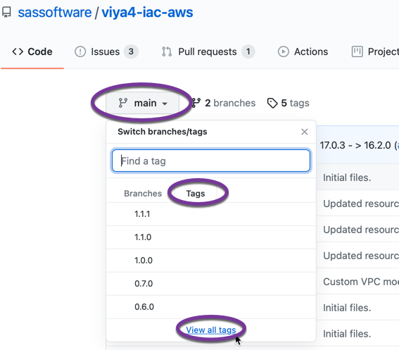
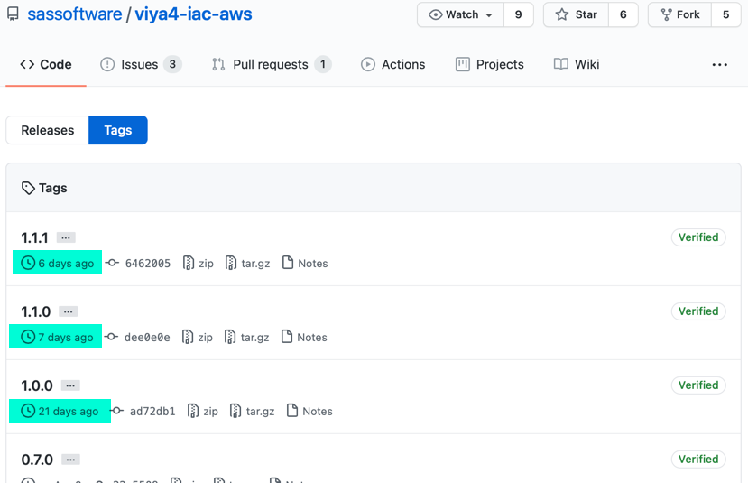

# Troubleshooting tips for SAS Viya deployment to AWS

This is not an exercise. Instead, it will be a collection of procedures to help troubleshoot and resolve unexpected challenges during the deployment of SAS Viya into AWS.

## Selecting a specific version of a Git project

By default, the AWS exercises pull the "latest" versions of **viya4-iac-aws** and **viya4-deployment**. However, while this provides for the latest features and bug fixes, it can also sometimes introduce breaking changes. 

If you find that you encounter unexpected errors when running the **viya4-iac-aws** and **viya4-deployment** projects, then you might want to specify a previous known-good version. Here's how.

1. In either project, click on the **main** branch pull-down menu > select the **Tags** tab > click the **View all tags** link at the bottom of the list:

   

2. Notice the dates of release for the list of version tags:

   

   If you want more information about a specific release, then click the **Releases** tab to see the release notes.

3. Select the version you want. This is where it's tricky just as if you were to encounter this problem in the real world. Generally, you want the newest version you can get *before* the breaking change you're trying to avoid. 

   For this workshop, you can see the dates of the exercise files in Gitlab. So try to match up the release tag shown in Github with a date that aligns with the exercises in this workshop. 

4. Tell your local Git repo to use the version of the project you want. 

   ```bash
   # as cloud-user on your Linux host in RACE

   cd ~/viya4-iac-aws/        # or viya4-deployment, as needed

   # pull down all remotes
   git fetch --all

   # Identify the release/version/tag you want
   RELEASE_TAG=1.0.0

   # Switch to the release you want
   git checkout tags/${RELEASE_TAG}
   ```

5. Now that you're running on a specific version, try again to perform the step that failed unexpectedly. 
