**WORK IN PROGRESS**

# Creating a GKE cluster

* [Introduction](#introduction)
* [Registration](#registration)
  * [Ask us to be added to the sas-gelsandbox project](#ask-us-to-be-added-to-the-sas-gelsandbox-project)
* [Book a RACE Collection](#book-a-race-collection)
* [Connect to the Google Cloud Platform](#connect-to-the-google-cloud-platform)
* [Review the SAS Viya 4 IaC for Google GCP prerequisites](#review-the-sas-viya-4-iac-for-google-gcp-prerequisites)
  * [Optional : check if the APIs are enabled for your project](#optional--check-if-the-apis-are-enabled-for-your-project)
* [Connect to your Collection](#connect-to-your-collection)
  * [Has the Collection finished bootstrapping?](#has-the-collection-finished-bootstrapping)
  * [Make sure kubectl is installed](#make-sure-kubectl-is-installed)
  * [Make sure jq is installed](#make-sure-jq-is-installed)
* [Install and Configure the Google Cloud CLI](#install-and-configure-the-google-cloud-cli)
  * [Set the GCP settings (project, region and zone)](#set-the-gcp-settings-project-region-and-zone)
  * [Download and install the Google Cloud CLI (gcloud)](#download-and-install-the-google-cloud-cli-gcloud)
  * [Authenticate yourself with GCP](#authenticate-yourself-with-gcp)
  * [Set and check the default configuration](#set-and-check-the-default-configuration)
* [Install and Configure Terraform](#install-and-configure-terraform)
  * [Set up Terraform](#set-up-terraform)
  * [Obtain the Terraform templates from the sassoftware GitHub](#obtain-the-terraform-templates-from-the-sassoftware-github)
* [Authenticating Terraform to access GCP](#authenticating-terraform-to-access-gcp)
  * [Get the STUDENT information](#get-the-student-information)
  * [Create the Service Account Keyfile](#create-the-service-account-keyfile)
  * [Initialize Terraform](#initialize-terraform)
* [Provision the GKE cluster with Terraform](#provision-the-gke-cluster-with-terraform)
  * [Create an ssh key](#create-an-ssh-key)
  * [Customize the Terraform variables](#customize-the-terraform-variables)
  * [Generate a Terraform plan](#generate-a-terraform-plan)
* [Stand up GKE cluster and Validate](#stand-up-gke-cluster-and-validate)
  * [Apply the Terraform plan](#apply-the-terraform-plan)
  * [Getting the kubectl config file for your newly built GCP cluster](#getting-the-kubectl-config-file-for-your-newly-built-gcp-cluster)
* [If you need to delete the GKE cluster](#if-you-need-to-delete-the-gke-cluster)
  * [Use Terraform](#use-terraform)
  * [Use gcloud commands](#use-gcloud-commands)
* [Troubleshooting](#troubleshooting)
* [Navigation](#navigation)

## Introduction

In this hands-on we use the GitHub open source project to fully automate the build of the Kubernetes cluster in Google (with the [SAS Viya 4 Infrastructure as Code (IaC) for Google GCP](https://github.com/sassoftware/viya4-iac-gcp))

## Registration

### Ask us to be added to the sas-gelsandbox project

**Your account will be added to the sas-gelsandbox project for *1 week*. Please plan to do the hands-on accordingly.**

Send this [email](mailto:gelreg@sas.com?subject=GEL%20GCP%20sas-gelsandbox%20add) without any change.

If the link above does not open your default email program, see [this](https://duckduckgo.com/?q=mailto+protocol+default) or simply email gelreg@sas.com with subject "GEL GCP sas-gelsandbox add".

Once you get some feedback from us, please proceed with the next steps.

## Book a RACE Collection

* We will use a RACE machine as a jumphost to interact with GKE

* Book the "single machine K3s" [collection](http://race.exnet.sas.com/Reservations?action=new&imageId=333991&imageKind=C&comment=%20GELLOW%20DEV%20VMWare&purpose=PST&sso=PSGEL255&schedtype=SchedTrainEDU&startDate=now&endDateLength=0&discardonterminate=y) which comes with one Windows client and one Linux machine.

* Once the collection has been started, you should receive an email like the one below.

    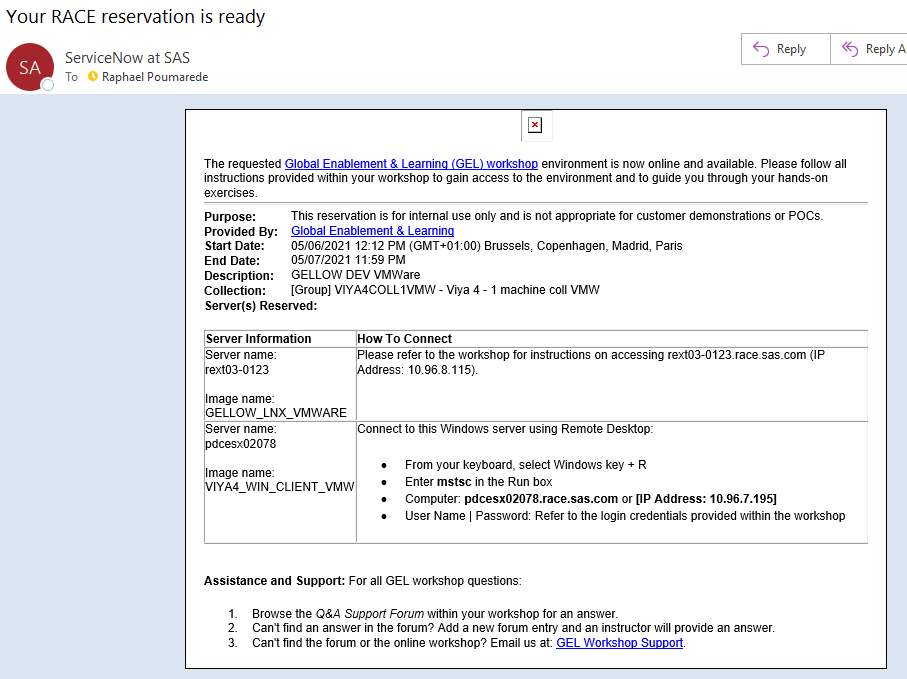

## Connect to the Google Cloud Platform

Go to [https://console.cloud.google.com/](https://console.cloud.google.com/) and sign-in.

Be sure to connect using your **SAS email** address, check the signed-in account at the top-right corner of the Google Cloud Console:

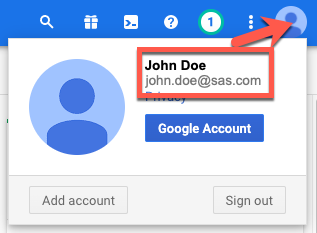

Look for the "**sas-gelsandbox**" project:

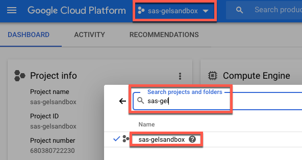

Check if you have access to the correct project:

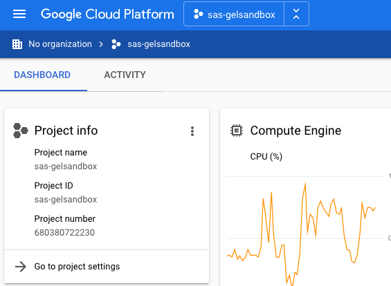

## Review the SAS Viya 4 IaC for Google GCP prerequisites

* In this exercise, we will us the [SAS Viya 4 IaC for GCP](https://github.com/sassoftware/viya4-iac-gcp) project.
* The project is available in GitHub and has several pre-requisites, such as :
  * Access to a Google Cloud "Project" with these API Services enabled.
  * A Google Cloud Service Account.
  * Terraform or Docker

### Optional : check if the APIs are enabled for your project

* Open the GCP console, connect with sas.com account and pick the **sas-gelsandbox** project.
* Then open this [page](https://github.com/sassoftware/viya4-iac-gcp/blob/main/docs/user/APIServices.md) and click on the API links to make sure they are enabled.

## Connect to your Collection

* Connect to the Windows Machine of your RACE collection (as Student/Metadata0).
* In the following steps, **we will run the commands run from the sasnode1 session from within MobaXterm** on the RACE client machine.

### Has the Collection finished bootstrapping?

If you connect to the collection as soon as you receive the confirmation e-mail, the collection is probably still in the process of self-configuring.

You need to wait until that process is done. (aroubd 10 minutes, usually).

In order to confirm that the bootstrapping is finished and successful, do the following:

1. Execute the following command on sasnode01:

    ```sh
    tail -f /opt/gellow_work/logs/gellow_summary.log
    ```

1. Wait for the last line to say:

    ```log
    PASS Final message: It seems everything deployed successfully!
    PASS Final message: You can start using this collection

    #####################################################################################
    ####### DONE WITH THE BOOTSTRAPPING OF THE MACHINE ##################################
    #####################################################################################
    ```

### Make sure kubectl is installed

* Run the command below to show the installed version

    ```bash
    kubectl version
    ```

### Make sure jq is installed

* Run the command below to show the installed version

    ```bash
    jq --version
    ```

## Install and Configure the Google Cloud CLI

_Reference : <https://cloud.google.com/sdk/docs/install#linux>_

### Set the GCP settings (project, region and zone)

* Set the GCP project

    ```bash
    # The default project that we choose is "sas-gelsandbox" but you can choose something else if you want:
    GCPPROJECT=${GCPPROJECT:-sas-gelsandbox}
    echo ${GCPPROJECT} > ~/gcpproject.txt
    # check
    cat ~/gcpproject.txt
    # Save the GCPPROJECT info for next time we re-login
    ansible localhost -m lineinfile \
        -a "dest=~/.bashrc \
            regexp='^export GCPPROJECT' \
            line='export GCPPROJECT=$(cat ~/gcpproject.txt)'" \
            --diff
    ```

* Set the GCP region and zone
* Run the code below with the region, zone and project that you want to use. (see <https://cloud.google.com/compute/docs/regions-zones> for available rregions and zones)
* By default it will be "us-east1" and "us-east1-b"

    ```bash
    # The default region that we choose is "us-east1" but you can choose something else if you want:
    GCPREGION=${GCPREGION:-us-east1}
    GCPZONE=${GCPZONE:-us-east1-b}

    echo ${GCPREGION} > ~/gcpregion.txt
    cat ~/gcpregion.txt
    echo ${GCPZONE} > ~/gcpzone.txt
    cat ~/gcpzone.txt

    # Save the GCPREGION info for next time we re-login
    ansible localhost -m lineinfile \
        -a "dest=~/.bashrc \
            regexp='^export GCPREGION' \
            line='export GCPREGION=$(cat ~/gcpregion.txt)'" \
            --diff
    # Save the GCPZONE info for next time we re-login
    ansible localhost -m lineinfile \
        -a "dest=~/.bashrc \
            regexp='^export GCPZONE' \
            line='export GCPZONE=$(cat ~/gcpzone.txt)'" \
            --diff
    ```

### Download and install the Google Cloud CLI (gcloud)

* Run the commands below

    ```bash
    # install the gcloud SDK in $HOME folder
    cd $HOME
    curl -O https://dl.google.com/dl/cloudsdk/channels/rapid/downloads/google-cloud-sdk-328.0.0-linux-x86_64.tar.gz
    tar -xf google-cloud-sdk-328.0.0-linux-x86_64.tar.gz
    ./google-cloud-sdk/install.sh --quiet
    #Add gcloud in the PATH
    ansible localhost -m lineinfile -a "dest=~/.bashrc line='export PATH=$PATH:/home/cloud-user/google-cloud-sdk/bin'" --diff
    source ~/.bashrc
    ## Initialize gcloud
    gcloud init --project=${GCPPROJECT} --console-only
    ```

* You should see something like :

    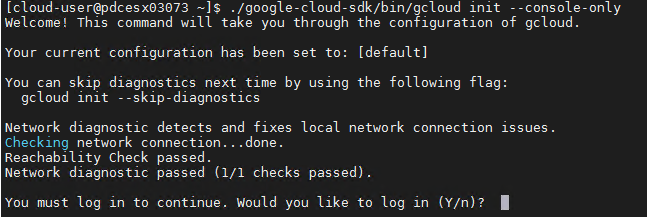

* Type "Y"

### Authenticate yourself with GCP

* The previous command will generate a web URL

    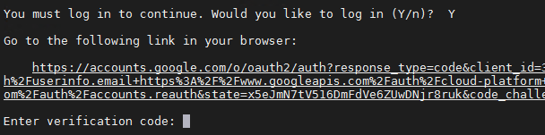

* Select the whole URL and paste it in the web browser **of your laptop/workstation**
* **BE CAREFUL, DON'T TYPE CTRL+C ! JUST SELECT THE LONG URL AND COPY IT IN YOUR WORKSTATION WEB BROWSER**

    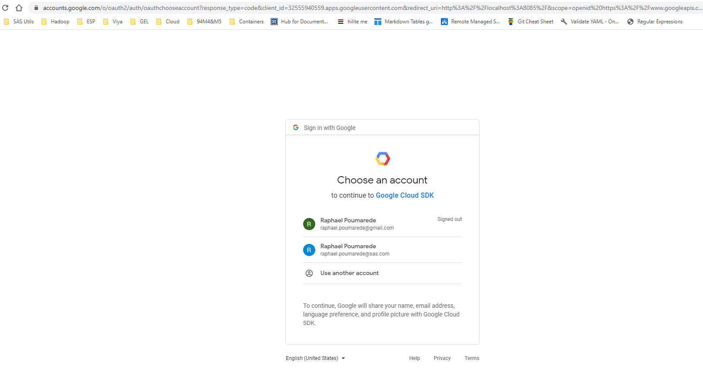

* Make sure you select your sas.com account.

    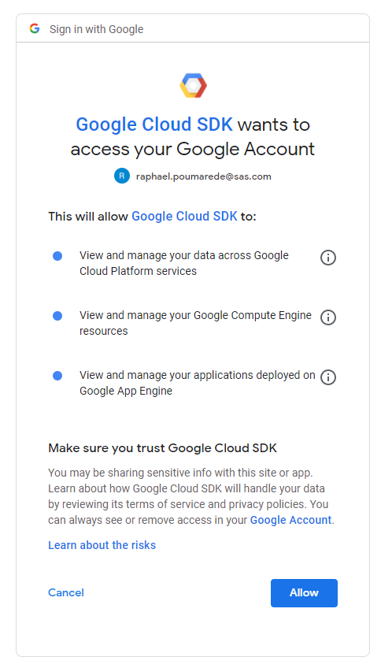

* Click on the "Allow" button
* You will now see the code :

    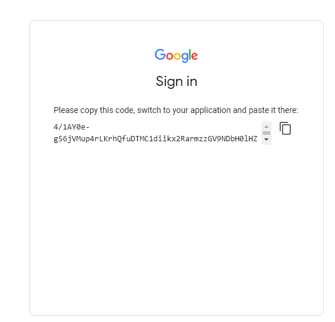

* Copy-paste the authentication code and type "enter"

* Now, you should see :

    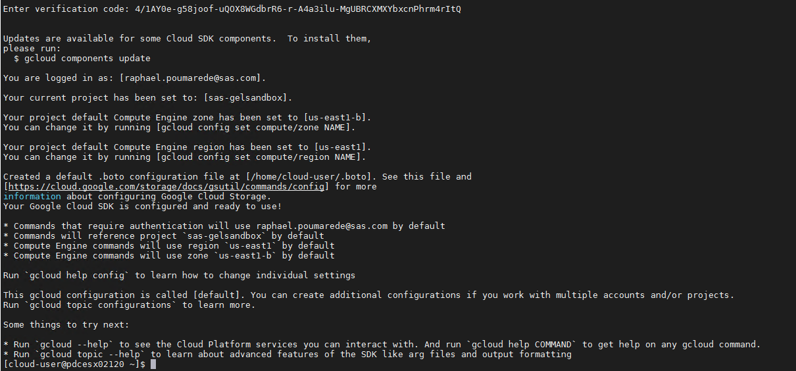

### Set and check the default configuration

* Set the default region and zone in the active configuration

    ```bash
    gcloud config set compute/region ${GCPREGION}
    gcloud config set compute/zone ${GCPZONE}
    ```

* Make sure your settings are correct before proceeding with the next steps

    ```bash
    gcloud config list
    ```

* Here is what you MUST see :

    ```yaml
    account = <your sas.com email address>
    project = sas-gelsandbox
    ```

* You can also see the configured regions and zones.

## Install and Configure Terraform

### Set up Terraform

* Install the Terraform YUM repository

    ```bash
    ## Install yum-config-manager to manage your repositories.
    sudo yum install -y yum-utils
    ## Use yum-config-manager to add the official HashiCorp Linux repository.
    sudo yum-config-manager --add-repo https://rpm.releases.hashicorp.com/RHEL/hashicorp.repo
    ```

* We want to pin our Terraform version to the version required by the "SAS Viya 4 IaC for GCP" tool.

    ```bash
    # we stick to 13.6 bc it is the required version from https://github.com/sassoftware/viya4-iac-gcp
    ## Install
    yum --showduplicate list terraform
    ## Pick up the version that is supported with viya4-iac
    sudo yum install terraform-0.13.6-1 -y
    ```

### Obtain the Terraform templates from the sassoftware GitHub

The Terraform templates that we need come from this [project](https://github.com/sassoftware/viya4-iac-gcp).

* Get the Terraform artifacts from github and checkout a specific version

    ```bash
    rm -Rf ~/project/gcp/viya4-iac-gcp
    mkdir -p ~/project/gcp/
    cd ~/project/gcp/
    git clone https://github.com/sassoftware/viya4-iac-gcp.git
    # as long as the github project is private you need to logon with an authorized GitHub account (ex: raphaelpoumarede)
    cd ~/project/gcp/viya4-iac-gcp/
    # Instead of being at the mercy of the latest changes, we pin to a specific version
    #IAC_GCP_TAG=0.3.0
    #git checkout tags/${IAC_GCP_TAG}
    # pickup the latest version until it is GA...
    ```

## Authenticating Terraform to access GCP

Reference : [https://github.com/sassoftware/viya4-iac-gcp/blob/main/docs/user/TerraformGCPAuthentication.md]

### Get the STUDENT information

* Show signed-in user

    ```bash
    STUDENTEMAIL=$(gcloud auth list --filter=status:ACTIVE --format="value(account)")
    echo $STUDENTEMAIL
    ```

* Compute a STUDENT ID from the email

    ```bash
    STUDENT=$(echo $STUDENTEMAIL | awk -F "[.@]" '{print substr($1,1,4) substr($2,1,6)}')
    echo $STUDENT
    echo $STUDENT > ~/student.txt
    ```

<!-- ### Create a GCP service account, add roles (NOT REQUIRED AS WE USE A SHARED SERVICE ACCOUNT)

    -- cheat code to only create the service account when it DOES NOT ALREADY EXIST. TO COMMENT !
    ```sh
    gcloud iam service-accounts list --format="table(displayName)" | grep $STUDENT
    if [ $? == 0 ]; then
        echo "service account $STUDENT already exists, nothing to do"
    else
        echo "let's create the Service account $SA_NAME"
        SA_NAME="${STUDENT}"
        gcloud iam service-accounts create $SA_NAME  --description "Service Account used Terraform Viya4 Infrastructure" --display-name "$SA_NAME"
            PROJECT="${GCPPROJECT}"
        SA_NAME="${STUDENT}"
        echo "Now we give the required roles to the service account $SA_NAME"
        gcloud projects add-iam-policy-binding $PROJECT --member serviceAccount:${SA_NAME}@${PROJECT}.iam.gserviceaccount.com  --role roles/compute.networkAdmin
        gcloud projects add-iam-policy-binding $PROJECT --member serviceAccount:${SA_NAME}@${PROJECT}.iam.gserviceaccount.com  --role roles/compute.admin
        gcloud projects add-iam-policy-binding $PROJECT --member serviceAccount:${SA_NAME}@${PROJECT}.iam.gserviceaccount.com  --role roles/container.admin
        gcloud projects add-iam-policy-binding $PROJECT --member serviceAccount:${SA_NAME}@${PROJECT}.iam.gserviceaccount.com  --role roles/iam.serviceAccountUser
        gcloud projects add-iam-policy-binding $PROJECT --member serviceAccount:${SA_NAME}@${PROJECT}.iam.gserviceaccount.com  --role roles/iam.serviceAccountAdmin
        gcloud projects add-iam-policy-binding $PROJECT --member serviceAccount:${SA_NAME}@${PROJECT}.iam.gserviceaccount.com  --role roles/file.editor
        gcloud projects add-iam-policy-binding $PROJECT --member serviceAccount:${SA_NAME}@${PROJECT}.iam.gserviceaccount.com  --role roles/cloudsql.admin
        # additional required permissions
        gcloud projects add-iam-policy-binding $PROJECT --member serviceAccount:${SA} --role roles/compute.securityAdmin
        gcloud projects add-iam-policy-binding $PROJECT --member serviceAccount:${SA} --role roles/compute.viewer
        gcloud projects add-iam-policy-binding $PROJECT --member serviceAccount:${SA} --role roles/container.clusterAdmin
        gcloud projects add-iam-policy-binding $PROJECT --member serviceAccount:${SA} --role roles/container.developer
        gcloud projects add-iam-policy-binding $PROJECT --member serviceAccount:${SA} --role roles/resourcemanager.projectIamAdmin
    fi
    ```
-->

### Create the Service Account Keyfile

* Run the code below to get the SA keyfile for the GCP bucket

    <!--
    ```sh
    PROJECT="${GCPPROJECT}"
    SA_NAME="${STUDENT}"
    SA_KEY_FILE="$HOME/.viya4-tf-gcp-service-account.json"
    gcloud iam service-accounts keys create ${SA_KEY_FILE} --iam-account ${SA_NAME}@${PROJECT}.iam.gserviceaccount.com
    chmod 500 ${SA_KEY_FILE} # secure the keyfile
    ``` -->

    ```bash
    BUCKETNAME=gelviya4deploy
    SA_KEY_FILE="$HOME/.viya4-tf-gcp-service-account.json"
    echo ${SA_KEY_FILE} > ~/gcpsakeyfile.txt
    gsutil cp  gs://${BUCKETNAME}/.gelviya4tfdeploy-service-account.json ${SA_KEY_FILE}
    chmod 500 ${SA_KEY_FILE} # secure the keyfile
    ```

### Initialize Terraform

* Run this command to initialize terraform in our environment.

    ```bash
    cd ~/project/gcp/viya4-iac-gcp
    #terraform init
    terraform init
    ```

* the end of the output should look like:

  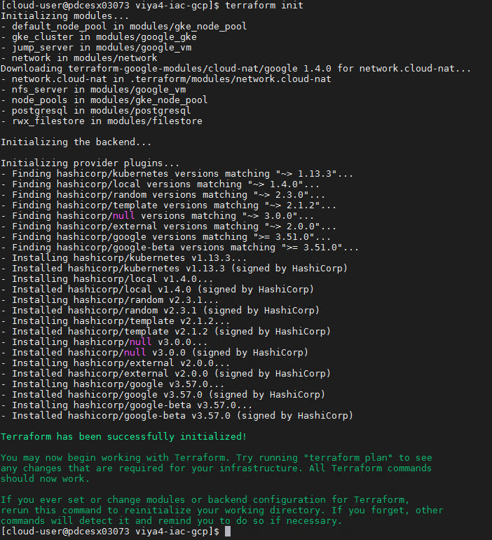

  The important part is **"Terraform has been successfully initialized!"**

## Provision the GKE cluster with Terraform

### Create an ssh key

* An ssh key needs to be created in case we create a jumphost VM with Terraform

    ```bash
    # ensure there is a .ssh dir in $HOME
    ansible localhost -m file \
        -a "path=$HOME/.ssh mode=0700 state=directory"

    # ensure there is an ssh key that we can use
    ansible localhost -m openssh_keypair \
        -a "path=~/.ssh/id_rsa type=rsa size=2048" --diff
    ```

### Customize the Terraform variables

There are many "knobs and buttons" that you can play with in the TF templates using the variables.

See this [page](https://github.com/sassoftware/viya4-iac-gcp/blob/main/variables.tf) in the IAC-GCP project for the list of available variables and default values.

You can also consult [this page](https://github.com/sassoftware/viya4-iac-gcp/blob/main/docs/CONFIG-VARS.md) for a complete and readable list of the variables.

An important decision to make while creating the TF variable files is whether you want to use a regional or zonal location.

See this [page](https://github.com/sassoftware/viya4-iac-gcp/blob/main/docs/user/Locations.md) to understand the differences.
In this exercise we set the location to a sepcific zone.

As an example, try to find which variable to use to increase the sizing of my external PostgreSQL Database.

Let's create our Terraform variables file:

* ```gel-vars.tfvars``` with multiple node pools specialized : cas node pool, compute node pool, stateless and stateful node pool.

* Before generating the ```gel-vars.tfvars``` file with our own values , let's make sure they are not empty.

    ```bash
    GCPPROJECT=$(cat ~/gcpproject.txt)
    GCPREGION=$(cat ~/gcpregion.txt)
    GCPZONE=$(cat ~/gcpzone.txt)
    STUDENT=$(cat ~/student.txt)
    SA_KEY_FILE=$(cat ~/gcpsakeyfile.txt)
    #make sure we have everything we need
    echo "GCP Project: ${GCPPROJECT}
    GCP Region: ${GCPREGION}
    GCP Zone: ${GCPZONE}
    Student: ${STUDENT}
    Student Email: ${STUDENTEMAIL}
    SA Key file: ${SA_KEY_FILE}"
    ```

* Review the values of the variables. Make sure they ALL have the expected value (otherwhise Terraform will not be able to build the GKE cluster)

* Run this block of commands to populate the TF variables file:

    ```bash
    # Populate the TF variables file
    cd ~/project/gcp/viya4-iac-gcp

    tee  ~/project/gcp/viya4-iac-gcp/gel-vars.tfvars > /dev/null << EOF

    # !NOTE! - These are only a subset of variables.tf provided for sample.
    # Customize this file to add any variables from 'variables.tf' that you want
    # to change their default values.

    # ****************  REQUIRED VARIABLES  ****************
    # These required variables' values MUST be provided by the User
    prefix                  = "${STUDENT}v4"
    location                = "${GCPZONE}" # e.g., "us-east1-b""
    project                 = "${GCPPROJECT}"
    service_account_keyfile = "${SA_KEY_FILE}"
    ssh_public_key          = "~/.ssh/id_rsa.pub"
    #
    # ****************  REQUIRED VARIABLES  ****************

    # Create shareable kubeconfig : default to using the cloud providers mechanism for generating the kubeconfig file.
    create_static_kubeconfig = true

    # "temporary" Hack to change the default hardcoded GKE subnet range to avoid IP range conflicts between peers networks
    gke_subnet_cidr = "192.168.8.0/23"

    # Configuring Node auto-provisioning
    enable_cluster_autoscaling = false

    # Source address ranges to allow client admin access to the cloud resources
    default_public_access_cidrs = ["149.173.0.0/16"] # e.g., ["123.45.6.89/32"]

    # add labels to the created resources
    tags = { "resourceowner" = "${STUDENT}" , project_name = "sasviya4gcp", environment = "dev", gel_project = "deployviya4gcp" } # e.g., { "key1" = "value1", "key2" = "value2" }

    # Postgres config
    create_postgres                  = true # set this to "false" when using internal Crunchy Postgres
    postgres_ssl_enforcement_enabled = true
    postgres_administrator_password  = "mySup3rS3cretPassw0rd"

    # GKE config
    kubernetes_version         = "latest"
    default_nodepool_min_nodes = 1
    default_nodepool_max_nodes = 2
    default_nodepool_vm_type    = "e2-standard-4"

    # Node Pools config
    node_pools = {
    cas = {
        "vm_type"      = "n1-highmem-4"
        "os_disk_size" = 200
        "min_nodes"    = 1
        "max_nodes"    = 5
        "node_taints"  = ["workload.sas.com/class=cas:NoSchedule"]
        "node_labels" = {
        "workload.sas.com/class" = "cas"
        }
        "local_ssd_count" = 1
        "accelerator_count" = 0
        "accelerator_type" = ""
    },
    compute = {
        "vm_type"      = "n1-highmem-4"
        "os_disk_size" = 200
        "min_nodes"    = 1
        "max_nodes"    = 1
        "node_taints"  = ["workload.sas.com/class=compute:NoSchedule"]
        "node_labels" = {
        "workload.sas.com/class"        = "compute"
        "launcher.sas.com/prepullImage" = "sas-programming-environment"
        }
        "local_ssd_count" = 1
        "accelerator_count" = 0
        "accelerator_type" = ""
    },
    connect = {
        "vm_type"      = "n1-highmem-4"
        "os_disk_size" = 200
        "min_nodes"    = 1
        "max_nodes"    = 1
        "node_taints"  = ["workload.sas.com/class=connect:NoSchedule"]
        "node_labels" = {
        "workload.sas.com/class"        = "connect"
        "launcher.sas.com/prepullImage" = "sas-programming-environment"
        }
        "local_ssd_count" = 1
        "accelerator_count" = 0
        "accelerator_type" = ""
    },
    stateless = {
        "vm_type"      = "e2-standard-16"
        "os_disk_size" = 200
        "min_nodes"    = 0
        "max_nodes"    = 2
        "node_taints"  = ["workload.sas.com/class=stateless:NoSchedule"]
        "node_labels" = {
        "workload.sas.com/class" = "stateless"
        }
        "local_ssd_count" = 0
        "accelerator_count" = 0
        "accelerator_type" = ""
    },
    stateful = {
        "vm_type"      = "e2-standard-8"
        "os_disk_size" = 200
        "min_nodes"    = 0
        "max_nodes"    = 3
        "node_taints"  = ["workload.sas.com/class=stateful:NoSchedule"]
        "node_labels" = {
        "workload.sas.com/class" = "stateful"
        }
        "local_ssd_count" = 0
        "accelerator_count" = 0
        "accelerator_type" = ""
    }
    }

    # Jump Box
    create_jump_public_ip = true
    jump_vm_admin         = "jumpuser"

    # Storage for SAS Viya CAS/Compute
    storage_type = "ha"
    EOF
    ```

* Take a moment to review and understand the content of the files. It defines how our Kubernetes cluster will look like in the Google Cloud.
* It defines the node pools and what kind of GCP Instance sizes will be used for the Kubernetes Workers

### Generate a Terraform plan

* Let's generate the TF plan corresponding to the GKE cluster with multile node pools :

    ```bash
    # generate the TF plan corresponding to the GKE cluster with multiple node pools
    cd ~/project/gcp/viya4-iac-gcp
    terraform plan -input=false \
        -var-file=./gel-vars.tfvars \
        -out ./my-gcp.plan
    ```

* Now you should see something like that :

    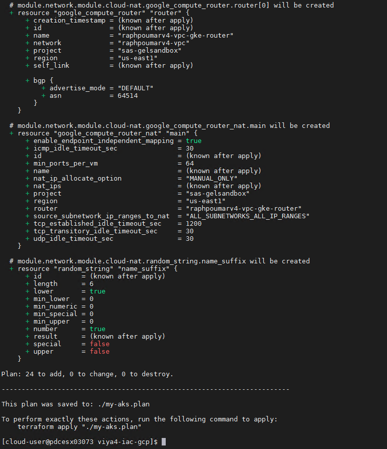

* Review the generated plan

    ```sh
    TFPLAN=my-gcp.plan
    cd ~/project/gcp/viya4-iac-gcp
    terraform show ${TFPLAN}
    ```

* The plan shows all the infrastructure components that will be created in GCP to support the Viya deployment : Virtual network, Subnets, Public IPs, Network Security Groups, a GCP Postgres DB, a GKE Kubernetes Cluster with several node pools and associated instance types.

## Stand up GKE cluster and Validate

### Apply the Terraform plan

* Now let's deploy the GKE cluster with the TF plan.
* In our testing it takes less than 10 minutes.

    ```bash
    # Deploy the GKE cluster with the TF plan
    TFPLAN=my-gcp.plan
    cd ~/project/gcp/viya4-iac-gcp
    time terraform apply "./${TFPLAN}" 2>&1 \
    | tee -a /tmp/terraform-apply.log
    ```

* Now, you can see the progress of the Terraform plan being executed to provision the GKE infrastructure.

    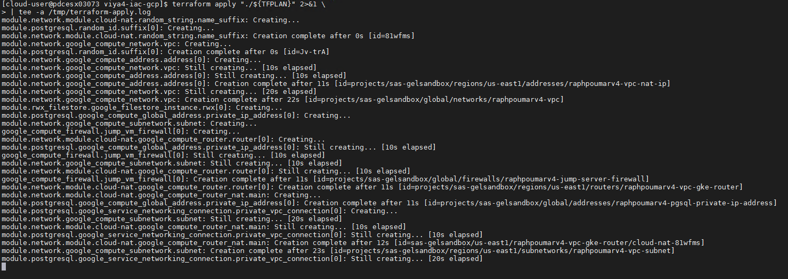

* Finally, in the terminal window, you should see some green text reporting that the TF plan run is now complete.

  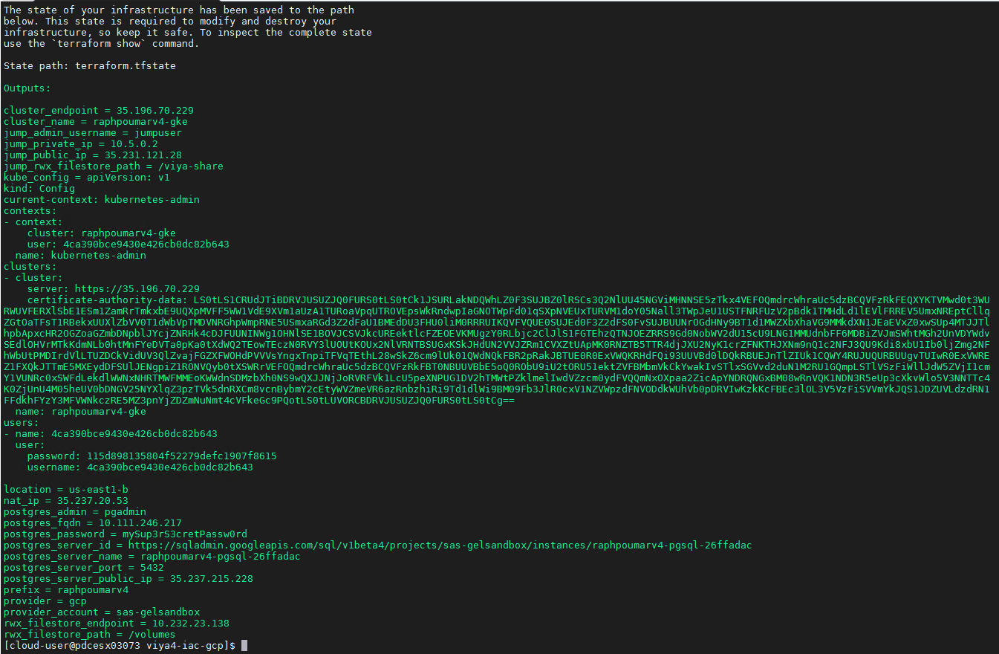

* Browse in the GCP portal to see if the Kubernetes cluster was created

    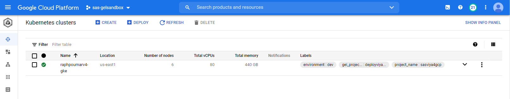

    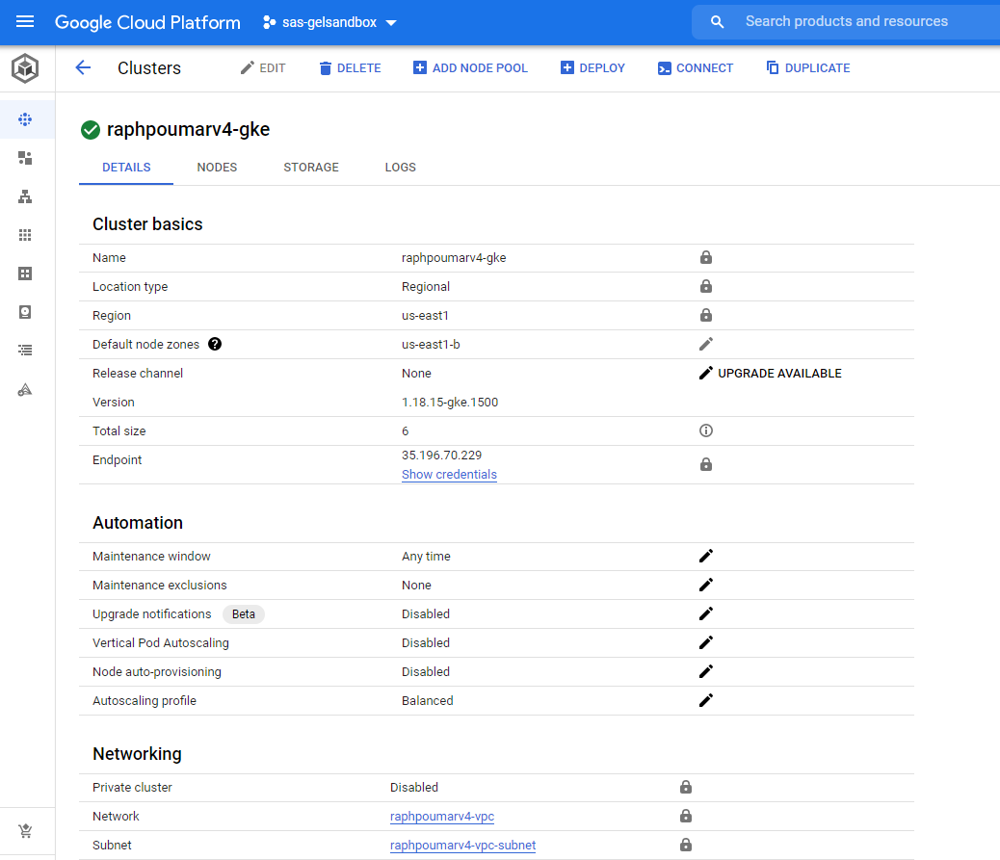

### Getting the kubectl config file for your newly built GCP cluster

* First, let's generate the config file with a recognizable name:

    ```bash
    # generate the config file with a recognizable name
    cd ~/project/gcp/viya4-iac-gcp
    mkdir -p ~/.kube
    terraform output kube_config > ~/.kube/${STUDENT}-gke-kubeconfig.conf
    ```

* Then, let's make a symlink to it for easier access:

    ```bash
    SOURCEFOLDER=~/.kube/${STUDENT}-gke-kubeconfig.conf
    ansible localhost -m file \
        -a "src=$SOURCEFOLDER \
            dest=~/.kube/config state=link" \
        --diff
    ```

* If you have the application "Lens" on your desktop, and if you are VPN'ed directly to Cary, you can use that config file to configure Lens.

* Now run the kubectl command to check if your cluster is there !

    ```bash
    kubectl get nodes
    ```

* You should see something like that :

    ```log
    NAME                                         STATUS   ROLES    AGE   VERSION
    gke-raphpoumarv4-gke-cas-d91ef56a-nvxv       Ready    <none>   59m   v1.18.16-gke.500
    gke-raphpoumarv4-gke-compute-2cbc9f88-07l5   Ready    <none>   59m   v1.18.16-gke.500
    gke-raphpoumarv4-gke-default-e35b0e40-m1zb   Ready    <none>   59m   v1.18.16-gke.500
    ```

    (probably with a more recent kubernetes version)
## If you need to delete the GKE cluster

WARNING: __DO NOT DO THIS IF YOU PLAN TO CONTNUE WITH THE NEXT GKE HANDS-ON__

### Use Terraform

* Execute the command below to delete the GKE cluster and the associated resources.

    ```sh
    cd ~/project/gcp/viya4-iac-gcp
    terraform destroy -var-file gel-vars.tfvars \
        -state terraform.tfstate \
        -lock=false \
        -force \
        -input=false
    #because of  https://github.com/sassoftware/viya4-iac-gcp/issues/47
    terraform state rm -state terraform.tfstate module.postgresql[0].google_sql_user.default[0]
    terraform destroy -var-file gel-vars.tfvars \
        -state terraform.tfstate \
        -lock=false \
        -force \
        -input=false
    # remove the TF state, so next time we start clean
    rm ~/project/gcp/viya4-iac-gcp/terraform.tfstate
    ```

### Use gcloud commands

* Make sure your variables are in place

    ```sh
    GCPPROJECT=$(cat ~/gcpproject.txt)
    GCPREGION=$(cat ~/gcpregion.txt)
    GCPZONE=$(cat ~/gcpzone.txt)
    STUDENT=$(cat ~/student.txt)
    SA_KEY_FILE=$(cat ~/gcpsakeyfile.txt)
    echo "GCP Project: ${GCPPROJECT}
    GCP Region: ${GCPREGION}
    GCP Zone: ${GCPZONE}
    Student: ${STUDENT}
    SA Key file: ${SA_KEY_FILE}"
    ```

* Generate the deletion script for your specific cluster (and associated infrastructure pieces)

    ```sh
    # generate the deletion script
    bash /home/cloud-user/PSGEL255-deploying-viya-4.0.1-on-kubernetes/scripts/gcp-gen-deletion-script.sh  -k ${SA_KEY_FILE} -p ${GCPPROJECT} -s ${STUDENT}> /tmp/todelete.sh
    ```

* Review the generated deletion script for your specific cluster (and associated infrastructure pieces)

    ```sh
    # generate the deletion script
    less /tmp/todelete.sh
    ```

* If you are happy with the result run the deletion script for your specific cluster (and associated infrastructure pieces)

    ```sh
    # run the deletion script
    bash /tmp/todelete.sh
    ```

* You will likely see some deletion ERRORs, you can ignore them.

## Troubleshooting

if the Terraform apply fails. For example : some resources already exist.

* remove the existing resources
* re-run the terraform plan command
* re-run the terraform apply command

## Navigation

<!-- startnav -->
* [01 Introduction / 01 031 Booking a Lab Environment for the Workshop](/01_Introduction/01_031_Booking_a_Lab_Environment_for_the_Workshop.md)
* [01 Introduction / 01 032 Assess Readiness of Lab Environment](/01_Introduction/01_032_Assess_Readiness_of_Lab_Environment.md)
* [01 Introduction / 01 033 CheatCodes](/01_Introduction/01_033_CheatCodes.md)
* [02 Kubernetes and Containers Fundamentals / 02 131 Learning about Namespaces](/02_Kubernetes_and_Containers_Fundamentals/02_131_Learning_about_Namespaces.md)
* [03 Viya 4 Software Specifics / 03 011 Looking at a Viya 4 environment with Visual Tools DEMO](/03_Viya_4_Software_Specifics/03_011_Looking_at_a_Viya_4_environment_with_Visual_Tools_DEMO.md)
* [03 Viya 4 Software Specifics / 03 051 Create your own Viya order](/03_Viya_4_Software_Specifics/03_051_Create_your_own_Viya_order.md)
* [03 Viya 4 Software Specifics / 03 056 Getting the order with the CLI](/03_Viya_4_Software_Specifics/03_056_Getting_the_order_with_the_CLI.md)
* [04 Pre Requisites / 04 081 Pre Requisites automation with Viya4-ARK](/04_Pre-Requisites/04_081_Pre-Requisites_automation_with_Viya4-ARK.md)
* [05 Deployment tools / 05 121 Setup a Windows Client Machine](/05_Deployment_tools/05_121_Setup_a_Windows_Client_Machine.md)
* [06 Deployment Steps / 06 031 Deploying a simple environment](/06_Deployment_Steps/06_031_Deploying_a_simple_environment.md)
* [06 Deployment Steps / 06 051 Deploying Viya with Authentication](/06_Deployment_Steps/06_051_Deploying_Viya_with_Authentication.md)
* [06 Deployment Steps / 06 061 Deploying in a second namespace](/06_Deployment_Steps/06_061_Deploying_in_a_second_namespace.md)
* [06 Deployment Steps / 06 071 Removing Viya deployments](/06_Deployment_Steps/06_071_Removing_Viya_deployments.md)
* [06 Deployment Steps / 06 081 Deploying a programing only environment](/06_Deployment_Steps/06_081_Deploying_a_programing-only_environment.md)
* [06 Deployment Steps / 06 091 Deployment Operator setup](/06_Deployment_Steps/06_091_Deployment_Operator_setup.md)
* [06 Deployment Steps / 06 093 Using the DO with a Git Repository](/06_Deployment_Steps/06_093_Using_the_DO_with_a_Git_Repository.md)
* [06 Deployment Steps / 06 095 Using an inline configuration](/06_Deployment_Steps/06_095_Using_an_inline_configuration.md)
* [06 Deployment Steps / 06 097 Using the Orchestration Tool](/06_Deployment_Steps/06_097_Using_the_Orchestration_Tool.md)
* [06 Deployment Steps / 06 101 Create Viya Deployment Roles](/06_Deployment_Steps/06_101_Create_Viya_Deployment_Roles.md)
* [07 Deployment Customizations / 07 021 Configuring SASWORK](/07_Deployment_Customizations/07_021_Configuring_SASWORK.md)
* [07 Deployment Customizations / 07 051 Adding a local registry to k8s](/07_Deployment_Customizations/07_051_Adding_a_local_registry_to_k8s.md)
* [07 Deployment Customizations / 07 052 Using mirror manager to populate the local registry](/07_Deployment_Customizations/07_052_Using_mirror_manager_to_populate_the_local_registry.md)
* [07 Deployment Customizations / 07 053 Deploy from local registry](/07_Deployment_Customizations/07_053_Deploy_from_local_registry.md)
* [07 Deployment Customizations / 07 091 Configure SAS ACCESS Engine](/07_Deployment_Customizations/07_091_Configure_SAS_ACCESS_Engine.md)
* [07 Deployment Customizations / 07 101 Configure SAS ACCESS TO HADOOP](/07_Deployment_Customizations/07_101_Configure_SAS_ACCESS_TO_HADOOP.md)
* [07 Deployment Customizations / 07 102 Parallel loading with EP for Hadoop](/07_Deployment_Customizations/07_102_Parallel_loading_with_EP_for_Hadoop.md)
* [09 Validation / 09 011 Validate the Viya deployment](/09_Validation/09_011_Validate_the_Viya_deployment.md)
* [09 Validation / 09 021 SAS Viya deployment reports](/09_Validation/09_021_SAS_Viya_deployment_reports.md)
* [11 Azure AKS Deployment / 11 000 Navigating the AKS Hands on Deployment Options](/11_Azure_AKS_Deployment/11_000_Navigating_the_AKS_Hands-on_Deployment_Options.md)
* [11 Azure AKS Deployment / 11 999 Fast track with cheatcodes](/11_Azure_AKS_Deployment/11_999_Fast_track_with_cheatcodes.md)
* [11 Azure AKS Deployment/Fully Automated / 11 500 Full Automation of AKS Deployment](/11_Azure_AKS_Deployment/Fully_Automated/11_500_Full_Automation_of_AKS_Deployment.md)
* [11 Azure AKS Deployment/Fully Automated / 11 590 Cleanup](/11_Azure_AKS_Deployment/Fully_Automated/11_590_Cleanup.md)
* [11 Azure AKS Deployment/Standard / 11 100 Creating an AKS Cluster](/11_Azure_AKS_Deployment/Standard/11_100_Creating_an_AKS_Cluster.md)
* [11 Azure AKS Deployment/Standard / 11 110 Performing the prerequisites](/11_Azure_AKS_Deployment/Standard/11_110_Performing_the_prerequisites.md)
* [11 Azure AKS Deployment/Standard/Cleanup / 11 400 Cleanup](/11_Azure_AKS_Deployment/Standard/Cleanup/11_400_Cleanup.md)
* [11 Azure AKS Deployment/Standard/Manual / 11 200 Deploying Viya 4 on AKS](/11_Azure_AKS_Deployment/Standard/Manual/11_200_Deploying_Viya_4_on_AKS.md)
* [11 Azure AKS Deployment/Standard/Manual / 11 210 Deploy a second namespace in AKS](/11_Azure_AKS_Deployment/Standard/Manual/11_210_Deploy_a_second_namespace_in_AKS.md)
* [11 Azure AKS Deployment/Standard/Manual / 11 220 CAS Customizations](/11_Azure_AKS_Deployment/Standard/Manual/11_220_CAS_Customizations.md)
* [11 Azure AKS Deployment/Standard/Manual / 11 230 Install monitoring and logging](/11_Azure_AKS_Deployment/Standard/Manual/11_230_Install_monitoring_and_logging.md)
* [12 Amazon EKS Deployment / 12 010 Access Environments](/12_Amazon_EKS_Deployment/12_010_Access_Environments.md)
* [12 Amazon EKS Deployment / 12 020 Provision Resources](/12_Amazon_EKS_Deployment/12_020_Provision_Resources.md)
* [12 Amazon EKS Deployment / 12 030 Deploy SAS Viya](/12_Amazon_EKS_Deployment/12_030_Deploy_SAS_Viya.md)
* [13 Google GKE Deployment / 13 011 Creating a GKE Cluster](/13_Google_GKE_Deployment/13_011_Creating_a_GKE_Cluster.md)**<-- you are here**
* [13 Google GKE Deployment / 13 021 Performing Prereqs in GKE](/13_Google_GKE_Deployment/13_021_Performing_Prereqs_in_GKE.md)
* [13 Google GKE Deployment / 13 031 Deploying Viya 4 on GKE](/13_Google_GKE_Deployment/13_031_Deploying_Viya_4_on_GKE.md)
* [13 Google GKE Deployment / 13 041 Full Automation of GKE Deployment](/13_Google_GKE_Deployment/13_041_Full_Automation_of_GKE_Deployment.md)
* [13 Google GKE Deployment / 13 099 Fast track with cheatcodes](/13_Google_GKE_Deployment/13_099_Fast_track_with_cheatcodes.md)
<!-- endnav -->
