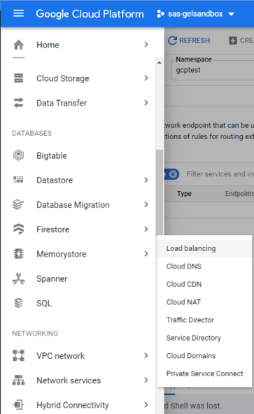
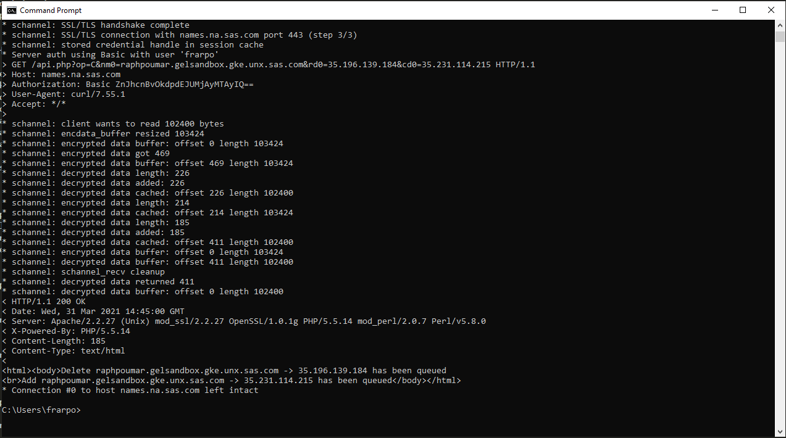

**WORK IN PROGRESS**

# Performing Pre-reqs in GKE (Google Kubernetes Engine)

* [What do we need?](#what-do-we-need)
* [Create the project folder](#create-the-project-folder)
* [Install the NGINX ingress controller](#install-the-nginx-ingress-controller)
* [Define a DNS entry for the GCP external IP](#define-a-dns-entry-for-the-gcp-external-ip)
  * [Manual method](#manual-method)
  * [Automated method (with curl)](#automated-method-with-curl)
* [Create New StorageClass to support RWX](#create-new-storageclass-to-support-rwx)
* [Install Kustomize](#install-kustomize)
* [Create the namespace](#create-the-namespace)
* [Deploy GELLDAP in our namespace](#deploy-gelldap-in-our-namespace)
* [Copy the OKViya script](#copy-the-okviya-script)
* [Install yq](#install-yq)
* [Install cert-manager](#install-cert-manager)
* [Install Metrics server (for HPA)](#install-metrics-server-for-hpa)
* [Deploy the cloud-sql-proxy](#deploy-the-cloud-sql-proxy)
* [Create the cloud-sql-proxy Deployment and Service](#create-the-cloud-sql-proxy-deployment-and-service)
* [References](#references)
* [Navigation](#navigation)

## What do we need?

Before being in position to deploy Viya on GKE, there are a few things that we need :

* Install Kustomize
* a Viya Order (Deployment Assets)
* An Ingress controller
* An LDAP Server

There are also "nice to have" stuff such as the OKViya4 tool to monitor services startup, mirror manager (in case  we'd like to setup our own registry), the tools for monitoring and alerting, etc...

## Create the project folder

* Create a directory for our project

  ```bash
  # create the project folder
  mkdir -p ~/project/deploy/gcptest
  ```

## Install the NGINX ingress controller

Reference <https://cloud.google.com/community/tutorials/nginx-ingress-gke>

* run the code below to install the NGINX ingress controller

    ```bash
    cd ~/project/gcp/viya4-iac-gcp
    # Get the Cloud NAT IP
    export NATIP=$(terraform output nat_ip)
    # Create the NGNIX namespace
    kubectl delete ns ingress-nginx
    kubectl create ns ingress-nginx
    # Install the Helm repo
    helm repo add ingress-nginx https://kubernetes.github.io/ingress-nginx
    # Install the ingress controller (NGINX)
    # We install it in HA mode
    # We allow the Cary network IP range to access
    helm install  ingress-nginx --namespace ingress-nginx  \
            --set controller.service.externalTrafficPolicy=Local \
            --set controller.service.sessionAffinity=None \
            --set controller.service.loadBalancerSourceRanges="{149.173.0.0/16,$NATIP/32}" \
            --set controller.config.use-forwarded-headers="true" \
            --set controller.autoscaling.enabled=true \
            --set controller.autoscaling.minReplicas=2 \
            --set controller.autoscaling.maxReplicas=5 \
            --set controller.resources.requests.cpu=100m \
            --set controller.resources.requests.memory=500Mi \
            --set controller.autoscaling.targetCPUUtilizationPercentage=90 \
            --set controller.autoscaling.targetMemoryUtilizationPercentage=90 \
            --version 3.20.1 \
            ingress-nginx/ingress-nginx

    kubectl wait -n ingress-nginx --for=condition=available  --all deployments --timeout=60s
    kubectl wait -n ingress-nginx --for=condition=available  --all deployments --timeout=60s
    ```

* After you've deployed nginx, you can run :

  ```sh
  kubectl get svc -n ingress-nginx
  ```

* and you'll get the external IP of the Load Balancer for that IP.
* You can even store it into an environment variable.

    <!-- for cheatcodes
    ```bash
    #wait 20 sec for the external IP to be allocatd by GCP
    sleep 20
    ```
    -->

    ```bash
    LBIP=$(kubectl get service -n ingress-nginx | grep LoadBalancer | awk '{print $4}')
    echo $LBIP
    ```

  It is a useful information and you will see that we use it later.

  It corresponds to the Load-balancer's external IP assigned to the GKE cluster which is also visible in the GCP console.

  In the left panel of the GCP web console, Naviguate until you find the "Networking" section and the "Load-balancing" item.

    

    

  _Note : until we deploy an application the instances are marked as unhealty_

  

  The public IP allows the access to our Viya 4 applications from the outside.

## Define a DNS entry for the GCP external IP

* Real life customers will likely have their own domains and be in position to request named or wildcard DNS aliases to support as many Viya environments as they want in the same GKE cluster.

* Here, instead SAS Employees can use names.na.sas.com (SAS internal DNS Self-Service).

* You will need to using your own laptop/desktop session and not the RACE client machine to interact with "names.na.sas.com"

### Manual method

1. go to <https://names.na.sas.com>, enter your credentials, and select on the Home screen the option to add a new Alias :

    

1. Since we want to add an alias to an existing host, select that option:

    

1. The next screen asks to type the new hostname ("host info") and associated value, type the `<YOUR_FQDN>` value and paste the GCP **external IP address** that was created before:

    

    Theoretically, you could type any "host info" (as long as it is not used/reserved and allowed), but let's stick to some convention:

   `<STUDENT>.gelsandbox.gke.unx.sas.com`

    Where `<STUDENT>` corresponds to the user ID created in the previous [Hands-on](../13_Google_GKE_Deployment/13_011_Creating_a_GKE_Cluster.md), run the code below if you don't remember its value.

    ```sh
    STUDENT=$(cat ~/student.txt)
    echo $STUDENT
    ```

   Example: `raphpoumar.gelsandbox.gke.unx.sas.com`

1. **IMPORTANT**:
   * Make sure you keep the word `gelsandbox` in your alias. This way, we (the GEL team) can periodically clean up those stale aliases out of the DNS! (in case you forget to do it).
   * If you are doing this outside of the workshop, **DO NOT** use the word `gelsandbox` in your alias!

1. Let's note this new host name as `<YOUR_GKE_HOST>`.

1. The next 2 screens are confirmation screens (be sure to read all the information). You also have the possibility to get a confirmation email when the alias creation is done. I suggest you do so.

1. Don't forget to click **Submit** on the last screen:

    

    

1. If you asked for a confirmation email, you should receive something email similar to the one below.

  

### Automated method (with curl)

There is a way to automate the previous manual steps using curl and the names.sas.com API.
As a SAS Employee you can create DNS alias using the https://names.na.sas.com/ server (read this [page](https://names.na.sas.com/new.html) to understand how to use the API).

However, since the RACE machine does not have access to any SAS internal resources, you need to run the actual API code from your own machine's terminal.

* If you are running Windows 10 on your SAS laptop, you might have "curl" pre-installed and available from the DOS command (If you have version 1803 or later of Windows 10, cURL is installed by default.)
* Otherwhise you can install WSL (Windows Subsystem for Linux) and use [ubuntu](https://ubuntu.com/tutorials/ubuntu-on-windows#1-overview)
* Mac users should be able to use an integrated Unix terminal.

* First generate the commands block from the RACE environment:

    ```sh
    USER="<replace with your SAS ID>"
    LBIP=$(kubectl get service -n ingress-nginx | grep LoadBalancer | awk '{print $4}')
    INGFQDN="${STUDENT}.gelsandbox.gke.unx.sas.com"
    OLDIP=$(nslookup $INGFQDN | awk -F':' '/^Address: / {matched = 1} matched {print $2}' |xargs)
    echo "Command to associate " ${INGFQDN} " to "${LBIP}" :
    **********************************************************
    CURL METHOD (ADD):
    curl -kv -u "$USER" \"https://names.na.sas.com/api.php?op=A&nm0="${INGFQDN}"&rd0="${LBIP}\""
    **********************************************************
    CURL METHOD (UPDATE - if the NAME already exists):
    curl -kv -u "$USER" \"https://names.na.sas.com/api.php?op=C&nm0="${INGFQDN}"&rd0="${OLDIP}"&cd0="${LBIP}\""
    **********************************************************
    You will have to copy the command above and run it from your own SAS laptop"
    ```

* MAKE SURE YOU CAN SEE THE VARIABLES VALUE FROM THE PREVIOUS STEP
* Copy the Code Block from the RACE environment
* Now, start a new terminal or DOS session ON YOUR OWN LAPTOP, to do the next steps

* If it is the first time and the name entry does not already existss, run the command generated to ADD the DNS entry.
* Otherwhise, if there is already a DNS entry but you need to update the associated IP address, run the command to UPDATE the associated IP address.

* For example if you are updating the IP associated to your hostname, you should see something like that :

  

* You should receive an email shortly.

<!-- #### Using the python scripts

* Install Python 3 if it is not already there:

    ```sh
    sudo yum install python36
    #install requests module as our scripts need it
    sudo pip3 install requests
    ```

* Get the python scripts

    ```sh
    mkdir names
    curl https://gitlab.sas.com/GEL/workshops/PSGEL255-deploying-viya-4.0.1-on-kubernetes/-/raw/feature/GKE_HO/scripts/names/names.py -o names/names.py
    curl https://gitlab.sas.com/GEL/workshops/PSGEL255-deploying-viya-4.0.1-on-kubernetes/-/raw/feature/GKE_HO/scripts/names/add_alias.py -o names/add_alias.py
    ```

* Now, run the command that you generated earlier, as in the example below (you will be prompted to provide your SAS corporate credentials):

     -->

## Create New StorageClass to support RWX

* By default, we have only 3 storage classes in GCP.
* We must define a storageClass in which we explicitly set mountOptions for each PVC in order to allow non-root users to access them.
* We will use the Google File Store that was provisionned by the IAC tool.

  

* We need to install an NFS provisionner and connect it to our Google File Store.

* First let's get the Google Filestore IP address

    ```bash
    #let's get the GFS IP Address
    STUDENT=$(cat ~/student.txt)
    export NFSIP=$(gcloud filestore instances list | grep ${STUDENT}v4-rwx-filestore | awk '{print $6}')
    ```

* Now we install the NFS provisionner and create a new Storage class using our Google File Store instance.

    ```bash
    kubectl delete ns nfs
    kubectl create ns nfs
    helm repo add ckotzbauer https://ckotzbauer.github.io/helm-charts
    helm repo update
    helm install  nfs \
        --set nfs.server=${NFSIP} \
        --set nfs.path=/volumes \
        --namespace nfs \
        --version  1.0.2 \
        --set podSecurityPolicy.enabled=true \
        --set storageClass.name="sas-gke" \
        --set storageClass.archiveOnDelete=false \
        --set nfs.mountOptions="{noatime,nodiratime,'rsize=262144','wsize=262144'}" \
        ckotzbauer/nfs-client-provisioner
    ```

## Install Kustomize

* Run the code below to download kustomize.

    ```bash
    cd /tmp ; ansible localhost \
      -b --become-user=root \
      -m get_url -a  \
        "url=https://github.com/kubernetes-sigs/kustomize/releases/download/kustomize%2Fv3.7.0/kustomize_v3.7.0_linux_amd64.tar.gz \
        dest=/tmp/kustomize.tgz \
        validate_certs=no \
        force=yes \
        owner=root \
        mode=0755 \
        backup=yes" \
        --diff
    ```

* Prepare and check kustomize

    ```bash
    cd /tmp/ ; tar xf /tmp/kustomize.tgz
    sudo cp /tmp/kustomize /usr/local/bin/kustomize
    sudo chmod 755 /usr/local/bin/kustomize
    sudo chown root:root /usr/local/bin/kustomize
    kustomize version --short
    ```

## Create the namespace

* Create a namespace for our gcptest environment

    ```bash
    kubectl delete ns gcptest
    kubectl create ns gcptest
    kubectl get ns

    ```

* Make it the default namespace:

    ```bash
    kubectl config set-context --current --namespace=gcptest
    ```

## Deploy GELLDAP in our namespace

* Let's copy the gelldap artifacts from the payload directory:

    ```bash
    # copy gelldap deployment artifcats
    cp -R ~/payload/gelldap ~/project/
    ```

* Deploy GELLDAP into the namespace

    ```bash
    # Deploy GELLDAP into the gcptest namespace
    cd ~/project/gelldap/
    kustomize build ./no_TLS/ | kubectl -n gcptest apply -f -

    ```

* To confirm that the pod is running:

    ```bash
    #confirm that the gelldap pod is running
    kubectl -n gcptest get all,cm -l app.kubernetes.io/part-of=gelldap

    ```

## Copy the OKViya script

* The OKViya script is a very handy tool to manage the Viya 4 applications (get status, start, stop), let's get it from the payload tarball.

    ```bash
    # Copy the OKViya script from the payload
    cp ~/payload/gel_OKViya4/gel_OKViya4.sh* \
        ~/project/deploy/gcptest

    ```

## Install yq

* **yq** is a very handy tool to manipulate yaml files. Let's install it.

    ```bash
    VERSION=3.4.0
    BINARY=yq_linux_386
    wget https://github.com/mikefarah/yq/releases/download/${VERSION}/${BINARY} -O /tmp/yq
    sudo cp /tmp/yq /usr/local/bin/yq
    sudo chmod 755 /usr/local/bin/yq
    sudo chown root:root /usr/local/bin/yq
    yq --version
    ```

## Install cert-manager

* We install cert-manager in its own namespace

    ```bash
    kubectl delete namespace cert-manager
    kubectl create namespace cert-manager
    helm repo add jetstack https://charts.jetstack.io
    helm repo update
    helm install cert-manager jetstack/cert-manager \
        --namespace cert-manager \
        --version v1.0.3  \
        --set installCRDs=true \
        --set extraArgs='{--enable-certificate-owner-ref=true}'

    ```

_Note : it is required in order to configure front door TLS, enable internal Via services communications encryption, and also to deploy the Viya logging tool (Kibana) with TLS._

## Install Metrics server (for HPA)

* Install the K8s metrics server

    ```bash
    kubectl apply -f https://github.com/kubernetes-sigs/metrics-server/releases/download/v0.3.6/components.yaml

    ```

## Deploy the cloud-sql-proxy

You only need to do that if you are using the external PostgreSQL.

* Create a Kubernetes secret with the GCP service account key:

    ```bash
    SA_KEY_FILE=$(cat ~/gcpsakeyfile.txt)
    kubectl create secret generic cloud-sql-proxy-credentials --from-file=service_account.json=${SA_KEY_FILE}
    ```

## Create the cloud-sql-proxy Deployment and Service

* run this code to create the manifest

    ```bash
    cd ~/project/gcp/viya4-iac-gcp
    PGSERVERNAME=$(terraform output postgres_server_name)
    GCPPROJECT=$(cat ~/gcpproject.txt)
    GCPREGION=$(cat ~/gcpregion.txt)
    # check the values
    echo "GCP Project: ${GCPPROJECT}
    GCP Region: ${GCPREGION}
    PGSERVERNAME: ${PGSERVERNAME}"
    # generate the cloud-sql-proxy manifest content
    cat > /tmp/create-cloud-sql-proxy.yaml << EOF
    ---
    apiVersion: v1
    kind: Service
    metadata:
      name: cloud-sql-proxy
    spec:
      selector:
        app: cloud-sql-proxy
      ports:
        - protocol: TCP
          port: 5432
          targetPort: 5432
    ---
    apiVersion: apps/v1
    kind: Deployment
    metadata:
      name: cloud-sql-proxy
    spec:
      selector:
        matchLabels:
          app: cloud-sql-proxy
      template:
        metadata:
          labels:
            app: cloud-sql-proxy
        spec:
          containers:
          - name: cloud-sql-proxy
            image: gcr.io/cloudsql-docker/gce-proxy:1.17
            command:
              - "/cloud_sql_proxy"
              - "-instances=${GCPPROJECT}:${GCPREGION}:${PGSERVERNAME}=tcp:0.0.0.0:5432"
              - "-credential_file=/secrets/service_account.json"
            securityContext:
              runAsNonRoot: true
            volumeMounts:
            - name: credentials
              mountPath: /secrets/
              readOnly: true
          volumes:
          - name: credentials
            secret:
              secretName: cloud-sql-proxy-credentials
    EOF
    kubectl apply -f /tmp/create-cloud-sql-proxy.yaml
    ```

## References

<https://rndconfluence.sas.com/confluence/display/RNDDEVOPS/GCP+Liaisons>

## Navigation

<!-- startnav -->
* [01 Introduction / 01 031 Booking a Lab Environment for the Workshop](/01_Introduction/01_031_Booking_a_Lab_Environment_for_the_Workshop.md)
* [01 Introduction / 01 032 Assess Readiness of Lab Environment](/01_Introduction/01_032_Assess_Readiness_of_Lab_Environment.md)
* [01 Introduction / 01 033 CheatCodes](/01_Introduction/01_033_CheatCodes.md)
* [02 Kubernetes and Containers Fundamentals / 02 131 Learning about Namespaces](/02_Kubernetes_and_Containers_Fundamentals/02_131_Learning_about_Namespaces.md)
* [03 Viya 4 Software Specifics / 03 011 Looking at a Viya 4 environment with Visual Tools DEMO](/03_Viya_4_Software_Specifics/03_011_Looking_at_a_Viya_4_environment_with_Visual_Tools_DEMO.md)
* [03 Viya 4 Software Specifics / 03 051 Create your own Viya order](/03_Viya_4_Software_Specifics/03_051_Create_your_own_Viya_order.md)
* [03 Viya 4 Software Specifics / 03 056 Getting the order with the CLI](/03_Viya_4_Software_Specifics/03_056_Getting_the_order_with_the_CLI.md)
* [04 Pre Requisites / 04 081 Pre Requisites automation with Viya4-ARK](/04_Pre-Requisites/04_081_Pre-Requisites_automation_with_Viya4-ARK.md)
* [05 Deployment tools / 05 121 Setup a Windows Client Machine](/05_Deployment_tools/05_121_Setup_a_Windows_Client_Machine.md)
* [06 Deployment Steps / 06 031 Deploying a simple environment](/06_Deployment_Steps/06_031_Deploying_a_simple_environment.md)
* [06 Deployment Steps / 06 051 Deploying Viya with Authentication](/06_Deployment_Steps/06_051_Deploying_Viya_with_Authentication.md)
* [06 Deployment Steps / 06 061 Deploying in a second namespace](/06_Deployment_Steps/06_061_Deploying_in_a_second_namespace.md)
* [06 Deployment Steps / 06 071 Removing Viya deployments](/06_Deployment_Steps/06_071_Removing_Viya_deployments.md)
* [06 Deployment Steps / 06 081 Deploying a programing only environment](/06_Deployment_Steps/06_081_Deploying_a_programing-only_environment.md)
* [06 Deployment Steps / 06 091 Deployment Operator setup](/06_Deployment_Steps/06_091_Deployment_Operator_setup.md)
* [06 Deployment Steps / 06 093 Using the DO with a Git Repository](/06_Deployment_Steps/06_093_Using_the_DO_with_a_Git_Repository.md)
* [06 Deployment Steps / 06 095 Using an inline configuration](/06_Deployment_Steps/06_095_Using_an_inline_configuration.md)
* [06 Deployment Steps / 06 097 Using the Orchestration Tool](/06_Deployment_Steps/06_097_Using_the_Orchestration_Tool.md)
* [06 Deployment Steps / 06 101 Create Viya Deployment Roles](/06_Deployment_Steps/06_101_Create_Viya_Deployment_Roles.md)
* [07 Deployment Customizations / 07 021 Configuring SASWORK](/07_Deployment_Customizations/07_021_Configuring_SASWORK.md)
* [07 Deployment Customizations / 07 051 Adding a local registry to k8s](/07_Deployment_Customizations/07_051_Adding_a_local_registry_to_k8s.md)
* [07 Deployment Customizations / 07 052 Using mirror manager to populate the local registry](/07_Deployment_Customizations/07_052_Using_mirror_manager_to_populate_the_local_registry.md)
* [07 Deployment Customizations / 07 053 Deploy from local registry](/07_Deployment_Customizations/07_053_Deploy_from_local_registry.md)
* [07 Deployment Customizations / 07 091 Configure SAS ACCESS Engine](/07_Deployment_Customizations/07_091_Configure_SAS_ACCESS_Engine.md)
* [07 Deployment Customizations / 07 101 Configure SAS ACCESS TO HADOOP](/07_Deployment_Customizations/07_101_Configure_SAS_ACCESS_TO_HADOOP.md)
* [07 Deployment Customizations / 07 102 Parallel loading with EP for Hadoop](/07_Deployment_Customizations/07_102_Parallel_loading_with_EP_for_Hadoop.md)
* [09 Validation / 09 011 Validate the Viya deployment](/09_Validation/09_011_Validate_the_Viya_deployment.md)
* [09 Validation / 09 021 SAS Viya deployment reports](/09_Validation/09_021_SAS_Viya_deployment_reports.md)
* [11 Azure AKS Deployment / 11 000 Navigating the AKS Hands on Deployment Options](/11_Azure_AKS_Deployment/11_000_Navigating_the_AKS_Hands-on_Deployment_Options.md)
* [11 Azure AKS Deployment / 11 999 Fast track with cheatcodes](/11_Azure_AKS_Deployment/11_999_Fast_track_with_cheatcodes.md)
* [11 Azure AKS Deployment/Fully Automated / 11 500 Full Automation of AKS Deployment](/11_Azure_AKS_Deployment/Fully_Automated/11_500_Full_Automation_of_AKS_Deployment.md)
* [11 Azure AKS Deployment/Fully Automated / 11 590 Cleanup](/11_Azure_AKS_Deployment/Fully_Automated/11_590_Cleanup.md)
* [11 Azure AKS Deployment/Standard / 11 100 Creating an AKS Cluster](/11_Azure_AKS_Deployment/Standard/11_100_Creating_an_AKS_Cluster.md)
* [11 Azure AKS Deployment/Standard / 11 110 Performing the prerequisites](/11_Azure_AKS_Deployment/Standard/11_110_Performing_the_prerequisites.md)
* [11 Azure AKS Deployment/Standard/Cleanup / 11 400 Cleanup](/11_Azure_AKS_Deployment/Standard/Cleanup/11_400_Cleanup.md)
* [11 Azure AKS Deployment/Standard/Manual / 11 200 Deploying Viya 4 on AKS](/11_Azure_AKS_Deployment/Standard/Manual/11_200_Deploying_Viya_4_on_AKS.md)
* [11 Azure AKS Deployment/Standard/Manual / 11 210 Deploy a second namespace in AKS](/11_Azure_AKS_Deployment/Standard/Manual/11_210_Deploy_a_second_namespace_in_AKS.md)
* [11 Azure AKS Deployment/Standard/Manual / 11 220 CAS Customizations](/11_Azure_AKS_Deployment/Standard/Manual/11_220_CAS_Customizations.md)
* [11 Azure AKS Deployment/Standard/Manual / 11 230 Install monitoring and logging](/11_Azure_AKS_Deployment/Standard/Manual/11_230_Install_monitoring_and_logging.md)
* [12 Amazon EKS Deployment / 12 010 Access Environments](/12_Amazon_EKS_Deployment/12_010_Access_Environments.md)
* [12 Amazon EKS Deployment / 12 020 Provision Resources](/12_Amazon_EKS_Deployment/12_020_Provision_Resources.md)
* [12 Amazon EKS Deployment / 12 030 Deploy SAS Viya](/12_Amazon_EKS_Deployment/12_030_Deploy_SAS_Viya.md)
* [13 Google GKE Deployment / 13 011 Creating a GKE Cluster](/13_Google_GKE_Deployment/13_011_Creating_a_GKE_Cluster.md)
* [13 Google GKE Deployment / 13 021 Performing Prereqs in GKE](/13_Google_GKE_Deployment/13_021_Performing_Prereqs_in_GKE.md)**<-- you are here**
* [13 Google GKE Deployment / 13 031 Deploying Viya 4 on GKE](/13_Google_GKE_Deployment/13_031_Deploying_Viya_4_on_GKE.md)
* [13 Google GKE Deployment / 13 041 Full Automation of GKE Deployment](/13_Google_GKE_Deployment/13_041_Full_Automation_of_GKE_Deployment.md)
* [13 Google GKE Deployment / 13 099 Fast track with cheatcodes](/13_Google_GKE_Deployment/13_099_Fast_track_with_cheatcodes.md)
<!-- endnav -->
