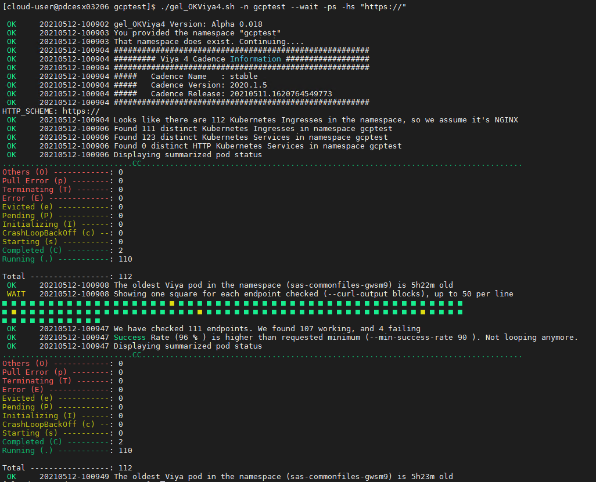
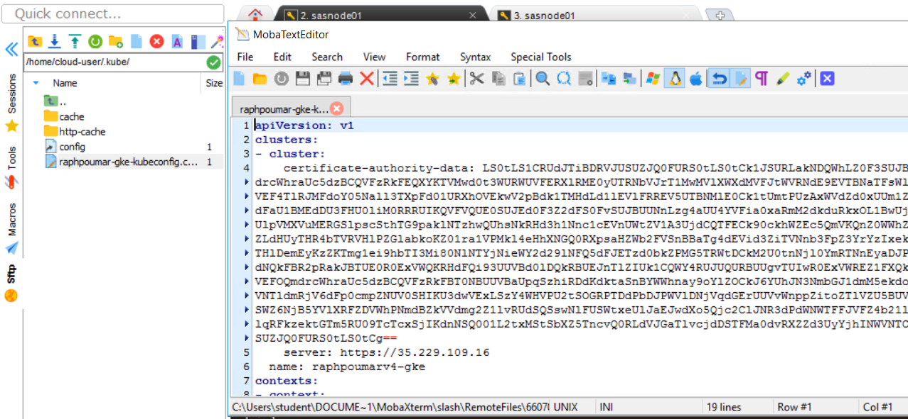
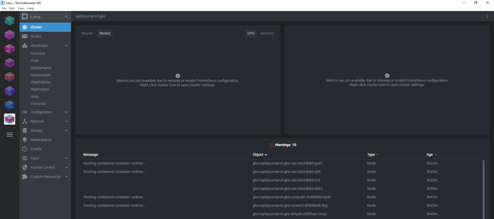
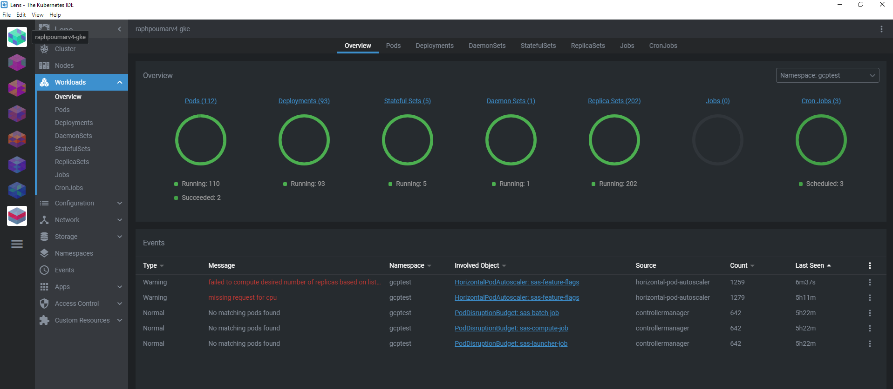

**WORK IN PROGRESS**
# Deploy Viya 4 in GKE

* [Prepare the Order's Deployment Assets](#prepare-the-orders-deployment-assets)
* [Create a site-config directory](#create-a-site-config-directory)
* [Creating a sitedefault file](#creating-a-sitedefault-file)
* [Creating a TLS-related file in `./site-config/`](#creating-a-tls-related-file-in-site-config)
* [Deploy Viya in our GKE cluster](#deploy-viya-in-our-gke-cluster)
  * [Kustomize the gcptest deployment](#kustomize-the-gcptest-deployment)
    * [Prepare the configuration](#prepare-the-configuration)
    * [Write the kustomization.yaml file](#write-the-kustomizationyaml-file)
  * [Configure CAS MPP](#configure-cas-mpp)
  * [Build step](#build-step)
  * [Deployment : Apply the Kubernetes manifests](#deployment--apply-the-kubernetes-manifests)
  * [Troubleshooting](#troubleshooting)
* [Monitor the Viya services startup](#monitor-the-viya-services-startup)
  * [Waiting for the environment to report "ready" state](#waiting-for-the-environment-to-report-ready-state)
  * [Monitor with OKViya](#monitor-with-okviya)
    * [Watching the environment come up](#watching-the-environment-come-up)
  * [Monitor the cluster with lens](#monitor-the-cluster-with-lens)
* [Validation](#validation)
  * [Connect to your Viya applications](#connect-to-your-viya-applications)
  * [Make sure you are on the Cary Network](#make-sure-you-are-on-the-cary-network)
* [Remove the Viya Deployment](#remove-the-viya-deployment)
  * [Delete the namespace](#delete-the-namespace)
* [Stop and restart Viya](#stop-and-restart-viya)
  * [Commands to scale down to 0 the Viya environment (STOP)](#commands-to-scale-down-to-0-the-viya-environment-stop)
  * [Commands to scale up the Viya environment (RESTART)](#commands-to-scale-up-the-viya-environment-restart)
* [Troubleshooting](#troubleshooting-1)
  * [Error exceed quotas limited: count/ingresses.networking.k8s.io=100 when applying the manifest](#error-exceed-quotas-limited-countingressesnetworkingk8sio100-when-applying-the-manifest)
  * [The deployment is stuck with only 30 to 50% of the pods in a running state](#the-deployment-is-stuck-with-only-30-to-50-of-the-pods-in-a-running-state)
  * [Almost all my pods are fully READY except a few ones](#almost-all-my-pods-are-fully-ready-except-a-few-ones)
  * [A Consul pod is not running](#a-consul-pod-is-not-running)
* [Navigation](#navigation)

## Prepare the Order's Deployment Assets

<!--
Several Order's Deployment assets are available in our payload directory (they were collected from : <https://gelweb.race.sas.com/scripts/PSGEL255/orders/>)

For more details on these orders and their content, consult [this page](01_Introduction/01_999_OrdersIndex.md)

* Run the code below to extract the Order's deployment assets from the payload tarball and make them available for our deployment.

    ```sh
    # Set the order and copy the deployment assets from the payload archive in deploy gcptest dir

    # Determine ORDER deployment assets filename
    ORDER_FILE=$(ls ~/payload/orders \
        | grep ${ORDER} \
        | grep ${CADENCE_NAME} \
        | grep ${CADENCE_VERSION} \
        | sort \
        | tail -n 1 \
        )

    echo $ORDER_FILE
    # Copy the ORDER deployment assets
    cp ~/payload/orders/${ORDER_FILE} ~/project/deploy/gcptest
    cd ~/project/deploy/gcptest
    rm -Rf sas-bases
    # Extract the deployment assets
    tar xf $ORDER_FILE && rm $ORDER_FILE
    ``` -->

1. In order to keep the materials in this course up to date, we will use a script to generate the assets.

1. In a normal scenario, you would :
   1. log in to the <https://my.sas.com/> portal and
   1. download a .tgz file containing your assets
   1. explode the .tgz into the `~/project/deploy/gcptest/` directory
   1. which would create `~/project/deploy/gcptest/sas-bases`

1. Instead, the script will do all of that for us.

1. Please run the following command (copy-paste all lines together)

    ```bash
    CADENCE_NAME='stable'
    CADENCE_VERSION='2020.1.5'

    bash /opt/gellow_code/scripts/common/generate_sas_bases.sh \
          --cadence-name ${CADENCE_NAME} \
          --cadence-version ${CADENCE_VERSION} \
          --order-nickname 'simple' \
          --output-folder ~/project/deploy/gcptest
    ```

## Create a site-config directory

* We need to create a "site-config" to store our specific configuration (it is a separated space from the Software provided manifests).

    ```bash
    mkdir -p ~/project/deploy/gcptest/site-config/
    cd ~/project/deploy/gcptest

    ```

## Creating a sitedefault file

* Since we installed GELLDAP we can pre-configure the LDAP access.
* Let's copy the provided file in the proper location:

    ```bash
    # Copy the gelldap site-default
    cp ~/project/gelldap/no_TLS/gelldap-sitedefault.yaml \
       ~/project/deploy/gcptest/site-config/

    ```

<!-- * Generate a sitedefault.yaml just to define the default password for the sasboot account

    ```sh
    tee  ~/project/deploy/gcptest/site-config/sitedefault.yaml > /dev/null << "EOF"
    ---
    config:
      application:
        sas.logon.initial:
          user: sasboot
          password: lnxsas
    EOF
    ```
-->

## Creating a TLS-related file in `./site-config/`

By default since the 2020.0.6 version, all internal communications are TLS encrypted.

* Prepare the TLS configuration

    ```bash
    cd ~/project/deploy/gcptest
    mkdir -p ./site-config/security/
    # create the certificate issuer called "sas-viya-issuer"
    sed 's|{{.*}}|sas-viya-issuer|g' ./sas-bases/examples/security/cert-manager-provided-ingress-certificate.yaml  \
        > ./site-config/security/cert-manager-provided-ingress-certificate.yaml

    ```

## Deploy Viya in our GKE cluster

### Kustomize the gcptest deployment

#### Prepare the configuration

<!-- * **Temporary note : Current Viya4 deployment doesn't support for SSL of GCP Postgresql server. <https://rndjira.sas.com/browse/DOPL-1099>** -->

<!-- * **Temporary workaround : sas-consul HA is not working yet - see <https://rndjira.sas.com/browse/NGMTS-16145>**

    ```sh
    mkdir -p ~/project/deploy/gcptest/site-config/consulworkaround
    cat > ~/project/deploy/gcptest/site-config/consulworkaround/consul-transformer.yaml  <<-EOF
    ---
    apiVersion: builtin
    kind: PatchTransformer
    metadata:
      name: ss-node-count
    patch: |-
        - op: replace
          path: /spec/replicas
          value:
            1
    target:
      group: apps
      kind: StatefulSet
      version: v1
      annotationselector: sas.com/component-name in (sas-consul-server)
    ---
    apiVersion: builtin
    kind: PatchTransformer
    metadata:
      name: consul-cluster-node-count
    patch: |-
        - op: replace
          path: /spec/template/spec/containers/0/env/0/value
          value:
            "1"
    target:
      group: apps
      kind: StatefulSet
      annotationselector: sas.com/component-name in (sas-consul-server)
      version: v1
    EOF
    ``` -->

In this step we edit the kustomization.yaml file in order to generate Kubernetes manifests that are :

* Using a custom Storage Class to support RWX access for components that needs it (CAS, backup manager, etc...)
* Using an external GCP PostgreSQL server
* No TLS (as it is not supported yet with GCP Postgresql server) - TLS lines commented out.

* First, let's create the patch that we will refer to for the storage class.

    ```bash
    mkdir -p ~/project/deploy/gcptest/site-config/patches
    cat > ~/project/deploy/gcptest/site-config/patches/storage-class.yaml <<-EOF
    kind: PersistentStorageClass
    metadata:
      name: wildcard
    spec:
      storageClassName: sas-gke #GCP file with sas UID/GID
    EOF
    ```

* Get the ingress name (based on the convention used to define the hostname in previous [hands-on](../13_Google_GKE_Deployment/13_021_Performing_Prereqs_in_GKE.md) )

    ```bash
    STUDENT=$(cat ~/student.txt)
    echo $STUDENT
    export INGRESS_SUFFIX=${STUDENT}.gelsandbox.gke.unx.sas.com
    echo $INGRESS_SUFFIX
    ```

* look in the TF output to get the database connection settings

    ```bash
    cd /home/cloud-user/project/gcp/viya4-iac-gcp
    terraform output
    ```

* here is an example of what you can see

    ```log
    [cloud-user@pdcesx11134 viya4-iac-gcp]$ terraform output
    cluster_endpoint = 35.231.59.120
    cluster_name = raphpoumarv4-gke
    jump_admin_username = jumpuser
    jump_private_ip = 10.5.0.2
    jump_public_ip = 35.190.170.169
    jump_rwx_filestore_path = /viya-share
    kube_config = apiVersion: v1
    kind: Config
    current-context: kubernetes-admin
    contexts:
    - context:
        cluster: raphpoumarv4-gke
        user: daddd467c9e44909292c133a5b30
    name: kubernetes-admin
    clusters:
    - cluster:
        server: https://35.231.59.120
        certificate-authority-data: LS0tLS1CRUdJTiBDRVJUSUZJQ0FURS0tLS0tCk1JSURLakNDQWhLZ0F3SUJBZ0lRR01xRnlsbmt2UURDNG4wd0ZOSURlVEFOQmdrcWhraUc5dzBCQVFzRkFEQXYKTVMwd0t3WURWUVFERXlRek5UTmxaakZtWmkwMk...SUZJQ0FURS0tLS0tCg==
    name: raphpoumarv4-gke
    users:
    - name: daddd467c9e44909292c133a5b30
    user:
        password: 9be4a2234517512080e8d0d54693b3d3
        username: daddd467c9e44909292c133a5b30

    location = us-east1-b
    nat_ip = 35.231.192.13
    postgres_admin = pgadmin
    postgres_fqdn = 10.111.243.26
    postgres_password = mySup3rS3cretPassw0rd
    postgres_server_id = https://sqladmin.googleapis.com/sql/v1beta4/projects/sas-gelsandbox/instances/raphpoumarv4-pgsql-5a7ccafe
    postgres_server_name = raphpoumarv4-pgsql-5a7ccafe
    postgres_server_port = 5432
    postgres_server_public_ip = 35.237.9.208
    prefix = raphpoumarv4
    provider = gcp
    provider_account = sas-gelsandbox
    rwx_filestore_endpoint = 10.116.78.34
    rwx_filestore_path = /volumes
    ```

* Get the private IP of the PostgreSQL server

    ```bash
    cd ~/project/gcp/viya4-iac-gcp
    # Private IP of the PostgreSQL server. Use this value to set DATABASE_HOST in your Viya deployment.
    #export DATABASEHOST=$(terraform output postgres_fqdn)
    # Since we use the cloud-sql-proxy we need the cloud-sql-proxy service ClusterIP - see https://rndjira.sas.com/browse/IAC-223
    export DATABASEHOST=$(kubectl get service cloud-sql-proxy | grep 5432 | awk '{print $3}')
    echo $DATABASEHOST
    ```

#### Write the kustomization.yaml file

* Create the kustomization.yaml file with the external postgres DB configuration.

    ```bash
    echo student: $STUDENT
    echo ingress: $INGRESS_SUFFIX
    echo extdbip: $DATABASEHOST
    cat > ~/project/deploy/gcptest/kustomization.yaml <<-EOF
    ---
    namespace: gcptest
    resources:
      - sas-bases/base
      - sas-bases/overlays/cert-manager-issuer     # TLS
      - sas-bases/overlays/network/ingress
      - sas-bases/overlays/network/ingress/security   # TLS
    #  - sas-bases/overlays/internal-postgres
    #  - sas-bases/overlays/crunchydata
      - sas-bases/overlays/cas-server
      - sas-bases/overlays/update-checker       # added update checker
      - sas-bases/overlays/cas-server/auto-resources    # CAS-related
      - sas-bases/overlays/internal-elasticsearch   # Stable 2020.1.3
    configurations:
      - sas-bases/overlays/required/kustomizeconfig.yaml  # required for 0.6
    transformers:
      - sas-bases/overlays/network/ingress/security/transformers/product-tls-transformers.yaml   # TLS
      - sas-bases/overlays/network/ingress/security/transformers/ingress-tls-transformers.yaml   # TLS
      - sas-bases/overlays/network/ingress/security/transformers/backend-tls-transformers.yaml   # TLS
      - sas-bases/overlays/external-postgres/googlecloud-full-stack-tls-transformer.yaml         # TLS required with GCP external PG when using Full stack TLS (see https://rndjira.sas.com/browse/DOPL-1099)
      - sas-bases/overlays/internal-elasticsearch/internal-elasticsearch-transformer.yaml    # Stable 2020.1.3
      - sas-bases/overlays/internal-elasticsearch/sysctl-transformer.yaml                    # Stable 2020.1.3 (must be after TLS but before required/transformers)

      - sas-bases/overlays/required/transformers.yaml
    #  - sas-bases/overlays/internal-postgres/internal-postgres-transformer.yaml
      - sas-bases/overlays/external-postgres/external-postgres-transformer.yaml
      - site-config/security/cert-manager-provided-ingress-certificate.yaml     # TLS
      - sas-bases/overlays/cas-server/auto-resources/remove-resources.yaml    # CAS-related
      # - sas-bases/overlays/scaling/zero-scale/phase-0-transformer.yaml
      # - sas-bases/overlays/scaling/zero-scale/phase-1-transformer.yaml

      # workaround for consul (no HA support - https://rndjira.sas.com/browse/NGMTS-16145)
      #- site-config/consulworkaround/consul-transformer.yaml

    # set our custom Storage Class for PersistentVolumeClaims
    # a new SC is required to support ReadWriteMany access
    # Note: annotationSelector is how we limit which PV use GCP filestore(RWX) versus default RWO (GCP Disks).
    patches:
      - path: site-config/patches/storage-class.yaml
        target:
          kind: PersistentVolumeClaim
          annotationSelector: sas.com/component-name in (sas-cas-operator,sas-backup-job,sas-event-stream-processing-studio-app,sas-reference-data-deploy-utilities,sas-data-quality-services,sas-model-publish,sas-commonfiles) # Stable 2020.1.4 : adding sas-commonfiles

    configMapGenerator:
      - name: ingress-input
        behavior: merge
        literals:
          - INGRESS_HOST=${INGRESS_SUFFIX}

      - name: sas-shared-config
        behavior: merge
        literals:
          - SAS_SERVICES_URL=https://${INGRESS_SUFFIX} #TLS
    #      - SAS_SERVICES_URL=http://${INGRESS_SUFFIX} #TLS

      - name: sas-postgres-config
        behavior: merge
        literals:
          - DATABASE_HOST=$DATABASEHOST
          - DATABASE_PORT=5432
          - DATABASE_SSL_ENABLED="false"
          - DATABASE_NAME=SharedServices
          - EXTERNAL_DATABASE="true"
          - SAS_DATABASE_DATABASESERVERNAME="postgres"

    secretGenerator:
      - name: postgres-sas-user
        literals:
          - username=pgadmin
          - password=mySup3rS3cretPassw0rd

      - name: sas-consul-config            ## This injects content into consul. You can add, but not replace
        behavior: merge
        files:
          - SITEDEFAULT_CONF=site-config/gelldap-sitedefault.yaml ## with 2020.1.5, the sitedefault.yaml config becomes a secretGenerator


    EOF
    ```

After you revise the base kustomization.yaml file, continue your SAS Viya deployment as documented.

### Configure CAS MPP

* By default CAS is installed with SMP
* Run the commands below to configure CAS with 3 workers.

    ```bash
    # Copy the PatchTransformer from the examples
    sudo cp -p ~/project/deploy/gcptest/sas-bases/examples/cas/configure/cas-manage-workers.yaml \
          ~/project/deploy/gcptest/site-config/cas-manage-workers.yaml

    # Set the required number of workers
    _numberOfWorkers=3

    # Modify the project site-config/cas-manage-workers.yaml file with the required number of workers
    sudo sed -i "s/{{ NUMBER-OF-WORKERS }}/${_numberOfWorkers}/g" \
         ~/project/deploy/gcptest/site-config/cas-manage-workers.yaml

    # Add a new transformer
    printf "
    - command: update
      path: transformers[+]
      value:
        site-config/cas-manage-workers.yaml
    " | yq -I 4 w -i -s - ~/project/deploy/gcptest/kustomization.yaml
    ```

### Build step

* At this point, we are ready to generate or populate the Kubernetes manifest files with Kustomize.

    ```bash
    cd ~/project/deploy/gcptest
    kustomize build -o site.yaml
    ```

### Deployment : Apply the Kubernetes manifests

* We are now ready to apply the manifests in our GKE cluster to deploy and start the Viya 4 containers:

  There are 3 level of admin in the resources defined in the site.yaml :
  * "cluster-wide" (operators/crds, service accounts, roles)
  * "cluster-local" (rolebindings, pvc, config map, secrets, podtemplates)
  * "namespace" (the rest of the resources)

  Each resource has a label for it, the key is "sas.com/admin" and the value is one of the 3 levels
  (You can search for "sas.com/admin: <administration scope level>" keyword in the site.yaml to see the corresponding resources)

  To show that a different K8s permission level is required depending on the type of resources created, we will use 3 distinct commands for the deployment.

    ```bash
    cd ~/project/deploy/gcptest
    # Apply the "cluster wide" configuration in site.yaml (CRDs, Roles, Service Accounts)
    kubectl apply --selector="sas.com/admin=cluster-wide" -f site.yaml
    # Wait for Custom Resource Deployment to be deployed
    kubectl wait --for condition=established --timeout=60s -l "sas.com/admin=cluster-wide" crd
    ```

    The previous commands requires a cluster level access (cluster-admin role) and create "cluster wide" resources (that do not ony applies to a namespace but to the cluster in general : such as operators, roles and service accounts)

    The next command required a cluster-local permission.

    ```bash
    #Apply the "cluster local" configuration in site.yaml and delete all the other "cluster local" resources that are not in the file (essentially config maps)
    kubectl apply --selector="sas.com/admin=cluster-local" -f site.yaml --prune
    ```

    Finally the next command can be run by a namespace admin.

    ```bash
    # Apply the configuration in manifest.yaml that matches label "sas.com/admin=namespace" and delete all the other resources that are not in the file and match label "sas.com/admin=namespace".
    kubectl apply --selector="sas.com/admin=namespace" -f site.yaml --prune
    ```

    Doing this will create all required content in kubernetes and start up the process.

* For the next time we want to start the Viya 4 containers, you can simply reapply the site.yaml file with the command below (since the components created outside of the namespace scope will already be there)

    ```bash
    cd ~/project/deploy/gcptest
    kubectl -n gcptest apply -f site.yaml
    ```

### Troubleshooting

* When running the "apply" command, you might get an error message from the GKE service like :

    ```log
    Error from server (Forbidden): error when creating "site.yaml": ingresses.networking.k8s.io "sas-theme-designer-app" is forbidden: exceeded quota: gke-resource-quotas, requested: count/ingresses.networking.k8s.io=1, used: count/ingresses.networking.k8s.io=100, limited: count/ingresses.networking.k8s.io=100
    Error from server (Forbidden): error when creating "site.yaml": ingresses.networking.k8s.io "sas-themes" is forbidden: exceeded quota: gke-resource-quotas, requested: count/ingresses.networking.k8s.io=1, used: count/ingresses.networking.k8s.io=100, limited: count/ingresses.networking.k8s.io=100
    Error from server (Forbidden): error when creating "site.yaml": ingresses.networking.k8s.io "sas-thumbnails" is forbidden: exceeded quota: gke-resource-quotas, requested: count/ingresses.networking.k8s.io=1, used: count/ingresses.networking.k8s.io=100, limited: count/ingresses.networking.k8s.io=100
    Error from server (Forbidden): error when creating "site.yaml": ingresses.networking.k8s.io "sas-transfer" is forbidden: exceeded quota: gke-resource-quotas, requested: count/ingresses.networking.k8s.io=1, used: count/ingresses.networking.k8s.io=100, limited: count/ingresses.networking.k8s.io=100
    ...
    Error from server (Forbidden): error when creating "site.yaml": ingresses.networking.k8s.io "sas-web-data-access" is forbidden: exceeded quota: gke-resource-quotas, requested: count/ingresses.networking.k8s.io=1, used: count/ingresses.networking.k8s.io=100, limited: count/ingresses.networking.k8s.io=100
    ```

It will not prevent you to perform the deployment. If you see these messages, just re-run the kubectl apply commands.
## Monitor the Viya services startup

* There are several ways to monitor your Viya deployment progress.
* Pick one of the method presented below (sas-readiness, GEL_OKViya4 script, Lens)
* If after 50-70 minutes your environment is still not ready ...it's time to start debugging.
* Make sure you are not in one of the situation described in the [Troubleshooting](#troubleshooting) paragraph.
* If not you can use commands like "kubectl describe" or "kubectl logs" to troubleshoot your issues.

_Note: The Kubernetes Lens tool is also very handy to look at logs and Kuberenetes events (you can learn a lot about Kubernetes just by using it)._

### Waiting for the environment to report "ready" state

* The following command will only return when the environment is ready (or after 45 minutes):

    ```sh
    time kubectl -n gcptest wait \
         --for=condition=ready \
         pod \
         --selector='app.kubernetes.io/name=sas-readiness' \
          --timeout=2700s

    ```

* The following command will monitor the log of the readiness pod:

    ```sh
    watch -c -n 20 'kubectl -n gcptest logs \
         --selector=app.kubernetes.io/name=sas-readiness \
          | tail -n 1  '

    ```

### Monitor with OKViya

#### Watching the environment come up

* With the `gel_OKViya4.sh` script:

    ```sh
    cd ~/project/deploy/gcptest
    ./gel_OKViya4.sh -n gcptest --wait -ps -hs "https://"
    ```

* If you prefer to see the gcptested URL (showing the curl command with the ingress host), you can type :

    ```sh
    cd ~/project/deploy/gcptest
    ./gel_OKViya4.sh -n gcptest --wait -ps -co lines -hs "https://"
    ```

* At the end you should see something like :

  

* You can also use tmux to have a multi-windows monitoring:

* This will kick off a tmux session called "gcptest_watch":

    ```sh
    #watch kubectl get pods -o wide -n gcptest

    SessName=gcptest_watch

    tmux new -s $SessName -d
    tmux send-keys -t $SessName "time ~/project/deploy/gcptest/gel_OKViya4.sh -n gcptest --wait --pod-status"  C-m
    tmux split-window -v -t $SessName
    tmux send-keys -t $SessName "watch 'kubectl get pods -o wide -n gcptest | grep 0/ | grep -v Completed '"  C-m

    ```

* And this will attach you to it:

    ```sh
    tmux attach -t $SessName
    ```

### Monitor the cluster with lens

* What is [Lens](https://github.com/lensapp/lens/) ?

  * Lens is a great IDE to take control of your Kubernetes cluster.
  * It is a standalone application for MacOS, Windows and Linux operating systems.
  * It is open source and free.

* In the Lens github project, click on "Releases", then download and install Lens on your machine.

* Get your Cluster config file

* In Mobaxterm, click on the "SFTP" tab,
* Then navigate to /home/cloud-user/.kube/
* And open the file "kubeconfig" file

  


* Copy the content of the config file.

* Open Lens, click on "Add cluster" for "Choose config", select "Custom"

  

* and paste the content of the config file.

* Click on "Add Cluster" and then you should see something that looks like that :

  

* You can see the nodes, pods, configuration, logs etc... very easily. You can also start a Terminal from there to run kubectl commands against your Cluster.

* A successful deployment would look like that in Lens:

  

<!-- ### Monitor the Cluster-autoscaler

During the deployment, then when you stop and restart the Viya services, the GKE Cluster autoscaler will either provision additionnal nodes or decomission them to meet the pods requests.
There is a way to monitor the progress of the Cloud autoscaler (and potentially identify if it is stalled) in Kubernetes.
Kubernetes keep track of the autoscaler status in the cluster-auto-scaler configMap (in the kube-system namespace).

* If you are using Lens you can see it easily:

  

* Otherwhise you can run the command to get the cluster auto-scaler status at a point in time :

    ```sh
    kubectl -n kube-system describe cm cluster-autoscaler-status
    ```

* Monitor the status in real time

    ```sh
    watch "kubectl -n kube-system describe cm cluster-autoscaler-status | grep -e 'status\|Name\:\|\Health\:'"
    ```

* You should see something like this :

    

* Finally you can also monitor the Kubernetes events and filter on a specific pattern, for example :

    ```sh
    kubectl get events --sort-by=.metadata.creationTimestamp -n gcptest | grep ScaleUp
    ``` -->

## Validation

### Connect to your Viya applications

* Run the command below to get the url printed in the Cloud Shell terminal, then you can just click on it (with the CTRL key).

    ```bash
    echo "https://${STUDENT}.gelsandbox.gke.unx.sas.com"
    ```

If the SAS Logon page appears, then connect as ```sastest1``` or ```sasadm``` (password is "lnxsas"). Otherwhise look at the next section.

### Make sure you are on the Cary Network

* If you see something like that when you try to open the url :

  

  It is likely that your workstation has an IP that is not in the authorized IP range to access the environment.

  By default in the ingress definition, we allowed the Cary Headquarter IP range. So the best way to get an IP in this range from your own workstation is to be on the Cary Direct VPN (profile 3 usually).

## Remove the Viya Deployment

### Delete the namespace

* To get rid of the environment delete the whole namespace.

    ```sh
    kubectl delete ns gcptest
    ```

Note that everything will be deleted, including the persistent volumes holding user's content and data.

## Stop and restart Viya

### Commands to scale down to 0 the Viya environment (STOP)

* Add a new transformer for the scale down to 0 of some of the resources (phase 0)

    ```sh
    # Add a new transformer
    printf "
    - command: update
      path: transformers[+]
      value:
        sas-bases/overlays/scaling/zero-scale/phase-0-transformer.yaml
    " | yq -I 4 w -i -s - ~/project/deploy/gcptest/kustomization.yaml
    ```

* Rebuild the manifest

    ```sh
    cd ~/project/deploy/gcptest
    kustomize build -o site.yaml
    ```

* Apply the updated site.yaml file to your deployment:

    ```sh
    kubectl apply -f site.yaml
    ```

* Wait for CAS operator-managed pods to get deleted:

    ```sh
    kubectl -n test wait --for=delete -l casoperator.sas.com/server=default pods
    ```

* Add an other new transformer for the scale down to 0 of the rest of the resources (phase 1)

    ```sh
    # Add a new transformer
    printf "
    - command: update
      path: transformers[+]
      value:
        sas-bases/overlays/scaling/zero-scale/phase-1-transformer.yaml
    " | yq -I 4 w -i -s - ~/project/deploy/gcptest/kustomization.yaml
    ```

* Rebuild the manifest

    ```sh
    cd ~/project/deploy/gcptest
    kustomize build -o site.yaml
    ```

* Apply the updated site.yaml file to your deployment:

    ```sh
    kubectl apply -f site.yaml
    ```

### Commands to scale up the Viya environment (RESTART)

* Remove the 2 lines, rebuild and reapply.

    ```sh
    yq d -i ~/project/deploy/gcptest/kustomization.yaml 'transformers(.==sas-bases/overlays/scaling/zero-scale/phase-0-transformer.yaml)'
    yq d -i ~/project/deploy/gcptest/kustomization.yaml 'transformers(.==sas-bases/overlays/scaling/zero-scale/phase-1-transformer.yaml)'
    ```

* Rebuild the manifest

    ```sh
    cd ~/project/deploy/gcptest
    kustomize build -o site.yaml
    ```

* Apply the updated site.yaml file to your deployment:

    ```sh
    kubectl apply -f site.yaml
    ```

    _Note: if you run this hands-on exercise with the cheatcodes, it will just stop (scale down to 0) the Viya environment but NOT restart it, so you can also witness the AKS autoscaler behavior. To restart it, just reapply the site.yaml manifest_

## Troubleshooting

### Error exceed quotas limited: count/ingresses.networking.k8s.io=100 when applying the manifest

* Symptom: when applying the site.yaml you might see some errors like :

    ```log
    Error from server (Forbidden): error when creating "site.yaml": ingresses.networking.k8s.io "sas-themsigner-app" is forbidden: exceeded quota: gke-resource-quotas, requested: count/ingresses.networking.io=1, used: count/ingresses.networking.k8s.io=100, limited: count/ingresses.networking.k8s.io=100
    Error from server (Forbidden): error when creating "site.yaml": ingresses.networking.k8s.io "sas-themis forbidden: exceeded quota: gke-resource-quotas, requested: count/ingresses.networking.k8s.io=1, uscount/ingresses.networking.k8s.io=100, limited: count/ingresses.networking.k8s.io=100
    Error from server (Forbidden): error when creating "site.yaml": ingresses.networking.k8s.io "sas-thumls" is forbidden: exceeded quota: gke-resource-quotas, requested: count/ingresses.networking.k8s.io=1ed: count/ingresses.networking.k8s.io=100, limited: count/ingresses.networking.k8s.io=100
    Error from server (Forbidden): error when creating "site.yaml": ingresses.networking.k8s.io "sas-tran" is forbidden: exceeded quota: gke-resource-quotas, requested: count/ingresses.networking.k8s.io=1, : count/ingresses.networking.k8s.io=100, limited: count/ingresses.networking.k8s.io=100
    Error from server (Forbidden): error when creating "site.yaml": ingresses.networking.k8s.io "sas-tranmations" is forbidden: exceeded quota: gke-resource-quotas, requested: count/ingresses.networking.k8s1, used: count/ingresses.networking.k8s.io=100, limited: count/ingresses.networking.k8s.io=100
    Error from server (Forbidden): error when creating "site.yaml": ingresses.networking.k8s.io "sas-types forbidden: exceeded quota: gke-resource-quotas, requested: count/ingresses.networking.k8s.io=1, useount/ingresses.networking.k8s.io=100, limited: count/ingresses.networking.k8s.io=100
    Error from server (Forbidden): error when creating "site.yaml": ingresses.networking.k8s.io "sas-visunalytics" is forbidden: exceeded quota: gke-resource-quotas, requested: count/ingresses.networking.k8=1, used: count/ingresses.networking.k8s.io=100, limited: count/ingresses.networking.k8s.io=100
    Error from server (Forbidden): error when creating "site.yaml": ingresses.networking.k8s.io "sas-visunalytics-administration" is forbidden: exceeded quota: gke-resource-quotas, requested: count/ingressetworking.k8s.io=1, used: count/ingresses.networking.k8s.io=100, limited: count/ingresses.networking.ko=100
    Error from server (Forbidden): error when creating "site.yaml": ingresses.networking.k8s.io "sas-visunalytics-app" is forbidden: exceeded quota: gke-resource-quotas, requested: count/ingresses.networkins.io=1, used: count/ingresses.networking.k8s.io=100, limited: count/ingresses.networking.k8s.io=100
    Error from server (Forbidden): error when creating "site.yaml": ingresses.networking.k8s.io "sas-web--access" is forbidden: exceeded quota: gke-resource-quotas, requested: count/ingresses.networking.k8s1, used: count/ingresses.networking.k8s.io=100, limited: count/ingresses.networking.k8s.io=100
    ```

* Root cause : We hit some quotas limitations when all the ingresses are created at the same time. The ingresses quotas should auto-adjust itself from the default ("100") to an higher number ("5k"), but sometimes the "auto adjustement" does not happen in time.

* Solution : re-run the command to apply the manifest (site.yaml).

### The deployment is stuck with only 30 to 50% of the pods in a running state

* Symptoms :
  * sas-data-mining-services is not running
  * One 3rd of the Pods are running the others are crashlooping

* Hints:
  * The microservice logs show a problem to contact the sas-authorization service
  * The sas-authorization pod log shows errors in the SSL connection to PostgreSQL

* Root cause :
  * sas-authorization fails in the initial SSL "hand shake" with PostgreSQL (possibly because of the [Java version](https://stackoverflow.com/questions/21245796/javax-net-ssl-sslhandshakeexception-remote-host-closed-connection-during-handsh), as a consequence many pods can not start because they can not talk to sas-authorization microservice.

* Solution : restart the sas-authorization pod.

    ```sh
    kubectl -n gcptest get po -l "app=sas-authorization" | awk '{ print $1 }' | xargs -I % kubectl delete pod % -n gcptest
    ```

### Almost all my pods are fully READY except a few ones

* Symptoms :
  * a few pods not ready (READY column shows 0/1)
  * containers with the "waiting status"
  * containers fails to contact postgres (EOFException: SSL peer shut down incorrectly)

* Hints:
  * The microsservice logs show a problem to contact the sas-authorization service

* Root cause :
  * potentially cluster autoscaling RACE condition and SSL negociation failure with postgreSQL because of different protocol versions.

* Solution : restart the pods that are not READY.

    ```sh
    kubectl -n gcptest get po | grep "0/" | awk '{ print $1 }' | xargs -I % kubectl delete pod % -n gcptest
    ```

### A Consul pod is not running

* Symptoms :
  * Consul has 2 running pods not READY ("0/1") and 1 pod is "pending"

* Root cause :
  * The stateful additional node was not properly started by the GCP autoscaler (network issues).

* Solution : increase max count for the stateful node pools in GCP portal, the missing consul instance should restart automatically.

<!-- If you restart then the env does not come up bc of RabbitMQ "mnesia" database issues.

* You can scale rabbit to 0, delete the rabbit PVCs, then scale back to 3. I hope to have this patch promoted later today or tomorrow.

    ```sh
    kubectl delete pvc sas-viya-rabbitmq-data-volume-sas-rabbitmq-server-0
    kubectl delete pvc sas-viya-rabbitmq-data-volume-sas-rabbitmq-server-1
    kubectl delete pvc sas-viya-rabbitmq-data-volume-sas-rabbitmq-server-2
    ```

from <https://rndjira.sas.com/browse/NGMTS-15211>
 -->

## Navigation

<!-- startnav -->
* [01 Introduction / 01 031 Booking a Lab Environment for the Workshop](/01_Introduction/01_031_Booking_a_Lab_Environment_for_the_Workshop.md)
* [01 Introduction / 01 032 Assess Readiness of Lab Environment](/01_Introduction/01_032_Assess_Readiness_of_Lab_Environment.md)
* [01 Introduction / 01 033 CheatCodes](/01_Introduction/01_033_CheatCodes.md)
* [02 Kubernetes and Containers Fundamentals / 02 131 Learning about Namespaces](/02_Kubernetes_and_Containers_Fundamentals/02_131_Learning_about_Namespaces.md)
* [03 Viya 4 Software Specifics / 03 011 Looking at a Viya 4 environment with Visual Tools DEMO](/03_Viya_4_Software_Specifics/03_011_Looking_at_a_Viya_4_environment_with_Visual_Tools_DEMO.md)
* [03 Viya 4 Software Specifics / 03 051 Create your own Viya order](/03_Viya_4_Software_Specifics/03_051_Create_your_own_Viya_order.md)
* [03 Viya 4 Software Specifics / 03 056 Getting the order with the CLI](/03_Viya_4_Software_Specifics/03_056_Getting_the_order_with_the_CLI.md)
* [04 Pre Requisites / 04 081 Pre Requisites automation with Viya4-ARK](/04_Pre-Requisites/04_081_Pre-Requisites_automation_with_Viya4-ARK.md)
* [05 Deployment tools / 05 121 Setup a Windows Client Machine](/05_Deployment_tools/05_121_Setup_a_Windows_Client_Machine.md)
* [06 Deployment Steps / 06 031 Deploying a simple environment](/06_Deployment_Steps/06_031_Deploying_a_simple_environment.md)
* [06 Deployment Steps / 06 051 Deploying Viya with Authentication](/06_Deployment_Steps/06_051_Deploying_Viya_with_Authentication.md)
* [06 Deployment Steps / 06 061 Deploying in a second namespace](/06_Deployment_Steps/06_061_Deploying_in_a_second_namespace.md)
* [06 Deployment Steps / 06 071 Removing Viya deployments](/06_Deployment_Steps/06_071_Removing_Viya_deployments.md)
* [06 Deployment Steps / 06 081 Deploying a programing only environment](/06_Deployment_Steps/06_081_Deploying_a_programing-only_environment.md)
* [06 Deployment Steps / 06 091 Deployment Operator setup](/06_Deployment_Steps/06_091_Deployment_Operator_setup.md)
* [06 Deployment Steps / 06 093 Using the DO with a Git Repository](/06_Deployment_Steps/06_093_Using_the_DO_with_a_Git_Repository.md)
* [06 Deployment Steps / 06 095 Using an inline configuration](/06_Deployment_Steps/06_095_Using_an_inline_configuration.md)
* [06 Deployment Steps / 06 097 Using the Orchestration Tool](/06_Deployment_Steps/06_097_Using_the_Orchestration_Tool.md)
* [06 Deployment Steps / 06 101 Create Viya Deployment Roles](/06_Deployment_Steps/06_101_Create_Viya_Deployment_Roles.md)
* [07 Deployment Customizations / 07 021 Configuring SASWORK](/07_Deployment_Customizations/07_021_Configuring_SASWORK.md)
* [07 Deployment Customizations / 07 051 Adding a local registry to k8s](/07_Deployment_Customizations/07_051_Adding_a_local_registry_to_k8s.md)
* [07 Deployment Customizations / 07 052 Using mirror manager to populate the local registry](/07_Deployment_Customizations/07_052_Using_mirror_manager_to_populate_the_local_registry.md)
* [07 Deployment Customizations / 07 053 Deploy from local registry](/07_Deployment_Customizations/07_053_Deploy_from_local_registry.md)
* [07 Deployment Customizations / 07 091 Configure SAS ACCESS Engine](/07_Deployment_Customizations/07_091_Configure_SAS_ACCESS_Engine.md)
* [07 Deployment Customizations / 07 101 Configure SAS ACCESS TO HADOOP](/07_Deployment_Customizations/07_101_Configure_SAS_ACCESS_TO_HADOOP.md)
* [07 Deployment Customizations / 07 102 Parallel loading with EP for Hadoop](/07_Deployment_Customizations/07_102_Parallel_loading_with_EP_for_Hadoop.md)
* [09 Validation / 09 011 Validate the Viya deployment](/09_Validation/09_011_Validate_the_Viya_deployment.md)
* [09 Validation / 09 021 SAS Viya deployment reports](/09_Validation/09_021_SAS_Viya_deployment_reports.md)
* [11 Azure AKS Deployment / 11 000 Navigating the AKS Hands on Deployment Options](/11_Azure_AKS_Deployment/11_000_Navigating_the_AKS_Hands-on_Deployment_Options.md)
* [11 Azure AKS Deployment / 11 999 Fast track with cheatcodes](/11_Azure_AKS_Deployment/11_999_Fast_track_with_cheatcodes.md)
* [11 Azure AKS Deployment/Fully Automated / 11 500 Full Automation of AKS Deployment](/11_Azure_AKS_Deployment/Fully_Automated/11_500_Full_Automation_of_AKS_Deployment.md)
* [11 Azure AKS Deployment/Fully Automated / 11 590 Cleanup](/11_Azure_AKS_Deployment/Fully_Automated/11_590_Cleanup.md)
* [11 Azure AKS Deployment/Standard / 11 100 Creating an AKS Cluster](/11_Azure_AKS_Deployment/Standard/11_100_Creating_an_AKS_Cluster.md)
* [11 Azure AKS Deployment/Standard / 11 110 Performing the prerequisites](/11_Azure_AKS_Deployment/Standard/11_110_Performing_the_prerequisites.md)
* [11 Azure AKS Deployment/Standard/Cleanup / 11 400 Cleanup](/11_Azure_AKS_Deployment/Standard/Cleanup/11_400_Cleanup.md)
* [11 Azure AKS Deployment/Standard/Manual / 11 200 Deploying Viya 4 on AKS](/11_Azure_AKS_Deployment/Standard/Manual/11_200_Deploying_Viya_4_on_AKS.md)
* [11 Azure AKS Deployment/Standard/Manual / 11 210 Deploy a second namespace in AKS](/11_Azure_AKS_Deployment/Standard/Manual/11_210_Deploy_a_second_namespace_in_AKS.md)
* [11 Azure AKS Deployment/Standard/Manual / 11 220 CAS Customizations](/11_Azure_AKS_Deployment/Standard/Manual/11_220_CAS_Customizations.md)
* [11 Azure AKS Deployment/Standard/Manual / 11 230 Install monitoring and logging](/11_Azure_AKS_Deployment/Standard/Manual/11_230_Install_monitoring_and_logging.md)
* [12 Amazon EKS Deployment / 12 010 Access Environments](/12_Amazon_EKS_Deployment/12_010_Access_Environments.md)
* [12 Amazon EKS Deployment / 12 020 Provision Resources](/12_Amazon_EKS_Deployment/12_020_Provision_Resources.md)
* [12 Amazon EKS Deployment / 12 030 Deploy SAS Viya](/12_Amazon_EKS_Deployment/12_030_Deploy_SAS_Viya.md)
* [13 Google GKE Deployment / 13 011 Creating a GKE Cluster](/13_Google_GKE_Deployment/13_011_Creating_a_GKE_Cluster.md)
* [13 Google GKE Deployment / 13 021 Performing Prereqs in GKE](/13_Google_GKE_Deployment/13_021_Performing_Prereqs_in_GKE.md)
* [13 Google GKE Deployment / 13 031 Deploying Viya 4 on GKE](/13_Google_GKE_Deployment/13_031_Deploying_Viya_4_on_GKE.md)**<-- you are here**
* [13 Google GKE Deployment / 13 041 Full Automation of GKE Deployment](/13_Google_GKE_Deployment/13_041_Full_Automation_of_GKE_Deployment.md)
* [13 Google GKE Deployment / 13 099 Fast track with cheatcodes](/13_Google_GKE_Deployment/13_099_Fast_track_with_cheatcodes.md)
<!-- endnav -->
