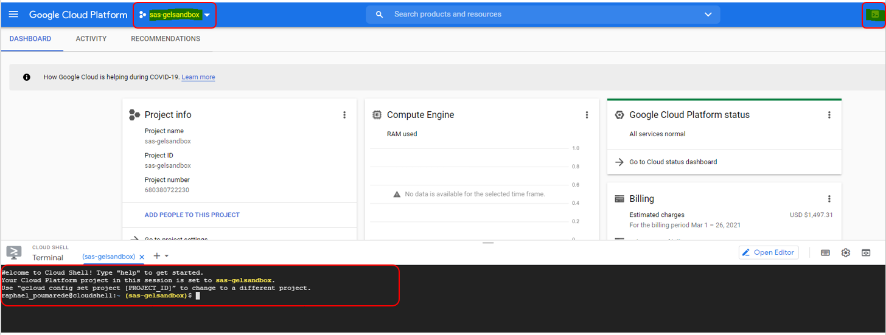
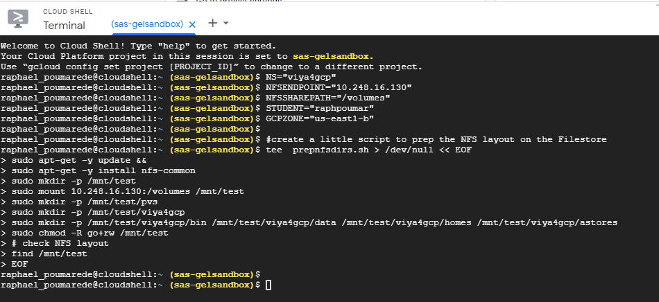
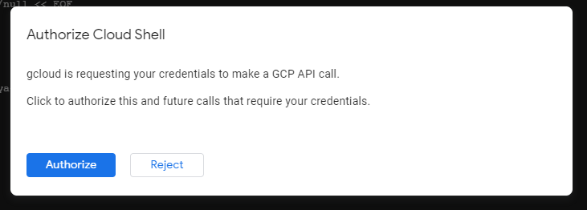
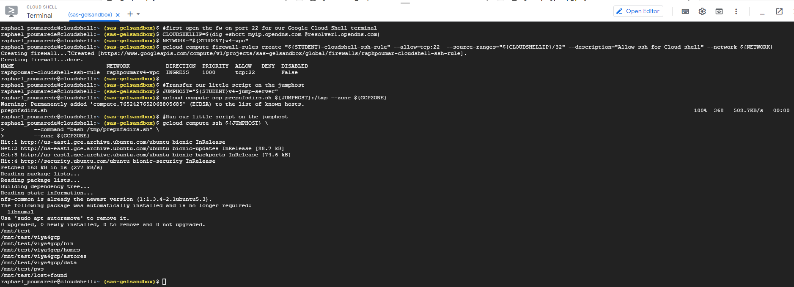

<!--
```sh
#!/bin/bash -x

```
 -->

# Full automation of deployment

**WORK IN PROGRESS**

* [Book a RACE Collection](#book-a-race-collection)
* [Create working folder](#create-working-folder)
* [Preparing tools](#preparing-tools)
  * [Getting the github projects cloned](#getting-the-github-projects-cloned)
  * [Building the docker images](#building-the-docker-images)
* [Authenticating to GCP and getting static credentials for Terraform](#authenticating-to-gcp-and-getting-static-credentials-for-terraform)
* [Authenticate to GCP](#authenticate-to-gcp)
  * [Figure the username of who just logged in](#figure-the-username-of-who-just-logged-in)
  * [Get the Service Account Key file](#get-the-service-account-key-file)
* [Prep the required files for the creation of the GKE cluster](#prep-the-required-files-for-the-creation-of-the-gke-cluster)
  * [Create and copy our public ssh key in the workspace](#create-and-copy-our-public-ssh-key-in-the-workspace)
* [Full automated deployment](#full-automated-deployment)
  * [Create a .tfvars file for the deployment](#create-a-tfvars-file-for-the-deployment)
  * [Deploy new GKE cluster](#deploy-new-gke-cluster)
    * [Build the Terraform plan](#build-the-terraform-plan)
    * [Show the plan](#show-the-plan)
    * [Apply the plan to build the GKE cluster](#apply-the-plan-to-build-the-gke-cluster)
    * [Get the kubeconfig](#get-the-kubeconfig)
    * [Validate the GKE cluster provisionning](#validate-the-gke-cluster-provisionning)
  * [Pre-requisites and Viya Deployment in GKE](#pre-requisites-and-viya-deployment-in-gke)
    * [Create vars.yaml](#create-varsyaml)
    * [Create directory structure](#create-directory-structure)
    * [Configure CAS Node timeout](#configure-cas-node-timeout)
    * [Deploy Pre-reqs in GKE](#deploy-pre-reqs-in-gke)
    * [Deploy Viya](#deploy-viya)
* [Post-Deployment Manual steps](#post-deployment-manual-steps)
  * [Create the NFS folders](#create-the-nfs-folders)
    * [Why ?](#why-)
    * [How ?](#how-)
    * [Generate the code that we want to run in the Google Cloud Shell](#generate-the-code-that-we-want-to-run-in-the-google-cloud-shell)
  * [Create the DNS aliases](#create-the-dns-aliases)
  * [Use names.sas.com](#use-namessascom)
  * [Automated method (with curl)](#automated-method-with-curl)
* [Validate your deployment](#validate-your-deployment)
* [Optional : Deploy logging and monitoring](#optional--deploy-logging-and-monitoring)
* [Optional : Configure Ephemeral Storage](#optional--configure-ephemeral-storage)
* [Optional : SSH to the jumphost VM](#optional--ssh-to-the-jumphost-vm)
  * [Destroy everything](#destroy-everything)
* [Use the cheat codes to build your Viya platform](#use-the-cheat-codes-to-build-your-viya-platform)
  * [Generate the cheat codes](#generate-the-cheat-codes)
* [Navigation](#navigation)

# Introduction

In this hands-on we use the GitHub [SAS Viya 4 resources](https://github.com/sassoftware/viya4-resource-guide) open source projects to fully automate the build of the Kubernetes cluster in GCP (with the [SAS Viya 4 Infrastructure as Code (IaC) for Microsoft GCP](https://github.com/sassoftware/viya4-iac-gcp)), then the pre-requisite installation and finally the Viya 4 deployment (with the [SAS Viya 4 Deployment](https://github.com/sassoftware/viya4-deployment))

* We will use a RACE machine as a jumphost to interact with GKE
* We will use the "Docker" method to run the tools, so we only need a machine with Docker installed on it.

## Book a RACE Collection

* Click on the link to book the RACE.EXNET "single machine K3s" [collection](http://race.exnet.sas.com/Reservations?action=new&imageId=333991&imageKind=C&comment=%20GELLOW%20DEV%20VMWare&purpose=PST&sso=PSGEL255&schedtype=SchedTrainEDU&startDate=now&endDateLength=0&discardonterminate=y) which comes with one Windows client and one Linux machine where docker is already installed.

## Create working folder

* Create a working folder for the hands-on

    ```bash
    # clean up first with sudo as resouces were created from docker container as root
    sudo rm -rf ~/jumphost/
    # create a working folder
    mkdir -p ~/jumphost/
    mkdir -p ~/jumphost/workspace
    ```

* We need to choose a default zone, region and project

    ```bash
    # set GCP zone
    GCPZONE=${GCPZONE:-us-east1-b}
    echo ${GCPZONE} > ~/jumphost/workspace/.gcpzone.txt
    # set GCP Region
    GCPREGION=${GCPREGION:-us-east1}
    echo ${GCPREGION} > ~/jumphost/workspace/.gcpregion.txt

    # set GCP project
    GCPPROJECT=${GCPPROJECT:-sas-gelsandbox}
    echo ${GCPPROJECT} > ~/jumphost/workspace/.gcpproject.txt

    ```

## Preparing tools

### Getting the github projects cloned

1. Clone the IAC project

    ```bash
    # clone the viya4-iac project
    cd  ~/jumphost/
    git clone https://github.com/sassoftware/viya4-iac-gcp.git
    # Instead of being at the mercy of the latest changes, we pin to a specific version
    #IAC_GCP_TAG=0.3.0
    # pickup the latest version until it is GA...
    #git checkout tags/${IAC_GCP_TAG}
    ```

Note : As long as the github project is private you need to logon with an authorized GitHub account (ex: raphaelpoumarede)

1. Clone the Deployment Project

    ```bash
    # clone the viya4-deployment project
    cd  ~/jumphost/
    git clone https://github.com/sassoftware/viya4-deployment.git
    cd ~/jumphost/viya4-deployment
    DEP_GCP_TAG=3.2.2
    git checkout tags/${DEP_GCP_TAG}
    ```

### Building the docker images

1. Before you build the viya4-iac and viya-deploy image, make sure the ubuntu and terraform images are already on the machine (we pre-pulled them in advance during the RACE machine bootstrap to avoid the [docker hub rate limit](https://www.docker.com/increase-rate-limits) issue.)

    ```bash
    ## check if ubuntu and terraform images are there
    docker image ls

    ```

    If you don't see the ubuntu and terraform images, make sure the RACE machine bootstrap has completed. See [these instructions](../01_Introduction/01_032_Assess_Readiness_of_Lab_Environment.md).

1. Build the IAC container image

    ```bash
    ## build docker images (iac)
    cd  ~/jumphost/viya4-iac-gcp
    time docker image build -t viya4-iac-gcp .
    ## this should take about 2mn
    ```

1. Build the deployment container image

    ```bash
    ## build docker images (deploy)
    cd  ~/jumphost/viya4-deployment
    time docker image build -t viya4-deployment .
    ## this should take about 6m30s

    ```

1. Confirm that both images have been built

    ```bash
    #check docker images locally
    docker image ls | grep viya4\-

    ```

1. Should return:

    ```log
    viya4-deployment                                                                         latest           e2dbcab07995   Less than a second ago   2.67GB
    viya4-iac-gcp                                                                            latest           ee36837dda84   7 minutes ago            2.91GB
    ```

## Authenticating to GCP and getting static credentials for Terraform

## Authenticate to GCP

1. Do a gcloud login first.

    ```bash
    # Do a gcloud init to get GCP credentials
    if [ ! -d "$HOME/jumphost/workspace/.gcp" ]; then
        echo "the GCP credentials directory is missing. Prompting you to authenticate"
        docker container  run -it --rm \
            -v $HOME/jumphost/workspace/.gcp/:/root/.config/gcloud/ \
            --entrypoint gcloud \
            viya4-iac-gcp \
            auth login
    fi
    ```

1. Set the project

    ```bash
    echo "GCPPROJECT:"${GCPPROJECT}
    # Set GCP project
    docker container  run -it --rm \
        -v $HOME/jumphost/workspace/.gcp/:/root/.config/gcloud/ \
        --entrypoint gcloud \
        viya4-iac-gcp \
        config set project ${GCPPROJECT}
    ```

### Figure the username of who just logged in

1. Determine the userid of the person who just authenticated:

    ```bash
    # Get the userid
    docker container  run  --rm \
        -v $HOME/jumphost/workspace/.gcp/:/root/.config/gcloud/ \
        --entrypoint gcloud \
        viya4-iac-gcp \
        auth list --filter=status:ACTIVE --format="value(account)" \
            | tee ~/jumphost/workspace/.email.txt
    STUDENTEMAIL=$(cat ~/jumphost/workspace/.email.txt)
    STUDENT=$(echo $STUDENTEMAIL | awk -F "[.@]" '{print substr($1,1,4) substr($2,1,6)}')
    echo "Your STUDENT ID is :"${STUDENT}
    echo ${STUDENT} > ~/jumphost/workspace/.student.txt
    ```

1. Confirm this user id is yours

    ```bash
    #store student info
    STUDENT=$(cat ~/jumphost/workspace/.student.txt)
    EMAIL=$(cat ~/jumphost/workspace/.email.txt)
    printf "\nThis should be your SAS Account:\n   ${STUDENT} (${EMAIL})  \nIf not, do not continue\n"

    if  [ "${STUDENT}" == "" ]; then
        echo "Can't figure out your student ID. Exiting"
        exit
    fi
    ```

<!-- ## Get the Service Account Key

* Run the command to get the Service Account Key file.

    ```bash
    BUCKETNAME=gelviya4deploy
    SA_KEY_FILE="viya4-tf-gcp-service-account.json"
    docker container  run  --rm \
        -v $HOME/jumphost/workspace/.gcp/:/root/.config/gcloud/ \
        --entrypoint gsutil \
        viya4-iac-gcp \
        cp  gs://${BUCKETNAME}/.gelviya4tfdeploy-service-account.json /root/.config/gcloud/${SA_KEY_FILE}
    # then secure the file
    sudo chmod 500 $HOME/jumphost/workspace/.gcp/${SA_KEY_FILE} # secure the keyfile
    ``` -->

### Get the Service Account Key file

1. Get the Service Account Key file from the GS bucket.

    ```bash
    BUCKETNAME=gelviya4deploy
    SA_KEY_FILE="viya4-tf-gcp-service-account.json"
    if [ ! -f "$HOME/jumphost/workspace/.gcp/${SA_KEY_FILE}" ]; then
        sudo touch $HOME/jumphost/workspace/.gcp/${SA_KEY_FILE}
        # Generate a Service Principal and get his password
        docker container  run  --rm \
            -v $HOME/jumphost/workspace/.gcp/:/root/.config/gcloud/ \
            --entrypoint gsutil \
            viya4-iac-gcp \
            cp  gs://${BUCKETNAME}/.gelviya4tfdeploy-service-account.json /root/.config/gcloud/${SA_KEY_FILE}
        # then secure the file
        sudo chmod 500 $HOME/jumphost/workspace/.gcp/${SA_KEY_FILE} # secure the keyfile
    fi
    ```

1. review the content of the file:

    ```bash
    #show the service account JSON Key file
    sudo cat $HOME/jumphost/workspace/.gcp/${SA_KEY_FILE}
    ```

## Prep the required files for the creation of the GKE cluster

### Create and copy our public ssh key in the workspace

1. just run this:

    ```bash
    ssh-keygen -t rsa -b 4096 -f ~/.ssh/jumpuser_idrsa <<< y
    # Copy our public ssh key in the workspace
    cp  ~/.ssh/jumpuser_idrsa.pub \
        ~/jumphost/workspace/jumpuser_idrsa.pub
    ```

## Full automated deployment

In this hands-on we perform a fully automated deployment of Viya 4 in GCP using the docker image of SAS Viya IaC.

### Create a .tfvars file for the deployment

* Let's create the Terraform variables file

* Before generating the ```gel-vars.tfvars``` file with our own values , let's make sure they are not empty.

    ```bash
    GCPZONE=$(cat ~/jumphost/workspace/.gcpzone.txt)
    GCPPROJECT=$(cat ~/jumphost/workspace/.gcpproject.txt)
    STUDENT=$(cat ~/jumphost/workspace/.student.txt)
    #make sure we have everything we need
    echo "GCP Project: ${GCPPROJECT}
    GCP Zone: ${GCPZONE}
    Student: ${STUDENT}
    SA Key file: ${SA_KEY_FILE}"
    ```

* Review the values of the variables. Make sure they ALL have the expected value (otherwhise Terraform will not be able to build the GKE cluster)

* Run this block of commands to populate the TF variables file:

    ```bash
    # Populate the TF variables file
    tee  ~/jumphost/workspace/gel-vars.tfvars > /dev/null << EOF

    # !NOTE! - These are only a subset of variables.tf provided for sample.
    # Customize this file to add any variables from 'variables.tf' that you want
    # to change their default values.

    # ****************  REQUIRED VARIABLES  ****************
    # These required variables' values MUST be provided by the User
    prefix                  = "${STUDENT}v4fa"
    location                = "${GCPZONE}" # e.g., "us-east1-b""
    project                 = "${GCPPROJECT}"
    service_account_keyfile = "/workspace/.gcp/${SA_KEY_FILE}"
    ssh_public_key          = "/workspace/jumpuser_idrsa.pub"
    #
    # ****************  REQUIRED VARIABLES  ****************

    # temporary Hack to change the default hardcoded GKE subnet range to avoid IP range conflicts
    gke_subnet_cidr = "192.168.8.0/23"

    # Create shareable kubeconfig this one is important, otherwhise the kubeconfig file is created with references to gcloud placeholders and will require gcloud.
    # see https://github.com/sassoftware/viya4-iac-gcp/blob/main/docs/user/Kubeconfig.md
    create_static_kubeconfig = true


    # Source address ranges to allow client admin access to the cloud resources
    #default_public_access_cidrs = ["149.173.0.0/16", "172.17.0.0/16"] # e.g., ["123.45.6.89/32"]
    default_public_access_cidrs = ["149.173.0.0/16"]

    # add labels to the created resources
    tags = { "resourceowner" = "${STUDENT}" , project_name = "sasviya4gcp", environment = "devfa", gel_project = "deployviya4gcp" } # e.g., { "key1" = "value1", "key2" = "value2" }

    # Postgres config
    create_postgres                  = false # set this to "false" when using internal Crunchy Postgres

    # GKE config
    kubernetes_version         = "latest"

    default_nodepool_min_nodes = 1
    default_nodepool_max_nodes = 2
    default_nodepool_vm_type    = "e2-standard-4"

    # Configuring Node auto-provisioning
    #cluster_autoscaling_max_cpu_cores = 100
    #cluster_autoscaling_max_memory_gb = 1000

    # Disable Node auto-provisioning
    enable_cluster_autoscaling = false

    # Node Pools config
    node_pools = {
    cas = {
        "vm_type"      = "n1-highmem-4"
        "os_disk_size" = 200
        "disk_type"    = "pd-ssd"
        "min_nodes"    = 1
        "max_nodes"    = 5
        "node_taints"  = ["workload.sas.com/class=cas:NoSchedule"]
        "node_labels" = {
        "workload.sas.com/class" = "cas"
        }
        # The amount of local SSD disks that will be attached to each cluster node.
        "local_ssd_count" = 0
        "accelerator_count" = 0
        "accelerator_type" = ""

    },
    compute = {
        "vm_type"      = "n1-highmem-4"
        "os_disk_size" = 200
        "disk_type"    = "pd-ssd"
        "min_nodes"    = 1
        "max_nodes"    = 1
        "node_taints"  = ["workload.sas.com/class=compute:NoSchedule"]
        "node_labels" = {
        "workload.sas.com/class"        = "compute"
        "launcher.sas.com/prepullImage" = "sas-programming-environment"
        }
        "local_ssd_count" = 0
        "accelerator_count" = 0
        "accelerator_type" = ""

    },
    connect = {
        "vm_type"      = "n1-highmem-4"
        "os_disk_size" = 200
        "disk_type"    = "pd-ssd"
        "min_nodes"    = 1
        "max_nodes"    = 1
        "node_taints"  = ["workload.sas.com/class=connect:NoSchedule"]
        "node_labels" = {
        "workload.sas.com/class"        = "connect"
        "launcher.sas.com/prepullImage" = "sas-programming-environment"
        }
        "local_ssd_count" = 0
        "accelerator_count" = 0
        "accelerator_type" = ""

    },
    stateless = {
        "vm_type"      = "e2-standard-16"
        "os_disk_size" = 200
        "disk_type"    = "pd-ssd"
        "min_nodes"    = 1
        "max_nodes"    = 2
        "node_taints"  = ["workload.sas.com/class=stateless:NoSchedule"]
        "node_labels" = {
        "workload.sas.com/class" = "stateless"
        }
        "local_ssd_count" = 0
        "accelerator_count" = 0
        "accelerator_type" = ""

    },
    stateful = {
        "vm_type"      = "e2-standard-8"
        "os_disk_size" = 200
        "disk_type"    = "pd-ssd"
        "min_nodes"    = 1
        "max_nodes"    = 3
        "node_taints"  = ["workload.sas.com/class=stateful:NoSchedule"]
        "node_labels" = {
        "workload.sas.com/class" = "stateful"
        }
        "local_ssd_count" = 0
        "accelerator_count" = 0
        "accelerator_type" = ""
    }
    }

    # Jump Box
    create_jump_public_ip = true
    jump_vm_admin         = "jumpuser"

    # Storage for SAS Viya CAS/Compute
    storage_type = "ha"
    EOF
    ```

### Deploy new GKE cluster

#### Build the Terraform plan

* Run the command to build the terraform plan (inside the docker image)

    ```bash
    # plan
    docker container run --rm -it \
        -v $HOME/jumphost/workspace/.gcp/:/root/.config/gcloud/ \
        -v $HOME/jumphost/workspace:/workspace \
        viya4-iac-gcp \
        plan \
        -var-file /workspace/gel-vars.tfvars \
        -state /workspace/gel-vars.tfstate \
        -out /workspace/gel-vars.plan
    ```

#### Show the plan

* Run the command to show the terraform plan

    ```bash
    docker container  run --rm -it \
        -v $HOME/jumphost/workspace/.gcp/:/root/.config/gcloud/ \
        -v $HOME/jumphost/workspace:/workspace \
        viya4-iac-gcp \
        show \
        /workspace/gel-vars.plan

    ```

#### Apply the plan to build the GKE cluster

* Run the command to apply the terraform plan (from inside the docker image)

    ```bash
    time docker container  run --rm -it \
        -v $HOME/jumphost/workspace/.gcp/:/root/.config/gcloud/ \
        -v $HOME/jumphost/workspace:/workspace \
        viya4-iac-gcp \
        apply \
        -auto-approve \
        -var-file /workspace/gel-vars.tfvars \
        -state /workspace/gel-vars.tfstate
    ## this should take around 16 minutes.
    ```

* If the command is succesful, then the GKE cluster and the required infrastructure has been created in GCP.

#### Get the kubeconfig

* Let's grab our KUBECONFIG file with a gcloud command

    ```bash
    ## get the kubeconfig file
    docker container  run --rm \
        -v $HOME/jumphost/workspace/.gcp/:/root/.config/gcloud/ \
        -v $HOME/jumphost/workspace:/workspace \
        viya4-iac-gcp \
        output \
        -state /workspace/gel-vars.tfstate\
        kube_config > $HOME/jumphost/workspace/.kubeconfig_gke
    mv ~/.kube/config ~/.kube/config_old
    ln -s  $HOME/jumphost/workspace/.kubeconfig_gke  $HOME/.kube/config
    #secure the KUBECONFIG file
    chmod 700 $HOME/.kube/config
    ```

#### Validate the GKE cluster provisionning

* Run the kubctl command below

    ```bash
    kubectl get nodes
    ```

* You should see something like :

    ```log
    NAME                                           STATUS   ROLES    AGE     VERSION
    gke-raphpoumarv4-gke-cas-308eb3b6-cfkp         Ready    <none>   7m20s   v1.18.16-gke.1200
    gke-raphpoumarv4-gke-compute-b8813ae3-86x2     Ready    <none>   2m42s   v1.18.16-gke.1200
    gke-raphpoumarv4-gke-connect-6db0b6ab-gv14     Ready    <none>   8m31s   v1.18.16-gke.1200
    gke-raphpoumarv4-gke-default-1be7eaea-551p     Ready    <none>   6m10s   v1.18.16-gke.1200
    gke-raphpoumarv4-gke-stateful-de97c87c-83fw    Ready    <none>   3m42s   v1.18.16-gke.1200
    gke-raphpoumarv4-gke-stateless-7a14aa1c-b7hb   Ready    <none>   4m54s   v1.18.16-gke.1200
    ```

### Pre-requisites and Viya Deployment in GKE

Reference : [https://github.com/sassoftware/viya4-deployment](https://github.com/sassoftware/viya4-deployment)

#### Create vars.yaml

* Let's prepare our vars.yaml for the automated Viya 4 deployment.

    ```bash
    export NS="viya4gcp"
    #GCPREGION=$(cat ~/jumphost/workspace/.gcpregion.txt )
    STUDENT=$(cat ~/jumphost/workspace/.student.txt)
    V4_CFG_INGRESS_FQDN="${STUDENT}.gelsandbox.gke.unx.sas.com"

    tee  ~/jumphost/workspace/gel-vars.yaml > /dev/null << EOF
    ## Cluster
    PROVIDER: gcp
    CLUSTER_NAME: ${STUDENT}v4fa-gke
    NAMESPACE: ${NS}

    ## MISC
    DEPLOY: true # Set to false to stop at generating the manifest

    #LOADBALANCER_SOURCE_RANGES: ['<cluster_nat_ip>/32']
    #LOADBALANCER_SOURCE_RANGES: ["109.232.56.224/27", "149.173.0.0/16", "194.206.69.176/28"]
    LOADBALANCER_SOURCE_RANGES: ["149.173.0.0/16"]

    ## Storage - we let the tool create the SC for us
    V4_CFG_MANAGE_STORAGE: true
    #JUMP_SVR_RWX_FILESTORE_PATH: /volumes

    ## JUMP VM ACCESS TO PREPARE NFS DIRECTORIES
    # JUMP_SVR_PRIVATE_KEY: '/config/jump_svr_private_key'

    ## SAS API Access
    V4_CFG_SAS_API_KEY: 'otHGJtno8QGTqys9vRGxmgLOCnVsHWG2'
    V4_CFG_SAS_API_SECRET: 'banKYbGZyNkDXbBO'
    V4_CFG_ORDER_NUMBER: 9CDZDD

    ## CR Access
    # V4_CFG_CR_USER: <container_registry_user>
    # V4_CFG_CR_PASSWORD: <container_registry_password>

    ## Ingress
    V4_CFG_INGRESS_TYPE: ingress
    V4_CFG_INGRESS_FQDN: "${V4_CFG_INGRESS_FQDN}"
    V4_CFG_TLS_MODE: "full-stack" # [full-stack|front-door|disabled]

    ## Postgres
    V4_CFG_POSTGRES_TYPE: internal


    ## LDAP
    V4_CFG_EMBEDDED_LDAP_ENABLE: true

    ## Consul UI
    #V4_CFG_CONSUL_ENABLE_LOADBALANCER: false

    ## SAS/CONNECT
    V4_CFG_CONNECT_ENABLE_LOADBALANCER: false

    ## Cadence and version
    V4_CFG_CADENCE_NAME: 'stable'
    V4_CFG_CADENCE_VERSION: '2020.1.5'

    ## CAS Configuration
    V4_CFG_CAS_WORKER_COUNT: '3'
    V4_CFG_CAS_ENABLE_BACKUP_CONTROLLER: true
    V4_CFG_CAS_ENABLE_LOADBALANCER: true

    # Monitoring and logging tools
    V4M_BASE_DOMAIN: "${STUDENT}.gelsandbox.gke.unx.sas.com"

    # allow ELASTIC SEARCH to be properly configured
    V4_CFG_ELASTICSEARCH_ENABLE: true

    EOF
    ```

#### Create directory structure

* The viya4-deployment tool fully manages the kustomization.yaml file.
* Users can make change by adding custom overlays into sub-folders under the site-config folder.
* we can pre-create our local directory structure and add any specific customization we want there.

    ```bash
    # create local directories
    mkdir -p $HOME/jumphost/workspace/deploy/
    mkdir -p $HOME/jumphost/workspace/deploy/${STUDENT}v4fa-gke
    mkdir -p $HOME/jumphost/workspace/deploy/${STUDENT}v4fa-gke/${NS}
    mkdir -p $HOME/jumphost/workspace/deploy/${STUDENT}v4fa-gke/${NS}/site-config
    mkdir -p $HOME/jumphost/workspace/deploy/${STUDENT}v4fa-gke/${NS}/site-config/cas-server
    ```

#### Configure CAS Node timeout

* Add CAS configuration to make the backup controller compatible with autoscaling.
(the workaround was provided in this [JIRA](https://rndjira.sas.com/browse/CSVIYA4TRIAG-460))

    ```bash
    cat > /tmp/setcasnodetimeout.yaml << EOF
    apiVersion: builtin
    kind: ConfigMapGenerator
    metadata:
      name: sas-cas-config
    behavior: merge
    literals:
      - CAS_NODE_CONNECT_TIMEOUT=1800
    EOF

    cp /tmp/setcasnodetimeout.yaml $HOME/jumphost/workspace/deploy/${STUDENT}v4fa-gke/${NS}/site-config/cas-server
    ```

#### Deploy Pre-reqs in GKE

* Simply run the command below to deploy all the pre-requisites for Viya 4 ("baseline")

    ```bash
    # Deploy all the pre-requisites for Viya 4
    docker container run -it \
        --group-add root \
        --user $(id -u):$(id -g) \
        -v $HOME/jumphost/workspace/deploy:/data \
        -v $HOME/jumphost/workspace/.kubeconfig_gke:/config/kubeconfig \
        -v $HOME/jumphost/workspace/gel-vars.yaml:/config/config \
        -v $HOME/jumphost/workspace/gel-vars.tfstate:/config/tfstate \
        viya4-deployment \
            --tags "baseline,install"
    ```

#### Deploy Viya

* Now we deploy Viya 4

    ```bash
    # Deploy Viya 4
    docker container run -it \
        --group-add root \
        --user $(id -u):$(id -g) \
        -v $HOME/jumphost/workspace/deploy:/data \
        -v $HOME/jumphost/workspace/.kubeconfig_gke:/config/kubeconfig \
        -v $HOME/jumphost/workspace/gel-vars.yaml:/config/config \
        -v $HOME/jumphost/workspace/gel-vars.tfstate:/config/tfstate \
        viya4-deployment \
        --tags "baseline,viya,install"

    ```

* While it is running, move to the Manual steps to configure the NFS structure and the DNS name.

## Post-Deployment Manual steps

### Create the NFS folders

#### Why ?

**IMPORTANT: please read below to understand what we do here and WHY we are doing it that way. Unfortunately this part can not be automated and you will have to use the Google Cloud Shell**

* Reference: [SAS Viya 4 deployment](https://github.com/sassoftware/viya4-deployment)

* In order to use NFS-based storage, the Viya 4 automated deployment tool _*assume that there is a specific sub-folder structure for the NFS shared folder*_.

* Below is the required NFS exports folder structure

    ```log
    <export_dir>        <- nfs export path
      /pvs              <- location for persistent volumes
      /<namespace>      <- folder per namespace
        /bin            <- location for open source directories
        /data           <- location for SAS and CAS Data
        /homes          <- location for user home directories to be mounted
        /astores        <- location for astores
    ```

* Note that a part of the structure depends on the **Kuberenetes namespace** name. That's the reason why it can not be pre-created in advance.

* If you combine the `viya4-iac` and the `viya4-deployment` tools, then this specific sub-folder structure can be created **automatically** by the viya4-deployment tool with the proper namespace.

* **However**, the way it is done **rely on an ssh access from our client machine** (with docker) to the GCP Jumpbox VM from where the commands to create the directory structure and mount the File Systems will run.

* Unfortunately, in RACE.EXNET, there is a firewall rule that only allow access to the outside (Internet) on HTTPS ports (80 and 443). As a consequence **we can NOT ssh (with port 22) to the Jump VM running in GCP**.

* So, we have to prepare the NFS layout by ourselves (we will assume that our intial namespace for the viya deployment is called `viya4gcp`)

#### How ?

* To prepare the NFS layout in the GCP FileStore, we need to ssh to our Jump VM in GCP and run the `mount` and `mkdir` commands. As explained we can not ssh to an internet facing machine from RACE.EXNET...

* So here is the plan : we will generate some varaiable values and some code in the RACE EXNET environment and then open a session in the Google Cloud Shell to submit them to the Jump VM.

#### Generate the code that we want to run in the Google Cloud Shell

* Run the code below in your RACE.EXNET machine to get the variables

    ```bash
    # Get the FileStore path
    docker container run --rm \
        -v $HOME/jumphost/workspace:/workspace \
        viya4-iac-gcp \
        output \
        -state /workspace/gel-vars.tfstate \
        rwx_filestore_path > $HOME/jumphost/workspace/.NFSSHAREPATH.txt
    NFSSHAREPATH=$(cat $HOME/jumphost/workspace/.NFSSHAREPATH.txt)
    echo $NFSSHAREPATH

    # Get FileStore endpoint
    docker container run --rm \
        -v $HOME/jumphost/workspace:/workspace \
        viya4-iac-gcp \
        output \
        -state /workspace/gel-vars.tfstate \
        rwx_filestore_endpoint > $HOME/jumphost/workspace/.NFSENDPOINT.txt
    NFSENDPOINT=$(cat $HOME/jumphost/workspace/.NFSENDPOINT.txt)
    echo $NFSENDPOINT
    ```

* Run the code below in your RACE.EXNET machine to generate a block of code then copy paste it in Google Cloud Terminal

    ```bash
    NAMESPACE="viya4gcp"
    STUDENT=$(cat ~/jumphost/workspace/.student.txt)
    GCPZONE=$(cat ~/jumphost/workspace/.gcpzone.txt)
    echo "
    NAMESPACE=\"${NAMESPACE}\"
    NFSENDPOINT=\"${NFSENDPOINT}\"
    NFSSHAREPATH=\"${NFSSHAREPATH}\"
    STUDENT=\"${STUDENT}\"
    GCPZONE=\"${GCPZONE}\"
    #create a little script to prep the NFS layout on the Filestore
    tee  prepnfsdirs.sh > /dev/null << EOF
    sudo apt-get -y update &&
    sudo apt-get -y install nfs-common
    sudo mkdir -p /mnt/test
    sudo mount ${NFSENDPOINT}:${NFSSHAREPATH} /mnt/test
    sudo mkdir -p /mnt/test/pvs
    sudo mkdir -p /mnt/test/${NAMESPACE}
    sudo mkdir -p /mnt/test/${NAMESPACE}/bin
    sudo mkdir -p /mnt/test/${NAMESPACE}/data
    sudo mkdir -p /mnt/test/${NAMESPACE}/homes
    sudo mkdir -p /mnt/test/${NAMESPACE}/astores
    sudo chmod -R go+rw /mnt/test
    # check NFS layout
    find /mnt/test
    EOF"
    ```

* IMPORTANT: `Make sure that in the resulting code block, each variable has a value.`
* Now select the generated code containing the values (from "NS..." to "EOF"), copy it

* Open a **Google Cloud Shell** Session from your web browser
  * Naviguate to [https://console.cloud.google.com](https://console.cloud.google.com/)
  * Make sure you have selected the `sas-gelsanbox` project
  * Click on the little terminal icon at the top right.

    

* Now, paste he generated code containing the values. `IMPORTANT: Use the "Ctrl+Shift+V" keys to paste in the Cloud Shell.`

* You should see something like in the screenshot below:

    

* Still in the GCP Cloud shell,
  * run the command below to make sure you have created the script:

    ```sh
    cat prepnfsdirs.sh
    ```

  * run the following commands to create the NFS layout from the Jump VM:

    ```sh
    #first open the fw on port 22 for our Google Cloud Shell terminal
    CLOUDSHELLIP=$(dig +short myip.opendns.com @resolver1.opendns.com)
    NETWORK="${STUDENT}v4fa-vpc"
    gcloud compute firewall-rules create "${STUDENT}v4fa-gke-cloudshell-ssh-rule" --allow=tcp:22  --source-ranges="${CLOUDSHELLIP}/32" --description="Allow ssh for Cloud shell" --network ${NETWORK}

    #Transfer our little script on the jumphost
    JUMPHOST="${STUDENT}v4fa-jump-server"
    gcloud compute scp prepnfsdirs.sh ${JUMPHOST}:/tmp --zone ${GCPZONE}
    #Run our little script on the jumphost
    gcloud compute ssh ${JUMPHOST} \
            --command "bash /tmp/prepnfsdirs.sh" \
            --zone ${GCPZONE}
    ```

* When you see this dialog window, just click on "Authorize"

    

* Then you should see something like

    

* Clean-up

    ```sh
    #Now remove the firewall rule (otherwhise the TF destroy will not work) and the script
    # confirm with "y"
    gcloud compute firewall-rules delete "${STUDENT}v4fa-gke-cloudshell-ssh-rule"
    rm -Rf prepnfsdirs.sh
    ```

* You can now close Google Cloud Shell and go back to your RACE machine for the remaining steps.

* Note : you might have to restart CAS, so the pods will pick up the required PVs.

    ```sh
    kubectl -n viya4gcp delete pod --selector='app.kubernetes.io/managed-by=sas-cas-operator'
    ```

### Create the DNS aliases

* As explained in the viya4-deployment project README file :

    _When running the baseline action an ingress will be created. You will need to register this ingress ip with your dns provider such that:_

  * _An A record (ex. example.com) points to the <ingress_ip>_
  * _A wildcard (ex *.example.com) points to the <ingress_ip>_

    _When running the viya action with V4_CFG_CONNECT_ENABLE_LOADBALANCER true a load balancer will be created to allow external SAS/CONNECT clients to connect to Viya._
    _You will need to register this load balancer ip with your dns provider such that an A record (ex. connect.example.com) points to the <connect_load_balancer_ip>_

* For things like the SAS CONNECT service or the logging and monitoring domain (grafana.xxx, alertmanager.xxx) ingresses, you also need to create the required DNS aliases.

### Use names.sas.com

* Real life customers will likely have their own domains and be in position to request named or wildcard DNS aliases to support as many Viya environments as they want in the same GKE cluster.

* Here, instead SAS Employees can use names.na.sas.com (SAS internal DNS Self-Service).

* You will need to using your own laptop/desktop session and not the RACE client machine to interact with "names.na.sas.com"

### Automated method (with curl)

There is a way to automate the previous manual steps using curl and the names.sas.com API.
As a SAS Employee you can create DNS alias using the https://names.na.sas.com/ server (read this [page](https://names.na.sas.com/new.html) to understand how to use the API).

However, since the RACE machine does not have access to any SAS internal resources, you need to run the actual API code from your own machine's terminal.

* If you are running Windows 10 on your SAS laptop, you might have "curl" pre-installed and available from the DOS command Otherwhise you can install WSL (Windows Subsystem for Linux) and use [ubuntu](https://ubuntu.com/tutorials/ubuntu-on-windows#1-overview)
* Mac users should be able to use an integrated Unix terminal.

* First generate the commands block from the RACE environment:

    ```sh
    STUDENT=$(cat ~/jumphost/workspace/.student.txt)
    USER="<replace with your SAS ID>"
    LBIP=$(kubectl get service -n ingress-nginx | grep LoadBalancer | awk '{print $4}')
    INGFQDN="${STUDENT}.gelsandbox.gke.unx.sas.com"
    OLDIP=$(nslookup $INGFQDN | awk -F':' '/^Address: / {matched = 1} matched {print $2}' |xargs)
    echo "Command to associate " ${INGFQDN} " to "${LBIP}" :
    **********************************************************
    CURL METHOD (ADD):
    curl -kv -u "$USER" \"https://names.na.sas.com/api.php?op=A&nm0="${INGFQDN}"&rd0="${LBIP}\""
    **********************************************************
    CURL METHOD (UPDATE - if the NAME already exists):
    curl -kv -u "$USER" \"https://names.na.sas.com/api.php?op=C&nm0="${INGFQDN}"&rd0="${OLDIP}"&cd0="${LBIP}\""
    **********************************************************
    You will have to copy the command above and run it from your own SAS laptop"
    ```

* MAKE SURE YOU CAN SEE THE VARIABLES VALUE FROM THE PREVIOUS STEP
* Copy the Code Block from the RACE environment
* Now, start a new terminal or DOS session ON YOUR OWN LAPTOP, to do the next steps

* If it is the first time and the name entry does not already existss, run the command generated to ADD the DNS entry.
* Otherwhise, if there is already a DNS entry but you need to update the associated IP address, run the command to UPDATE the associated IP address.

* For example if you are updating the IP associated to your hostname, you should see something like that :

  

* You should receive an email shortly.
* Validate that the DNS name is working

    ```sh
    curl ${INGFQDN}
    ```

* Here is what you are supposed to see:

    ```html
    <html>
    <head><title>308 Permanent Redirect</title></head>
    <body>
    <center><h1>308 Permanent Redirect</h1></center>
    <hr><center>nginx</center>
    </body>
    </html>
    ```

## Validate your deployment

* Once all your pods are READY, open the url corresponding to the Viya web application ingress and login as `viya_admin` or `user1` (Password123).

    ```sh
    echo " click on : https://$FQDN"
    ```


## Optional : Deploy logging and monitoring

* We can also deploy the monitoring and logging tools

    ```sh
    # Deploy Monioring and Logging tools
    docker container run -it \
        -v $HOME/jumphost/workspace/deploy:/data \
        -v $HOME/jumphost/workspace/.kubeconfig_gke:/config/kubeconfig \
        -v $HOME/jumphost/workspace/gel-vars.yaml:/config/config \
        -v $HOME/jumphost/workspace/gel-vars.tfstate:/config/tfstate \
        viya4-deployment \
        --tags "baseline,viya,cluster-logging,cluster-monitoring,viya-monitoring,install"
    ```

## Optional : Configure Ephemeral Storage

* Run the code below to also provision ephemeral storage for our deployment

    ```sh
    cd $HOME/jumphost/
    git clone https://gelgitlab.race.sas.com/GEL/deployment/kev
    cd $HOME/jumphost/kev/nodestrap
    kustomize build | kubectl apply -f -
    ```

This very handy tool called KEV (Kubernetes Ephemral Volumes) will deploy a Kubernetes daemonset and other resources in the "nodestrap" namespace that can take care to prepare a deicated directory for things like CAS Disk cache and SASWORK on the CAS, Compute and Connect nodes.

If the GCP instance comes with ephemeral storage suche as NVMe Drives on LSv2 instances, it will also fromat, strip and mount them.

What remains to do, though,  is to configure our Viya deployment so CAS, Compute and Connect pods can use those mountpoints as HostPath instead of the default emptyDir volume type (visit the other Hands-on of this VLE to know how to do it).

Consult this [page](https://gelgitlab.race.sas.com/GEL/deployment/kev) for additional details.

## Optional : SSH to the jumphost VM

* You should be able to ssh to the Jump Host server from **you own laptop** or using the GCP Cloud Shell (but not from the RACE.EXNET machine as internal firewall prevents SSH outbound connection from the RACE.EXNET network)

* Get the jumphost public IP

    ```sh
    docker container run --rm \
        -v $HOME/jumphost/workspace:/workspace \
        viya4-iac-gcp \
        output \
        -state /workspace/gel-vars.tfstate \
        jump_public_ip

* Transfer the SSH key on your laptop or inside the GCP Cloud Shell session.

    ```sh
    ssh -v -i jumpuser_idrsa nfsuser@<NFS PUBLIC IP>
    ```

### Destroy everything

* run the code below to destroy the whole GKE cluster

    ```sh
    docker container run -it --rm \
        -v $HOME/jumphost/workspace/.gcp/:/root/.config/gcloud/ \
        -v $HOME/jumphost/workspace:/workspace \
        viya4-iac-gcp \
        destroy \
        -var-file /workspace/gel-vars.tfvars \
        -state /workspace/gel-vars.tfstate \
        -lock=false \
        -force \
        -input=false
    ```

## Use the cheat codes to build your Viya platform

### Generate the cheat codes

* Run these commands to generate the cheat codes for the GKE Hands-on, using the GELLOW cheatcode generator.

    ```sh
    cd ~/PSGEL255-deploying-viya-4.0.1-on-kubernetes/
    git pull
    # optionnaly you can switch to a diffent version branch
    # ex:
    # git checkout "release/stable-2020.1.5"
    /opt/gellow_code/scripts/cheatcodes/create.cheatcodes.sh /home/cloud-user/PSGEL255-deploying-viya-4.0.1-on-kubernetes/13_Google_GKE_Deployment/
    ```

* run this command to execute the fully automated deployment

    ```sh
    bash -x /home/cloud-user/PSGEL255-deploying-viya-4.0.1-on-kubernetes/13_Google_GKE_Deployment/13_041_Full_Automation_of_GKE_Deployment.sh 2>&1 \
    | tee -a ~/13_041_Full_Automation_of_GKE_Deployment.log
    ```

* If you don't have your GCP credentials, yet :
  * The script will stop at the "gcloud login" interactive step and wait for you to login in GCP with the authorization code and your credentials.
  * it will then populate your `~/jumphost/workspace/.gcp` and `~/jumphost/workspace/.tf_creds` files so you won't have to do it the next time you run the cheat code.

* You can also select, copy and paste the appropriate lines in `/home/cloud-user/PSGEL255-deploying-viya-4.0.1-on-kubernetes/11_GCP_GKE_Deployment/11_101_Full_Automation_of_GKE_Deployment.sh` depending on the kind of deployment you want to perform.

## Navigation

<!-- startnav -->
* [01 Introduction / 01 031 Booking a Lab Environment for the Workshop](/01_Introduction/01_031_Booking_a_Lab_Environment_for_the_Workshop.md)
* [01 Introduction / 01 032 Assess Readiness of Lab Environment](/01_Introduction/01_032_Assess_Readiness_of_Lab_Environment.md)
* [01 Introduction / 01 033 CheatCodes](/01_Introduction/01_033_CheatCodes.md)
* [02 Kubernetes and Containers Fundamentals / 02 131 Learning about Namespaces](/02_Kubernetes_and_Containers_Fundamentals/02_131_Learning_about_Namespaces.md)
* [03 Viya 4 Software Specifics / 03 011 Looking at a Viya 4 environment with Visual Tools DEMO](/03_Viya_4_Software_Specifics/03_011_Looking_at_a_Viya_4_environment_with_Visual_Tools_DEMO.md)
* [03 Viya 4 Software Specifics / 03 051 Create your own Viya order](/03_Viya_4_Software_Specifics/03_051_Create_your_own_Viya_order.md)
* [03 Viya 4 Software Specifics / 03 056 Getting the order with the CLI](/03_Viya_4_Software_Specifics/03_056_Getting_the_order_with_the_CLI.md)
* [04 Pre Requisites / 04 081 Pre Requisites automation with Viya4-ARK](/04_Pre-Requisites/04_081_Pre-Requisites_automation_with_Viya4-ARK.md)
* [05 Deployment tools / 05 121 Setup a Windows Client Machine](/05_Deployment_tools/05_121_Setup_a_Windows_Client_Machine.md)
* [06 Deployment Steps / 06 031 Deploying a simple environment](/06_Deployment_Steps/06_031_Deploying_a_simple_environment.md)
* [06 Deployment Steps / 06 051 Deploying Viya with Authentication](/06_Deployment_Steps/06_051_Deploying_Viya_with_Authentication.md)
* [06 Deployment Steps / 06 061 Deploying in a second namespace](/06_Deployment_Steps/06_061_Deploying_in_a_second_namespace.md)
* [06 Deployment Steps / 06 071 Removing Viya deployments](/06_Deployment_Steps/06_071_Removing_Viya_deployments.md)
* [06 Deployment Steps / 06 081 Deploying a programing only environment](/06_Deployment_Steps/06_081_Deploying_a_programing-only_environment.md)
* [06 Deployment Steps / 06 091 Deployment Operator setup](/06_Deployment_Steps/06_091_Deployment_Operator_setup.md)
* [06 Deployment Steps / 06 093 Using the DO with a Git Repository](/06_Deployment_Steps/06_093_Using_the_DO_with_a_Git_Repository.md)
* [06 Deployment Steps / 06 095 Using an inline configuration](/06_Deployment_Steps/06_095_Using_an_inline_configuration.md)
* [06 Deployment Steps / 06 097 Using the Orchestration Tool](/06_Deployment_Steps/06_097_Using_the_Orchestration_Tool.md)
* [06 Deployment Steps / 06 101 Create Viya Deployment Roles](/06_Deployment_Steps/06_101_Create_Viya_Deployment_Roles.md)
* [07 Deployment Customizations / 07 021 Configuring SASWORK](/07_Deployment_Customizations/07_021_Configuring_SASWORK.md)
* [07 Deployment Customizations / 07 051 Adding a local registry to k8s](/07_Deployment_Customizations/07_051_Adding_a_local_registry_to_k8s.md)
* [07 Deployment Customizations / 07 052 Using mirror manager to populate the local registry](/07_Deployment_Customizations/07_052_Using_mirror_manager_to_populate_the_local_registry.md)
* [07 Deployment Customizations / 07 053 Deploy from local registry](/07_Deployment_Customizations/07_053_Deploy_from_local_registry.md)
* [07 Deployment Customizations / 07 091 Configure SAS ACCESS Engine](/07_Deployment_Customizations/07_091_Configure_SAS_ACCESS_Engine.md)
* [07 Deployment Customizations / 07 101 Configure SAS ACCESS TO HADOOP](/07_Deployment_Customizations/07_101_Configure_SAS_ACCESS_TO_HADOOP.md)
* [07 Deployment Customizations / 07 102 Parallel loading with EP for Hadoop](/07_Deployment_Customizations/07_102_Parallel_loading_with_EP_for_Hadoop.md)
* [09 Validation / 09 011 Validate the Viya deployment](/09_Validation/09_011_Validate_the_Viya_deployment.md)
* [09 Validation / 09 021 SAS Viya deployment reports](/09_Validation/09_021_SAS_Viya_deployment_reports.md)
* [11 Azure AKS Deployment / 11 000 Navigating the AKS Hands on Deployment Options](/11_Azure_AKS_Deployment/11_000_Navigating_the_AKS_Hands-on_Deployment_Options.md)
* [11 Azure AKS Deployment / 11 999 Fast track with cheatcodes](/11_Azure_AKS_Deployment/11_999_Fast_track_with_cheatcodes.md)
* [11 Azure AKS Deployment/Fully Automated / 11 500 Full Automation of AKS Deployment](/11_Azure_AKS_Deployment/Fully_Automated/11_500_Full_Automation_of_AKS_Deployment.md)
* [11 Azure AKS Deployment/Fully Automated / 11 590 Cleanup](/11_Azure_AKS_Deployment/Fully_Automated/11_590_Cleanup.md)
* [11 Azure AKS Deployment/Standard / 11 100 Creating an AKS Cluster](/11_Azure_AKS_Deployment/Standard/11_100_Creating_an_AKS_Cluster.md)
* [11 Azure AKS Deployment/Standard / 11 110 Performing the prerequisites](/11_Azure_AKS_Deployment/Standard/11_110_Performing_the_prerequisites.md)
* [11 Azure AKS Deployment/Standard/Cleanup / 11 400 Cleanup](/11_Azure_AKS_Deployment/Standard/Cleanup/11_400_Cleanup.md)
* [11 Azure AKS Deployment/Standard/Manual / 11 200 Deploying Viya 4 on AKS](/11_Azure_AKS_Deployment/Standard/Manual/11_200_Deploying_Viya_4_on_AKS.md)
* [11 Azure AKS Deployment/Standard/Manual / 11 210 Deploy a second namespace in AKS](/11_Azure_AKS_Deployment/Standard/Manual/11_210_Deploy_a_second_namespace_in_AKS.md)
* [11 Azure AKS Deployment/Standard/Manual / 11 220 CAS Customizations](/11_Azure_AKS_Deployment/Standard/Manual/11_220_CAS_Customizations.md)
* [11 Azure AKS Deployment/Standard/Manual / 11 230 Install monitoring and logging](/11_Azure_AKS_Deployment/Standard/Manual/11_230_Install_monitoring_and_logging.md)
* [12 Amazon EKS Deployment / 12 010 Access Environments](/12_Amazon_EKS_Deployment/12_010_Access_Environments.md)
* [12 Amazon EKS Deployment / 12 020 Provision Resources](/12_Amazon_EKS_Deployment/12_020_Provision_Resources.md)
* [12 Amazon EKS Deployment / 12 030 Deploy SAS Viya](/12_Amazon_EKS_Deployment/12_030_Deploy_SAS_Viya.md)
* [13 Google GKE Deployment / 13 011 Creating a GKE Cluster](/13_Google_GKE_Deployment/13_011_Creating_a_GKE_Cluster.md)
* [13 Google GKE Deployment / 13 021 Performing Prereqs in GKE](/13_Google_GKE_Deployment/13_021_Performing_Prereqs_in_GKE.md)
* [13 Google GKE Deployment / 13 031 Deploying Viya 4 on GKE](/13_Google_GKE_Deployment/13_031_Deploying_Viya_4_on_GKE.md)
* [13 Google GKE Deployment / 13 041 Full Automation of GKE Deployment](/13_Google_GKE_Deployment/13_041_Full_Automation_of_GKE_Deployment.md)**<-- you are here**
* [13 Google GKE Deployment / 13 099 Fast track with cheatcodes](/13_Google_GKE_Deployment/13_099_Fast_track_with_cheatcodes.md)
<!-- endnav -->
